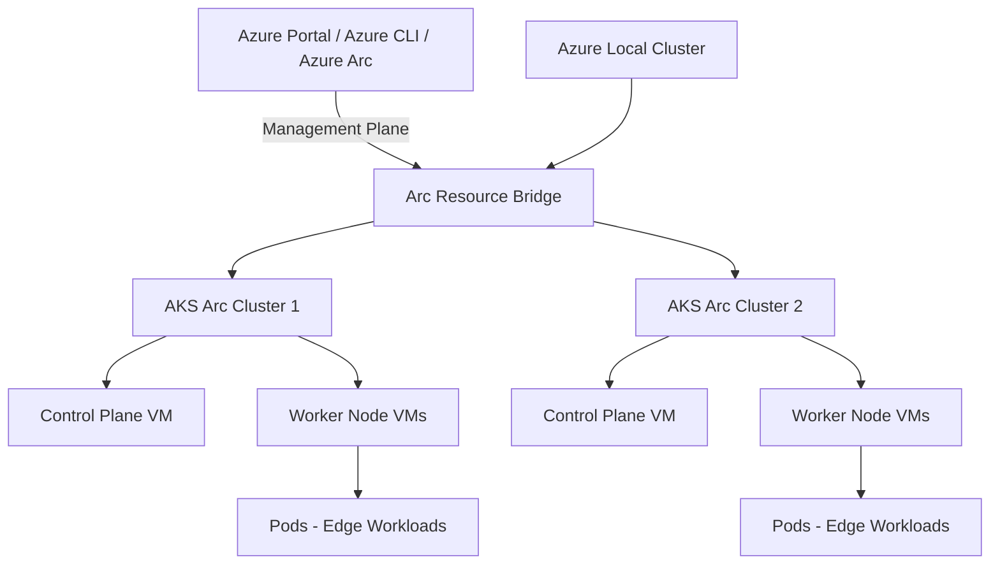

# How to Run Azure Kubernetes Service on Azure Stack HCI for Edge Workloads

Author: [nawazdhandala](https://www.github.com/nawazdhandala)

Tags: Azure, Kubernetes, Azure Stack HCI, Edge Computing, AKS, Container, Hybrid Cloud

Description: Learn how to deploy and manage Azure Kubernetes Service on Azure Stack HCI to run containerized edge workloads on your own infrastructure.

---

Running Kubernetes at the edge has a specific appeal: your containers run close to the data sources, close to the users, and close to the machines they control. Azure Kubernetes Service (AKS) enabled by Azure Arc on Azure Local, formerly Azure Stack HCI, brings the managed Kubernetes experience to your on-premises hardware, complete with Azure Arc integration for centralized management. You get the same kubectl experience, the same container ecosystem, and the same GitOps workflows, but the pods run on your own servers.

This guide covers deploying AKS on Azure Local, creating workload clusters, and managing them through Azure.

## Architecture

AKS on Azure Local has a layered architecture:


```mermaid
graph TD
    A[Azure Portal / Azure CLI / Azure Arc] -->|Management Plane| B[Arc Resource Bridge]
    B --> C[AKS Arc Cluster 1]
    B --> D[AKS Arc Cluster 2]
    C --> E[Control Plane VM]
    C --> F[Worker Node VMs]
    D --> G[Control Plane VM]
    D --> H[Worker Node VMs]
    F --> I[Pods - Edge Workloads]
    H --> J[Pods - Edge Workloads]
    K[Azure Local Cluster] --> B
```

The **Arc Resource Bridge** and the AKS Arc extension handle lifecycle operations - creating, scaling, and upgrading AKS clusters through Azure. Each **AKS Arc cluster** is an independent Kubernetes cluster with its own control plane and worker nodes, all running as VMs on the Azure Local infrastructure.

## Prerequisites

- Azure Local cluster deployed and registered with Azure. For current deployments, use Azure Local version 23H2 or later; Azure Stack HCI 22H2 is out of support.
- At least 4 vCPUs and 8 GB RAM available per Kubernetes node VM.
- An Azure subscription with the required resource providers registered.
- A custom location and AKS logical network created for the Azure Local cluster.
- Static IP capacity in the logical network for Kubernetes nodes, the control plane IP, and load balancer IPs.
- Azure CLI installed with the `aksarc`, `customlocation`, `k8s-extension`, and `k8s-configuration` extensions.
- Internet connectivity for pulling container images and connecting to Azure.

## Step 1: Prepare the Azure Local Cluster

Make sure your Azure Local cluster meets the networking requirements for AKS.

```powershell
# Verify the cluster has enough resources

Get-ClusterNode | ForEach-Object {
    $node = $_
    $memory = Get-CimInstance -ClassName Win32_ComputerSystem -ComputerName $node.Name
    [PSCustomObject]@{
        Node = $node.Name
        TotalMemoryGB = [math]::Round($memory.TotalPhysicalMemory / 1GB, 2)
        Status = $node.State
    }
} | Format-Table

# Check available storage
Get-Volume -CimSession (Get-ClusterNode).Name | Where-Object FileSystemLabel -eq "VMStorage" | Format-Table
```

Plan your IP address allocation:

- **Kubernetes node VMs**: A range of static IPs (for example, 10.0.0.100 - 10.0.0.150).
- **Control plane IP**: A single IP for the Kubernetes API server.
- **Load balancer IPs**: A range for Kubernetes LoadBalancer services (for example, 10.0.0.200 - 10.0.0.220).

## Step 2: Install the Azure CLI Extensions

```bash
# Sign in and select the subscription that contains your Azure Local resources
az login
az account set --subscription "your-subscription-id"

# Install or update the required Azure CLI extensions
az extension add --upgrade --name aksarc
az extension add --upgrade --name customlocation
az extension add --upgrade --name k8s-extension
az extension add --upgrade --name k8s-configuration

# Verify the AKS Arc extension is available
az aksarc --help
```

## Step 3: Verify the Custom Location and Logical Network

AKS on Azure Local uses a custom location and an AKS logical network created during the Azure Local deployment. Get the resource IDs before creating the cluster.

```bash
# Set resource names for the Azure Local environment
RESOURCE_GROUP="myResourceGroup"
CUSTOM_LOCATION="myCustomLocation"
AKS_LOGICAL_NETWORK="aks-logical-network"

# Get the custom location resource ID
CUSTOM_LOCATION_ID=$(az customlocation show \
  --name "$CUSTOM_LOCATION" \
  --resource-group "$RESOURCE_GROUP" \
  --query id \
  --output tsv)

# Get the AKS logical network resource ID
VNET_ID=$(az aksarc vnet show \
  --name "$AKS_LOGICAL_NETWORK" \
  --resource-group "$RESOURCE_GROUP" \
  --query id \
  --output tsv)

# Check supported Kubernetes versions for this custom location
az aksarc get-versions \
  --custom-location "$CUSTOM_LOCATION_ID" \
  --resource-group "$RESOURCE_GROUP" \
  --output table
```

The custom location represents the Azure Local environment in Azure. The logical network supplies the IP addresses and networking configuration for the AKS control plane, node VMs, and Kubernetes services.

## Step 4: Create a Workload Cluster

With the Azure Local infrastructure ready, create a workload cluster for your applications.

```bash
# Create a Linux workload cluster with 2 worker nodes
az aksarc create \
  --name "edgecluster01" \
  --resource-group "$RESOURCE_GROUP" \
  --custom-location "$CUSTOM_LOCATION_ID" \
  --vnet-ids "$VNET_ID" \
  --control-plane-count 1 \
  --node-count 2 \
  --node-vm-size "Standard_K8S3_v1" \
  --generate-ssh-keys
```

Available VM sizes depend on the Azure Local environment. List the supported sizes before choosing one:

```bash
az aksarc vmsize list \
  --custom-location "$CUSTOM_LOCATION_ID" \
  --resource-group "$RESOURCE_GROUP" \
  --output table
```

For edge workloads, `Standard_K8S3_v1` is usually sufficient. Scale up the VM size if your containers need more memory.

After the cluster is created, get the kubeconfig.

```bash
# Get the kubeconfig to access the workload cluster
az aksarc get-credentials \
  --name "edgecluster01" \
  --resource-group "$RESOURCE_GROUP" \
  --overwrite-existing

# Verify connectivity
kubectl get nodes
```

Expected output:

```text
NAME                              STATUS   ROLES                  AGE   VERSION
edgecluster01-control-plane-0     Ready    control-plane          5m    v1.29.4
edgecluster01-nodepool1-0         Ready    <none>                 3m    v1.29.4
edgecluster01-nodepool1-1         Ready    <none>                 3m    v1.29.4
```

## Step 5: Deploy an Edge Workload

Here is an example deployment for an edge data processing application.

```yaml
# edge-processor.yaml
# Deploys a data processing application that reads from local sensors
apiVersion: apps/v1
kind: Deployment
metadata:
  name: edge-processor
  namespace: default
spec:
  replicas: 2
  selector:
    matchLabels:
      app: edge-processor
  template:
    metadata:
      labels:
        app: edge-processor
    spec:
      containers:
        - name: processor
          image: myregistry.azurecr.io/edge-processor:v1.0
          ports:
            - containerPort: 8080
          env:
            # Environment variable pointing to the local data source
            - name: DATA_SOURCE
              value: "mqtt://10.0.0.50:1883"
            # Azure IoT Hub connection for upstream reporting
            - name: IOT_HUB_CONNECTION
              valueFrom:
                secretKeyRef:
                  name: iot-credentials
                  key: connection-string
          resources:
            requests:
              cpu: "250m"
              memory: "256Mi"
            limits:
              cpu: "500m"
              memory: "512Mi"
---
# Expose the processor with a LoadBalancer service
apiVersion: v1
kind: Service
metadata:
  name: edge-processor-svc
spec:
  type: LoadBalancer
  selector:
    app: edge-processor
  ports:
    - port: 80
      targetPort: 8080
```

Deploy it.

```bash
# Deploy the edge processing workload
kubectl apply -f edge-processor.yaml

# Check the deployment status
kubectl get deployments

# Get the external IP assigned by the load balancer
kubectl get svc edge-processor-svc
```

## Step 6: Enable Azure Arc for GitOps

AKS Arc clusters on Azure Local are connected to Azure Arc when they are created. Use the Arc resource to enable GitOps-based deployments where your cluster automatically syncs with a Git repository.

```bash
# Enable GitOps with Flux v2
az k8s-configuration flux create \
  --name "edge-apps" \
  --cluster-name "edgecluster01" \
  --resource-group "$RESOURCE_GROUP" \
  --cluster-type connectedClusters \
  --namespace "flux-system" \
  --scope cluster \
  --url "https://github.com/your-org/edge-manifests" \
  --branch "main" \
  --kustomization name=apps path=./apps prune=true
```

With GitOps, pushing manifest changes to your repository automatically deploys them to the edge cluster. No need to run kubectl from your laptop against a remote edge location.

## Step 7: Scale and Update Clusters

Scale worker nodes based on workload demand.

```bash
# Scale the cluster to 4 Linux worker nodes
az aksarc nodepool scale \
  --cluster-name "edgecluster01" \
  --resource-group "$RESOURCE_GROUP" \
  --name "nodepool1" \
  --node-count 4

# Check the updated node count
kubectl get nodes
```

Update the Kubernetes version when new releases are available.

```bash
# Check available updates
az aksarc get-upgrades \
  --name "edgecluster01" \
  --resource-group "$RESOURCE_GROUP" \
  --output table

# Upgrade the cluster to a supported target version
az aksarc upgrade \
  --name "edgecluster01" \
  --resource-group "$RESOURCE_GROUP" \
  --kubernetes-version "1.30.3"
```

AKS on Azure Local performs rolling upgrades. Pick one of the versions returned by `az aksarc get-upgrades`, not a hard-coded version from another environment.

## Monitoring Edge Clusters

Use Azure Monitor Container Insights for centralized monitoring of all your edge clusters.

```bash
# Enable monitoring on the connected cluster
az k8s-extension create \
  --name "azuremonitor-containers" \
  --cluster-name "edgecluster01" \
  --resource-group "$RESOURCE_GROUP" \
  --cluster-type connectedClusters \
  --extension-type Microsoft.AzureMonitor.Containers
```

This deploys monitoring agents to the cluster that report metrics and logs to your Azure Monitor workspace. You can view CPU usage, memory consumption, pod health, and container logs from the Azure portal regardless of where the cluster physically runs.

## Summary

AKS on Azure Local brings managed Kubernetes to your on-premises hardware without sacrificing the cloud management experience. The setup involves preparing Azure Local with Arc Resource Bridge, a custom location, and a logical network, creating AKS Arc clusters as needed, and using Azure Arc for centralized operations. For edge scenarios, the combination of local compute with cloud management through GitOps and Azure Monitor means your operations team manages edge clusters the same way they manage cloud clusters. The physical location of the hardware becomes an implementation detail rather than a fundamentally different operational model.
