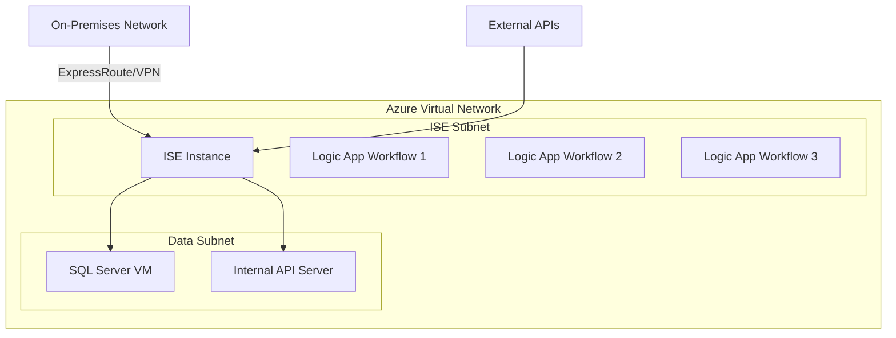

# How to Run Azure Logic Apps Workflows in an Integration Service Environment

Author: [nawazdhandala](https://www.github.com/nawazdhandala)

Tags: Azure, Logic Apps, ISE, Integration Service Environment, VNET, Enterprise Integration, Network Isolation

Description: Deploy Azure Logic Apps in an Integration Service Environment for VNET integration, network isolation, and dedicated compute capacity.

---

Azure Logic Apps Consumption runs on shared multi-tenant infrastructure. That works fine for many workloads, but enterprise scenarios often require network isolation - connecting to databases on private networks, accessing on-premises resources through ExpressRoute, or meeting compliance requirements that prohibit shared infrastructure. The Integration Service Environment (ISE) gives you a dedicated, isolated instance of the Logic Apps runtime that runs inside your Azure Virtual Network.

## Important Note on ISE Availability

Microsoft announced the retirement of ISE for new deployments. If you are starting fresh, you should use Logic Apps Standard with VNET integration instead. However, many existing deployments still run on ISE, and understanding how it works remains relevant for maintaining and operating those environments. This guide covers both ISE concepts and the migration path to Standard.

## What Is an ISE?

An ISE is a dedicated instance of the Logic Apps service deployed into an Azure Virtual Network. It has its own compute, storage, and networking - completely isolated from the multi-tenant service. Workflows running in an ISE can directly access resources in your VNET, peered VNETs, and on-premises networks connected via VPN or ExpressRoute.



## ISE Requirements

Setting up an ISE requires:

- An Azure Virtual Network with a dedicated subnet (minimum /27)
- The subnet must be empty and delegated to `Microsoft.Logic/integrationServiceEnvironments`
- No network security groups or route tables on the ISE subnet (the ISE manages its own networking)
- The VNET must be in a supported region

The ISE subnet needs at least 32 IP addresses (/27 subnet), though Microsoft recommends /24 for room to scale.

## Creating an ISE

Creating an ISE is a long-running operation that takes several hours. Plan accordingly.

```bash
# Create a VNET with an ISE subnet
az network vnet create \
  --name vnet-integration \
  --resource-group rg-integration \
  --location eastus2 \
  --address-prefix 10.0.0.0/16

az network vnet subnet create \
  --name snet-ise \
  --vnet-name vnet-integration \
  --resource-group rg-integration \
  --address-prefix 10.0.1.0/24 \
  --delegations Microsoft.Logic/integrationServiceEnvironments

# Create the ISE (this takes 2-4 hours)
az rest --method PUT \
  --uri "https://management.azure.com/subscriptions/{sub-id}/resourceGroups/rg-integration/providers/Microsoft.Logic/integrationServiceEnvironments/ise-production?api-version=2019-05-01" \
  --body '{
    "location": "eastus2",
    "sku": {
      "name": "Premium",
      "capacity": 1
    },
    "properties": {
      "networkConfiguration": {
        "subnets": [
          {
            "id": "/subscriptions/{sub-id}/resourceGroups/rg-integration/providers/Microsoft.Network/virtualNetworks/vnet-integration/subnets/snet-ise"
          }
        ]
      }
    }
  }'
```

## ISE Connector Versions

When running in an ISE, connectors come in three flavors:

**ISE-labeled connectors**: These run directly inside the ISE, on your dedicated infrastructure. Data does not leave your VNET. Examples include SQL Server ISE, Azure Blob Storage ISE, and HTTP ISE.

**Core connectors**: Built-in connectors that always run inside the ISE. These include HTTP, Request/Response, Compose, Variables, and other basic actions.

**Multi-tenant connectors**: Standard connectors that run in the shared multi-tenant Logic Apps service. Data leaves your VNET to reach the connector. Only use these when an ISE version is not available.

Always prefer ISE-labeled connectors when available. They give you the network isolation benefit you are paying for.

## Creating a Workflow in an ISE

Logic Apps created in an ISE are regular Logic App resources, but they reference the ISE as their integration service environment.

```bash
# Create a Logic App in the ISE
az rest --method PUT \
  --uri "https://management.azure.com/subscriptions/{sub-id}/resourceGroups/rg-integration/providers/Microsoft.Logic/workflows/logic-order-processor-ise?api-version=2019-05-01" \
  --body '{
    "location": "eastus2",
    "properties": {
      "integrationServiceEnvironment": {
        "id": "/subscriptions/{sub-id}/resourceGroups/rg-integration/providers/Microsoft.Logic/integrationServiceEnvironments/ise-production"
      },
      "definition": {
        "$schema": "https://schema.management.azure.com/providers/Microsoft.Logic/schemas/2016-06-01/workflowdefinition.json#",
        "triggers": {
          "manual": {
            "type": "Request",
            "kind": "Http",
            "inputs": {
              "method": "POST"
            }
          }
        },
        "actions": {
          "Call_Internal_API": {
            "type": "Http",
            "inputs": {
              "method": "GET",
              "uri": "http://10.0.2.10:8080/api/orders"
            },
            "runAfter": {}
          }
        }
      }
    }
  }'
```

Notice the `Call_Internal_API` action uses a private IP address. This only works because the ISE is in the same VNET (or a peered VNET) as the target server.

## Connecting to On-Premises Resources

One of the primary use cases for ISE is connecting to on-premises systems through ExpressRoute or VPN.

```json
{
  "actions": {
    "Query_On_Prem_Database": {
      "type": "ApiConnection",
      "inputs": {
        "host": {
          "connection": {
            "name": "@parameters('$connections')['sql_ise']['connectionId']"
          }
        },
        "method": "get",
        "path": "/v2/datasets/@{encodeURIComponent('on-prem-sql-server.corp.local')},@{encodeURIComponent('OrdersDB')}/tables/@{encodeURIComponent('[dbo].[Orders]')}/items"
      },
      "runAfter": {}
    },
    "Call_On_Prem_API": {
      "type": "Http",
      "inputs": {
        "method": "GET",
        "uri": "https://erp.corp.local/api/inventory",
        "authentication": {
          "type": "Basic",
          "username": "@appsetting('ErpUsername')",
          "password": "@appsetting('ErpPassword')"
        }
      },
      "runAfter": {}
    }
  }
}
```

## Scaling the ISE

ISE comes in Developer (for testing) and Premium (for production) SKUs. The Premium SKU starts with one scale unit and can scale up to add more capacity.

```bash
# Scale up the ISE by adding capacity
az rest --method PATCH \
  --uri "https://management.azure.com/subscriptions/{sub-id}/resourceGroups/rg-integration/providers/Microsoft.Logic/integrationServiceEnvironments/ise-production?api-version=2019-05-01" \
  --body '{
    "sku": {
      "name": "Premium",
      "capacity": 3
    }
  }'
```

Each scale unit adds approximately:
- 80 million action executions per month
- Additional throughput for connectors
- More concurrent workflow runs

## Monitoring ISE Health

Monitor your ISE to ensure it has enough capacity and is healthy.

```bash
# Check ISE status
az rest --method GET \
  --uri "https://management.azure.com/subscriptions/{sub-id}/resourceGroups/rg-integration/providers/Microsoft.Logic/integrationServiceEnvironments/ise-production?api-version=2019-05-01" \
  --query "properties.state"

# Get ISE metrics
az monitor metrics list \
  --resource "/subscriptions/{sub-id}/resourceGroups/rg-integration/providers/Microsoft.Logic/integrationServiceEnvironments/ise-production" \
  --metric "ActionLatency" "RunsStarted" "RunsSucceeded" "RunsFailed" \
  --interval PT5M
```

Set up alerts on ISE-specific metrics:
- CPU and memory utilization (approaching capacity limits)
- Action execution latency (degrading performance)
- Failed runs (application errors)

## Migration Path: ISE to Logic Apps Standard

Since ISE is being retired for new deployments, existing ISE users should plan their migration to Logic Apps Standard with VNET integration.

Logic Apps Standard on the WS3 App Service Plan (or higher) supports VNET integration through regional VNET integration and private endpoints. This gives you similar network isolation without the ISE overhead.

```bash
# Create a Logic App Standard with VNET integration
az appservice plan create \
  --name plan-logicapp-standard \
  --resource-group rg-integration \
  --location eastus2 \
  --sku WS2

# Create the Logic App
az logicapp create \
  --name logic-order-workflows-std \
  --resource-group rg-integration \
  --plan plan-logicapp-standard \
  --storage-account stworkflowsruntime

# Enable VNET integration
az logicapp vnet-integration add \
  --name logic-order-workflows-std \
  --resource-group rg-integration \
  --vnet vnet-integration \
  --subnet snet-logicapp
```

The key differences from ISE:
- Logic Apps Standard uses built-in (service provider) connectors that run in-process and respect VNET routing
- No separate ISE-labeled connectors - built-in connectors handle VNET traffic natively
- Faster provisioning (minutes instead of hours)
- More flexible scaling options

## Summary

The Integration Service Environment provides dedicated, VNET-isolated Logic Apps infrastructure for enterprise scenarios that require network isolation and access to private resources. While ISE is being retired for new deployments, understanding its architecture helps with maintaining existing deployments and planning the migration to Logic Apps Standard with VNET integration. Whether you are on ISE today or planning for Standard, the goal is the same - run your integration workflows in a network-isolated environment that can reach your private resources without exposing them to the public internet.
