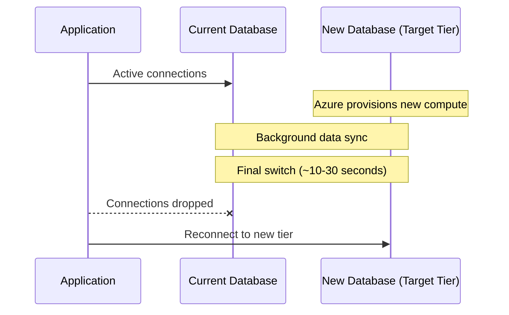

# How to Scale an Azure SQL Database Up or Down Without Downtime

Author: [nawazdhandala](https://www.github.com/nawazdhandala)

Tags: Azure SQL, Scaling, Performance, Cost Optimization, Azure, Database, Elasticity

Description: Learn how to scale Azure SQL Database compute and storage up or down with minimal or no downtime to match your workload demands and budget.

---

One of the biggest advantages of running your database in the cloud is the ability to scale resources without buying new hardware. Azure SQL Database lets you change your compute tier, add more vCores, increase storage, or switch between purchasing models - all without taking the database offline. There is a brief connectivity interruption at the very end of the operation, but with proper connection handling, your users should not notice.

In this post, I will cover how scaling works, the different dimensions you can scale, how to perform scaling operations, and how to automate scaling based on demand.

## What Can You Scale?

Azure SQL Database scaling involves several dimensions:

**Compute (vCores or DTUs)**: The amount of CPU and memory allocated to your database. Scaling up means more processing power; scaling down means less cost.

**Storage**: The maximum data size for your database. Storage can only be scaled up, not down (for most tiers).

**Service tier**: Moving between tiers (e.g., General Purpose to Business Critical, or Standard to Premium) changes both the performance characteristics and the available features.

**Compute tier**: Switching between Provisioned and Serverless within the vCore model.

## How Scaling Works Behind the Scenes

When you initiate a scaling operation, Azure:

1. Provisions a new compute resource with the target configuration.
2. Copies the database to the new resource (this happens in the background).
3. At the very end, switches the connection endpoint to the new resource.

The switch takes approximately 10-30 seconds. During this brief period, existing connections are dropped and need to reconnect. Uncommitted transactions are rolled back.



## Scaling via Azure Portal

### Step 1: Navigate to Your Database

Go to the Azure Portal and open your SQL database.

### Step 2: Open Compute + Storage

In the left menu, click "Compute + storage".

### Step 3: Choose the New Configuration

You will see your current configuration and can modify:

**For DTU-based databases**: Move the slider or select a different tier (Basic, Standard, Premium) and performance level.

**For vCore-based databases**: Change the number of vCores, the service tier (General Purpose, Business Critical, Hyperscale), the compute tier (Provisioned, Serverless), or the hardware generation.

### Step 4: Review the Cost Impact

The portal shows the estimated monthly cost for the new configuration. Compare it with your current cost to understand the financial impact.

### Step 5: Apply

Click "Apply". The scaling operation begins immediately. You can monitor progress in the "Activity log" or by checking the database status.

## Scaling via Azure CLI

The CLI is useful for scripting and can be integrated into CI/CD pipelines.

### Scaling DTU-Based Databases

```bash
# Scale a database from S1 to S3 (higher DTU)
az sql db update \
    --resource-group myResourceGroup \
    --server myserver \
    --name mydb \
    --service-objective S3
```

Common DTU service objectives: B (Basic), S0-S12 (Standard), P1-P15 (Premium).

### Scaling vCore-Based Databases

```bash
# Scale a General Purpose database from 2 to 4 vCores
az sql db update \
    --resource-group myResourceGroup \
    --server myserver \
    --name mydb \
    --capacity 4
```

### Changing Service Tiers

```bash
# Move from General Purpose to Business Critical
az sql db update \
    --resource-group myResourceGroup \
    --server myserver \
    --name mydb \
    --edition BusinessCritical \
    --family Gen5 \
    --capacity 4
```

### Scaling Storage

```bash
# Increase maximum data size to 500 GB
az sql db update \
    --resource-group myResourceGroup \
    --server myserver \
    --name mydb \
    --max-size 500GB
```

## Scaling via PowerShell

```powershell
# Scale up to 8 vCores, General Purpose
Set-AzSqlDatabase `
    -ResourceGroupName "myResourceGroup" `
    -ServerName "myserver" `
    -DatabaseName "mydb" `
    -Edition "GeneralPurpose" `
    -VCore 8 `
    -ComputeGeneration "Gen5"
```

## Scaling via T-SQL

You can also initiate scaling from within the database:

```sql
-- Scale to a different service objective
-- This runs asynchronously - the command returns immediately
ALTER DATABASE mydb
MODIFY (SERVICE_OBJECTIVE = 'S3');
```

Check the progress:

```sql
-- Monitor the scaling operation status
SELECT
    name,
    service_objective,
    edition,
    state_desc
FROM sys.databases
WHERE name = 'mydb';
```

## Handling the Connectivity Interruption

The brief connection drop during the final switchover is the main concern when scaling. Here is how to handle it gracefully.

### Retry Logic

Implement retry logic in your application. Most database libraries support this natively.

For .NET with Entity Framework:

```csharp
// Configure retry logic in Entity Framework
// This automatically retries failed operations due to transient errors
services.AddDbContext<MyDbContext>(options =>
    options.UseSqlServer(connectionString,
        sqlOptions => sqlOptions.EnableRetryOnFailure(
            maxRetryCount: 5,
            maxRetryDelay: TimeSpan.FromSeconds(30),
            errorNumbersToAdd: null
        )
    )
);
```

For Python with pyodbc:

```python
import pyodbc
import time

def execute_with_retry(conn_str, query, max_retries=3):
    """Execute a query with retry logic for transient failures."""
    for attempt in range(max_retries):
        try:
            conn = pyodbc.connect(conn_str, timeout=30)
            cursor = conn.cursor()
            cursor.execute(query)
            result = cursor.fetchall()
            conn.close()
            return result
        except pyodbc.OperationalError as e:
            if attempt < max_retries - 1:
                # Wait with exponential backoff before retrying
                time.sleep(2 ** attempt)
            else:
                raise
```

### Connection Pooling Settings

Configure your connection pool to handle dropped connections:

- Enable connection validation/ping before use
- Set a reasonable connection lifetime so stale connections are recycled
- Configure the pool to handle connection failures gracefully

## Automating Scaling

For workloads with predictable patterns, you can automate scaling to save costs.

### Using Azure Automation

Create a runbook that scales the database on a schedule:

```powershell
# Azure Automation Runbook - Scale up during business hours
param(
    [string]$ResourceGroupName = "myResourceGroup",
    [string]$ServerName = "myserver",
    [string]$DatabaseName = "mydb"
)

# Authenticate using the Automation Run As account
$connection = Get-AutomationConnection -Name "AzureRunAsConnection"
Connect-AzAccount -ServicePrincipal `
    -Tenant $connection.TenantId `
    -ApplicationId $connection.ApplicationId `
    -CertificateThumbprint $connection.CertificateThumbprint

# Scale up to 4 vCores for business hours
Set-AzSqlDatabase `
    -ResourceGroupName $ResourceGroupName `
    -ServerName $ServerName `
    -DatabaseName $DatabaseName `
    -Edition "GeneralPurpose" `
    -VCore 4 `
    -ComputeGeneration "Gen5"

Write-Output "Database scaled to 4 vCores"
```

Schedule this to run at 8 AM, and create a corresponding runbook to scale down at 6 PM.

### Using Azure Monitor Autoscale

While Azure SQL Database does not have native autoscale like Azure App Service, you can achieve similar results with metric-based alerts and Azure Functions:

1. Create an alert that triggers when CPU > 80% for 10 minutes.
2. The alert triggers an Azure Function that scales up the database.
3. Create another alert for CPU < 30% for 30 minutes that triggers a scale-down.

This provides reactive scaling based on actual demand.

## Scaling Considerations

**Scaling up is faster than scaling down.** Moving to a higher tier usually completes within minutes. Moving to a lower tier or changing service tiers can take longer.

**Storage cannot be scaled down.** Once you increase the max data size, you cannot decrease it without recreating the database. Plan storage increases carefully.

**In-flight transactions are rolled back.** The connection drop during switchover means any uncommitted transactions at that moment will be rolled back. Use short transactions and retry logic.

**Elastic pool considerations.** If the database is in an elastic pool, you scale the pool rather than individual databases. Moving a database out of a pool to a standalone tier requires its own scaling operation.

**Hyperscale scaling is different.** Hyperscale databases scale compute almost instantly because compute and storage are decoupled. Adding vCores does not require data movement.

**Cross-tier moves take longer.** Moving between General Purpose and Business Critical involves a full data copy because the storage architecture differs (remote storage vs. local SSD).

## Cost Optimization Through Scaling

Here are practical strategies for using scaling to control costs:

**Scale down during off-peak hours.** If your database is busy during business hours but idle at night, scale down overnight and back up in the morning.

**Use Serverless for variable workloads.** Instead of manually scaling, let the Serverless tier handle it automatically.

**Right-size regularly.** Review your metrics monthly. If your database never exceeds 40% CPU, you are probably oversized and could scale down.

**Scale up temporarily for batch jobs.** Before running a large batch process, scale up to a higher tier. After it completes, scale back down. This is cheaper than keeping the database at the higher tier permanently.

## Summary

Scaling Azure SQL Database is a low-risk, high-impact operation that lets you match resources to demand. The process involves a brief connectivity interruption of 10-30 seconds, which is easily handled with retry logic in your application. Scale through the Portal for ad hoc changes, use the CLI or PowerShell for scripted operations, and automate scaling with Azure Automation or Functions for predictable patterns. Regular right-sizing based on actual usage is one of the simplest ways to control your Azure SQL costs.
