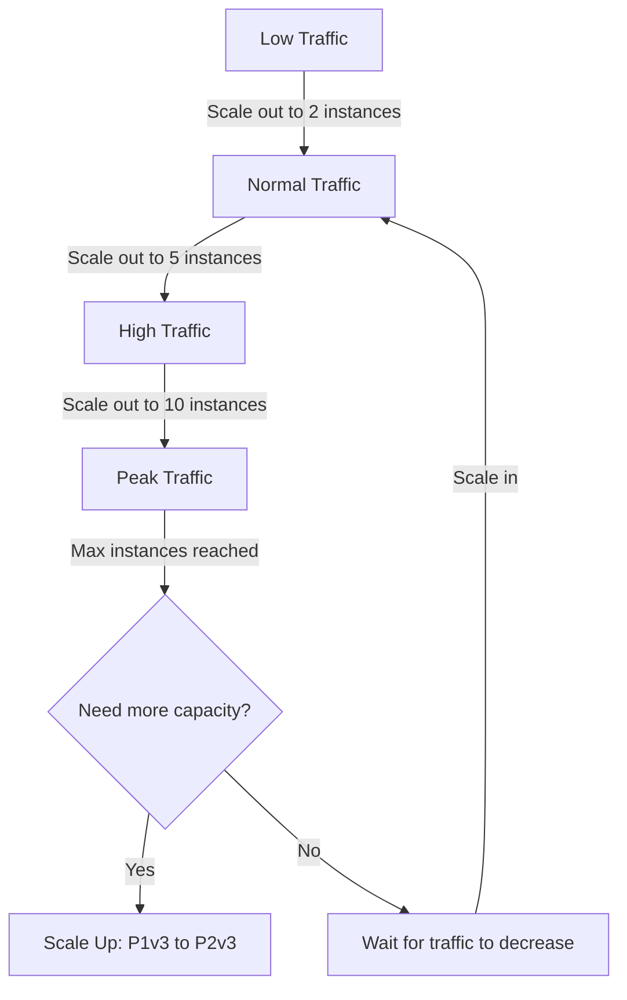

# How to Scale Azure App Service Vertically and Horizontally

Author: [nawazdhandala](https://www.github.com/nawazdhandala)

Tags: Azure, App Service, Scaling, Horizontal Scaling, Vertical Scaling, Performance, Auto Scaling

Description: Learn how to scale Azure App Service both vertically by changing the plan tier and horizontally by adding instances with autoscale rules.

---

Your application starts on a single small instance and everything works great. Then traffic grows, response times creep up, and you need more capacity. Azure App Service gives you two ways to handle this: scale up (vertical scaling) by moving to a more powerful instance, or scale out (horizontal scaling) by adding more instances behind the load balancer. Most production applications end up using both.

Understanding when to use each approach and how to configure them properly is the difference between a smoothly scaling application and one that either wastes money on oversized instances or falls over during traffic spikes.

## Vertical Scaling (Scale Up)

Vertical scaling means changing your App Service plan to a tier with more CPU, memory, and features. You are replacing the underlying VM with a bigger one.

### App Service Plan Tiers

Here is a practical overview of the tiers:

- **Free (F1)**: 1 GB memory, shared compute, 60 CPU minutes/day. Development only.
- **Basic (B1-B3)**: 1.75-7 GB memory, dedicated compute, no autoscale. Good for dev/test.
- **Standard (S1-S3)**: 1.75-7 GB memory, dedicated compute, autoscale, deployment slots, VNet integration. Production entry point.
- **Premium v3 (P1v3-P3v3)**: 8-32 GB memory, faster processors, more instances. Production workloads.
- **Isolated (I1-I3)**: Dedicated environment (App Service Environment), network isolation. Enterprise/compliance.

### When to Scale Up

Scale up when:
- Your application is CPU-bound and a single request uses significant CPU time (heavy computation, image processing)
- You need more memory per instance (in-memory caching, large data processing)
- You need features only available at higher tiers (deployment slots require Standard, VNet Integration requires Standard)
- Your application does not scale horizontally well (stateful applications, applications with in-process session state)

### How to Scale Up

```bash
# Check your current plan tier
az appservice plan show \
  --resource-group myAppRG \
  --name myAppPlan \
  --query "{Tier:sku.tier, Size:sku.name, Workers:sku.capacity}" -o table

# Scale up to Premium v3
az appservice plan update \
  --resource-group myAppRG \
  --name myAppPlan \
  --sku P1v3

# Scale up to a larger Premium tier
az appservice plan update \
  --resource-group myAppRG \
  --name myAppPlan \
  --sku P2v3
```

Scaling up causes a brief restart of your application. The actual downtime is usually under 30 seconds, but if you are running a production workload, use deployment slots to minimize the impact. Deploy to a slot on the new tier first, verify it works, and then swap.

### Comparing Instance Sizes

Here is a quick comparison to help you choose:

```bash
# List available SKUs for your plan
az appservice list-locations --sku P1v3 -o table
```

| SKU | vCPUs | Memory | Monthly Cost (approx) |
|-----|-------|--------|----------------------|
| B1 | 1 | 1.75 GB | $55 |
| S1 | 1 | 1.75 GB | $73 |
| P1v3 | 2 | 8 GB | $138 |
| P2v3 | 4 | 16 GB | $276 |
| P3v3 | 8 | 32 GB | $552 |

## Horizontal Scaling (Scale Out)

Horizontal scaling means adding more instances of the same size behind the App Service's built-in load balancer. Your application runs on multiple VMs simultaneously, and traffic is distributed across them.

### When to Scale Out

Scale out when:
- Your application is stateless and can run on multiple instances
- You need to handle more concurrent requests
- You want fault tolerance (multiple instances means one failing does not take down the service)
- Traffic patterns are variable and you want to add/remove capacity dynamically

### Manual Scale Out

```bash
# Scale out to 3 instances
az appservice plan update \
  --resource-group myAppRG \
  --name myAppPlan \
  --number-of-workers 3

# Check current instance count
az appservice plan show \
  --resource-group myAppRG \
  --name myAppPlan \
  --query "sku.capacity" -o tsv
```

### Autoscale Configuration

For production, you want autoscale - automatic horizontal scaling based on metrics. This requires the Standard tier or higher.

```bash
# Enable autoscale with CPU-based rules
az monitor autoscale create \
  --resource-group myAppRG \
  --resource myAppPlan \
  --resource-type Microsoft.Web/serverfarms \
  --name app-autoscale \
  --min-count 2 \
  --max-count 10 \
  --count 2

# Scale out when average CPU exceeds 70% for 10 minutes
az monitor autoscale rule create \
  --resource-group myAppRG \
  --autoscale-name app-autoscale \
  --condition "CpuPercentage > 70 avg 10m" \
  --scale out 1

# Scale in when average CPU drops below 30% for 15 minutes
az monitor autoscale rule create \
  --resource-group myAppRG \
  --autoscale-name app-autoscale \
  --condition "CpuPercentage < 30 avg 15m" \
  --scale in 1
```

### HTTP Queue Length Based Scaling

For web applications, HTTP queue length is often a better metric than CPU. It measures how many requests are waiting to be processed:

```bash
# Scale out based on HTTP queue length
az monitor autoscale rule create \
  --resource-group myAppRG \
  --autoscale-name app-autoscale \
  --condition "HttpQueueLength > 100 avg 5m" \
  --scale out 2

# Scale in when queue is mostly empty
az monitor autoscale rule create \
  --resource-group myAppRG \
  --autoscale-name app-autoscale \
  --condition "HttpQueueLength < 10 avg 15m" \
  --scale in 1
```

### Memory-Based Scaling

For memory-intensive applications:

```bash
# Scale out when memory exceeds 80%
az monitor autoscale rule create \
  --resource-group myAppRG \
  --autoscale-name app-autoscale \
  --condition "MemoryPercentage > 80 avg 10m" \
  --scale out 1

# Scale in when memory drops below 40%
az monitor autoscale rule create \
  --resource-group myAppRG \
  --autoscale-name app-autoscale \
  --condition "MemoryPercentage < 40 avg 15m" \
  --scale in 1
```

### Schedule-Based Scaling

If your traffic has predictable patterns, combine metric-based rules with schedules:

```bash
# Create a business hours profile with higher minimum instances
az monitor autoscale profile create \
  --resource-group myAppRG \
  --autoscale-name app-autoscale \
  --name "business-hours" \
  --min-count 4 \
  --max-count 15 \
  --count 4 \
  --recurrence week Mon Tue Wed Thu Fri \
  --start "08:00" \
  --end "20:00" \
  --timezone "Eastern Standard Time"
```

## Making Your Application Scale-Ready

Horizontal scaling only works if your application is designed for it. Here are the requirements:

### Stateless Design

Every instance must be able to handle any request independently. Do not store session state in memory or on the local filesystem.

```javascript
// Bad: In-memory session storage (breaks with multiple instances)
const sessions = {};
app.use((req, res, next) => {
  req.session = sessions[req.cookies.sessionId];
  next();
});

// Good: External session storage (works with multiple instances)
const session = require('express-session');
const RedisStore = require('connect-redis').default;
const redis = require('redis');

const redisClient = redis.createClient({ url: process.env.REDIS_URL });
app.use(session({
  store: new RedisStore({ client: redisClient }),
  secret: process.env.SESSION_SECRET,
  resave: false,
  saveUninitialized: false
}));
```

### Health Endpoints

Your app needs a health check endpoint that the load balancer uses to determine if an instance is healthy:

```bash
# Configure the App Service health check
az webapp config set \
  --resource-group myAppRG \
  --name myapp \
  --generic-configurations '{"healthCheckPath": "/health"}'
```

When health checks are enabled and an instance fails the check, App Service stops routing traffic to it and eventually replaces it.

### Warm-Up Configuration

When a new instance starts, it needs time to warm up (load caches, establish database connections, compile JIT code). Configure warm-up to prevent traffic from hitting a cold instance:

```json
{
  "applicationInitialization": {
    "remapManagedRequestsTo": "/loading.html",
    "customInitializationActions": [
      { "initializationPage": "/health" },
      { "initializationPage": "/api/warmup" }
    ]
  }
}
```

### ARR Affinity

App Service uses Application Request Routing (ARR) cookies for session affinity by default. This means a user's requests tend to go to the same instance. For truly stateless apps, disable ARR affinity for more even load distribution:

```bash
# Disable ARR affinity
az webapp update \
  --resource-group myAppRG \
  --name myapp \
  --client-affinity-enabled false
```

## Combining Vertical and Horizontal Scaling

The best approach for most applications is a combination:

1. Start with a right-sized instance tier (vertical scaling to match your base requirements)
2. Configure autoscale for horizontal scaling to handle variable load
3. Scale up the tier if your per-instance resource needs grow



## Monitoring Scaling Events

Track when and why scaling happens:

```bash
# View autoscale activity
az monitor autoscale show \
  --resource-group myAppRG \
  --name app-autoscale \
  --query "{Enabled:enabled, Min:profiles[0].capacity.minimum, Max:profiles[0].capacity.maximum, Current:profiles[0].capacity.default}" \
  -o table

# Check current instance count
az webapp show \
  --resource-group myAppRG \
  --name myapp \
  --query "siteConfig.numberOfWorkers" -o tsv

# View instance-level metrics
az monitor metrics list \
  --resource "/subscriptions/<sub-id>/resourceGroups/myAppRG/providers/Microsoft.Web/serverfarms/myAppPlan" \
  --metric "CpuPercentage" "MemoryPercentage" "HttpQueueLength" \
  --interval PT5M \
  --aggregation Average \
  -o table
```

Set up alerts for scaling events and capacity limits:

```bash
# Alert when approaching maximum instance count
az monitor metrics alert create \
  --resource-group myAppRG \
  --name "near-max-capacity" \
  --scopes "/subscriptions/<sub-id>/resourceGroups/myAppRG/providers/Microsoft.Web/serverfarms/myAppPlan" \
  --condition "avg CpuPercentage > 80" \
  --description "CPU high at max instance count - consider scaling up"
```

Feed all of this into OneUptime for a unified view of your application's performance, scaling behavior, and resource utilization. When you can see response times, error rates, and instance counts on the same dashboard, you can make informed decisions about whether to scale up, scale out, or optimize your code.

## Cost Optimization Tips

- Use autoscale to avoid paying for instances you do not need during low traffic periods.
- Set the minimum instance count to 2 for production (for availability), not higher unless your baseline traffic requires it.
- Consider Premium v3 over Standard for cost-per-performance - P1v3 often gives better value than S3.
- Use reserved instances (1 or 3 year) for baseline capacity at up to 55% savings.
- Monitor your actual CPU and memory usage - if instances are consistently under 30% utilized, you are overprovisioned.

## Wrapping Up

Scaling Azure App Service is a two-dimensional problem. Vertical scaling gives you bigger instances for more demanding per-request workloads. Horizontal scaling gives you more instances for higher concurrency and throughput. Use vertical scaling to right-size your base instances and horizontal autoscale to handle variable traffic. Design your application for statelessness, configure health checks, and monitor both your scaling events and application performance to make data-driven capacity decisions.
