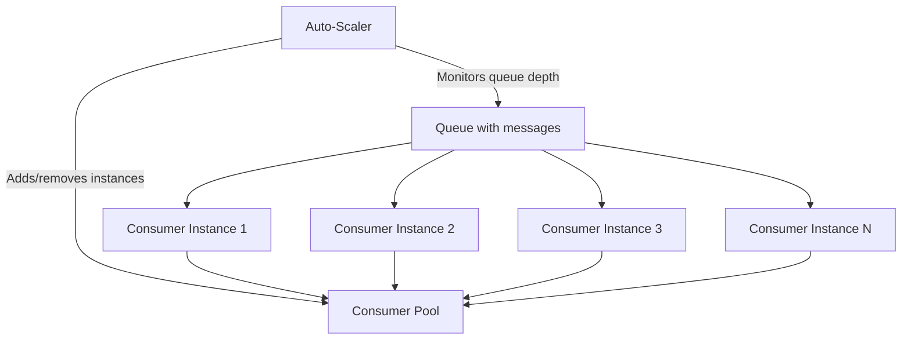

# How to Scale Azure Queue Storage Consumers for High-Throughput Processing

Author: [nawazdhandala](https://www.github.com/nawazdhandala)

Tags: Azure, Queue Storage, Scaling, High Throughput, Azure Storage, Performance, Distributed Systems

Description: Learn how to scale Azure Queue Storage consumers horizontally for high-throughput message processing with auto-scaling strategies, batching, and performance optimization.

---

A single Azure Queue Storage consumer can process maybe a few hundred messages per second. That is fine for most workloads, but when you need to process thousands or tens of thousands of messages per second, you need to scale out. Azure Queue Storage is designed for this - it supports up to 20,000 messages per second per queue and allows unlimited concurrent consumers.

Scaling queue consumers is not just about adding more instances. You need to think about batch sizes, polling intervals, auto-scaling triggers, and how to avoid the various bottlenecks that appear at scale. This guide covers the practical aspects of building a high-throughput queue processing system.

## Understanding Queue Storage Throughput Limits

Azure Queue Storage has documented scalability targets:

- **Single queue:** Up to 2,000 messages per second (for messages around 1 KB each)
- **Storage account:** Up to 20,000 messages per second across all queues
- **Single message operation:** Each receive or delete is a separate HTTP request with associated latency

These numbers mean that a single consumer making individual receive-then-delete calls will max out well below the queue's capacity. To saturate the queue, you need multiple consumers and batch operations.

## Scaling Strategy Overview



The basic strategy is:

1. Run multiple consumer instances in parallel
2. Each instance processes messages in batches
3. An auto-scaler monitors queue depth and adjusts the number of instances
4. Each instance uses efficient polling to minimize wasted API calls

## Batch Processing

The single biggest performance improvement is processing messages in batches instead of one at a time. Azure Queue Storage lets you receive up to 32 messages in a single API call.

```python
from azure.storage.queue import QueueClient
import concurrent.futures
import json
import time
import logging

logging.basicConfig(level=logging.INFO)
logger = logging.getLogger(__name__)

class BatchQueueProcessor:
    def __init__(self, connection_string, queue_name, batch_size=32, visibility_timeout=120):
        self.queue_client = QueueClient.from_connection_string(
            conn_str=connection_string,
            queue_name=queue_name
        )
        self.batch_size = batch_size
        self.visibility_timeout = visibility_timeout

    def process_single_message(self, content):
        """Process a single message. Override this with your logic."""
        task = json.loads(content)
        # Simulate processing
        time.sleep(0.01)
        return True

    def process_batch(self):
        """Receive and process a batch of messages."""
        messages = list(self.queue_client.receive_messages(
            messages_per_page=self.batch_size,
            visibility_timeout=self.visibility_timeout
        ))

        if not messages:
            return 0

        processed = 0
        for message in messages:
            try:
                self.process_single_message(message.content)
                self.queue_client.delete_message(message)
                processed += 1
            except Exception as e:
                logger.error(f"Failed to process message {message.id}: {e}")

        return processed

    def run(self):
        """Main processing loop with adaptive polling."""
        logger.info("Batch processor started")
        empty_polls = 0

        while True:
            processed = self.process_batch()

            if processed > 0:
                empty_polls = 0
                logger.info(f"Processed {processed} messages")
            else:
                empty_polls += 1
                # Adaptive backoff: increase wait time when queue is empty
                wait_time = min(empty_polls * 2, 30)
                time.sleep(wait_time)
```

## Parallel Processing Within a Single Instance

Within a single consumer instance, you can use thread pools to process multiple messages concurrently:

```python
from azure.storage.queue import QueueClient
import concurrent.futures
import json
import time
import logging

logging.basicConfig(level=logging.INFO)
logger = logging.getLogger(__name__)

class ParallelQueueProcessor:
    def __init__(self, connection_string, queue_name, worker_threads=8):
        self.queue_client = QueueClient.from_connection_string(
            conn_str=connection_string,
            queue_name=queue_name
        )
        self.worker_threads = worker_threads
        self.executor = concurrent.futures.ThreadPoolExecutor(max_workers=worker_threads)

    def process_message(self, message):
        """Process a single message and delete it on success."""
        try:
            task = json.loads(message.content)
            # Your processing logic here
            time.sleep(0.05)  # simulate work

            # Delete the message after successful processing
            self.queue_client.delete_message(message)
            return True
        except Exception as e:
            logger.error(f"Failed: {message.id} - {e}")
            return False

    def run(self):
        """Process messages using a thread pool for parallelism."""
        logger.info(f"Parallel processor started with {self.worker_threads} threads")

        while True:
            # Receive a batch of messages
            messages = list(self.queue_client.receive_messages(
                messages_per_page=32,
                visibility_timeout=120
            ))

            if not messages:
                time.sleep(5)
                continue

            # Submit all messages to the thread pool for parallel processing
            futures = {
                self.executor.submit(self.process_message, msg): msg
                for msg in messages
            }

            # Wait for all messages in the batch to complete
            done_count = 0
            fail_count = 0
            for future in concurrent.futures.as_completed(futures):
                if future.result():
                    done_count += 1
                else:
                    fail_count += 1

            logger.info(f"Batch complete: {done_count} succeeded, {fail_count} failed")
```

## C# Parallel Processing

```csharp
using Azure.Storage.Queues;
using Azure.Storage.Queues.Models;
using System.Text.Json;

public class ParallelQueueProcessor
{
    private readonly QueueClient _queueClient;
    private readonly int _maxConcurrency;

    public ParallelQueueProcessor(string connectionString, string queueName, int maxConcurrency = 8)
    {
        _queueClient = new QueueClient(connectionString, queueName);
        _queueClient.CreateIfNotExists();
        _maxConcurrency = maxConcurrency;
    }

    public async Task RunAsync(CancellationToken cancellationToken)
    {
        Console.WriteLine($"Parallel processor started (concurrency: {_maxConcurrency})");

        // Use a SemaphoreSlim to limit concurrency
        var semaphore = new SemaphoreSlim(_maxConcurrency);

        while (!cancellationToken.IsCancellationRequested)
        {
            // Receive a batch of messages
            QueueMessage[] messages = await _queueClient.ReceiveMessagesAsync(
                maxMessages: 32,
                visibilityTimeout: TimeSpan.FromMinutes(2)
            );

            if (messages.Length == 0)
            {
                await Task.Delay(5000, cancellationToken);
                continue;
            }

            // Process all messages in parallel with bounded concurrency
            var tasks = messages.Select(async message =>
            {
                await semaphore.WaitAsync(cancellationToken);
                try
                {
                    await ProcessMessageAsync(message.MessageText);
                    await _queueClient.DeleteMessageAsync(
                        message.MessageId, message.PopReceipt);
                }
                catch (Exception ex)
                {
                    Console.WriteLine($"Failed: {message.MessageId} - {ex.Message}");
                }
                finally
                {
                    semaphore.Release();
                }
            });

            await Task.WhenAll(tasks);
        }
    }

    private async Task ProcessMessageAsync(string content)
    {
        // Your processing logic here
        await Task.Delay(50); // simulate work
    }
}
```

## Auto-Scaling Based on Queue Depth

The most effective way to scale consumers is based on queue depth - the number of messages waiting to be processed. When the queue grows, add more consumers. When it shrinks, remove them.

### Using Azure Functions (Simplest Approach)

Azure Functions with a Queue Storage trigger handles auto-scaling automatically:

```csharp
using Azure.Storage.Queues.Models;
using Microsoft.Azure.Functions.Worker;
using Microsoft.Extensions.Logging;

public class QueueProcessor
{
    private readonly ILogger<QueueProcessor> _logger;

    public QueueProcessor(ILogger<QueueProcessor> logger)
    {
        _logger = logger;
    }

    // Azure Functions automatically scales based on queue depth
    // It adds instances when the queue grows and removes them when it empties
    [Function("ProcessQueueMessage")]
    public void Run(
        [QueueTrigger("task-queue", Connection = "AzureWebJobsStorage")] QueueMessage message)
    {
        _logger.LogInformation($"Processing: {message.MessageText}");

        // Your processing logic here

        _logger.LogInformation($"Message processed: {message.MessageId}");
    }
}
```

Azure Functions automatically scales to match queue depth. The scaling behavior is configured in the `host.json`:

```json
{
  "version": "2.0",
  "extensions": {
    "queues": {
      "maxPollingInterval": "00:00:02",
      "visibilityTimeout": "00:00:30",
      "batchSize": 16,
      "maxDequeueCount": 5,
      "newBatchThreshold": 8
    }
  }
}
```

Key settings:

- `batchSize` - How many messages each instance processes at once
- `maxPollingInterval` - How often to poll when the queue is empty
- `newBatchThreshold` - Fetch a new batch when this many messages remain from the current batch

### Custom Auto-Scaling with KEDA

If you run consumers on Kubernetes, KEDA (Kubernetes Event-Driven Autoscaling) can scale based on Azure Queue Storage depth:

```yaml
# keda-scaledobject.yaml
apiVersion: keda.sh/v1alpha1
kind: ScaledObject
metadata:
  name: queue-consumer-scaler
spec:
  scaleTargetRef:
    name: queue-consumer-deployment
  minReplicaCount: 1
  maxReplicaCount: 20
  triggers:
    - type: azure-queue
      metadata:
        # Scale based on the number of messages in the queue
        queueName: task-queue
        queueLength: "50"  # Target 50 messages per consumer instance
        connectionFromEnv: AZURE_STORAGE_CONNECTION_STRING
```

This tells KEDA to maintain roughly 50 messages per consumer instance. If the queue has 500 messages, KEDA scales to 10 instances. If it drops to 25 messages, KEDA scales back to 1 instance.

### Custom Auto-Scaling Script

For environments without KEDA or Azure Functions, you can build a simple auto-scaler:

```python
from azure.storage.queue import QueueClient
import subprocess
import time
import logging

logging.basicConfig(level=logging.INFO)
logger = logging.getLogger(__name__)

class QueueAutoScaler:
    def __init__(self, connection_string, queue_name):
        self.queue_client = QueueClient.from_connection_string(
            connection_string, queue_name
        )
        self.min_instances = 1
        self.max_instances = 20
        self.messages_per_instance = 100  # target messages per consumer
        self.current_instances = 1
        self.scale_check_interval = 30  # seconds between scale checks

    def get_queue_depth(self):
        """Get the approximate number of messages in the queue."""
        props = self.queue_client.get_queue_properties()
        return props.approximate_message_count

    def calculate_desired_instances(self, queue_depth):
        """Calculate how many consumer instances we need."""
        if queue_depth == 0:
            return self.min_instances

        desired = max(
            self.min_instances,
            min(
                self.max_instances,
                (queue_depth + self.messages_per_instance - 1) // self.messages_per_instance
            )
        )
        return desired

    def scale_to(self, desired_instances):
        """Scale the consumer deployment to the desired number of instances."""
        if desired_instances == self.current_instances:
            return

        logger.info(f"Scaling from {self.current_instances} to {desired_instances} instances")

        # This could be any scaling mechanism:
        # - Azure Container Instances
        # - Kubernetes deployment
        # - VM Scale Set
        # Example using kubectl:
        # subprocess.run(["kubectl", "scale", "deployment/queue-consumer",
        #                 f"--replicas={desired_instances}"])

        self.current_instances = desired_instances

    def run(self):
        """Main auto-scaling loop."""
        logger.info("Auto-scaler started")

        while True:
            queue_depth = self.get_queue_depth()
            desired = self.calculate_desired_instances(queue_depth)

            logger.info(f"Queue depth: {queue_depth}, "
                       f"Current: {self.current_instances}, "
                       f"Desired: {desired}")

            self.scale_to(desired)
            time.sleep(self.scale_check_interval)
```

## Adaptive Polling

When the queue is empty, polling wastes API calls and costs money. Implement adaptive polling that backs off when the queue is empty and speeds up when messages arrive:

```python
class AdaptivePoller:
    def __init__(self, min_interval=0.1, max_interval=30.0, backoff_factor=1.5):
        self.min_interval = min_interval
        self.max_interval = max_interval
        self.backoff_factor = backoff_factor
        self.current_interval = min_interval

    def got_messages(self):
        """Call this when messages were found - reset to minimum interval."""
        self.current_interval = self.min_interval

    def no_messages(self):
        """Call this when no messages were found - increase interval."""
        self.current_interval = min(
            self.current_interval * self.backoff_factor,
            self.max_interval
        )

    def wait(self):
        """Wait for the current interval."""
        time.sleep(self.current_interval)
```

## Partitioning Across Multiple Queues

If a single queue cannot handle your throughput (the 2,000 messages/second per-queue limit), partition your messages across multiple queues:

```python
import hashlib

def get_queue_name(message_key, num_queues=4):
    """Determine which queue a message should go to based on a consistent hash."""
    hash_value = int(hashlib.md5(message_key.encode()).hexdigest(), 16)
    queue_index = hash_value % num_queues
    return f"task-queue-{queue_index}"

# Producer sends messages to partitioned queues
for order in orders:
    queue_name = get_queue_name(order["customer_id"])
    queue_client = QueueClient.from_connection_string(conn_str, queue_name)
    queue_client.send_message(json.dumps(order))
```

Each queue gets its own pool of consumers, effectively multiplying your throughput limit by the number of partitions.

## Monitoring at Scale

When running multiple consumers, centralized monitoring is critical:

```python
import time
from collections import defaultdict

class ProcessingMetrics:
    """Track processing metrics across consumer instances."""

    def __init__(self):
        self.processed_count = 0
        self.error_count = 0
        self.start_time = time.time()

    def record_success(self):
        self.processed_count += 1

    def record_error(self):
        self.error_count += 1

    def get_throughput(self):
        """Calculate messages processed per second."""
        elapsed = time.time() - self.start_time
        if elapsed == 0:
            return 0
        return self.processed_count / elapsed

    def report(self):
        """Print current metrics."""
        throughput = self.get_throughput()
        total = self.processed_count + self.error_count
        error_rate = (self.error_count / total * 100) if total > 0 else 0

        print(f"Throughput: {throughput:.1f} msg/s | "
              f"Processed: {self.processed_count} | "
              f"Errors: {self.error_count} ({error_rate:.1f}%)")
```

## Best Practices

**Start with batch processing.** Receiving 32 messages per API call instead of 1 gives you an immediate 32x improvement in API efficiency.

**Use thread pools within each instance.** Do not let a single consumer block on one message while others wait.

**Scale based on queue depth, not just CPU.** CPU usage might be low even when the queue is growing because consumers spend time waiting for I/O.

**Implement adaptive polling.** Backing off when the queue is empty saves money and reduces unnecessary API calls.

**Set visibility timeouts carefully.** Too short and messages get processed twice. Too long and failed messages take forever to become available for retry.

**Monitor end-to-end latency.** Track how long messages sit in the queue before being processed. Growing queue wait times indicate you need more consumers.

**Test at your expected throughput.** Do not assume your processing code will handle 1,000 messages per second just because it handles 10. Performance characteristics change at scale.

## Wrapping Up

Scaling Azure Queue Storage consumers is about combining batch processing, parallelism within instances, and horizontal scaling across instances. Azure Functions gives you the simplest auto-scaling experience. For custom setups, monitor queue depth and scale consumers proportionally. The key metrics to watch are queue depth, processing throughput, and message wait time. When these numbers tell you the system cannot keep up, add more consumers. When the queue is consistently empty, scale back down to save costs.
