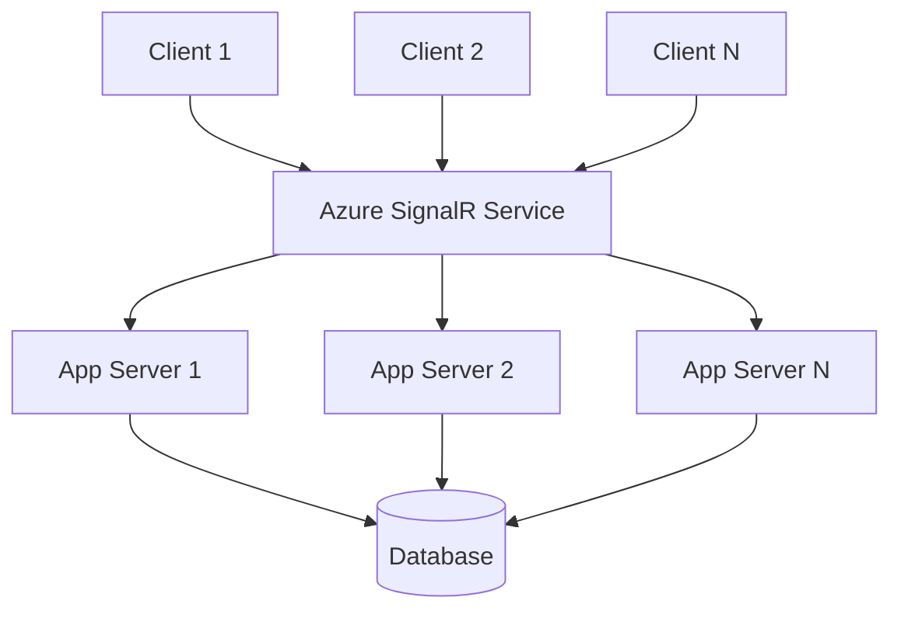

# How to Scale Real-Time Connections with Azure SignalR Service

Author: [nawazdhandala](https://www.github.com/nawazdhandala)

Tags: Azure, SignalR, Scaling, Real-Time, WebSockets, Performance, Cloud

Description: Learn how to scale Azure SignalR Service to handle thousands or millions of concurrent real-time connections with proper configuration and architecture.

---

Scaling real-time connections is a fundamentally different challenge than scaling HTTP APIs. With HTTP, each request is independent and stateless. With WebSockets, each connection is persistent and stateful. A single server can typically handle a few thousand WebSocket connections before running into file descriptor limits, memory pressure, or CPU bottlenecks. Azure SignalR Service abstracts this away by managing the connection infrastructure for you, but you still need to understand how to configure it properly and architect your application for scale.

In this post, I will cover the scaling dimensions of Azure SignalR Service, how to choose the right tier and unit count, and the architectural patterns that let you go from hundreds to millions of concurrent connections.

## Understanding SignalR Service Units

Azure SignalR Service scales in units. Each unit provides a certain number of concurrent connections and a message throughput limit. The exact numbers depend on the tier and the use case.

For the Standard tier, each unit supports approximately:
- 1,000 concurrent connections
- Varying message throughput depending on message size and pattern

The Free tier gives you 20 concurrent connections and is meant for development only.

You can add up to 100 units per service instance, which gives you roughly 100,000 concurrent connections per instance. For more than that, you deploy multiple instances.

## Choosing Between Service Modes

Azure SignalR Service offers three modes, and the choice affects scaling behavior:

**Default mode**: Your ASP.NET Core application connects to SignalR Service as a hub server. The service manages client connections, but your server processes all hub method invocations. Scaling your app server is important here because every message passes through it.

**Serverless mode**: Azure Functions handle the business logic. The service handles all connections, and functions only fire when something triggers them. This scales differently because your compute is event-driven.

**Classic mode**: Legacy mode that supports both default and serverless patterns. Not recommended for new projects.

For most scaling scenarios, I recommend either Default mode with ASP.NET Core (when you need complex hub logic) or Serverless mode with Azure Functions (when you want zero infrastructure management).

## Scaling in Default Mode

In Default mode, your ASP.NET Core app is the hub server. The scaling architecture looks like this:



SignalR Service distributes the client connections and routes messages to your app servers. Your app servers can run behind a load balancer without sticky sessions because SignalR Service handles the connection affinity.

To scale:

1. **Increase SignalR Service units**: Add more units for more concurrent connections
2. **Add app server instances**: More servers handle more message processing
3. **Optimize hub methods**: Keep your hub methods fast to increase throughput per server

Here is how to configure multiple app server instances to connect to the same SignalR Service:

```csharp
// Configure ASP.NET Core to use Azure SignalR Service
// Multiple instances of this app can connect to the same service
var builder = WebApplication.CreateBuilder(args);

builder.Services.AddSignalR()
    .AddAzureSignalR(options =>
    {
        options.ConnectionString = builder.Configuration["Azure:SignalR:ConnectionString"];
        // Number of connections between this server and SignalR Service
        // Increase for higher throughput
        options.ConnectionCount = 5;
        // Server-side timeout: how long to wait before considering a connection dead
        options.ServerStickyMode = ServerStickyMode.Required;
    });

var app = builder.Build();
app.MapHub<NotificationHub>("/hub/notifications");
app.Run();
```

The `ConnectionCount` setting controls how many connections exist between your app server and SignalR Service. The default is 5, but for high-throughput scenarios, increase it. Each connection can multiplex many client messages.

## Scaling in Serverless Mode

In Serverless mode, there are no persistent app servers. Azure Functions handle messages on demand:

1. **Increase SignalR Service units**: For more concurrent connections
2. **Scale Azure Functions**: The Functions runtime scales automatically in the Consumption plan
3. **Use Premium Functions plan**: For consistent latency without cold starts

The main scaling bottleneck in serverless mode is usually the Azure Functions throughput. If your function needs to send messages to thousands of clients in a group, ensure your function can handle the output volume.

## Handling High Message Throughput

Message throughput depends on several factors:

- **Message size**: Smaller messages mean higher throughput. Keep your payloads lean.
- **Message pattern**: Broadcasting to all clients is more expensive than sending to a single user.
- **Hub method complexity**: In Default mode, complex hub methods reduce throughput.

Here are the approximate throughput numbers per unit (these vary based on message size and pattern):

| Scenario | ~Messages/sec per unit |
|---|---|
| Broadcast, 1KB messages | ~500 |
| Send to user, 1KB messages | ~1,000 |
| Send to group (50 members), 1KB messages | ~2,000 |
| Echo (client sends, server echoes), 1KB | ~1,000 |

If you need higher throughput, increase the unit count. Throughput scales roughly linearly with units.

## Multi-Region Deployment

For global applications, deploy SignalR Service in multiple regions and route clients to the nearest instance:

```csharp
// Configure multiple SignalR Service endpoints for multi-region
builder.Services.AddSignalR()
    .AddAzureSignalR(options =>
    {
        options.Endpoints = new ServiceEndpoint[]
        {
            // Primary endpoint in East US
            new ServiceEndpoint("Endpoint=https://signalr-eastus.service.signalr.net;AccessKey=...;", EndpointType.Primary, "eastus"),
            // Secondary endpoint in West Europe
            new ServiceEndpoint("Endpoint=https://signalr-westeu.service.signalr.net;AccessKey=...;", EndpointType.Secondary, "westeu"),
        };
    });
```

With multiple endpoints, your app server connects to all of them. Messages sent by the app server are delivered through the endpoint that the target client is connected to. Azure Front Door or Traffic Manager can route clients to the nearest negotiate endpoint.

## Connection Lifecycle Management

At scale, connection management becomes important. Thousands of connections connecting and disconnecting simultaneously can cause spikes. Implement graceful handling:

```csharp
// Hub with connection lifecycle handling
// Tracks active connections for monitoring
public class NotificationHub : Hub
{
    private readonly ILogger<NotificationHub> _logger;
    private static int _connectionCount = 0;

    public NotificationHub(ILogger<NotificationHub> logger)
    {
        _logger = logger;
    }

    public override async Task OnConnectedAsync()
    {
        var count = Interlocked.Increment(ref _connectionCount);
        _logger.LogInformation("Client connected. Total: {Count}", count);

        // Add to default group based on user claims
        var userId = Context.UserIdentifier;
        if (!string.IsNullOrEmpty(userId))
        {
            await Groups.AddToGroupAsync(Context.ConnectionId, $"user-{userId}");
        }

        await base.OnConnectedAsync();
    }

    public override async Task OnDisconnectedAsync(Exception exception)
    {
        var count = Interlocked.Decrement(ref _connectionCount);
        _logger.LogInformation("Client disconnected. Total: {Count}", count);
        await base.OnDisconnectedAsync(exception);
    }
}
```

## Monitoring at Scale

When running thousands of connections, monitoring is essential. Azure SignalR Service provides built-in metrics:

- **Connection count**: Current number of active connections
- **Message count**: Total messages sent and received
- **Inbound/outbound traffic**: Bandwidth usage
- **Connection errors**: Failed connection attempts

Set up alerts on these metrics:

```bash
# Create an alert for connection count exceeding 80% of capacity
# Helps you scale before hitting the limit
az monitor metrics alert create \
    --name "signalr-high-connections" \
    --resource-group my-rg \
    --scopes "/subscriptions/.../Microsoft.SignalRService/SignalR/my-signalr" \
    --condition "avg ConnectionCount > 800" \
    --window-size 5m \
    --evaluation-frequency 1m \
    --action-group my-ops-team
```

## Auto-Scaling SignalR Service Units

SignalR Service does not auto-scale units automatically. You need to implement auto-scaling yourself, either manually or through automation:

```bash
# Scale up SignalR Service to 5 units
az signalr update \
    --name my-signalr \
    --resource-group my-rg \
    --sku Standard_S1 \
    --unit-count 5
```

For automated scaling, create an Azure Function that checks the connection count metric and adjusts units:

```csharp
// Auto-scale function that runs every 5 minutes
// Checks connection count and adjusts units accordingly
[Function("AutoScaleSignalR")]
public async Task Run([TimerTrigger("0 */5 * * * *")] TimerInfo timer)
{
    var connectionCount = await GetCurrentConnectionCount();
    var currentUnits = await GetCurrentUnitCount();
    var connectionsPerUnit = 1000;

    // Scale up if usage exceeds 80%
    var neededUnits = (int)Math.Ceiling(connectionCount / (connectionsPerUnit * 0.8));
    neededUnits = Math.Max(1, Math.Min(neededUnits, 100)); // Clamp between 1 and 100

    if (neededUnits != currentUnits)
    {
        await UpdateUnitCount(neededUnits);
        _logger.LogInformation("Scaled SignalR from {Old} to {New} units", currentUnits, neededUnits);
    }
}
```

## Optimizing Message Payloads

At scale, message size matters. Smaller payloads mean less bandwidth, lower latency, and higher throughput. Some tips:

- Send only changed data, not the full state
- Use short property names in JSON payloads
- Consider MessagePack protocol for binary serialization (smaller than JSON)
- Compress large payloads before sending

To enable MessagePack:

```csharp
// Use MessagePack protocol for smaller message sizes
builder.Services.AddSignalR()
    .AddAzureSignalR()
    .AddMessagePackProtocol();
```

On the client side:

```javascript
// Connect with MessagePack protocol for smaller payloads
const connection = new signalR.HubConnectionBuilder()
    .withUrl("/hub/notifications")
    .withHubProtocol(new signalR.protocols.msgpack.MessagePackHubProtocol())
    .withAutomaticReconnect()
    .build();
```

## Summary

Scaling Azure SignalR Service comes down to three things: adding units for more connections, choosing the right service mode for your architecture, and optimizing your message patterns. Use Default mode when you need complex server-side logic, Serverless mode when you want hands-off scaling, and multi-region deployment when latency matters globally. Monitor connection counts and message throughput, automate unit scaling, and keep your payloads small. Azure SignalR Service handles the hard parts of WebSocket infrastructure, but your architecture decisions determine how smoothly it scales.
