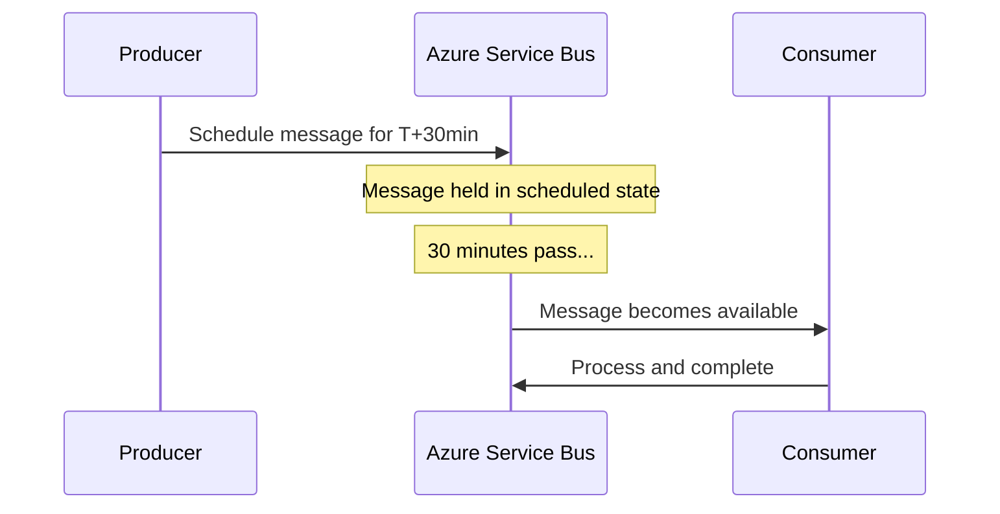

# How to Schedule Messages in Azure Service Bus for Delayed Delivery

Author: [nawazdhandala](https://www.github.com/nawazdhandala)

Tags: Azure Service Bus, Scheduled Messages, Delayed Delivery, Message Queue, Azure, Messaging, Automation

Description: Learn how to schedule messages for future delivery in Azure Service Bus to implement delayed processing, reminders, and time-based workflows.

---

Sometimes you do not want a message to be processed immediately. You want to send it now but have it delivered later. Maybe you need to send a reminder email 24 hours after a user signs up, or retry a failed payment in 30 minutes, or trigger a workflow at a specific time in the future. Azure Service Bus has built-in message scheduling that handles this without external timers or polling.

In this post, I will show you how to schedule messages for future delivery, manage scheduled messages, and build practical patterns around delayed messaging.

## How Message Scheduling Works

When you schedule a message, Service Bus accepts it immediately but does not make it visible to consumers until the scheduled enqueue time. The message sits in a "scheduled" state and becomes a regular message in the queue at the specified time.



This is different from setting a TTL (time to live). TTL controls when a message expires. Scheduled enqueue time controls when a message becomes visible.

## Scheduling a Message

There are two ways to schedule a message: setting the `ScheduledEnqueueTime` property on the message, or using the `ScheduleMessageAsync` method.

### Method 1: Setting the Property

```csharp
using Azure.Messaging.ServiceBus;

public class ReminderScheduler
{
    private readonly ServiceBusSender _sender;
    private readonly ILogger<ReminderScheduler> _logger;

    public ReminderScheduler(ServiceBusClient client, ILogger<ReminderScheduler> logger)
    {
        _sender = client.CreateSender("reminders");
        _logger = logger;
    }

    // Schedule a reminder message for a specific time
    public async Task ScheduleReminderAsync(string userId, string message, DateTime deliveryTime)
    {
        var busMessage = new ServiceBusMessage(BinaryData.FromObjectAsJson(new
        {
            UserId = userId,
            ReminderMessage = message,
            ScheduledFor = deliveryTime
        }))
        {
            ContentType = "application/json",
            Subject = "Reminder",
            // Set when the message should become visible in the queue
            ScheduledEnqueueTime = deliveryTime
        };

        await _sender.SendMessageAsync(busMessage);

        _logger.LogInformation(
            "Scheduled reminder for user {UserId} at {Time}",
            userId, deliveryTime);
    }

    // Schedule a batch of messages all at once
    public async Task ScheduleFollowUpSequenceAsync(string userId, DateTime signupTime)
    {
        var messages = new List<ServiceBusMessage>
        {
            // Welcome email - send immediately
            CreateMessage(userId, "Welcome! Here is how to get started.",
                signupTime),

            // Follow-up 1 day later
            CreateMessage(userId, "How is your experience so far?",
                signupTime.AddDays(1)),

            // Follow-up 3 days later
            CreateMessage(userId, "Have you tried our premium features?",
                signupTime.AddDays(3)),

            // Follow-up 7 days later
            CreateMessage(userId, "Your trial ends soon - upgrade now!",
                signupTime.AddDays(7))
        };

        // Send all scheduled messages in a single batch
        await _sender.SendMessagesAsync(messages);

        _logger.LogInformation(
            "Scheduled {Count} follow-up messages for user {UserId}",
            messages.Count, userId);
    }

    private ServiceBusMessage CreateMessage(string userId, string text, DateTime deliveryTime)
    {
        return new ServiceBusMessage(BinaryData.FromObjectAsJson(new
        {
            UserId = userId,
            Text = text,
            ScheduledFor = deliveryTime
        }))
        {
            ContentType = "application/json",
            Subject = "FollowUp",
            ScheduledEnqueueTime = deliveryTime,
            // Group by user ID for potential session-based ordering
            ApplicationProperties = { ["UserId"] = userId }
        };
    }
}
```

### Method 2: Using ScheduleMessageAsync

The `ScheduleMessageAsync` method returns a sequence number that you can use to cancel the scheduled message later.

```csharp
public class CancellableScheduler
{
    private readonly ServiceBusSender _sender;
    private readonly ILogger<CancellableScheduler> _logger;

    public CancellableScheduler(ServiceBusClient client, ILogger<CancellableScheduler> logger)
    {
        _sender = client.CreateSender("tasks");
        _logger = logger;
    }

    // Schedule a message and return the sequence number for potential cancellation
    public async Task<long> ScheduleTaskAsync(TaskPayload task, DateTimeOffset executeAt)
    {
        var message = new ServiceBusMessage(BinaryData.FromObjectAsJson(task))
        {
            ContentType = "application/json",
            Subject = task.TaskType,
            MessageId = task.TaskId
        };

        // ScheduleMessageAsync returns a sequence number
        // Store this number if you need to cancel the message later
        long sequenceNumber = await _sender.ScheduleMessageAsync(
            message, executeAt);

        _logger.LogInformation(
            "Scheduled task {TaskId} for {Time}, sequence: {Seq}",
            task.TaskId, executeAt, sequenceNumber);

        return sequenceNumber;
    }

    // Cancel a previously scheduled message using its sequence number
    public async Task CancelScheduledTaskAsync(long sequenceNumber)
    {
        await _sender.CancelScheduledMessageAsync(sequenceNumber);
        _logger.LogInformation("Cancelled scheduled message with sequence {Seq}",
            sequenceNumber);
    }

    // Cancel multiple scheduled messages at once
    public async Task CancelMultipleAsync(IEnumerable<long> sequenceNumbers)
    {
        await _sender.CancelScheduledMessagesAsync(sequenceNumbers);
        _logger.LogInformation("Cancelled {Count} scheduled messages",
            sequenceNumbers.Count());
    }
}
```

## Practical Pattern: Delayed Retry

One of the most useful applications of scheduled messages is implementing delayed retries. When a message fails, instead of retrying immediately (which often fails again for the same reason), schedule a retry with an increasing delay.

```csharp
public class DelayedRetryProcessor
{
    private readonly ServiceBusClient _client;
    private readonly ILogger<DelayedRetryProcessor> _logger;

    public async Task ProcessWithDelayedRetry(
        ProcessMessageEventArgs args)
    {
        var message = args.Message;

        try
        {
            var order = message.Body.ToObjectFromJson<Order>();
            await ProcessOrder(order);
            await args.CompleteMessageAsync(message);
        }
        catch (TransientException ex)
        {
            // Determine the retry delay based on the attempt number
            int attempt = message.ApplicationProperties.TryGetValue(
                "RetryAttempt", out var val) ? (int)(long)val : 0;

            if (attempt >= 5)
            {
                // Max retries exceeded - dead-letter the message
                _logger.LogError("Max retries exceeded for message {Id}",
                    message.MessageId);
                await args.DeadLetterMessageAsync(message,
                    deadLetterReason: "MaxDelayedRetriesExceeded");
                return;
            }

            // Calculate exponential backoff delay
            // Attempt 0: 30 seconds, 1: 60 seconds, 2: 2 minutes, etc.
            var delay = TimeSpan.FromSeconds(30 * Math.Pow(2, attempt));

            _logger.LogWarning(
                "Scheduling retry {Attempt} for message {Id} in {Delay}",
                attempt + 1, message.MessageId, delay);

            // Create a new message for the retry
            var sender = _client.CreateSender(args.EntityPath);
            var retryMessage = new ServiceBusMessage(message.Body)
            {
                ContentType = message.ContentType,
                Subject = message.Subject,
                ScheduledEnqueueTime = DateTimeOffset.UtcNow.Add(delay),
                MessageId = $"{message.MessageId}-retry-{attempt + 1}"
            };

            // Copy original properties and increment retry count
            foreach (var prop in message.ApplicationProperties)
            {
                retryMessage.ApplicationProperties[prop.Key] = prop.Value;
            }
            retryMessage.ApplicationProperties["RetryAttempt"] = attempt + 1;
            retryMessage.ApplicationProperties["OriginalMessageId"] = message.MessageId;

            await sender.SendMessageAsync(retryMessage);
            await args.CompleteMessageAsync(message);

            await sender.DisposeAsync();
        }
    }
}
```

## Practical Pattern: Timeout Monitoring

Schedule a "timeout" message when starting a long-running process. If the process completes before the timeout, cancel the message. If it does not complete, the timeout message fires and triggers an alert or compensation logic.

```csharp
public class TimeoutMonitor
{
    private readonly ServiceBusSender _sender;
    private readonly IDatabase _database;
    private readonly ILogger<TimeoutMonitor> _logger;

    // Start a process and schedule a timeout check
    public async Task StartProcessWithTimeout(string processId, TimeSpan timeout)
    {
        // Schedule a timeout check message
        var message = new ServiceBusMessage(BinaryData.FromObjectAsJson(new
        {
            ProcessId = processId,
            StartedAt = DateTimeOffset.UtcNow,
            Type = "TimeoutCheck"
        }))
        {
            Subject = "TimeoutCheck",
            MessageId = $"timeout-{processId}"
        };

        long sequenceNumber = await _sender.ScheduleMessageAsync(
            message, DateTimeOffset.UtcNow.Add(timeout));

        // Store the sequence number so we can cancel if the process completes
        await _database.SaveAsync(new ProcessRecord
        {
            ProcessId = processId,
            TimeoutSequenceNumber = sequenceNumber,
            Status = "Running",
            StartedAt = DateTimeOffset.UtcNow
        });

        _logger.LogInformation(
            "Started process {Id} with {Timeout} timeout",
            processId, timeout);
    }

    // When the process completes, cancel the timeout message
    public async Task CompleteProcess(string processId)
    {
        var record = await _database.GetAsync(processId);

        if (record?.TimeoutSequenceNumber != null)
        {
            await _sender.CancelScheduledMessageAsync(
                record.TimeoutSequenceNumber.Value);
            _logger.LogInformation(
                "Cancelled timeout for completed process {Id}", processId);
        }

        record.Status = "Completed";
        await _database.SaveAsync(record);
    }
}

// The timeout handler - processes timeout messages when they fire
public class TimeoutHandler
{
    [Function("HandleTimeout")]
    public async Task Run(
        [ServiceBusTrigger("timeouts", Connection = "ServiceBusConnection")]
        ServiceBusReceivedMessage message,
        ServiceBusMessageActions messageActions)
    {
        var payload = message.Body.ToObjectFromJson<TimeoutPayload>();

        // Check if the process actually timed out
        // (it might have completed between scheduling and now)
        var process = await _database.GetAsync(payload.ProcessId);

        if (process?.Status == "Completed")
        {
            // Process already completed - this timeout is stale
            await messageActions.CompleteMessageAsync(message);
            return;
        }

        // Process genuinely timed out - take action
        _logger.LogWarning("Process {Id} timed out after {Duration}",
            payload.ProcessId, DateTimeOffset.UtcNow - payload.StartedAt);

        await _alertService.SendAlertAsync(
            $"Process {payload.ProcessId} timed out");

        await messageActions.CompleteMessageAsync(message);
    }
}
```

## Viewing Scheduled Messages

You can peek at scheduled messages to see what is queued for future delivery.

```csharp
// Peek at scheduled messages in the queue
public async Task<List<ScheduledMessageInfo>> GetScheduledMessagesAsync(string queueName)
{
    var receiver = _client.CreateReceiver(queueName);
    var results = new List<ScheduledMessageInfo>();

    // PeekMessages returns both active and scheduled messages
    var messages = await receiver.PeekMessagesAsync(maxMessages: 100);

    foreach (var msg in messages.Where(m => m.State == ServiceBusMessageState.Scheduled))
    {
        results.Add(new ScheduledMessageInfo
        {
            MessageId = msg.MessageId,
            SequenceNumber = msg.SequenceNumber,
            ScheduledEnqueueTime = msg.ScheduledEnqueueTime,
            Subject = msg.Subject,
            BodyPreview = msg.Body.ToString()[..Math.Min(100, msg.Body.ToString().Length)]
        });
    }

    await receiver.DisposeAsync();
    return results;
}
```

## Limitations to Keep in Mind

Scheduled messages count toward your queue's storage quota. If you schedule millions of messages far into the future, you could hit storage limits.

The scheduling precision is approximately 1 second. Do not rely on sub-second timing accuracy.

Scheduled messages cannot be received by consumers until their enqueue time, but they can be peeked at any time. Keep this in mind if your scheduled messages contain sensitive data.

## Summary

Message scheduling in Azure Service Bus is a powerful feature for implementing delayed processing, follow-up sequences, retry strategies, and timeout monitoring. Use the `ScheduledEnqueueTime` property for fire-and-forget scheduling, or use `ScheduleMessageAsync` when you need the ability to cancel. The delayed retry pattern is particularly valuable for building resilient systems that gracefully handle transient failures without overloading failing downstream services.
