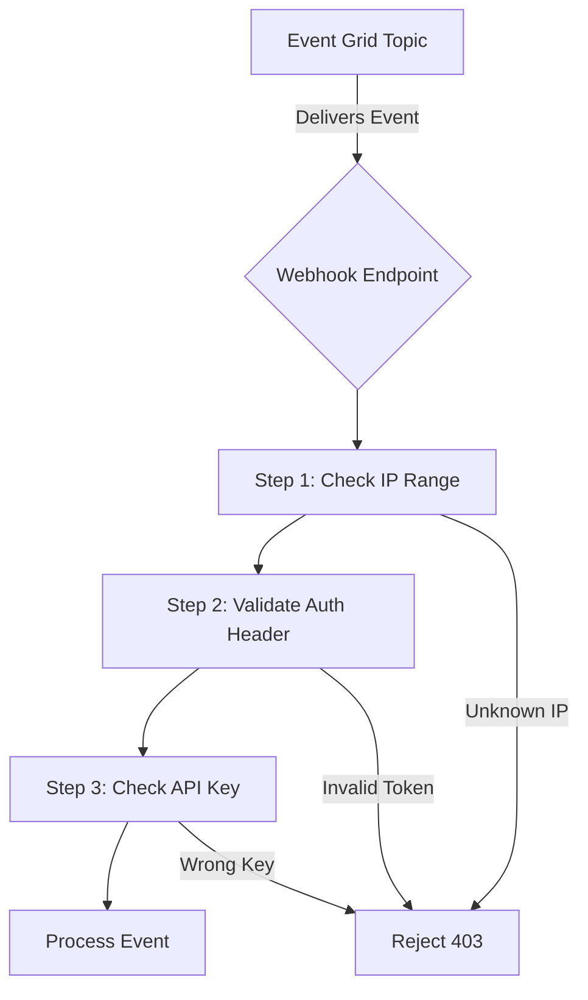

# How to Secure Azure Event Grid Webhook Endpoints with Validation

Author: [nawazdhandala](https://www.github.com/nawazdhandala)

Tags: Azure, Event Grid, Webhook Security, Endpoint Validation, Authentication, Cloud Security, Event Delivery

Description: Secure your Azure Event Grid webhook endpoints with subscription validation, Azure AD authentication, and shared secret verification.

---

When you create an Event Grid subscription that delivers events to a webhook endpoint, you are essentially telling Azure to send HTTP POST requests to your URL. Without proper security, anyone who discovers your endpoint URL could send fake events to it. Azure Event Grid provides several security mechanisms to prevent this, starting with the subscription validation handshake.

## The Validation Handshake

When you create a new event subscription pointing to a webhook, Event Grid sends a validation event to your endpoint before it starts delivering real events. Your endpoint must respond correctly to prove it owns the URL and wants to receive events. This prevents someone from subscribing your endpoint to an Event Grid topic without your knowledge.

Event Grid supports two validation methods: synchronous (validation code) and asynchronous (validation URL).

## Synchronous Validation

In the synchronous flow, Event Grid sends a `SubscriptionValidationEvent` to your endpoint. Your endpoint must respond with the validation code within 30 seconds.

Here is what the validation event looks like:

```json
[
  {
    "id": "validation-id-123",
    "eventType": "Microsoft.EventGrid.SubscriptionValidationEvent",
    "subject": "",
    "eventTime": "2026-02-16T10:00:00Z",
    "data": {
      "validationCode": "512d38b6-c7b8-40c8-89fe-f46f9e9622b6",
      "validationUrl": "https://rp-eastus2.eventgrid.azure.net:553/eventsubscriptions/sub-orders/validate?id=512d38b6..."
    },
    "dataVersion": "2",
    "metadataVersion": "1"
  }
]
```

Your endpoint needs to detect this event type and respond with the validation code.

```csharp
using Microsoft.Azure.Functions.Worker;
using Microsoft.Azure.Functions.Worker.Http;
using System.Text.Json;

[Function("EventGridHandler")]
public async Task<HttpResponseData> Run(
    [HttpTrigger(AuthorizationLevel.Function, "post")] HttpRequestData req)
{
    var body = await req.ReadAsStringAsync();
    var events = JsonSerializer.Deserialize<JsonElement[]>(body);

    foreach (var ev in events)
    {
        var eventType = ev.GetProperty("eventType").GetString();

        // Check if this is a validation event
        if (eventType == "Microsoft.EventGrid.SubscriptionValidationEvent")
        {
            // Extract the validation code from the event data
            var validationCode = ev
                .GetProperty("data")
                .GetProperty("validationCode")
                .GetString();

            // Respond with the validation code to confirm the subscription
            var response = req.CreateResponse(System.Net.HttpStatusCode.OK);
            await response.WriteAsJsonAsync(new
            {
                validationResponse = validationCode
            });
            return response;
        }
    }

    // Process regular events
    foreach (var ev in events)
    {
        await ProcessEvent(ev);
    }

    return req.CreateResponse(System.Net.HttpStatusCode.OK);
}
```

## Asynchronous Validation

If your endpoint cannot respond synchronously (for example, it is behind a queue or requires manual approval), you can use the validation URL. Event Grid includes a `validationUrl` in the validation event. Making a GET request to that URL within 10 minutes confirms the subscription.

```csharp
// Asynchronous validation - call the validation URL later
var validationUrl = validationEvent.Data.GetProperty("validationUrl").GetString();

// You can store this URL and call it later (within 10 minutes)
using var httpClient = new HttpClient();
await httpClient.GetAsync(validationUrl);
// The subscription is now confirmed
```

This is useful for scenarios where the initial webhook handler queues the event for processing and cannot provide an immediate synchronous response.

## Webhook Authentication with Azure AD

For the strongest security, configure your webhook endpoint to require Azure AD (now Entra ID) authentication. Event Grid can authenticate using a service principal or managed identity when delivering events.

First, register an application in Azure AD for your webhook endpoint.

```bash
# Create an Azure AD application for your webhook
APP_ID=$(az ad app create \
  --display-name "EventGrid-WebhookAuth" \
  --query "appId" \
  --output tsv)

# Create a service principal for the application
az ad sp create --id "$APP_ID"
```

Then configure the event subscription to use Azure AD authentication.

```bash
# Create subscription with Azure AD delivery authentication
az eventgrid event-subscription create \
  --name sub-secure-orders \
  --source-resource-id "/subscriptions/{sub-id}/resourceGroups/rg-events/providers/Microsoft.EventGrid/topics/topic-orders" \
  --endpoint "https://myapp.azurewebsites.net/api/events" \
  --delivery-attribute-mapping "Authorization" static "Bearer" false \
  --azure-active-directory-tenant-id "{tenant-id}" \
  --azure-active-directory-application-id-or-uri "$APP_ID"
```

Your webhook endpoint then validates the JWT token in the Authorization header.

```csharp
using Microsoft.IdentityModel.Tokens;
using System.IdentityModel.Tokens.Jwt;

public async Task<bool> ValidateToken(HttpRequestData req)
{
    // Extract the Bearer token from the Authorization header
    var authHeader = req.Headers.GetValues("Authorization").FirstOrDefault();
    if (string.IsNullOrEmpty(authHeader) || !authHeader.StartsWith("Bearer "))
        return false;

    var token = authHeader.Substring("Bearer ".Length);

    // Validate the JWT token
    var tokenHandler = new JwtSecurityTokenHandler();
    var validationParameters = new TokenValidationParameters
    {
        ValidateIssuerSigningKey = true,
        ValidateIssuer = true,
        ValidIssuer = $"https://login.microsoftonline.com/{tenantId}/v2.0",
        ValidateAudience = true,
        ValidAudience = applicationId,
        ValidateLifetime = true
    };

    try
    {
        tokenHandler.ValidateToken(token, validationParameters, out _);
        return true;
    }
    catch (SecurityTokenException)
    {
        return false;
    }
}
```

## Shared Access Signatures for Webhook URLs

Another common approach is to include a secret in the webhook URL itself. This is simpler than Azure AD but less secure since the secret is in the URL.

```bash
# Use a query parameter as a shared secret
az eventgrid event-subscription create \
  --name sub-secret-orders \
  --source-resource-id "/subscriptions/{sub-id}/resourceGroups/rg-events/providers/Microsoft.EventGrid/topics/topic-orders" \
  --endpoint "https://myapp.azurewebsites.net/api/events?code=your-secret-key-here"
```

Your handler checks the secret in the query string:

```csharp
// Validate the shared secret in the query string
var queryParams = HttpUtility.ParseQueryString(req.Url.Query);
var code = queryParams["code"];

if (code != Environment.GetEnvironmentVariable("WEBHOOK_SECRET"))
{
    return req.CreateResponse(System.Net.HttpStatusCode.Unauthorized);
}
```

## Delivery Attribute Mapping

Event Grid can include custom headers with each event delivery. You can use this to pass API keys or other authentication tokens.

```bash
# Add custom headers to event deliveries
az eventgrid event-subscription create \
  --name sub-with-headers \
  --source-resource-id "/subscriptions/{sub-id}/resourceGroups/rg-events/providers/Microsoft.EventGrid/topics/topic-orders" \
  --endpoint "https://myapp.azurewebsites.net/api/events" \
  --delivery-attribute-mapping "X-Api-Key" static "your-api-key" true \
  --delivery-attribute-mapping "X-Source" static "event-grid" false
```

The `true` at the end marks the header value as secret, so it will not be visible when you query the subscription configuration.

```bicep
// Bicep definition with delivery attribute mapping
resource subscription 'Microsoft.EventGrid/topics/eventSubscriptions@2022-06-15' = {
  name: '${topicName}/sub-with-auth-headers'
  properties: {
    destination: {
      endpointType: 'WebHook'
      properties: {
        endpointUrl: 'https://myapp.azurewebsites.net/api/events'
        // Custom headers for authentication
        deliveryAttributeMappings: [
          {
            name: 'X-Api-Key'
            type: 'Static'
            properties: {
              value: 'your-secret-api-key'
              isSecret: true
            }
          }
          {
            name: 'X-Event-Source'
            type: 'Static'
            properties: {
              value: 'azure-event-grid'
              isSecret: false
            }
          }
        ]
      }
    }
  }
}
```

## IP Filtering

You can also restrict your webhook endpoint to only accept traffic from Event Grid's IP addresses. Event Grid publishes its IP ranges in the Azure IP Ranges document. However, these ranges change periodically, so IP filtering alone is not recommended as a primary security mechanism.

A better approach is to combine IP filtering with one of the authentication methods above for defense in depth.

## Security Architecture Overview



## Best Practices

Use Azure AD authentication for production endpoints. It is the most robust option and integrates with Azure's identity platform.

Always handle the validation handshake correctly. If your endpoint cannot complete validation, Event Grid will not create the subscription.

Rotate secrets regularly. If you use API keys or shared secrets, rotate them on a schedule and update the Event Grid subscription configuration.

Log failed authentication attempts. This helps you detect potential attacks against your webhook endpoints.

Use HTTPS only. Event Grid requires HTTPS for webhook endpoints - it will not deliver events to HTTP URLs. Make sure your TLS certificate is valid and not expired.

## Summary

Securing Event Grid webhook endpoints involves multiple layers: the validation handshake ensures only authorized subscriptions are created, Azure AD authentication verifies the sender's identity, delivery attribute mapping lets you pass API keys, and IP filtering adds another barrier. Combine these mechanisms based on your security requirements, and monitor your endpoints for unauthorized access attempts.
