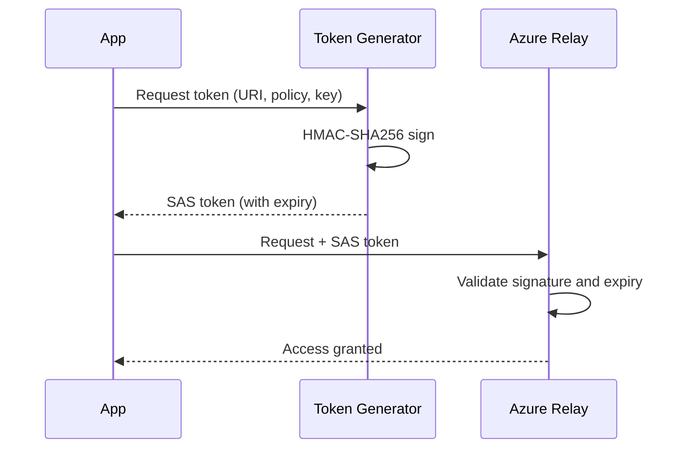

# How to Secure Azure Relay Hybrid Connections with Shared Access Signatures

Author: [nawazdhandala](https://www.github.com/nawazdhandala)

Tags: Azure, Relay, Hybrid Connections, Shared Access Signatures, Security, Authentication, SAS

Description: Learn how to secure Azure Relay Hybrid Connections using Shared Access Signatures for authentication and fine-grained access control.

---

Azure Relay Hybrid Connections allow cloud applications to communicate with on-premises services, but that communication path needs to be secured. You do not want just anyone sending requests through your relay or listening for incoming traffic. Shared Access Signatures (SAS) are the primary authentication mechanism for Azure Relay, and understanding how to use them properly is essential for a secure deployment.

In this post, I will cover how SAS authentication works with Hybrid Connections, how to create and manage authorization rules, how to generate tokens programmatically, and best practices for keeping your relay endpoints secure.

## How SAS Authentication Works

Every request to Azure Relay - whether it is a listener establishing a connection or a sender making a request - must include a valid SAS token. The token proves that the caller has the right to access the relay resource.

A SAS token is generated from three pieces of information:

- **Resource URI**: The endpoint being accessed
- **Policy name**: The name of the authorization rule
- **Policy key**: The secret key associated with the rule

The token has an expiration time. Once it expires, access is denied until a new token is presented.



## Creating Authorization Rules

Authorization rules define who can do what with your hybrid connection. Each rule has a name, a set of rights, and a pair of keys (primary and secondary).

The available rights are:

- **Listen**: Allows establishing a listener connection (the on-premises side)
- **Send**: Allows sending requests through the relay (the cloud side)
- **Manage**: Full control, including creating and deleting authorization rules

Always create separate rules for listeners and senders. Never use the root manage key for application access.

```bash
# Create a listener-only rule
az relay hyco authorization-rule create \
  --name on-prem-listener \
  --hybrid-connection-name my-connection \
  --namespace-name my-relay-ns \
  --resource-group rg-relay \
  --rights Listen

# Create a sender-only rule
az relay hyco authorization-rule create \
  --name cloud-sender \
  --hybrid-connection-name my-connection \
  --namespace-name my-relay-ns \
  --resource-group rg-relay \
  --rights Send

# Create a rule with both listen and send (for bidirectional scenarios)
az relay hyco authorization-rule create \
  --name bidirectional \
  --hybrid-connection-name my-connection \
  --namespace-name my-relay-ns \
  --resource-group rg-relay \
  --rights Listen Send
```

Each rule automatically gets a primary and secondary key. The secondary key exists so you can rotate keys without downtime.

```bash
# List the keys for a rule
az relay hyco authorization-rule keys list \
  --name cloud-sender \
  --hybrid-connection-name my-connection \
  --namespace-name my-relay-ns \
  --resource-group rg-relay
```

## Generating SAS Tokens Programmatically

Your applications need to generate SAS tokens at runtime. Here is how to do it in different languages.

### Node.js

```javascript
// sas-token.js - Generate a SAS token for Azure Relay
const crypto = require('crypto');

function createRelayToken(uri, keyName, key, expirySeconds) {
  // Default to 1 hour expiry
  expirySeconds = expirySeconds || 3600;

  // Encode the resource URI
  const encodedUri = encodeURIComponent(uri);

  // Calculate the expiry timestamp
  const expiry = Math.ceil(Date.now() / 1000) + expirySeconds;

  // Create the string to sign: encoded URI + newline + expiry
  const stringToSign = encodedUri + '\n' + expiry;

  // Sign with HMAC-SHA256 using the policy key
  const signature = crypto
    .createHmac('sha256', key)
    .update(stringToSign, 'utf8')
    .digest('base64');

  // Construct the token string
  const token = `SharedAccessSignature sr=${encodedUri}&sig=${encodeURIComponent(signature)}&se=${expiry}&skn=${keyName}`;

  return token;
}

// Generate a token for a sender
const senderToken = createRelayToken(
  'https://my-relay-ns.servicebus.windows.net/my-connection',
  'cloud-sender',
  process.env.RELAY_SENDER_KEY,
  3600 // 1 hour
);

console.log('Sender token:', senderToken);
```

### Python

```python
# sas_token.py - Generate a SAS token for Azure Relay in Python
import hmac
import hashlib
import base64
import time
from urllib.parse import quote_plus

def create_relay_token(uri, key_name, key, expiry_seconds=3600):
    # Encode the URI
    encoded_uri = quote_plus(uri)

    # Calculate expiry
    expiry = int(time.time()) + expiry_seconds

    # Create the string to sign
    string_to_sign = f"{encoded_uri}\n{expiry}"

    # Sign with HMAC-SHA256
    signature = base64.b64encode(
        hmac.new(
            key.encode('utf-8'),
            string_to_sign.encode('utf-8'),
            hashlib.sha256
        ).digest()
    ).decode('utf-8')

    # Construct the token
    token = f"SharedAccessSignature sr={encoded_uri}&sig={quote_plus(signature)}&se={expiry}&skn={key_name}"

    return token
```

### C#

```csharp
// SasTokenGenerator.cs - Generate SAS tokens in C#
using System;
using System.Security.Cryptography;
using System.Text;
using System.Web;

public static class SasTokenGenerator
{
    public static string CreateToken(string resourceUri, string keyName, string key, int expirySeconds = 3600)
    {
        // Encode the URI
        string encodedUri = HttpUtility.UrlEncode(resourceUri);

        // Calculate expiry timestamp
        long expiry = DateTimeOffset.UtcNow.ToUnixTimeSeconds() + expirySeconds;

        // Create the string to sign
        string stringToSign = $"{encodedUri}\n{expiry}";

        // Sign with HMAC-SHA256
        using var hmac = new HMACSHA256(Encoding.UTF8.GetBytes(key));
        byte[] hash = hmac.ComputeHash(Encoding.UTF8.GetBytes(stringToSign));
        string signature = Convert.ToBase64String(hash);

        // Build the token
        return $"SharedAccessSignature sr={encodedUri}&sig={HttpUtility.UrlEncode(signature)}&se={expiry}&skn={keyName}";
    }
}
```

## Key Rotation

Keys should be rotated periodically. The dual-key design (primary and secondary) allows zero-downtime rotation.

Here is the rotation procedure:

1. Update your listener application to use the secondary key.
2. Regenerate the primary key.
3. Update your sender application to use the new primary key.
4. Regenerate the secondary key.
5. Update your listener application back to the primary key (now new).

```bash
# Step 1: Regenerate the primary key
az relay hyco authorization-rule keys renew \
  --name on-prem-listener \
  --hybrid-connection-name my-connection \
  --namespace-name my-relay-ns \
  --resource-group rg-relay \
  --key-type PrimaryKey

# Step 2: Later, regenerate the secondary key
az relay hyco authorization-rule keys renew \
  --name on-prem-listener \
  --hybrid-connection-name my-connection \
  --namespace-name my-relay-ns \
  --resource-group rg-relay \
  --key-type SecondaryKey
```

Automate this with a scheduled Azure Function or pipeline.

```javascript
// key-rotation.js - Automated key rotation function
const { RelayManagementClient } = require('@azure/arm-relay');
const { DefaultAzureCredential } = require('@azure/identity');

async function rotateKeys(ruleName) {
  const credential = new DefaultAzureCredential();
  const client = new RelayManagementClient(credential, process.env.AZURE_SUBSCRIPTION_ID);

  // Regenerate the primary key
  const result = await client.hybridConnections.regenerateKeys(
    'rg-relay',
    'my-relay-ns',
    'my-connection',
    ruleName,
    { keyType: 'PrimaryKey' }
  );

  console.log('New primary key generated');

  // Store the new key in Key Vault
  await updateKeyVault(ruleName, result.primaryKey);
}
```

## Token Expiry Strategies

Short-lived tokens are more secure because they limit the window of exposure if a token is compromised. But too-short lifetimes create operational headaches.

For **listeners** (persistent connections), generate tokens with longer lifetimes (1-24 hours) and refresh them before they expire. The listener SDK handles this automatically if you provide a token provider function.

```javascript
// token-provider.js - Automatic token refresh for listeners
function createTokenProvider(uri, keyName, key) {
  let currentToken = null;
  let tokenExpiry = 0;

  return function getToken() {
    const now = Math.ceil(Date.now() / 1000);

    // Refresh the token if it expires within 5 minutes
    if (!currentToken || tokenExpiry - now < 300) {
      const expirySeconds = 3600; // 1 hour
      tokenExpiry = now + expirySeconds;
      currentToken = createRelayToken(uri, keyName, key, expirySeconds);
    }

    return currentToken;
  };
}
```

For **senders** (individual requests), short-lived tokens (5-15 minutes) are appropriate since each request is independent.

## Restricting Access by IP

SAS alone does not restrict which IP addresses can access the relay. For additional security, combine SAS with network-level controls.

```bash
# Configure IP filtering on the Relay namespace (if supported in your region)
az relay namespace network-rule-set update \
  --namespace-name my-relay-ns \
  --resource-group rg-relay \
  --default-action Deny \
  --ip-rules "[{\"ip-mask\":\"203.0.113.0/24\",\"action\":\"Allow\"}]"
```

## Best Practices Summary

Here are the key principles for securing Azure Relay with SAS:

- **Use separate rules for listen and send.** Never share the same key between the on-premises listener and the cloud sender.
- **Never use the root manage key** in applications. Create specific rules with minimum required rights.
- **Keep token lifetimes short** and refresh them before expiry.
- **Store keys in Azure Key Vault**, not in configuration files or environment variables on developer machines.
- **Rotate keys regularly.** Monthly rotation is a good starting point for most organizations.
- **Log and monitor** access. Enable diagnostic logging on the relay namespace to track who is connecting and when.
- **Use Azure AD authentication** when possible. Azure Relay supports Azure AD as an alternative to SAS, which eliminates the need to manage keys at all.

## Wrapping Up

Shared Access Signatures provide a flexible, key-based authentication mechanism for Azure Relay Hybrid Connections. By creating separate authorization rules for listeners and senders, generating short-lived tokens, rotating keys regularly, and storing secrets in Key Vault, you can build a secure relay deployment that meets enterprise security requirements. The dual-key design enables zero-downtime rotation, and the granular rights system ensures each component only has the access it needs.
