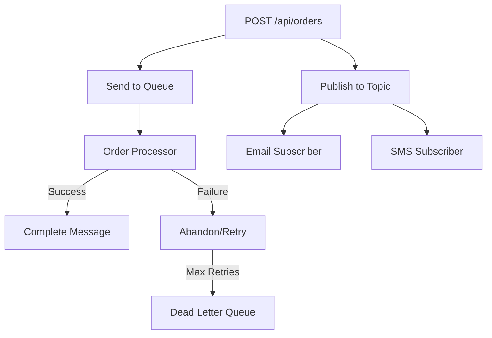

# How to Send and Receive Azure Service Bus Messages Using @azure/service-bus in Node.js

Author: [nawazdhandala](https://www.github.com/nawazdhandala)

Tags: Azure Service Bus, Node.js, Message Queue, @azure/service-bus, Microservices, Event-Driven, JavaScript

Description: Learn how to send and receive messages with Azure Service Bus using the @azure/service-bus SDK in Node.js for building reliable asynchronous messaging systems.

---

Azure Service Bus is an enterprise message broker that handles both queues (point-to-point) and topics (publish-subscribe). The `@azure/service-bus` SDK for Node.js gives you a clean, promise-based API for sending and receiving messages. It supports sessions, dead-letter queues, scheduled messages, and transactions - features you need when building reliable distributed systems.

In this post, we will build a complete messaging solution in Node.js using the Service Bus SDK. We will send messages to queues, subscribe to topics, handle errors, and implement patterns like dead-letter processing and scheduled messages.

## Setting Up Azure Service Bus

Create a Service Bus namespace and the necessary resources.

```bash
# Create a resource group
az group create --name servicebus-node-rg --location eastus

# Create a Service Bus namespace (Standard tier for topics)
az servicebus namespace create \
  --name my-node-servicebus \
  --resource-group servicebus-node-rg \
  --location eastus \
  --sku Standard

# Create a queue for order processing
az servicebus queue create \
  --namespace-name my-node-servicebus \
  --resource-group servicebus-node-rg \
  --name order-queue \
  --enable-dead-lettering-on-message-expiration true

# Create a topic for notifications
az servicebus topic create \
  --namespace-name my-node-servicebus \
  --resource-group servicebus-node-rg \
  --name notification-topic

# Create subscriptions for the topic
az servicebus topic subscription create \
  --namespace-name my-node-servicebus \
  --resource-group servicebus-node-rg \
  --topic-name notification-topic \
  --name email-sub

az servicebus topic subscription create \
  --namespace-name my-node-servicebus \
  --resource-group servicebus-node-rg \
  --topic-name notification-topic \
  --name sms-sub
```

## Installing the SDK

```bash
npm install @azure/service-bus @azure/identity dotenv
```

## Connecting to Service Bus

Create a client using the connection string or managed identity.

```javascript
// src/client.js
const { ServiceBusClient } = require("@azure/service-bus");
require("dotenv").config();

// Option 1: Connect with a connection string
const connectionString = process.env.SERVICE_BUS_CONNECTION_STRING;
const client = new ServiceBusClient(connectionString);

// Option 2: Connect with managed identity (recommended for production)
// const { DefaultAzureCredential } = require("@azure/identity");
// const client = new ServiceBusClient(
//     "my-node-servicebus.servicebus.windows.net",
//     new DefaultAzureCredential()
// );

module.exports = { client };
```

## Sending Messages to a Queue

Build a sender that publishes order messages to a queue.

```javascript
// src/sender.js
const { client } = require("./client");

// Create a sender for the order queue
const sender = client.createSender("order-queue");

// Send a single message
async function sendOrder(order) {
    const message = {
        // The message body - can be any JSON-serializable object
        body: order,

        // Custom properties for filtering and routing
        applicationProperties: {
            priority: order.amount > 1000 ? "high" : "normal",
            source: "web-api",
            orderType: order.type || "standard"
        },

        // Correlation ID for tracking across services
        correlationId: order.orderId,

        // Content type helps receivers deserialize correctly
        contentType: "application/json",

        // Label for quick identification without reading the body
        subject: `Order-${order.orderId}`
    };

    await sender.sendMessages(message);
    console.log(`Order ${order.orderId} sent to queue`);
}

// Send a batch of messages (more efficient for multiple messages)
async function sendOrderBatch(orders) {
    // Create a message batch
    let batch = await sender.createMessageBatch();

    for (const order of orders) {
        const message = {
            body: order,
            applicationProperties: {
                priority: order.amount > 1000 ? "high" : "normal"
            },
            correlationId: order.orderId
        };

        // Try to add the message to the batch
        if (!batch.tryAddMessage(message)) {
            // Batch is full - send it and start a new one
            await sender.sendMessages(batch);
            console.log(`Sent batch of ${batch.count} messages`);

            batch = await sender.createMessageBatch();

            // Add the message that did not fit to the new batch
            if (!batch.tryAddMessage(message)) {
                throw new Error("Message too large for an empty batch");
            }
        }
    }

    // Send any remaining messages
    if (batch.count > 0) {
        await sender.sendMessages(batch);
        console.log(`Sent final batch of ${batch.count} messages`);
    }
}

// Send a scheduled message (delivered at a future time)
async function sendScheduledOrder(order, deliverAt) {
    const message = {
        body: order,
        correlationId: order.orderId,
        subject: `Scheduled-Order-${order.orderId}`
    };

    // Schedule the message for future delivery
    const sequenceNumbers = await sender.scheduleMessages(message, deliverAt);
    console.log(`Order ${order.orderId} scheduled for ${deliverAt}, sequence: ${sequenceNumbers[0]}`);

    return sequenceNumbers[0];
}

module.exports = { sendOrder, sendOrderBatch, sendScheduledOrder, sender };
```

## Receiving Messages from a Queue

Build a receiver that processes messages from the queue.

```javascript
// src/receiver.js
const { client } = require("./client");

// Create a receiver for the order queue
const receiver = client.createReceiver("order-queue");

// Process messages using the subscribe pattern
function startProcessing() {
    receiver.subscribe({
        // Called for each message received
        processMessage: async (message) => {
            console.log(`Received order: ${message.body.orderId}`);
            console.log(`  Product: ${message.body.productName}`);
            console.log(`  Amount: $${message.body.amount}`);
            console.log(`  Priority: ${message.applicationProperties.priority}`);

            try {
                // Process the order
                await processOrder(message.body);

                // Complete the message (removes it from the queue)
                await receiver.completeMessage(message);
                console.log(`Order ${message.body.orderId} processed and completed`);
            } catch (error) {
                console.error(`Failed to process order ${message.body.orderId}:`, error.message);

                // Abandon the message - it goes back to the queue for retry
                await receiver.abandonMessage(message, {
                    lastError: error.message,
                    retryCount: (message.applicationProperties?.retryCount || 0) + 1
                });
            }
        },

        // Called when an error occurs in the receiver
        processError: async (args) => {
            console.error("Receiver error:", args.error.message);
            console.error("Error source:", args.errorSource);
        }
    });

    console.log("Order processor started, waiting for messages...");
}

// Simulated order processing
async function processOrder(order) {
    console.log(`Processing order ${order.orderId}...`);

    // Simulate some work
    await new Promise(resolve => setTimeout(resolve, 1000));

    // Simulate occasional failures for testing
    if (order.amount < 0) {
        throw new Error("Invalid order amount");
    }

    console.log(`Order ${order.orderId} fulfilled`);
}

module.exports = { startProcessing, receiver };
```

## Publishing to Topics

Topics work with a publish-subscribe pattern. Publishers send to a topic, and multiple subscribers receive copies.

```javascript
// src/publisher.js
const { client } = require("./client");

// Create a sender for the notification topic
const topicSender = client.createSender("notification-topic");

// Publish a notification event
async function publishNotification(notification) {
    const message = {
        body: notification,
        applicationProperties: {
            eventType: notification.type,        // e.g., "order.created"
            channel: notification.channel || "all"  // e.g., "email", "sms", "all"
        },
        subject: notification.type,
        correlationId: notification.referenceId
    };

    await topicSender.sendMessages(message);
    console.log(`Notification published: ${notification.type}`);
}

module.exports = { publishNotification, topicSender };
```

## Subscribing to Topics

Each subscription gets its own copy of every message published to the topic.

```javascript
// src/subscriber.js
const { client } = require("./client");

// Create a receiver for the email subscription
const emailReceiver = client.createReceiver("notification-topic", "email-sub");

// Create a receiver for the SMS subscription
const smsReceiver = client.createReceiver("notification-topic", "sms-sub");

// Start the email notification processor
function startEmailProcessor() {
    emailReceiver.subscribe({
        processMessage: async (message) => {
            const notification = message.body;
            console.log(`[Email] Sending to ${notification.recipient}: ${notification.subject}`);

            // Send the email (simulated)
            await sendEmail(notification);

            await emailReceiver.completeMessage(message);
        },
        processError: async (args) => {
            console.error("[Email] Error:", args.error.message);
        }
    });
    console.log("Email notification processor started");
}

// Start the SMS notification processor
function startSmsProcessor() {
    smsReceiver.subscribe({
        processMessage: async (message) => {
            const notification = message.body;
            console.log(`[SMS] Sending to ${notification.phone}: ${notification.text}`);

            // Send the SMS (simulated)
            await sendSms(notification);

            await smsReceiver.completeMessage(message);
        },
        processError: async (args) => {
            console.error("[SMS] Error:", args.error.message);
        }
    });
    console.log("SMS notification processor started");
}

async function sendEmail(notification) {
    await new Promise(resolve => setTimeout(resolve, 500));
}

async function sendSms(notification) {
    await new Promise(resolve => setTimeout(resolve, 300));
}

module.exports = { startEmailProcessor, startSmsProcessor };
```

## Dead Letter Processing

Messages that fail too many times automatically end up in the dead-letter queue. Build a processor to handle them.

```javascript
// src/dead-letter-processor.js
const { client } = require("./client");

// Create a receiver for the dead letter sub-queue
const dlqReceiver = client.createReceiver("order-queue", {
    subQueueType: "deadLetter"
});

async function processDeadLetters() {
    console.log("Processing dead letter messages...");

    // Peek at dead letter messages without removing them
    const peeked = await dlqReceiver.peekMessages(10);
    console.log(`Found ${peeked.length} dead letter messages`);

    // Receive and process dead letter messages
    const messages = await dlqReceiver.receiveMessages(10, {
        maxWaitTimeInMs: 5000
    });

    for (const message of messages) {
        console.log(`Dead letter: ${message.subject}`);
        console.log(`  Reason: ${message.deadLetterReason}`);
        console.log(`  Description: ${message.deadLetterErrorDescription}`);
        console.log(`  Body:`, message.body);

        // Decide what to do: retry, log, alert, or discard
        // For now, just log and complete
        await dlqReceiver.completeMessage(message);
    }
}

module.exports = { processDeadLetters };
```

## Putting It All Together

Create the main application that ties everything together.

```javascript
// src/app.js
const express = require("express");
const { sendOrder, sendOrderBatch, sendScheduledOrder, sender } = require("./sender");
const { startProcessing } = require("./receiver");
const { publishNotification } = require("./publisher");
const { startEmailProcessor, startSmsProcessor } = require("./subscriber");
const { processDeadLetters } = require("./dead-letter-processor");
const { client } = require("./client");

const app = express();
app.use(express.json());

// Endpoint to create an order
app.post("/api/orders", async (req, res) => {
    const order = {
        orderId: `ORD-${Date.now()}`,
        ...req.body
    };

    await sendOrder(order);

    // Also publish a notification
    await publishNotification({
        type: "order.created",
        referenceId: order.orderId,
        recipient: order.email,
        subject: `Order ${order.orderId} confirmed`,
        text: `Your order for ${order.productName} has been placed.`
    });

    res.status(202).json({ orderId: order.orderId, status: "queued" });
});

// Endpoint to process dead letters manually
app.post("/api/admin/process-dead-letters", async (req, res) => {
    await processDeadLetters();
    res.json({ status: "processed" });
});

// Start all processors
startProcessing();
startEmailProcessor();
startSmsProcessor();

// Graceful shutdown
process.on("SIGTERM", async () => {
    console.log("Shutting down...");
    await sender.close();
    await client.close();
    process.exit(0);
});

app.listen(3000, () => {
    console.log("Service running on port 3000");
});
```

## The Message Flow



## Wrapping Up

The `@azure/service-bus` SDK for Node.js gives you everything you need for reliable asynchronous messaging. Queues handle point-to-point communication, topics handle publish-subscribe, and dead-letter queues catch messages that cannot be processed. The subscribe pattern makes it easy to build long-running message processors, and batching improves throughput when sending multiple messages. Use connection strings for development and managed identities for production. Always implement dead-letter processing so failed messages do not disappear silently.
