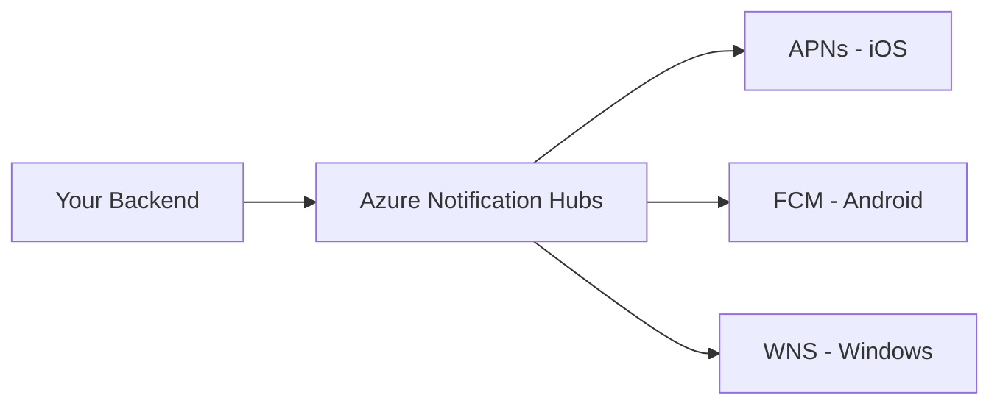

# How to Send Push Notifications with Azure Notification Hubs

Author: [nawazdhandala](https://www.github.com/nawazdhandala)

Tags: Azure, Notification Hubs, Push Notifications, Mobile, Cloud, FCM, APNs

Description: Learn how to set up Azure Notification Hubs and send push notifications to iOS and Android devices from your backend application.

---

Push notifications are one of those features that sounds simple until you try to implement it yourself. Each platform has its own push notification service - Apple Push Notification service (APNs) for iOS, Firebase Cloud Messaging (FCM) for Android, and Windows Notification Service (WNS) for Windows. Each has different protocols, authentication methods, and payload formats. Azure Notification Hubs abstracts all of that behind a single API.

In this post, I will walk through setting up Azure Notification Hubs from scratch, configuring it for both iOS and Android, registering devices, and sending your first push notification.

## What Azure Notification Hubs Does

Notification Hubs sits between your backend and the platform notification services. Instead of your server talking to APNs, FCM, and WNS individually, it talks to Notification Hubs, which handles the fan-out to each platform.



The service handles:
- Device registration and management
- Broadcast, multicast, and unicast notifications
- Template-based cross-platform notifications
- Tag-based targeting
- Scheduled delivery
- Telemetry and diagnostics

## Step 1: Create the Notification Hub

Use the Azure CLI to create a namespace and hub.

```bash
# Create a resource group
az group create --name rg-notifications --location eastus

# Create a notification hub namespace
az notification-hub namespace create \
  --name my-notification-ns \
  --resource-group rg-notifications \
  --location eastus \
  --sku Standard

# Create the notification hub within the namespace
az notification-hub create \
  --name my-notification-hub \
  --namespace-name my-notification-ns \
  --resource-group rg-notifications \
  --location eastus
```

The namespace is a container for notification hubs. You can have multiple hubs in a namespace, which is useful for separating environments (dev, staging, production) or different applications.

## Step 2: Configure Platform Credentials

Before you can send notifications, you need to configure the credentials for each platform you want to target.

### Configuring FCM for Android

You need a Firebase project and its server key.

```bash
# Configure FCM credentials
az notification-hub credential gcm update \
  --notification-hub-name my-notification-hub \
  --namespace-name my-notification-ns \
  --resource-group rg-notifications \
  --google-api-key "YOUR_FCM_SERVER_KEY"
```

### Configuring APNs for iOS

For APNs, you can use either a certificate or token-based authentication. Token-based is the recommended approach.

```bash
# Configure APNs with token-based authentication
az notification-hub credential apns update \
  --notification-hub-name my-notification-hub \
  --namespace-name my-notification-ns \
  --resource-group rg-notifications \
  --apns-certificate "YOUR_P8_KEY_CONTENT" \
  --key-id "YOUR_KEY_ID" \
  --app-id "YOUR_TEAM_ID" \
  --app-name "YOUR_BUNDLE_ID" \
  --endpoint "https://api.push.apple.com"
```

## Step 3: Register Devices

Devices register with the notification hub so it knows where to send notifications. There are two approaches: the client can register directly with the hub, or your backend can manage registrations.

Backend-managed registrations give you more control and are the recommended pattern for production.

```javascript
// register-device.js - Server-side device registration
const { NotificationHubsClient } = require('@azure/notification-hubs');

const connectionString = process.env.NOTIFICATION_HUB_CONNECTION_STRING;
const hubName = 'my-notification-hub';

const client = new NotificationHubsClient(connectionString, hubName);

// Register an Android device
async function registerAndroidDevice(fcmToken, userId) {
  const registration = {
    // The FCM registration token from the device
    gcmRegistrationId: fcmToken,
    // Tags for targeting this device later
    tags: [`user:${userId}`, 'platform:android']
  };

  const result = await client.createOrUpdateRegistration({
    kind: 'Gcm',
    gcmRegistrationId: fcmToken,
    tags: [`user:${userId}`, 'platform:android']
  });

  console.log('Registration ID:', result.registrationId);
  return result;
}

// Register an iOS device
async function registerIosDevice(deviceToken, userId) {
  const result = await client.createOrUpdateRegistration({
    kind: 'Apple',
    deviceToken: deviceToken,
    tags: [`user:${userId}`, 'platform:ios']
  });

  console.log('Registration ID:', result.registrationId);
  return result;
}
```

On the mobile side, your app needs to obtain the platform-specific push token (FCM token for Android, device token for iOS) and send it to your backend.

## Step 4: Send a Notification

Now comes the fun part. Let us send a notification to all registered devices.

```javascript
// send-notification.js - Send push notifications through Notification Hubs
const { NotificationHubsClient } = require('@azure/notification-hubs');

const connectionString = process.env.NOTIFICATION_HUB_CONNECTION_STRING;
const hubName = 'my-notification-hub';
const client = new NotificationHubsClient(connectionString, hubName);

// Send a notification to all Android devices
async function sendAndroidNotification(title, body) {
  const notification = {
    body: JSON.stringify({
      notification: {
        title: title,
        body: body
      },
      data: {
        // Custom data payload that your app can process
        action: 'open_dashboard',
        priority: 'high'
      }
    }),
    headers: {
      'Content-Type': 'application/json'
    }
  };

  const result = await client.sendNotification(
    { kind: 'Gcm', ...notification },
    { enableTestSend: false }
  );

  console.log('Tracking ID:', result.trackingId);
  console.log('Correlation ID:', result.correlationId);
}

// Send a notification to all iOS devices
async function sendIosNotification(title, body) {
  const notification = {
    body: JSON.stringify({
      aps: {
        alert: {
          title: title,
          body: body
        },
        sound: 'default',
        badge: 1
      },
      // Custom data for your app
      action: 'open_dashboard'
    }),
    headers: {
      'apns-priority': '10',
      'apns-push-type': 'alert'
    }
  };

  const result = await client.sendNotification(
    { kind: 'Apple', ...notification },
    { enableTestSend: false }
  );

  console.log('Tracking ID:', result.trackingId);
}

// Send to all devices
sendAndroidNotification('Server Alert', 'CPU usage exceeded 90%');
sendIosNotification('Server Alert', 'CPU usage exceeded 90%');
```

## Step 5: Target Specific Devices with Tags

Sending to all devices is fine for broadcast messages, but usually you want to target specific users or groups. Tags are the mechanism for this.

```javascript
// targeted-send.js - Send notifications to specific tags
async function sendToUser(userId, title, body) {
  const notification = {
    body: JSON.stringify({
      notification: { title, body }
    })
  };

  // Send to all devices registered with this user's tag
  const result = await client.sendNotification(
    { kind: 'Gcm', ...notification },
    { tagExpression: `user:${userId}` }
  );

  return result;
}

// Send to multiple tags with boolean expressions
async function sendToTeam(team, title, body) {
  const notification = {
    body: JSON.stringify({
      notification: { title, body }
    })
  };

  // Tag expressions support AND (&&), OR (||), and NOT (!)
  // This sends to users who are in the engineering team AND on Android
  const result = await client.sendNotification(
    { kind: 'Gcm', ...notification },
    { tagExpression: `team:${team} && platform:android` }
  );

  return result;
}
```

## Testing Notifications

During development, enable test send to get detailed feedback about the delivery.

```javascript
// test-send.js - Use test send mode for debugging
async function testSend() {
  const notification = {
    body: JSON.stringify({
      notification: {
        title: 'Test',
        body: 'This is a test notification'
      }
    })
  };

  // enableTestSend: true limits delivery to 10 devices but returns detailed results
  const result = await client.sendNotification(
    { kind: 'Gcm', ...notification },
    { enableTestSend: true }
  );

  console.log('Test send result:', result);
  // The result includes success/failure count and any error details
}
```

Test sends are rate-limited and should only be used during development. They send to a maximum of 10 devices but provide detailed outcome information for each delivery attempt.

## Common Issues and Solutions

**Notifications not arriving?** Check these things in order:

1. Verify your platform credentials are correct in the Azure portal under the notification hub's settings.
2. Confirm the device token or FCM registration ID is valid and current. Tokens expire and can be refreshed by the operating system.
3. Make sure the payload format matches what the platform expects. APNs is particularly strict about the `aps` structure.
4. Check the hub's metrics in the Azure portal. The "Outgoing Notifications" chart shows how many were sent, and the "Errors" chart shows failures.
5. For iOS, make sure you are using the correct APNs endpoint (sandbox vs. production) for your build type.

**Registration count keeps growing?** Devices do not unregister themselves when your app is uninstalled. Implement a cleanup process that removes stale registrations. The platform notification services return specific error codes for invalid tokens, which you can use to trigger cleanup.

## Wrapping Up

Azure Notification Hubs takes the pain out of cross-platform push notifications. Instead of maintaining separate integrations with APNs, FCM, and WNS, you get a single API that handles the routing and delivery. The tag system gives you flexible targeting, and the template system (covered in a separate post) lets you send one notification that renders correctly on every platform. Start with basic broadcast notifications, add tags for targeting, and build up from there.
