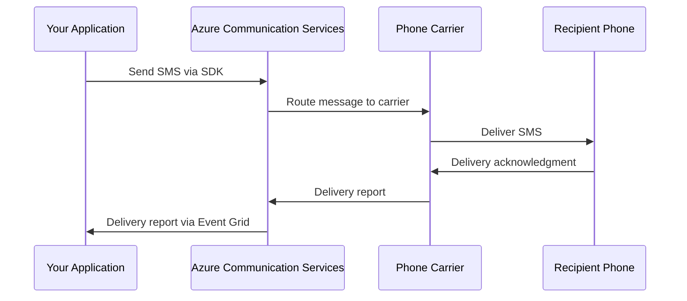

# How to Send SMS Messages Programmatically Using Azure Communication Services SDK

Author: [nawazdhandala](https://www.github.com/nawazdhandala)

Tags: Azure Communication Services, SMS, Messaging, SDK, Notifications, Two-Factor Authentication, Cloud Communication

Description: Learn how to send SMS messages programmatically using the Azure Communication Services SDK with examples for notifications, alerts, and two-factor authentication.

---

SMS is still one of the most reliable ways to reach people. Push notifications can be dismissed, emails can land in spam, but text messages have a 98% open rate and most get read within 3 minutes. Azure Communication Services (ACS) provides a programmable SMS API that lets you send and receive text messages from your applications. Whether you are building appointment reminders, delivery notifications, two-factor authentication, or emergency alerts, ACS handles the carrier integration, number provisioning, and delivery tracking.

This guide covers setting up ACS for SMS, sending messages with the SDK, handling delivery receipts, and building common messaging patterns.

## Prerequisites

You need:

- An Azure subscription
- An Azure Communication Services resource
- A phone number provisioned in ACS (toll-free or local)

## Step 1: Create an ACS Resource and Get a Phone Number

```bash
# Create the ACS resource
az communication create \
  --name my-acs-resource \
  --resource-group communication-rg \
  --location Global \
  --data-location UnitedStates

# Get the connection string
az communication list-key \
  --name my-acs-resource \
  --resource-group communication-rg \
  --query primaryConnectionString -o tsv
```

Phone numbers must be purchased through the Azure Portal or the Phone Numbers SDK. Navigate to your ACS resource in the portal, click Phone Numbers, and purchase a toll-free or local number with SMS capabilities.

## Step 2: Install the SDK

The ACS SMS SDK is available for multiple languages. We will use JavaScript and Python.

```bash
# JavaScript/Node.js
npm install @azure/communication-sms

# Python
pip install azure-communication-sms
```

## Step 3: Send a Simple SMS Message

Here is the most basic usage - sending a single text message.

```javascript
// send-sms.js - Send an SMS message with Azure Communication Services
const { SmsClient } = require('@azure/communication-sms');

// Connection string from your ACS resource
const connectionString = 'endpoint=https://my-acs-resource.communication.azure.com/;accesskey=...';

async function sendSms(to, message) {
    const smsClient = new SmsClient(connectionString);

    // Send the message
    const sendResults = await smsClient.send({
        from: '+18005551234',  // Your ACS phone number
        to: [to],               // Recipient phone number
        message: message
    });

    // Check the result
    for (const result of sendResults) {
        if (result.successful) {
            console.log(`Message sent to ${result.to}. ID: ${result.messageId}`);
        } else {
            console.error(`Failed to send to ${result.to}: ${result.errorMessage}`);
        }
    }
}

// Send a test message
sendSms('+12065551234', 'Your order #12345 has been shipped and will arrive tomorrow.');
```

And the Python equivalent.

```python
# send_sms.py - Send an SMS message using the Python SDK
from azure.communication.sms import SmsClient

connection_string = "endpoint=https://my-acs-resource.communication.azure.com/;accesskey=..."

def send_sms(to: str, message: str) -> dict:
    """Send a single SMS message and return the result."""
    client = SmsClient.from_connection_string(connection_string)

    # Send the message
    result = client.send(
        from_="<your-acs-phone-number>",
        to=to,
        message=message,
        enable_delivery_report=True  # Get delivery status updates
    )

    response = result[0]
    if response.successful:
        print(f"Message sent to {response.to}. ID: {response.message_id}")
        return {"success": True, "messageId": response.message_id}
    else:
        print(f"Failed: {response.error_message}")
        return {"success": False, "error": response.error_message}

# Send a message
send_sms("+12065551234", "Your appointment is confirmed for tomorrow at 2:00 PM.")
```

## Step 4: Send Bulk SMS Messages

When you need to send the same message to many recipients (like a notification blast), use the batch sending capability.

```javascript
// bulk-sms.js - Send SMS to multiple recipients
const { SmsClient } = require('@azure/communication-sms');

const connectionString = 'endpoint=https://my-acs-resource.communication.azure.com/;accesskey=...';

async function sendBulkSms(recipients, message) {
    const smsClient = new SmsClient(connectionString);

    // Send to multiple recipients in a single call
    // The SDK batches these efficiently
    const sendResults = await smsClient.send({
        from: '+18005551234',
        to: recipients,    // Array of phone numbers
        message: message
    });

    // Track results
    let successCount = 0;
    let failCount = 0;

    for (const result of sendResults) {
        if (result.successful) {
            successCount++;
        } else {
            failCount++;
            console.error(`Failed: ${result.to} - ${result.errorMessage}`);
        }
    }

    console.log(`Sent: ${successCount}, Failed: ${failCount}`);
    return { successCount, failCount };
}

// Send to a list of customers
const customers = [
    '+12065551001',
    '+12065551002',
    '+12065551003',
    '+12065551004',
    '+12065551005'
];

sendBulkSms(customers, 'Flash sale! 25% off all items today only. Reply STOP to unsubscribe.');
```

## Step 5: Handle Delivery Reports

Delivery reports tell you whether the message actually reached the recipient's phone. Enable them when sending and process them via Event Grid.

```javascript
// send-with-delivery-report.js - Send SMS with delivery tracking
const { SmsClient } = require('@azure/communication-sms');

const connectionString = 'endpoint=https://my-acs-resource.communication.azure.com/;accesskey=...';

async function sendTrackedSms(to, message) {
    const smsClient = new SmsClient(connectionString);

    const sendResults = await smsClient.send({
        from: '+18005551234',
        to: [to],
        message: message
    }, {
        enableDeliveryReport: true,  // Request delivery reports
        tag: 'order-notification'    // Custom tag for tracking
    });

    return sendResults[0];
}
```

Set up an Event Grid subscription on your ACS resource to receive delivery report events.

```bash
# Create an Event Grid subscription for SMS delivery reports
ACS_RESOURCE_ID=$(az communication show \
  --name my-acs-resource \
  --resource-group communication-rg \
  --query id -o tsv)

az eventgrid event-subscription create \
  --name sms-delivery-reports \
  --source-resource-id "$ACS_RESOURCE_ID" \
  --endpoint-type azurefunction \
  --endpoint "/subscriptions/{sub-id}/resourceGroups/communication-rg/providers/Microsoft.Web/sites/sms-handler/functions/ProcessDeliveryReport" \
  --included-event-types \
    "Microsoft.Communication.SMSDeliveryReportReceived"
```

Process the delivery report in an Azure Function.

```python
# function_app.py - Process SMS delivery reports
import azure.functions as func
import json
import logging

app = func.FunctionApp()

@app.function_name(name="ProcessDeliveryReport")
@app.event_grid_trigger(arg_name="event")
def process_delivery_report(event: func.EventGridEvent):
    """Handle SMS delivery report events."""
    data = event.get_json()

    message_id = data.get("messageId")
    delivery_status = data.get("deliveryStatus")
    to = data.get("to")
    received_at = data.get("receivedTimestamp")

    logging.info(f"Delivery report: {message_id} to {to} - Status: {delivery_status}")

    # Update your database with the delivery status
    if delivery_status == "Delivered":
        logging.info(f"Message {message_id} confirmed delivered to {to}")
        # Mark as delivered in your system
    elif delivery_status == "Failed":
        logging.warning(f"Message {message_id} failed delivery to {to}")
        # Handle the failure - maybe retry or alert
    elif delivery_status == "Undelivered":
        logging.warning(f"Message {message_id} undelivered to {to}")
        # The number might be invalid
```

## Common SMS Patterns

### Appointment Reminders

```python
# appointment_reminders.py - Send appointment reminders
from datetime import datetime, timedelta

def send_appointment_reminder(patient_phone: str, doctor_name: str,
                             appointment_time: datetime) -> dict:
    """Send an appointment reminder SMS."""
    # Format the time nicely
    time_str = appointment_time.strftime("%A, %B %d at %I:%M %p")

    message = (
        f"Reminder: You have an appointment with Dr. {doctor_name} "
        f"on {time_str}. Reply YES to confirm or call us at "
        f"(206) 555-0100 to reschedule."
    )

    return send_sms(patient_phone, message)
```

### Two-Factor Authentication

```python
# two_factor.py - Send 2FA verification codes
import random
import time

# Simple in-memory code store (use Redis or a database in production)
verification_codes = {}

def send_verification_code(phone: str) -> str:
    """Generate and send a 6-digit verification code."""
    code = str(random.randint(100000, 999999))

    # Store the code with a 5-minute expiry
    verification_codes[phone] = {
        "code": code,
        "expires": time.time() + 300  # 5 minutes
    }

    message = f"Your verification code is {code}. It expires in 5 minutes. Do not share this code."
    send_sms(phone, message)

    return code

def verify_code(phone: str, submitted_code: str) -> bool:
    """Verify a submitted code against the stored code."""
    stored = verification_codes.get(phone)
    if not stored:
        return False

    if time.time() > stored["expires"]:
        # Code has expired
        del verification_codes[phone]
        return False

    if stored["code"] == submitted_code:
        # Code matches - clean up
        del verification_codes[phone]
        return True

    return False
```

### Delivery Status Updates

```python
# delivery_updates.py - Send delivery status updates to customers
def send_delivery_update(customer_phone: str, order_id: str,
                        status: str, details: str = "") -> dict:
    """Send a delivery status update via SMS."""
    messages = {
        "shipped": f"Order #{order_id} has shipped! Track your package at example.com/track/{order_id}",
        "out_for_delivery": f"Order #{order_id} is out for delivery. Expected arrival: today by 5 PM.",
        "delivered": f"Order #{order_id} has been delivered. Thank you for your purchase!",
        "delayed": f"Order #{order_id} is delayed. New estimated delivery: {details}. We apologize for the inconvenience."
    }

    message = messages.get(status, f"Order #{order_id} update: {status}")
    return send_sms(customer_phone, message)
```

## Message Flow Architecture



## Handling Opt-Outs

In the US, recipients can reply STOP to opt out of messages. ACS handles this automatically at the platform level - once a recipient opts out, subsequent messages to that number will fail. You should also maintain your own opt-out list.

```python
# Track opt-outs in your application
opted_out_numbers = set()

def send_sms_with_opt_out_check(phone: str, message: str) -> dict:
    """Send SMS only if the recipient has not opted out."""
    if phone in opted_out_numbers:
        return {"success": False, "error": "Recipient has opted out"}

    return send_sms(phone, message)
```

## Rate Limits and Best Practices

ACS SMS has rate limits that vary by number type:

- Toll-free numbers: 200 messages per minute
- Short codes: Much higher throughput (contact Azure for specific limits)
- Local numbers: Varies by region

For high-volume messaging, use short codes. For transactional messages like 2FA codes, toll-free numbers work well.

Best practices:
- Always include an opt-out instruction in marketing messages
- Keep messages under 160 characters to avoid multi-segment charges
- Validate phone numbers before sending to reduce failure rates
- Monitor delivery reports to catch invalid numbers early
- Use tags to categorize messages for tracking and analytics

## Wrapping Up

Azure Communication Services SMS gives you a straightforward API for sending text messages at scale. The SDK handles the complexity of carrier integration, number formatting, and delivery tracking. Start with simple transactional messages like verification codes and appointment reminders, then expand to bulk notifications as your needs grow. The key to reliable SMS is monitoring delivery reports, respecting opt-outs, and keeping messages concise and actionable.
