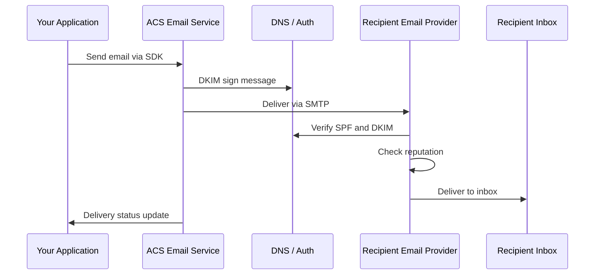

# How to Send Transactional Emails with Azure Communication Services Email

Author: [nawazdhandala](https://www.github.com/nawazdhandala)

Tags: Azure Communication Services, Email, Transactional Email, SMTP, Email API, Cloud Communication, Notifications

Description: Learn how to send transactional emails like order confirmations and password resets using Azure Communication Services Email with the SDK and REST API.

---

Transactional emails are the backbone of application communication - order confirmations, password resets, account verifications, shipping notifications, and invoice delivery. Unlike marketing emails, transactional emails are triggered by user actions and need to be delivered reliably and quickly. Azure Communication Services (ACS) Email provides a scalable platform for sending these emails with built-in deliverability features, domain verification, and delivery tracking.

This guide covers setting up ACS Email, configuring a custom domain, sending emails with the SDK, and handling delivery status.

## Setting Up ACS Email

ACS Email requires a few setup steps before you can start sending.

### Create an Email Communication Service

```bash
# Create an Email Communication Services resource
az communication email create \
  --name my-email-service \
  --resource-group communication-rg \
  --location global \
  --data-location unitedstates
```

### Connect a Domain

You have two options for the sender domain:

1. **Azure managed domain** - Uses an `azurecomm.net` subdomain. Quick to set up, good for testing, but recipient trust is lower.
2. **Custom domain** - Uses your own domain (e.g., `notifications.yourcompany.com`). Requires DNS configuration but gives better deliverability.

For a custom domain, add these DNS records:

| Type | Name | Value |
|---|---|---|
| TXT | @ | Verification value from Azure |
| CNAME | selector1._domainkey | DKIM key from Azure |
| CNAME | selector2._domainkey | DKIM key from Azure |
| TXT | @ | SPF record: `v=spf1 include:spf.protection.outlook.com -all` |

After adding the DNS records, verify the domain in the Azure portal under your Email Communication Service resource.

### Link to Your ACS Resource

Connect the Email service to your main ACS resource so you can use a single connection string for all ACS features.

```bash
# Link the email domain to the ACS resource
# This is done in the portal: ACS resource -> Email -> Domains -> Connect
```

## Sending Emails with the SDK

Install the email SDK.

```bash
# JavaScript
npm install @azure/communication-email

# Python
pip install azure-communication-email
```

### Send a Simple Email

```javascript
// send-email.js - Send a transactional email
const { EmailClient } = require('@azure/communication-email');

const connectionString = 'endpoint=https://my-acs-resource.communication.azure.com/;accesskey=...';
const emailClient = new EmailClient(connectionString);

async function sendEmail(to, subject, htmlBody, plainTextBody) {
    // Build the email message
    const message = {
        senderAddress: 'noreply@notifications.yourcompany.com',
        recipients: {
            to: [
                {
                    address: to,
                    displayName: ''  // Optional display name
                }
            ]
        },
        content: {
            subject: subject,
            html: htmlBody,
            plainText: plainTextBody  // Fallback for email clients that don't render HTML
        }
    };

    // Send the email - this returns a poller for tracking the send operation
    const poller = await emailClient.beginSend(message);

    // Wait for the send to complete
    const result = await poller.pollUntilDone();

    console.log(`Email sent. Operation ID: ${result.id}`);
    console.log(`Status: ${result.status}`);

    return result;
}

// Send an order confirmation email
sendEmail(
    'customer@example.com',
    'Order Confirmation #12345',
    `<html>
        <body style="font-family: Arial, sans-serif; color: #333;">
            <h2>Thank you for your order!</h2>
            <p>Your order <strong>#12345</strong> has been confirmed.</p>
            <table style="width: 100%; border-collapse: collapse; margin-top: 16px;">
                <tr style="background-color: #f5f5f5;">
                    <th style="padding: 8px; text-align: left;">Item</th>
                    <th style="padding: 8px; text-align: right;">Price</th>
                </tr>
                <tr>
                    <td style="padding: 8px;">Widget Pro</td>
                    <td style="padding: 8px; text-align: right;">$29.99</td>
                </tr>
                <tr>
                    <td style="padding: 8px;">Shipping</td>
                    <td style="padding: 8px; text-align: right;">$4.99</td>
                </tr>
                <tr style="font-weight: bold;">
                    <td style="padding: 8px;">Total</td>
                    <td style="padding: 8px; text-align: right;">$34.98</td>
                </tr>
            </table>
            <p style="margin-top: 16px;">Your estimated delivery date is February 20, 2026.</p>
        </body>
    </html>`,
    'Thank you for your order! Order #12345 confirmed. Total: $34.98. Estimated delivery: Feb 20, 2026.'
);
```

### Python Implementation

```python
# send_email.py - Send transactional emails with Python
from azure.communication.email import EmailClient

connection_string = "endpoint=https://my-acs-resource.communication.azure.com/;accesskey=..."
email_client = EmailClient.from_connection_string(connection_string)

def send_email(to: str, subject: str, html_body: str, plain_text_body: str = "") -> dict:
    """Send a transactional email and wait for delivery."""
    message = {
        "senderAddress": "noreply@notifications.yourcompany.com",
        "recipients": {
            "to": [{"address": to}]
        },
        "content": {
            "subject": subject,
            "html": html_body,
            "plainText": plain_text_body
        }
    }

    # Begin sending - returns a long-running operation
    poller = email_client.begin_send(message)

    # Wait for completion (with a timeout)
    result = poller.result()

    print(f"Email sent. Status: {result['status']}")
    return result


def send_password_reset(to: str, reset_link: str) -> dict:
    """Send a password reset email."""
    html = f"""
    <html>
    <body style="font-family: Arial, sans-serif; max-width: 600px; margin: 0 auto;">
        <h2>Password Reset Request</h2>
        <p>We received a request to reset your password. Click the button below to create a new password:</p>
        <p style="text-align: center; margin: 24px 0;">
            <a href="{reset_link}"
               style="background-color: #0078d4; color: white; padding: 12px 24px;
                      text-decoration: none; border-radius: 4px; display: inline-block;">
                Reset Password
            </a>
        </p>
        <p style="color: #666; font-size: 14px;">
            This link expires in 1 hour. If you did not request a password reset,
            you can safely ignore this email.
        </p>
    </body>
    </html>
    """

    plain = f"Password Reset: Click this link to reset your password: {reset_link} (expires in 1 hour)"

    return send_email(to, "Reset Your Password", html, plain)


def send_verification_email(to: str, code: str) -> dict:
    """Send an email verification code."""
    html = f"""
    <html>
    <body style="font-family: Arial, sans-serif; max-width: 600px; margin: 0 auto;">
        <h2>Verify Your Email Address</h2>
        <p>Enter this code to verify your email address:</p>
        <p style="text-align: center; margin: 24px 0;">
            <span style="font-size: 32px; font-weight: bold; letter-spacing: 8px;
                         background-color: #f0f0f0; padding: 12px 24px; border-radius: 4px;">
                {code}
            </span>
        </p>
        <p style="color: #666; font-size: 14px;">
            This code expires in 10 minutes.
        </p>
    </body>
    </html>
    """

    return send_email(to, f"Your verification code: {code}", html, f"Your verification code is: {code}")
```

## Sending Emails with Attachments

```javascript
// send-with-attachment.js - Email with file attachments
const fs = require('fs');

async function sendEmailWithAttachment(to, subject, htmlBody, filePath, fileName) {
    // Read the file and convert to base64
    const fileContent = fs.readFileSync(filePath);
    const base64Content = fileContent.toString('base64');

    // Determine the content type based on file extension
    const contentTypes = {
        '.pdf': 'application/pdf',
        '.csv': 'text/csv',
        '.xlsx': 'application/vnd.openxmlformats-officedocument.spreadsheetml.sheet',
        '.png': 'image/png',
        '.jpg': 'image/jpeg'
    };

    const ext = filePath.substring(filePath.lastIndexOf('.'));
    const contentType = contentTypes[ext] || 'application/octet-stream';

    const message = {
        senderAddress: 'noreply@notifications.yourcompany.com',
        recipients: {
            to: [{ address: to }]
        },
        content: {
            subject: subject,
            html: htmlBody
        },
        attachments: [
            {
                name: fileName,
                contentType: contentType,
                contentInBase64: base64Content
            }
        ]
    };

    const poller = await emailClient.beginSend(message);
    const result = await poller.pollUntilDone();

    return result;
}

// Send an invoice email with a PDF attachment
sendEmailWithAttachment(
    'customer@example.com',
    'Invoice #INV-2026-0123',
    '<h2>Your Invoice</h2><p>Please find your invoice attached.</p>',
    '/path/to/invoice.pdf',
    'invoice-INV-2026-0123.pdf'
);
```

## CC and BCC Recipients

```javascript
// Send to multiple recipients with CC and BCC
const message = {
    senderAddress: 'noreply@notifications.yourcompany.com',
    recipients: {
        to: [
            { address: 'primary@example.com', displayName: 'Primary Recipient' }
        ],
        cc: [
            { address: 'manager@example.com', displayName: 'Manager' }
        ],
        bcc: [
            { address: 'audit@yourcompany.com' }
        ]
    },
    content: {
        subject: 'Account Update Notification',
        html: '<p>Your account settings have been updated.</p>'
    }
};
```

## Email Delivery Flow



## Handling Delivery Status

The `beginSend` method returns a poller that tracks the email through the delivery pipeline. The status progresses through several stages.

```javascript
async function sendAndTrack(message) {
    const poller = await emailClient.beginSend(message);

    // Check status at each polling interval
    while (!poller.isDone()) {
        const status = poller.getOperationState();
        console.log(`Current status: ${status.status}`);

        // Status values:
        // - NotStarted: Queued but not processing yet
        // - Running: Being processed by the email service
        // - Succeeded: Accepted by the recipient's mail server
        // - Failed: Delivery failed
        // - Canceled: Send was canceled

        await poller.poll();
    }

    const result = poller.getResult();
    return result;
}
```

## Deliverability Best Practices

Getting emails to the inbox instead of the spam folder requires attention to several factors.

**Domain authentication is mandatory.** Configure SPF, DKIM, and DMARC records for your sending domain. Without these, major email providers will reject or spam-folder your messages.

**Use a subdomain for transactional email.** Send from `notifications.yourcompany.com` instead of your main `yourcompany.com` domain. This isolates your transactional email reputation from any marketing email activity.

**Keep the content clean.** Avoid excessive images, suspicious links, or spam trigger words. Include a plain text version alongside HTML. Keep the HTML simple and well-formatted.

**Warm up new sending domains gradually.** Do not send 10,000 emails on day one from a new domain. Start with a few hundred per day and increase over 2-4 weeks to build sender reputation.

**Monitor bounce rates.** High bounce rates (invalid email addresses) damage your sender reputation. Remove invalid addresses from your database promptly.

## Rate Limits

ACS Email has rate limits based on your subscription tier. The default limits are:

- 100 emails per minute
- 1,000 emails per hour
- Total attachment size: 10 MB per email

For higher volume needs, contact Azure support to increase your limits.

## Wrapping Up

Azure Communication Services Email provides a reliable foundation for transactional email in your applications. The SDK makes sending straightforward, the delivery tracking gives you visibility into whether messages reach their destination, and the domain authentication features help ensure your emails land in inboxes instead of spam folders. Start with the Azure managed domain for development, then switch to a custom domain with full SPF, DKIM, and DMARC configuration for production. The most important thing for long-term deliverability is maintaining a clean sending reputation, which means authenticating your domain, keeping bounce rates low, and only sending email that recipients expect and want.
