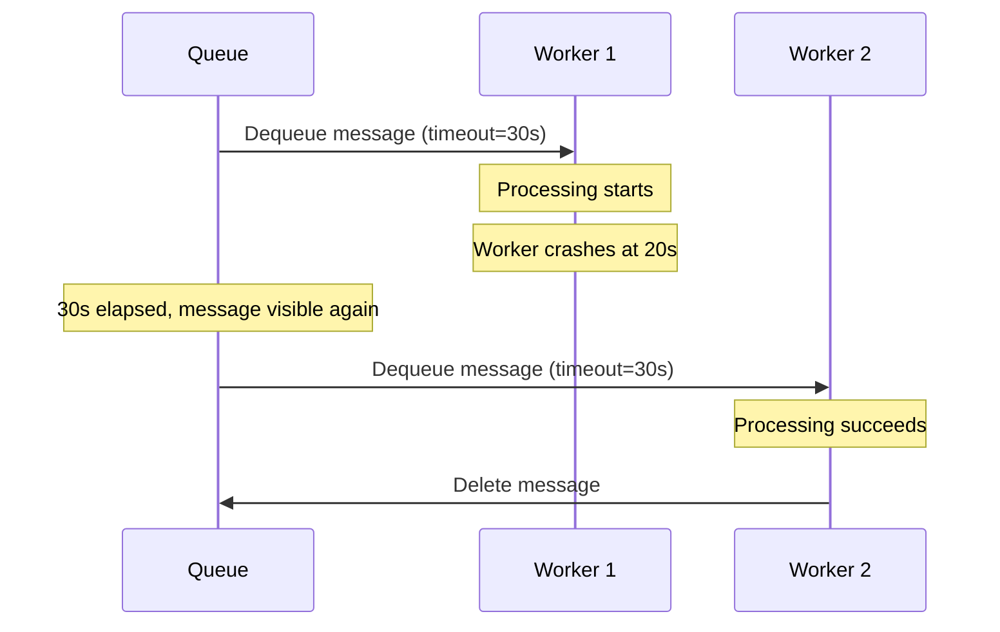

# How to Set Message Visibility Timeout in Azure Queue Storage

Author: [nawazdhandala](https://www.github.com/nawazdhandala)

Tags: Azure, Queue Storage, Visibility Timeout, Message Processing, Cloud Architecture, Distributed Systems

Description: Learn how to configure and manage message visibility timeouts in Azure Queue Storage to prevent duplicate processing and control retry behavior.

---

Message visibility timeout is one of those Azure Queue Storage settings that can make or break your message processing pipeline. Set it too short and you get duplicate processing. Set it too long and failed messages sit idle when they could be retried. In this guide, I will cover how visibility timeout works, how to set it properly, and how to adjust it dynamically based on your processing needs.

## What Is Visibility Timeout?

When a consumer reads a message from an Azure Queue, that message does not get removed immediately. Instead, it becomes invisible to other consumers for a configurable period - the visibility timeout. During this window, the consumer is expected to process the message and then explicitly delete it.

If the consumer finishes and deletes the message, everything works perfectly. If the consumer crashes or fails to delete the message before the timeout expires, the message reappears in the queue for another consumer to pick up. This is how Azure Queue Storage provides at-least-once delivery semantics.

The default visibility timeout is 30 seconds. The maximum you can set is 7 days. The minimum is 0 seconds, which makes the message immediately visible (useful in some specific scenarios).

## Setting Visibility Timeout When Receiving Messages

The most common place to set visibility timeout is when you dequeue messages. Here is how to do it with the Python SDK.

```python
from azure.storage.queue import QueueClient
import os

# Initialize the queue client
connection_string = os.environ["AZURE_STORAGE_CONNECTION_STRING"]
queue_client = QueueClient.from_connection_string(connection_string, "orders-queue")

# Receive messages with a 120-second visibility timeout
# This gives the worker two minutes to process each message
messages = queue_client.receive_messages(
    messages_per_page=5,
    visibility_timeout=120
)

for msg in messages:
    try:
        handle_order(msg.content)
        queue_client.delete_message(msg)
    except Exception as e:
        # Message will reappear after 120 seconds
        print(f"Failed to process message {msg.id}: {e}")
```

And here is the equivalent in C#.

```csharp
using Azure.Storage.Queues;

// Create the queue client
var client = new QueueClient(connectionString, "orders-queue");

// Receive up to 5 messages with a 2-minute visibility timeout
var response = await client.ReceiveMessagesAsync(
    maxMessages: 5,
    visibilityTimeout: TimeSpan.FromMinutes(2)
);

foreach (var message in response.Value)
{
    try
    {
        await HandleOrderAsync(message.Body.ToString());
        // Delete the message after successful processing
        await client.DeleteMessageAsync(message.MessageId, message.PopReceipt);
    }
    catch (Exception ex)
    {
        // Message becomes visible again after 2 minutes
        Console.WriteLine($"Processing failed: {ex.Message}");
    }
}
```

## Updating Visibility Timeout Mid-Processing

Sometimes you start processing a message and realize it will take longer than expected. Maybe the message triggers a large file upload or a complex database operation. Rather than letting the visibility timeout expire and risking duplicate processing, you can extend it while the message is still being processed.

```python
import time

messages = queue_client.receive_messages(
    messages_per_page=1,
    visibility_timeout=60
)

for msg in messages:
    # Start processing
    partial_result = start_heavy_computation(msg.content)

    # Processing is taking longer than expected, extend the timeout
    # This resets the visibility window to another 120 seconds from now
    queue_client.update_message(
        msg,
        visibility_timeout=120
    )

    # Continue with the rest of the work
    final_result = finish_computation(partial_result)

    # Done - delete the message
    queue_client.delete_message(msg)
```

This update_message call resets the visibility timer. The message will now be invisible for another 120 seconds from the moment you made the call, not from the original dequeue time. You can call this multiple times if needed.

## Setting Visibility Timeout When Adding Messages

You can also set a visibility timeout when you enqueue a message. This creates a delayed message that will not be visible to consumers until the timeout expires. Think of it as scheduling a message for future processing.

```python
# Send a message that won't be visible for 5 minutes
# Useful for scheduling delayed tasks or implementing cooldown periods
queue_client.send_message(
    content="process-daily-report",
    visibility_timeout=300  # 300 seconds = 5 minutes
)
```

This is handy for scenarios like delayed notifications, scheduled retries, or any case where you want to defer processing. The message enters the queue immediately but consumers will not see it until the visibility timeout expires.

## Choosing the Right Timeout Value

Picking the right visibility timeout depends on your processing characteristics. Here is a practical framework.

Measure your processing time under normal conditions. If your average processing takes 15 seconds with a 95th percentile of 45 seconds, a visibility timeout of 60 to 90 seconds gives you enough headroom.

Account for downstream dependencies. If your message processing calls an external API that sometimes takes 30 seconds to respond, factor that into your timeout calculation.

Consider the cost of duplicate processing. If processing a message twice causes real problems (like charging a customer twice), err on the side of a longer timeout. If duplicate processing is harmless (idempotent operations), you can use shorter timeouts for faster retries.

Here is a visualization of how different timeout strategies play out.



## Handling the Pop Receipt

When you dequeue a message, Azure returns a pop receipt along with the message. This receipt is required to update or delete the message. If you try to use a stale pop receipt (because the visibility timeout expired and the message was re-dequeued by another worker), you will get a 404 error.

```python
messages = queue_client.receive_messages(visibility_timeout=60)

for msg in messages:
    # The pop_receipt is valid only during the visibility window
    print(f"Message ID: {msg.id}")
    print(f"Pop Receipt: {msg.pop_receipt}")

    try:
        process(msg.content)
        queue_client.delete_message(msg)
    except Exception:
        # If we update the message, we get a new pop receipt
        updated = queue_client.update_message(
            msg,
            visibility_timeout=120
        )
        # The returned object has the new pop receipt
        # Use this for any subsequent operations on the message
```

When you update a message's visibility timeout, you get a new pop receipt back. Always use the latest pop receipt for subsequent operations.

## Setting Visibility Timeout to Zero

Setting the visibility timeout to zero makes the message immediately visible. This is useful if your worker determines it cannot process a particular message and wants to release it back to the queue right away instead of waiting for the timeout to expire.

```python
messages = queue_client.receive_messages(visibility_timeout=60)

for msg in messages:
    if not can_handle(msg.content):
        # Release the message immediately for another worker
        queue_client.update_message(msg, visibility_timeout=0)
        continue

    process(msg.content)
    queue_client.delete_message(msg)
```

## Common Pitfalls

One mistake I see frequently is not accounting for clock skew. If your workers run on different machines with slightly different clocks, the actual visibility window might be shorter than you expect. Always add a buffer.

Another common issue is setting the visibility timeout at the queue level and forgetting you can override it per-receive call. The per-receive timeout takes precedence and gives you fine-grained control.

Watch out for long-running operations without timeout extensions. If your processing involves multiple steps, consider extending the timeout between steps rather than setting one very long timeout up front. This way, if processing fails after step 3 of 5, the message reappears relatively quickly instead of sitting invisible for the full extended timeout.

Finally, remember that updating a message's visibility timeout counts as a storage transaction and costs money (though very little). If you are processing millions of messages and extending timeouts frequently, factor that into your cost estimates.

## Practical Configuration Guidance

For most workloads, start with a visibility timeout that is two to three times your average processing time. Monitor your poison queue and dequeue counts. If you see messages being processed multiple times, increase the timeout. If failed messages take too long to become available for retry, decrease it.

The visibility timeout is a balancing act between reliability and responsiveness. Get it right and your queue processing will hum along smoothly with minimal duplicate work and fast recovery from transient failures.
