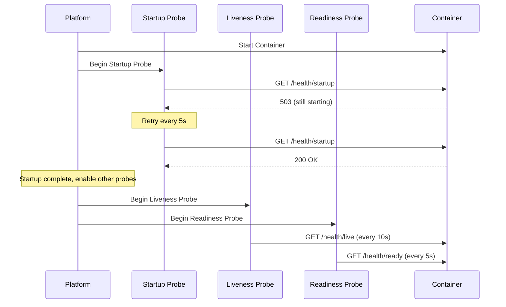

# How to Set Up a Custom Health Probe for Azure Container Apps

Author: [nawazdhandala](https://www.github.com/nawazdhandala)

Tags: Azure, Container Apps, Health Probes, Monitoring, Liveness, Readiness, Reliability

Description: A complete guide to configuring liveness, readiness, and startup probes in Azure Container Apps to improve application reliability and uptime.

---

Health probes are how Azure Container Apps knows whether your container is working correctly. Without them, the platform has no way to tell the difference between a container that is serving requests successfully and one that is deadlocked or stuck in an error state. Azure Container Apps supports three types of probes - liveness, readiness, and startup - each serving a different purpose. This guide shows you how to configure all three and when to use each one.

## The Three Types of Probes

**Liveness probes** check if your container is still alive. If the liveness probe fails, the platform restarts the container. Use this to recover from deadlocks or unrecoverable states where the process is running but not functional.

**Readiness probes** check if your container is ready to receive traffic. If the readiness probe fails, the container is removed from the load balancer but not restarted. Use this when your app needs warm-up time or temporarily cannot handle requests (e.g., during a cache rebuild).

**Startup probes** check if your container has finished starting up. While the startup probe is active, liveness and readiness probes are disabled. Use this for slow-starting applications that need more than the usual initial delay.

## Step 1: Implement Health Endpoints

Before configuring probes, your application needs endpoints that report health status.

Here is a Node.js example with separate liveness and readiness endpoints.

```javascript
const express = require('express');
const app = express();

let isReady = false;
let dbConnection = null;

// Simulate initialization that takes time
async function initialize() {
  // Connect to database
  dbConnection = await connectToDatabase();
  // Warm up caches
  await warmUpCache();
  // Mark as ready
  isReady = true;
  console.log('Application is ready to receive traffic');
}

// Liveness probe - checks if the process is alive and not deadlocked
app.get('/health/live', (req, res) => {
  // Simple check: if we can respond, we are alive
  res.status(200).json({ status: 'alive' });
});

// Readiness probe - checks if the app can handle requests
app.get('/health/ready', (req, res) => {
  if (!isReady) {
    return res.status(503).json({ status: 'initializing' });
  }
  if (!dbConnection || !dbConnection.isConnected()) {
    return res.status(503).json({ status: 'database disconnected' });
  }
  res.status(200).json({ status: 'ready' });
});

// Startup probe - checks if initialization is complete
app.get('/health/startup', (req, res) => {
  if (isReady) {
    res.status(200).json({ status: 'started' });
  } else {
    res.status(503).json({ status: 'starting' });
  }
});

app.listen(3000, () => {
  console.log('Server listening on port 3000');
  initialize();
});
```

The liveness endpoint is intentionally simple. If the process can respond to an HTTP request, it is alive. The readiness endpoint checks actual dependencies like database connections and cache state.

## Step 2: Configure Probes via CLI

You can configure probes when creating or updating a container app using a YAML file.

```yaml
# probe-config.yaml
properties:
  template:
    containers:
      - name: my-api
        image: myregistry.azurecr.io/my-api:v1
        resources:
          cpu: 0.5
          memory: 1Gi
        probes:
          - type: startup
            httpGet:
              path: /health/startup
              port: 3000
            initialDelaySeconds: 5
            periodSeconds: 5
            failureThreshold: 30
            timeoutSeconds: 3
          - type: liveness
            httpGet:
              path: /health/live
              port: 3000
            initialDelaySeconds: 0
            periodSeconds: 10
            failureThreshold: 3
            timeoutSeconds: 5
          - type: readiness
            httpGet:
              path: /health/ready
              port: 3000
            initialDelaySeconds: 0
            periodSeconds: 5
            failureThreshold: 3
            successThreshold: 1
            timeoutSeconds: 3
```

Apply the configuration.

```bash
# Update the container app with custom probes
az containerapp update \
  --name my-api \
  --resource-group my-rg \
  --yaml probe-config.yaml
```

## Step 3: Configure Probes via Bicep

In a Bicep template, probes are defined inside the container definition.

```bicep
// Container app with health probes
resource myApi 'Microsoft.App/containerApps@2023-05-01' = {
  name: 'my-api'
  location: location
  properties: {
    managedEnvironmentId: environment.id
    configuration: {
      ingress: {
        external: true
        targetPort: 3000
      }
    }
    template: {
      containers: [
        {
          name: 'my-api'
          image: 'myregistry.azurecr.io/my-api:v1'
          resources: {
            cpu: json('0.5')
            memory: '1Gi'
          }
          probes: [
            {
              // Startup probe - allows slow-starting apps to initialize
              type: 'Startup'
              httpGet: {
                path: '/health/startup'
                port: 3000
              }
              initialDelaySeconds: 5
              periodSeconds: 5
              failureThreshold: 30
              timeoutSeconds: 3
            }
            {
              // Liveness probe - restarts container if it becomes unresponsive
              type: 'Liveness'
              httpGet: {
                path: '/health/live'
                port: 3000
              }
              periodSeconds: 10
              failureThreshold: 3
              timeoutSeconds: 5
            }
            {
              // Readiness probe - removes from load balancer if not ready
              type: 'Readiness'
              httpGet: {
                path: '/health/ready'
                port: 3000
              }
              periodSeconds: 5
              failureThreshold: 3
              successThreshold: 1
              timeoutSeconds: 3
            }
          ]
        }
      ]
    }
  }
}
```

## Step 4: Use TCP Probes for Non-HTTP Apps

Not every container serves HTTP. For gRPC services, TCP workers, or other non-HTTP applications, you can use TCP socket probes instead.

```yaml
# TCP probe configuration for non-HTTP apps
probes:
  - type: liveness
    tcpSocket:
      port: 5000
    periodSeconds: 10
    failureThreshold: 3
  - type: readiness
    tcpSocket:
      port: 5000
    periodSeconds: 5
    failureThreshold: 3
```

A TCP probe simply checks if a connection to the specified port can be established. If the connection succeeds, the probe passes.

## Understanding Probe Parameters

Each parameter affects how the probe behaves.

| Parameter | Description | Default |
|-----------|-------------|---------|
| initialDelaySeconds | Wait this long before the first probe | 0 |
| periodSeconds | How often to run the probe | 10 |
| timeoutSeconds | How long to wait for a response | 1 |
| failureThreshold | How many failures before taking action | 3 |
| successThreshold | How many successes to consider recovered | 1 |

The total time before a container is restarted (for liveness) or removed from the load balancer (for readiness) is roughly:

```
initialDelaySeconds + (periodSeconds * failureThreshold)
```

For example, with `initialDelaySeconds=0`, `periodSeconds=10`, and `failureThreshold=3`, the container gets 30 seconds of failed probes before action is taken.

## Probe Interaction Flow

Here is how the three probes interact during the container lifecycle.



## When Things Go Wrong

**Probe kills a slow-starting app:** If your application takes 60 seconds to start and the liveness probe kicks in after 30 seconds, it will restart the container before it finishes starting. Use a startup probe with a high `failureThreshold` to handle this. With `periodSeconds=5` and `failureThreshold=30`, the startup probe allows 150 seconds for initialization.

**Readiness probe keeps failing:** If the readiness probe fails permanently (e.g., the database is down), the container stays alive but receives no traffic. This is by design - it prevents sending requests to a container that cannot handle them. Fix the underlying dependency issue.

**Liveness probe returns false positives:** If your health endpoint is too complex (checking external dependencies), it might fail due to a temporary network blip, causing unnecessary restarts. Keep the liveness probe simple - just check that the process is responsive.

## Best Practices

1. **Keep liveness probes lightweight.** A liveness probe should verify the process is not stuck, not that all dependencies are healthy. Checking a database connection in a liveness probe means a database outage will restart all your containers, making things worse.

2. **Put dependency checks in readiness probes.** Readiness probes are the right place to check if the database is connected, the cache is warm, or external services are reachable.

3. **Always use startup probes for slow-starting apps.** Java and .NET applications often take 30 seconds or more to start. Without a startup probe, the liveness probe will kill them before they finish.

4. **Set timeouts appropriately.** If your health endpoint takes 2 seconds under load, set `timeoutSeconds` to at least 3. A timeout that is too tight will cause false failures during traffic spikes.

5. **Log health check activity.** Log when health endpoints are called and what they return. This makes debugging much easier.

## Summary

Health probes are a critical part of running reliable containers on Azure Container Apps. Use startup probes to protect slow-starting applications, liveness probes to detect and recover from stuck processes, and readiness probes to prevent traffic from reaching unhealthy containers. Keep liveness checks simple, put dependency checks in readiness probes, and tune the timing parameters based on your application's actual behavior.
