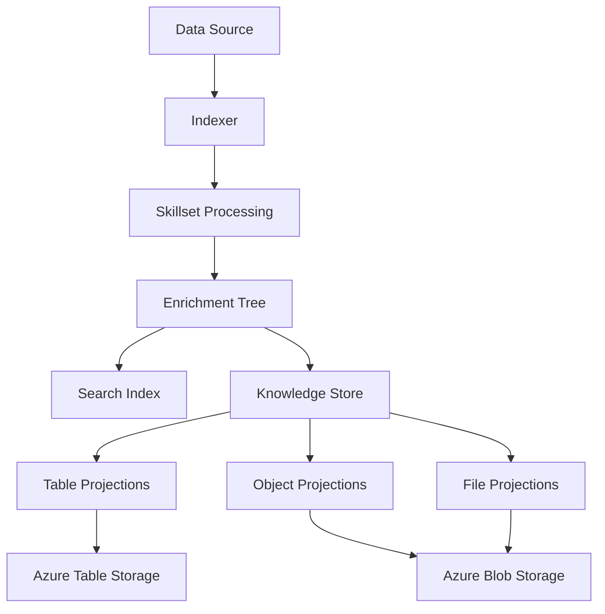

# How to Set Up a Knowledge Store in Azure AI Search to Persist Enriched Data

Author: [nawazdhandala](https://www.github.com/nawazdhandala)

Tags: Azure AI Search, Knowledge Store, AI Enrichment, Azure Storage, Data Persistence, Azure

Description: Learn how to configure a knowledge store in Azure AI Search to persist AI-enriched data to Azure Storage for downstream analytics and applications.

---

When you run AI enrichment through a skillset in Azure AI Search, the enriched data flows into your search index by default. But what if you also want to use that enriched data outside of search? Maybe you want to analyze extracted entities in Power BI, feed key phrases into a data pipeline, or build a separate machine learning dataset from your enriched content. That is where knowledge stores come in.

A knowledge store is a secondary output of a skillset that persists enriched data to Azure Storage. You can write enriched data to Azure Table Storage (for structured projections) or Azure Blob Storage (for file projections and object projections). This gives you a durable, queryable store of your AI-enriched data that is independent of the search index.

## How Knowledge Stores Work

During the normal enrichment pipeline, a skillset processes documents and produces an enrichment tree - a hierarchical data structure representing all the original and enriched fields for each document. Normally, only the fields you map to index fields make it through. A knowledge store lets you project parts of this enrichment tree into Azure Storage.

There are three types of projections:

- **Table projections** - write structured data to Azure Table Storage. Great for tabular data like extracted entities, key phrases, or metadata.
- **Object projections** - write JSON objects to Azure Blob Storage. Useful when you want the full enriched document as JSON.
- **File projections** - write binary content (like images extracted from documents) to Azure Blob Storage.



## Prerequisites

You need:

1. An Azure AI Search service (Basic tier or higher)
2. An Azure Storage account (Standard general-purpose v2)
3. An Azure AI services multi-service resource (for cognitive skills)
4. A data source with documents to process

## Step 1: Prepare Your Storage Account

The knowledge store writes to an Azure Storage account. You do not need to create the tables or containers ahead of time - Azure AI Search creates them automatically based on your projection definitions.

Make sure your search service has the connection string for the storage account. You will include this in the skillset definition.

## Step 2: Define a Skillset with a Knowledge Store

The knowledge store is defined within the skillset. You add a `knowledgeStore` section that specifies the storage connection string and the projections you want.

Here is a complete skillset definition that extracts key phrases and entities, then projects them to both table and blob storage.

```json
// PUT https://<search-service>.search.windows.net/skillsets/my-knowledge-skillset?api-version=2024-07-01
{
  "name": "my-knowledge-skillset",
  "description": "Skillset with knowledge store projections",
  "cognitiveServices": {
    "@odata.type": "#Microsoft.Azure.Search.CognitiveServicesByKey",
    "key": "<your-ai-services-key>"
  },
  "skills": [
    {
      // Extract key phrases from document content
      "@odata.type": "#Microsoft.Skills.Text.KeyPhraseExtractionSkill",
      "name": "keyphrases-skill",
      "context": "/document",
      "inputs": [
        { "name": "text", "source": "/document/content" }
      ],
      "outputs": [
        { "name": "keyPhrases", "targetName": "keyPhrases" }
      ]
    },
    {
      // Recognize entities in the document
      "@odata.type": "#Microsoft.Skills.Text.V3.EntityRecognitionSkill",
      "name": "entities-skill",
      "context": "/document",
      "categories": ["Person", "Organization", "Location"],
      "inputs": [
        { "name": "text", "source": "/document/content" }
      ],
      "outputs": [
        { "name": "persons", "targetName": "people" },
        { "name": "organizations", "targetName": "organizations" },
        { "name": "locations", "targetName": "locations" }
      ]
    },
    {
      // Shape the data for knowledge store projection
      "@odata.type": "#Microsoft.Skills.Util.ShaperSkill",
      "name": "shaper-skill",
      "context": "/document",
      "inputs": [
        { "name": "title", "source": "/document/metadata_storage_name" },
        { "name": "content", "source": "/document/content" },
        { "name": "keyPhrases", "source": "/document/keyPhrases" },
        { "name": "people", "source": "/document/people" },
        { "name": "organizations", "source": "/document/organizations" },
        { "name": "locations", "source": "/document/locations" }
      ],
      "outputs": [
        { "name": "output", "targetName": "enrichedDocument" }
      ]
    }
  ],
  "knowledgeStore": {
    // Connection string to your Azure Storage account
    "storageConnectionString": "DefaultEndpointsProtocol=https;AccountName=mystorageaccount;AccountKey=<key>;EndpointSuffix=core.windows.net",
    "projections": [
      {
        // Table projections for structured data
        "tables": [
          {
            "tableName": "documentsTable",
            "generatedKeyName": "documentId",
            "source": "/document/enrichedDocument"
          },
          {
            "tableName": "keyPhrasesTable",
            "generatedKeyName": "keyPhraseId",
            "source": "/document/enrichedDocument/keyPhrases/*"
          },
          {
            "tableName": "entitiesTable",
            "generatedKeyName": "entityId",
            "source": "/document/enrichedDocument/people/*"
          }
        ],
        // Object projections for full JSON documents
        "objects": [
          {
            "storageContainer": "enriched-documents",
            "generatedKeyName": "objectId",
            "source": "/document/enrichedDocument"
          }
        ],
        // File projections for binary content like images
        "files": []
      }
    ]
  }
}
```

## Understanding the Shaper Skill

The Shaper skill in the example above is important. It takes multiple enrichment outputs and combines them into a single structured object called `enrichedDocument`. This makes it much easier to define projections because you have a clean, well-organized shape to project from.

Without the Shaper skill, you would need to reference individual paths from the enrichment tree in each projection, which gets messy when you have many fields.

## Step 3: Create the Index and Indexer

You still need a search index and an indexer. The knowledge store works alongside the search index, not instead of it.

```json
// Index definition
{
  "name": "my-knowledge-index",
  "fields": [
    { "name": "id", "type": "Edm.String", "key": true },
    { "name": "content", "type": "Edm.String", "searchable": true },
    { "name": "keyPhrases", "type": "Collection(Edm.String)", "searchable": true }
  ]
}
```

```json
// Indexer definition that references the skillset
{
  "name": "my-knowledge-indexer",
  "dataSourceName": "my-blob-datasource",
  "targetIndexName": "my-knowledge-index",
  "skillsetName": "my-knowledge-skillset",
  "fieldMappings": [
    {
      "sourceFieldName": "metadata_storage_path",
      "targetFieldName": "id",
      "mappingFunction": { "name": "base64Encode" }
    }
  ],
  "outputFieldMappings": [
    { "sourceFieldName": "/document/keyPhrases", "targetFieldName": "keyPhrases" }
  ],
  "parameters": {
    "configuration": {
      "dataToExtract": "contentAndMetadata"
    }
  }
}
```

## Step 4: Run the Indexer and Verify

After creating the indexer, it will run automatically and populate both the search index and the knowledge store.

Check the indexer status to make sure it completes successfully.

```bash
# Check indexer status
curl -X GET "https://<search-service>.search.windows.net/indexers/my-knowledge-indexer/status?api-version=2024-07-01" \
  -H "api-key: <your-admin-key>"
```

Then verify the knowledge store by checking your Azure Storage account:

- **Table Storage** - you should see the tables (documentsTable, keyPhrasesTable, entitiesTable) populated with rows
- **Blob Storage** - the enriched-documents container should have JSON blobs

## Step 5: Query the Knowledge Store

The beauty of a knowledge store is that you can query it with tools outside of Azure AI Search.

For table projections, you can use Azure Storage Explorer, Power BI, or any tool that supports Azure Table Storage. The tables have auto-generated keys that let you join related tables (for example, joining documents with their key phrases).

```python
# query_knowledge_store.py - Read data from knowledge store tables
from azure.data.tables import TableServiceClient

# Connect to Table Storage
connection_string = "DefaultEndpointsProtocol=https;AccountName=mystorageaccount;AccountKey=<key>;EndpointSuffix=core.windows.net"
table_service = TableServiceClient.from_connection_string(connection_string)

# Query the documents table
documents_table = table_service.get_table_client("documentsTable")
entities = documents_table.list_entities()

for entity in entities:
    print(f"Document: {entity.get('title', 'N/A')}")
    print(f"Key Phrases: {entity.get('keyPhrases', 'N/A')}")
    print()
```

For object projections, read the JSON blobs directly from Azure Blob Storage.

## Practical Use Cases

Knowledge stores unlock several scenarios that the search index alone cannot support:

1. **Analytics dashboards** - connect Power BI to the table projections to visualize entity distributions, key phrase trends, and document characteristics
2. **Machine learning datasets** - export enriched data as training data for custom models
3. **Data pipelines** - feed enriched data into Azure Data Factory or Synapse for further processing
4. **Backup and audit** - maintain a durable record of enriched data independent of the search index
5. **Cross-service integration** - share enriched data with other applications that do not use Azure AI Search

## Projection Design Tips

Getting projections right takes some thought. Here are lessons from real implementations:

- **Use the Shaper skill** to create clean, well-structured objects before projecting them. This saves headaches with nested paths.
- **Separate collections into their own tables.** If a document has multiple key phrases, project the key phrases to a separate table with a foreign key back to the document table. This gives you proper relational structure.
- **Keep object projections for full documents.** Table projections work better for structured, queryable data.
- **Mind the storage costs.** If you are processing millions of documents, the storage for object projections and tables adds up. Plan accordingly.

## Wrapping Up

A knowledge store extends the value of your AI enrichment pipeline beyond search. By projecting enriched data to Azure Storage, you make it available to any tool or service that can read from table or blob storage. This turns your search indexing pipeline into a general-purpose data enrichment engine. Set up the Shaper skill to organize your data cleanly, define your projections thoughtfully, and you will have a reusable knowledge base that powers search, analytics, and machine learning workflows simultaneously.
