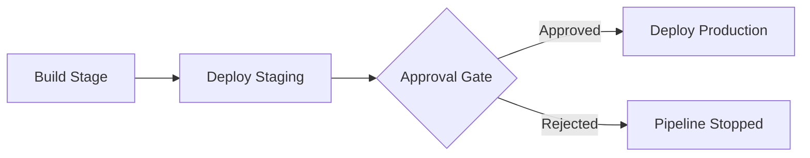

# How to Set Up a Multi-Stage YAML Pipeline in Azure DevOps with Approval Gates

Author: [nawazdhandala](https://www.github.com/nawazdhandala)

Tags: Azure DevOps, YAML Pipelines, CI/CD, Approval Gates, Multi-Stage Pipeline, DevOps, Deployment

Description: Learn how to build a multi-stage YAML pipeline in Azure DevOps with approval gates for controlled deployments across environments.

---

If you have been working with Azure DevOps for any length of time, you have probably encountered the need to deploy the same application across multiple environments - development, staging, and production. The classic approach was to use release pipelines with a visual designer, but the modern way is to define everything in YAML. The real power comes when you combine multi-stage pipelines with approval gates, giving your team control over what gets promoted and when.

In this post, I will walk through setting up a multi-stage YAML pipeline from scratch, adding approval gates between stages, and sharing some lessons I have learned from running these in production.

## Why Multi-Stage YAML Pipelines?

Before YAML pipelines, Azure DevOps had separate build and release pipelines. Builds were defined in YAML (or the classic editor), and releases were configured through a visual designer. This separation created a few problems:

- Release definitions were not version-controlled
- It was hard to review changes to deployment logic in pull requests
- Reproducing a specific release configuration from a point in time was painful

Multi-stage YAML pipelines solve all of these by putting your entire pipeline - build, test, and deploy - into a single file that lives alongside your code.

## The Basic Structure

A multi-stage pipeline has stages, and each stage contains jobs. Here is the skeleton you will work with.

The following YAML defines three stages: Build, DeployStaging, and DeployProduction, each depending on the previous one.

```yaml
# azure-pipelines.yml - Multi-stage pipeline with three environments
trigger:
  branches:
    include:
      - main

pool:
  vmImage: 'ubuntu-latest'

stages:
  # First stage: build and test the application
  - stage: Build
    displayName: 'Build and Test'
    jobs:
      - job: BuildJob
        steps:
          - task: DotNetCoreCLI@2
            displayName: 'Restore packages'
            inputs:
              command: 'restore'
              projects: '**/*.csproj'

          - task: DotNetCoreCLI@2
            displayName: 'Build the solution'
            inputs:
              command: 'build'
              projects: '**/*.csproj'
              arguments: '--configuration Release'

          - task: DotNetCoreCLI@2
            displayName: 'Run unit tests'
            inputs:
              command: 'test'
              projects: '**/*Tests.csproj'
              arguments: '--configuration Release'

          - task: PublishBuildArtifacts@1
            displayName: 'Publish build artifacts'
            inputs:
              pathToPublish: '$(Build.ArtifactStagingDirectory)'
              artifactName: 'drop'

  # Second stage: deploy to staging
  - stage: DeployStaging
    displayName: 'Deploy to Staging'
    dependsOn: Build
    jobs:
      - deployment: DeployStagingJob
        environment: 'staging'
        strategy:
          runOnce:
            deploy:
              steps:
                - task: AzureWebApp@1
                  inputs:
                    azureSubscription: 'my-azure-connection'
                    appName: 'myapp-staging'
                    package: '$(Pipeline.Workspace)/drop/**/*.zip'

  # Third stage: deploy to production
  - stage: DeployProduction
    displayName: 'Deploy to Production'
    dependsOn: DeployStaging
    jobs:
      - deployment: DeployProductionJob
        environment: 'production'
        strategy:
          runOnce:
            deploy:
              steps:
                - task: AzureWebApp@1
                  inputs:
                    azureSubscription: 'my-azure-connection'
                    appName: 'myapp-production'
                    package: '$(Pipeline.Workspace)/drop/**/*.zip'
```

The `dependsOn` keyword is what creates the sequential flow. Without it, stages would run in parallel.

## Setting Up Environments and Approval Gates

The `environment` keyword in the deployment job is where the magic happens. Environments in Azure DevOps are not just labels - they are first-class resources that you can attach policies to.

To create an environment and add approvals, follow these steps:

1. Navigate to **Pipelines > Environments** in your Azure DevOps project.
2. Click **New environment** and give it a name like `production`.
3. After the environment is created, click on it to open its details.
4. Click the three dots menu in the upper right and select **Approvals and checks**.
5. Click the **+** button and select **Approvals**.
6. Add the users or groups who should approve deployments to this environment.
7. Set a timeout (I usually go with 72 hours for production).

Once configured, when your pipeline reaches the `DeployProduction` stage, it will pause and wait for the designated approvers to sign off.

## Adding More Checks Beyond Approvals

Approval gates are just one type of check. Azure DevOps supports several others that I have found useful:

- **Branch control**: Only allow deployments from specific branches. This prevents someone from accidentally deploying a feature branch to production.
- **Business hours**: Restrict deployments to certain times of day. No more 4 AM production pushes on a Friday.
- **Required template**: Ensure the pipeline uses an approved template before it can deploy.
- **Invoke Azure Function**: Call a custom function to run your own validation logic.

Here is how the pipeline flow looks with checks in place.



## Conditional Stages

Sometimes you want a stage to run only under certain conditions. For example, maybe you only deploy to production from the `main` branch but want staging deployments from any branch.

This YAML shows how to use a condition to restrict the production stage to the main branch only.

```yaml
# Conditional stage that only runs for the main branch
- stage: DeployProduction
  displayName: 'Deploy to Production'
  dependsOn: DeployStaging
  condition: and(succeeded(), eq(variables['Build.SourceBranch'], 'refs/heads/main'))
  jobs:
    - deployment: DeployProductionJob
      environment: 'production'
      strategy:
        runOnce:
          deploy:
            steps:
              - script: echo 'Deploying to production'
```

The `condition` expression evaluates before the stage runs. If it evaluates to false, the stage is skipped entirely, and the pipeline shows it as "Skipped" rather than "Failed."

## Working with Stage Variables

Each stage runs in its own scope, so variables from one stage are not automatically available in another. If you need to pass data between stages, you have to use output variables.

The following example shows how to set an output variable in one stage and read it in another.

```yaml
stages:
  - stage: Build
    jobs:
      - job: BuildJob
        steps:
          # Set an output variable with the build version
          - script: |
              echo "##vso[task.setvariable variable=buildVersion;isOutput=true]1.0.$(Build.BuildId)"
            name: setVersion

  - stage: Deploy
    dependsOn: Build
    variables:
      # Reference the output variable from the Build stage
      buildVersion: $[ stageDependencies.Build.BuildJob.outputs['setVersion.buildVersion'] ]
    jobs:
      - deployment: DeployJob
        environment: 'staging'
        strategy:
          runOnce:
            deploy:
              steps:
                - script: echo "Deploying version $(buildVersion)"
```

The syntax for referencing cross-stage variables is verbose, but it works reliably. The pattern is `stageDependencies.<StageName>.<JobName>.outputs['<StepName>.<VariableName>']`.

## Handling Failures and Rollbacks

One thing that YAML pipelines do not give you out of the box is automatic rollback. If your production deployment fails, the pipeline stops, but it does not undo what was deployed. You need to handle that yourself.

I typically add a rollback job that runs on failure.

```yaml
# Rollback job that triggers only when deployment fails
- stage: DeployProduction
  jobs:
    - deployment: DeployProductionJob
      environment: 'production'
      strategy:
        runOnce:
          deploy:
            steps:
              - task: AzureWebApp@1
                inputs:
                  azureSubscription: 'my-azure-connection'
                  appName: 'myapp-production'
                  package: '$(Pipeline.Workspace)/drop/**/*.zip'

          # This block runs if the deploy step fails
          on:
            failure:
              steps:
                - script: |
                    echo "Deployment failed. Rolling back to previous version."
                    az webapp deployment slot swap \
                      --resource-group myapp-rg \
                      --name myapp-production \
                      --slot staging \
                      --target-slot production
                  displayName: 'Rollback deployment'
```

## Tips From Production Experience

After running multi-stage pipelines across dozens of projects, here are a few things I have learned:

**Keep stages focused.** Each stage should do one thing well. Do not mix build logic with deployment logic in the same stage.

**Use environment locks.** Azure DevOps lets you configure exclusive locks on environments, which prevents two pipelines from deploying to the same environment simultaneously. This is critical for production.

**Test your pipeline YAML changes in a branch.** Since the pipeline definition is code, you can make changes in a feature branch and see how they behave before merging to main.

**Set reasonable timeouts.** Both for approval gates and for individual jobs. I have seen pipelines hang indefinitely because a test was stuck and there was no timeout configured.

**Use stage display names.** The stage identifier has to be a valid identifier (no spaces), but the `displayName` can be anything. Use it to make your pipeline runs readable.

## Wrapping Up

Multi-stage YAML pipelines with approval gates give you the best of both worlds: the reproducibility and version control of code-defined pipelines, combined with the governance and control of manual approvals. Setting them up takes a bit more upfront effort than the classic release designer, but the long-term benefits in maintainability and auditability are worth it.

Start with a simple two-stage pipeline - build and deploy to one environment. Once that is working, add more stages and approval gates incrementally. You will be surprised how quickly your team adopts the workflow once they see how transparent the process becomes.
