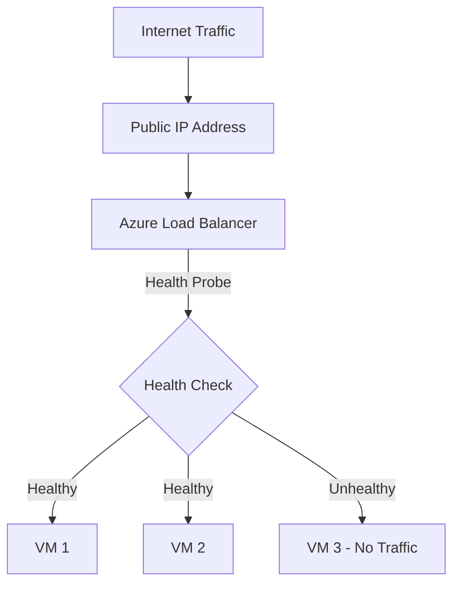

# How to Set Up a Public Load Balancer for Azure Virtual Machines

Author: [nawazdhandala](https://www.github.com/nawazdhandala)

Tags: Azure, Load Balancer, Virtual Machine, High Availability, Networking, Azure CLI, Cloud Infrastructure

Description: A complete walkthrough for setting up an Azure Public Load Balancer to distribute traffic across multiple virtual machines.

---

Running a single VM is fine for development, but production workloads need redundancy. A public load balancer distributes incoming internet traffic across multiple backend VMs, improving availability and allowing you to scale out. Azure Load Balancer operates at layer 4 (TCP/UDP), which makes it fast, low-latency, and suitable for most web applications and services.

In this post, I will walk through setting up a Standard public load balancer from scratch, including the backend pool, health probes, and load balancing rules.

## Standard vs. Basic Load Balancer

Azure offers two SKUs for load balancers: Basic and Standard. Here is what you need to know:

- **Basic**: Free, limited features, no SLA, being deprecated. Avoid it for new deployments.
- **Standard**: Costs a small amount per month, supports availability zones, has an SLA, supports more backend pool members, and offers richer health probes.

Always use the Standard SKU. Microsoft has announced that Basic Load Balancer will be retired, so there is no reason to start new projects with it.

## Architecture Overview

Here is how the pieces fit together:



The load balancer receives traffic on its public IP, checks which backend VMs are healthy, and distributes traffic only to the healthy ones.

## Step 1: Create the Resource Group and Network

Start with a resource group and a virtual network:

```bash
# Create a resource group
az group create \
  --name lbResourceGroup \
  --location eastus

# Create a virtual network with a subnet for the backend VMs
az network vnet create \
  --resource-group lbResourceGroup \
  --name lbVNet \
  --address-prefix 10.0.0.0/16 \
  --subnet-name backendSubnet \
  --subnet-prefix 10.0.1.0/24
```

## Step 2: Create a Public IP Address

The load balancer needs a public IP that clients will connect to:

```bash
# Create a static Standard SKU public IP for the load balancer
az network public-ip create \
  --resource-group lbResourceGroup \
  --name lbPublicIP \
  --sku Standard \
  --allocation-method Static \
  --zone 1 2 3
```

The `--zone 1 2 3` flag makes this a zone-redundant IP, which survives the failure of any single availability zone.

## Step 3: Create the Load Balancer

Now create the load balancer with a frontend IP configuration:

```bash
# Create a Standard public load balancer with a frontend IP
az network lb create \
  --resource-group lbResourceGroup \
  --name myLoadBalancer \
  --sku Standard \
  --public-ip-address lbPublicIP \
  --frontend-ip-name myFrontend \
  --backend-pool-name myBackendPool
```

This creates the load balancer, attaches the public IP to a frontend configuration named "myFrontend", and creates an empty backend pool named "myBackendPool".

## Step 4: Create a Health Probe

Health probes tell the load balancer which VMs are ready to receive traffic. If a VM fails the health check, traffic stops being routed to it.

```bash
# Create a health probe that checks port 80 every 5 seconds
az network lb probe create \
  --resource-group lbResourceGroup \
  --lb-name myLoadBalancer \
  --name httpHealthProbe \
  --protocol Tcp \
  --port 80 \
  --interval 5 \
  --threshold 2
```

The `--threshold 2` means a VM is considered unhealthy after 2 consecutive failed probes (10 seconds with a 5-second interval).

You can also use HTTP health probes that check a specific path:

```bash
# Create an HTTP health probe that checks a specific endpoint
az network lb probe create \
  --resource-group lbResourceGroup \
  --lb-name myLoadBalancer \
  --name httpPathProbe \
  --protocol Http \
  --port 80 \
  --path /health \
  --interval 10 \
  --threshold 3
```

HTTP probes are more reliable because they verify that your application is actually responding, not just that the port is open.

## Step 5: Create a Load Balancing Rule

Rules define how traffic is distributed. This rule forwards port 80 traffic to the backend pool:

```bash
# Create a load balancing rule for HTTP traffic
az network lb rule create \
  --resource-group lbResourceGroup \
  --lb-name myLoadBalancer \
  --name httpRule \
  --protocol Tcp \
  --frontend-port 80 \
  --backend-port 80 \
  --frontend-ip-name myFrontend \
  --backend-pool-name myBackendPool \
  --probe-name httpHealthProbe \
  --idle-timeout 4 \
  --enable-tcp-reset true
```

The `--idle-timeout` is how long (in minutes) to keep idle connections alive. The `--enable-tcp-reset` flag sends TCP reset packets on idle timeout, which helps clients detect dead connections faster.

For HTTPS, add another rule:

```bash
# Create a load balancing rule for HTTPS traffic
az network lb rule create \
  --resource-group lbResourceGroup \
  --lb-name myLoadBalancer \
  --name httpsRule \
  --protocol Tcp \
  --frontend-port 443 \
  --backend-port 443 \
  --frontend-ip-name myFrontend \
  --backend-pool-name myBackendPool \
  --probe-name httpHealthProbe \
  --idle-timeout 4 \
  --enable-tcp-reset true
```

## Step 6: Create an NSG for the Backend Subnet

The backend VMs need an NSG that allows traffic from the load balancer:

```bash
# Create an NSG for the backend subnet
az network nsg create \
  --resource-group lbResourceGroup \
  --name backendNSG

# Allow HTTP traffic from the internet
az network nsg rule create \
  --resource-group lbResourceGroup \
  --nsg-name backendNSG \
  --name AllowHTTP \
  --priority 1000 \
  --direction Inbound \
  --access Allow \
  --protocol Tcp \
  --source-address-prefixes '*' \
  --destination-port-ranges 80 443

# Associate the NSG with the backend subnet
az network vnet subnet update \
  --resource-group lbResourceGroup \
  --vnet-name lbVNet \
  --name backendSubnet \
  --network-security-group backendNSG
```

## Step 7: Create the Backend VMs

Now create the VMs and add them to the backend pool. These VMs should not have public IPs since traffic will come through the load balancer:

```bash
# Create two VMs for the backend pool
for i in 1 2; do
  # Create a NIC in the backend subnet and add it to the load balancer backend pool
  az network nic create \
    --resource-group lbResourceGroup \
    --name backendNic${i} \
    --vnet-name lbVNet \
    --subnet backendSubnet \
    --network-security-group backendNSG \
    --lb-name myLoadBalancer \
    --lb-address-pools myBackendPool

  # Create the VM using the NIC we just created
  az vm create \
    --resource-group lbResourceGroup \
    --name backendVM${i} \
    --nics backendNic${i} \
    --image Ubuntu2204 \
    --size Standard_B2s \
    --admin-username azureuser \
    --generate-ssh-keys \
    --no-wait \
    --custom-data cloud-init.yaml
done
```

The `--no-wait` flag creates the VMs in parallel, which saves time. The `--custom-data` flag lets you pass a cloud-init script to install your web server on first boot.

Here is a simple cloud-init that installs nginx:

```yaml
#cloud-config
# Install nginx and create a custom index page
package_upgrade: true
packages:
  - nginx
runcmd:
  - systemctl start nginx
  - systemctl enable nginx
  - echo "Hello from $(hostname)" > /var/www/html/index.html
```

## Step 8: Verify the Setup

After the VMs are created and booted, check the backend pool status:

```bash
# List the backend pool members and their health status
az network lb show \
  --resource-group lbResourceGroup \
  --name myLoadBalancer \
  --query backendAddressPools[0].backendIPConfigurations[].id \
  --output tsv
```

Get the public IP of the load balancer:

```bash
# Get the load balancer's public IP address
az network public-ip show \
  --resource-group lbResourceGroup \
  --name lbPublicIP \
  --query ipAddress \
  --output tsv
```

Test it with curl:

```bash
# Send multiple requests to verify round-robin distribution
for i in $(seq 1 6); do
  curl http://<load-balancer-ip>/
done
```

You should see responses alternating between your backend VMs.

## Session Persistence

By default, Azure Load Balancer uses a 5-tuple hash (source IP, source port, destination IP, destination port, protocol) to distribute traffic. This means subsequent requests from the same client might go to different VMs.

If your application needs sticky sessions, configure session persistence:

```bash
# Update the rule to use client IP-based session persistence
az network lb rule update \
  --resource-group lbResourceGroup \
  --lb-name myLoadBalancer \
  --name httpRule \
  --load-distribution SourceIP
```

Options for `--load-distribution`:
- **Default**: 5-tuple hash (best distribution)
- **SourceIP**: Same client IP always goes to the same backend
- **SourceIPProtocol**: Same client IP and protocol goes to the same backend

## Outbound Connectivity

With the Standard Load Balancer, backend VMs do not have default outbound internet access. If your VMs need to reach the internet (for package updates, API calls, etc.), you need to configure outbound rules:

```bash
# Create an outbound rule for backend VMs to access the internet
az network lb outbound-rule create \
  --resource-group lbResourceGroup \
  --lb-name myLoadBalancer \
  --name outboundRule \
  --frontend-ip-configs myFrontend \
  --protocol All \
  --idle-timeout 4 \
  --outbound-ports 10000 \
  --address-pool myBackendPool
```

Alternatively, you can use a NAT Gateway on the subnet, which is generally the better approach for outbound connectivity.

## Wrapping Up

Setting up an Azure Load Balancer is a multi-step process, but each step is straightforward. The critical pieces are the health probe (which determines how quickly failed VMs are removed from rotation), the load balancing rules (which map frontend ports to backend ports), and the backend pool configuration. Once it is running, the load balancer handles traffic distribution automatically, and you can add or remove VMs from the backend pool without any downtime.
