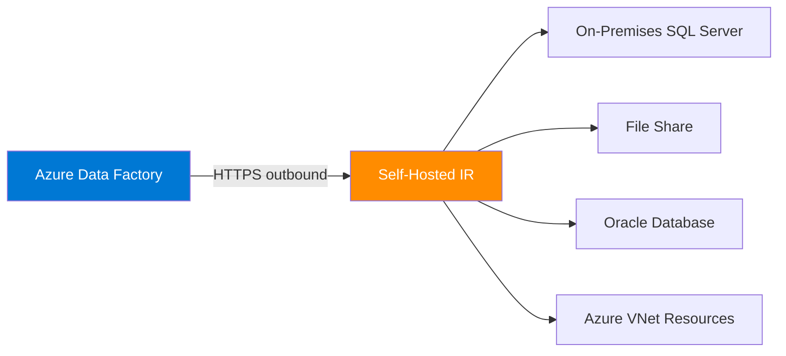
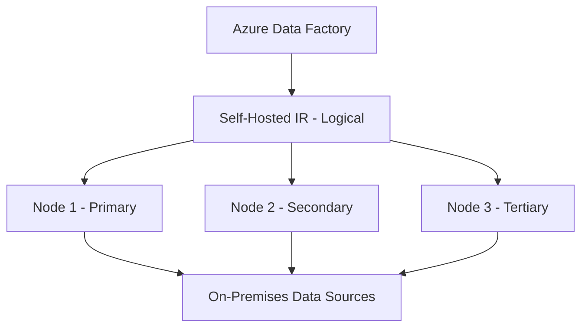

# How to Set Up a Self-Hosted Integration Runtime in Azure Data Factory

Author: [nawazdhandala](https://www.github.com/nawazdhandala)

Tags: Azure Data Factory, Integration Runtime, Self-Hosted, On-Premises, Data Integration, Azure

Description: Step-by-step guide to installing and configuring a self-hosted integration runtime in Azure Data Factory for accessing on-premises and private network data sources.

---

Azure Data Factory runs activities using an integration runtime (IR), which is the compute infrastructure behind the scenes. The Azure-hosted integration runtime handles connections to cloud data stores just fine, but it cannot reach into your on-premises network or private VNet. That is where the self-hosted integration runtime comes in.

A self-hosted IR is a piece of software you install on a machine inside your network. It acts as a bridge between Azure Data Factory in the cloud and your on-premises data sources - SQL Server instances, file shares, Oracle databases, or anything else that is not publicly accessible. In this post, I will walk through the full setup process, from creating the IR in ADF to installing it on a machine and configuring it for production use.

## When Do You Need a Self-Hosted IR?

You need a self-hosted integration runtime when:

- Your data source is on-premises (not exposed to the internet)
- Your data source is in an Azure VNet without a public endpoint
- You need to access data behind a corporate firewall
- You are connecting to data stores that require Windows authentication with domain credentials
- You need to run SSIS packages (using Azure-SSIS IR, but that is a different topic)

If all your data sources are cloud-based with public endpoints, the default Azure IR is sufficient.

## Architecture Overview

Here is how the self-hosted IR fits into the overall architecture.



Important: the self-hosted IR initiates outbound HTTPS connections to Azure. It does not require any inbound firewall rules. This makes it much easier to deploy in locked-down corporate environments.

## Prerequisites

Before starting, make sure you have:

1. An Azure Data Factory instance
2. A Windows machine (physical or VM) for the IR installation
   - Windows 10 or Windows Server 2016 and later
   - .NET Framework 4.7.2 or later
   - At least 4 CPU cores and 8 GB RAM (recommended)
   - Network access to both your data sources and the internet (for Azure communication)
3. Admin access to the machine

## Step 1: Create the Integration Runtime in ADF

First, register the self-hosted IR in Azure Data Factory.

1. Open ADF Studio
2. Go to **Manage** > **Integration runtimes** > **New**
3. Select **Self-Hosted**
4. Give it a name like `SelfHostedIR` and optionally a description
5. Click **Create**

After creation, you will see two authentication keys. Copy one of them - you will need it during installation.

You can also create it using the Azure CLI.

```bash
# Create a self-hosted integration runtime using Azure CLI
az datafactory integration-runtime create \
  --factory-name "my-data-factory" \
  --resource-group "my-resource-group" \
  --name "SelfHostedIR" \
  --type "SelfHosted"
```

To get the authentication keys:

```bash
# List the authentication keys for the integration runtime
az datafactory integration-runtime list-auth-key \
  --factory-name "my-data-factory" \
  --resource-group "my-resource-group" \
  --name "SelfHostedIR"
```

## Step 2: Install the Integration Runtime on Your Machine

Download and install the self-hosted integration runtime software.

1. From the ADF Studio (on the IR creation page), click "Download and install integration runtime" or go directly to the Microsoft Download Center
2. Download the latest version of the Microsoft Integration Runtime installer
3. Run the installer on your Windows machine
4. Follow the installation wizard - accept the defaults unless you have specific requirements
5. When prompted, paste the authentication key you copied in Step 1
6. Click **Register**

The IR will register with your Azure Data Factory and show up as "Running" in the ADF Studio.

## Step 3: Verify the Connection

After installation, verify everything is working.

1. Go back to ADF Studio > **Manage** > **Integration runtimes**
2. Click on your self-hosted IR
3. Check the status - it should show "Running"
4. The Nodes tab should show your machine with a green status

You can also verify from the Integration Runtime Configuration Manager on the Windows machine itself. It shows the connection status, version, and any issues.

## Step 4: Configure Linked Services to Use the Self-Hosted IR

When creating linked services for on-premises data sources, specify the self-hosted IR in the `connectVia` property.

```json
// Linked service for on-premises SQL Server using self-hosted IR
{
  "name": "ls_onprem_sqlserver",
  "properties": {
    "type": "SqlServer",
    "typeProperties": {
      "connectionString": "Server=ONPREM-DB01;Database=SalesDB;",
      "userName": "sqladmin",
      "password": {
        "type": "SecureString",
        "value": "<password>"
      }
    },
    // This tells ADF to use the self-hosted IR for this connection
    "connectVia": {
      "referenceName": "SelfHostedIR",
      "type": "IntegrationRuntimeReference"
    }
  }
}
```

For Windows authentication (common in on-premises environments):

```json
// Linked service using Windows authentication
{
  "name": "ls_onprem_sqlserver_windows",
  "properties": {
    "type": "SqlServer",
    "typeProperties": {
      "connectionString": "Server=ONPREM-DB01;Database=SalesDB;Integrated Security=True;",
      // Windows domain credentials
      "userName": "DOMAIN\\serviceaccount",
      "password": {
        "type": "SecureString",
        "value": "<password>"
      }
    },
    "connectVia": {
      "referenceName": "SelfHostedIR",
      "type": "IntegrationRuntimeReference"
    }
  }
}
```

## Step 5: Set Up High Availability

For production, a single IR node is a single point of failure. If the machine goes down, your pipelines stop. Set up high availability by adding additional nodes.

1. Install the IR software on a second (and optionally third) Windows machine
2. During registration, use the same authentication key from the same IR definition
3. The new node automatically joins the existing IR cluster

The nodes work together and ADF distributes the workload across them. If one node fails, the others continue processing.



You can have up to 4 nodes per self-hosted IR. Each node should be on a separate physical or virtual machine for true redundancy.

## Network Requirements

The self-hosted IR needs outbound internet access on the following ports:

| Port | Purpose |
|------|---------|
| 443 (HTTPS) | Communication with Azure Data Factory service |
| 443 (HTTPS) | Downloading updates |

If your network requires a proxy, you can configure it in the IR Configuration Manager or in the `diahost.exe.config` file.

```xml
<!-- Configure proxy in diahost.exe.config -->
<system.net>
  <defaultProxy useDefaultCredentials="true">
    <proxy
      proxyaddress="http://proxy.corp.com:8080"
      bypassonlocal="true"
    />
  </defaultProxy>
</system.net>
```

The IR does not require any inbound ports to be opened. All communication is initiated outbound from the IR to Azure.

## Performance Tuning

The default settings work for most scenarios, but you can tune performance for heavy workloads.

### Concurrent Jobs

By default, the number of concurrent jobs is auto-calculated based on the machine's resources. You can override this in the IR Configuration Manager.

A reasonable formula: for a machine with 8 cores and 16 GB RAM, you can typically handle 8-16 concurrent copy activities.

### Resource Allocation

If the IR machine runs other workloads, limit the resources available to the IR:

1. Open the Integration Runtime Configuration Manager
2. Go to the Diagnostics tab
3. Adjust resource limits if needed

For best performance, dedicate the machine to the IR and do not run other heavy workloads on it.

## Monitoring and Maintenance

### Auto-Update

The self-hosted IR supports auto-update, which keeps it on the latest version. By default, auto-update is enabled and runs during a maintenance window (typically at 2 AM).

You can configure the update window in ADF Studio:

1. Go to **Manage** > **Integration runtimes**
2. Click on your IR
3. Under **Auto update**, set the schedule

### Monitoring

Monitor your self-hosted IR from ADF Studio:

- **Status** - shows if the IR is running, offline, or degraded
- **Node details** - CPU usage, memory usage, concurrent jobs, and version
- **Activity runs** - which activities are using this IR

Set up Azure Monitor alerts for when the IR goes offline so you can react before pipelines fail.

### Log Collection

If you encounter issues, collect diagnostic logs:

1. Open the Integration Runtime Configuration Manager
2. Go to the **Diagnostics** tab
3. Click "Send logs" to upload logs to Microsoft for support cases
4. Or click "View logs" to investigate locally

## Common Issues and Solutions

**IR shows as "Limited" or "Offline"** - Check that the machine has internet access and can reach Azure endpoints. Verify that the Windows service "Microsoft Integration Runtime" is running.

**Slow data copy performance** - Check the machine's CPU and memory usage. If the IR is the bottleneck, add more nodes or use a more powerful machine. Also check network bandwidth between the IR and the data source.

**Authentication failures with on-premises databases** - Make sure the IR service account has the necessary permissions. For Windows authentication, the service account needs domain credentials.

**Connection timeout to data source** - Verify network connectivity from the IR machine to the data source. Try connecting using SQL Server Management Studio or a similar tool from the IR machine directly.

## Wrapping Up

A self-hosted integration runtime is the bridge between Azure Data Factory and your on-premises or private network data sources. The setup is straightforward: create the IR in ADF, install the software on a Windows machine in your network, and configure your linked services to use it. For production, always set up multiple nodes for high availability. Keep the IR updated, monitor its status through ADF Studio, and make sure the host machine has adequate resources for your workload. With a properly configured self-hosted IR, you can move data from virtually any source into Azure, regardless of where it lives.
