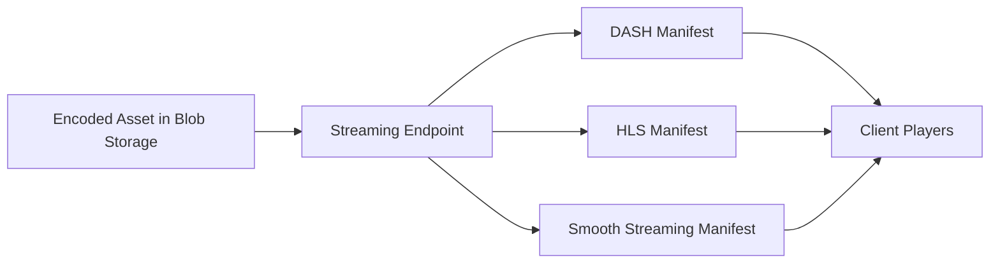

# How to Set Up a Streaming Endpoint and Locator for On-Demand Video in Azure Media Services

Author: [nawazdhandala](https://www.github.com/nawazdhandala)

Tags: Azure, Media Services, Streaming, Video On Demand, Streaming Endpoint, Locator, Cloud

Description: A step-by-step guide to setting up streaming endpoints and locators in Azure Media Services for delivering on-demand video content at scale.

---

Delivering video on demand requires more than just uploading a file and sharing a link. You need adaptive bitrate streaming, global distribution, and the ability to handle thousands of concurrent viewers without buffering. Azure Media Services solves this through two key components: streaming endpoints and streaming locators. The endpoint is your content delivery gateway, and the locator generates the URLs your players use to access content.

This guide covers everything from starting your first streaming endpoint to creating locators that serve DASH and HLS manifests to your audience.

## How Streaming Works in Azure Media Services

When you upload and encode a video in Azure Media Services, the result is an asset - a collection of files stored in Azure Blob Storage. These files include multiple bitrate versions of your video, audio tracks, and manifest files. But these raw files are not directly playable by most video players.

Streaming endpoints act as the origin server. They take the encoded files and package them on the fly into the format the client player requests - DASH for Chrome, HLS for Safari, or Smooth Streaming for legacy Microsoft clients. Streaming locators provide the URL path that maps a player request to a specific asset.



## Prerequisites

Before starting, you will need:

- An Azure subscription.
- An Azure Media Services account already created.
- At least one video asset uploaded and encoded using a standard encoding preset.
- The Azure CLI installed or access to the Azure portal.

## Step 1: Understand Streaming Endpoint Types

Azure Media Services offers two types of streaming endpoints:

**Standard Streaming Endpoint**: This is the default option. It provides a dedicated streaming unit with up to 600 Mbps of throughput. You pay per streaming unit and can scale up to handle more traffic.

**Premium Streaming Endpoint**: Designed for large-scale broadcasting, premium endpoints provide dedicated egress capacity and include a built-in CDN. They are priced higher but offer better performance guarantees for high-traffic scenarios.

For most applications, the standard endpoint combined with Azure CDN provides excellent performance at a reasonable cost.

## Step 2: Start the Default Streaming Endpoint

Every Media Services account comes with a default streaming endpoint, but it is stopped by default. You need to start it before you can stream any content.

Using the Azure CLI, start the default endpoint with this command.

```bash
# Start the default streaming endpoint (it is created automatically but stopped)
az ams streaming-endpoint start \
  --resource-group myResourceGroup \
  --account-name myMediaServicesAccount \
  --name default
```

Starting the endpoint takes a few minutes. You can check the status with the following command.

```bash
# Check the status of the streaming endpoint
az ams streaming-endpoint show \
  --resource-group myResourceGroup \
  --account-name myMediaServicesAccount \
  --name default \
  --query "resourceState" \
  --output tsv
```

The status should return `Running` once it is ready.

## Step 3: Configure CDN Integration

For production workloads, you should enable Azure CDN on your streaming endpoint. The CDN caches content at edge locations worldwide, reducing latency for your viewers and offloading traffic from the streaming endpoint itself.

```bash
# Enable CDN on the streaming endpoint
az ams streaming-endpoint update \
  --resource-group myResourceGroup \
  --account-name myMediaServicesAccount \
  --name default \
  --cdn-profile "myMediaCdnProfile" \
  --cdn-provider "StandardVerizon"
```

After enabling CDN, it takes about 90 minutes for the CDN profile to fully propagate. During this time, you can still stream content directly from the endpoint - CDN just adds the caching layer on top.

There are three CDN provider options: Standard Verizon, Premium Verizon, and Standard Akamai. Standard Verizon is the most common choice because it provides a good balance of features and cost.

## Step 4: Create a Streaming Locator

With the endpoint running, you need a streaming locator to generate playable URLs for your asset. The locator connects an asset to a streaming policy and optionally a content key policy for DRM.

For unprotected on-demand content, use the predefined clear streaming policy.

```bash
# Create a streaming locator for unprotected content
az ams streaming-locator create \
  --resource-group myResourceGroup \
  --account-name myMediaServicesAccount \
  --name myVideoLocator \
  --asset-name myEncodedVideoAsset \
  --streaming-policy-name Predefined_ClearStreamingOnly
```

If you want to enable AES-128 encryption (which is lighter than full DRM but still provides basic protection), use this instead.

```bash
# Create a streaming locator with AES clear key encryption
az ams streaming-locator create \
  --resource-group myResourceGroup \
  --account-name myMediaServicesAccount \
  --name mySecureLocator \
  --asset-name myEncodedVideoAsset \
  --streaming-policy-name Predefined_ClearKey
```

## Step 5: Get the Streaming URLs

Once the locator is created, you can retrieve the streaming URLs that players will use.

```bash
# List all streaming paths for the locator
az ams streaming-locator get-paths \
  --resource-group myResourceGroup \
  --account-name myMediaServicesAccount \
  --name myVideoLocator
```

This returns paths for each supported streaming protocol. A typical output looks like this:

```json
{
  "streamingPaths": [
    {
      "streamingProtocol": "Dash",
      "encryptionScheme": "NoEncryption",
      "paths": [
        "/locator-guid/manifest(format=mpd-time-cmaf)"
      ]
    },
    {
      "streamingProtocol": "Hls",
      "encryptionScheme": "NoEncryption",
      "paths": [
        "/locator-guid/manifest(format=m3u8-cmaf)"
      ]
    },
    {
      "streamingProtocol": "SmoothStreaming",
      "encryptionScheme": "NoEncryption",
      "paths": [
        "/locator-guid/manifest"
      ]
    }
  ]
}
```

To construct the full URL, prepend your streaming endpoint hostname. For example:

```
https://myMediaServicesAccount-usea.streaming.media.azure.net/locator-guid/manifest(format=mpd-time-cmaf)
```

## Step 6: Configure the Player

Here is a minimal HTML page using the Shaka Player library to play DASH content from your streaming endpoint.

```html
<!DOCTYPE html>
<html>
<head>
  <!-- Include Shaka Player library for DASH playback -->
  <script src="https://cdn.jsdelivr.net/npm/shaka-player/dist/shaka-player.compiled.js"></script>
</head>
<body>
  <video id="video" width="800" controls></video>

  <script>
    // Initialize Shaka Player and configure it with the streaming URL
    async function initPlayer() {
      const video = document.getElementById('video');
      const player = new shaka.Player(video);

      // Listen for errors
      player.addEventListener('error', function(event) {
        console.error('Shaka Player error:', event.detail);
      });

      // Replace with your actual streaming URL
      const manifestUrl =
        'https://myaccount-usea.streaming.media.azure.net/guid/manifest(format=mpd-time-cmaf)';

      try {
        await player.load(manifestUrl);
        console.log('Video loaded successfully');
      } catch (error) {
        console.error('Failed to load video:', error);
      }
    }

    // Wait for Shaka to be ready, then initialize
    document.addEventListener('DOMContentLoaded', initPlayer);
  </script>
</body>
</html>
```

For HLS playback on Safari or iOS devices, you can use the native `<video>` element directly since Safari has built-in HLS support.

```html
<!-- Safari natively supports HLS - no additional libraries needed -->
<video controls width="800">
  <source
    src="https://myaccount-usea.streaming.media.azure.net/guid/manifest(format=m3u8-cmaf)"
    type="application/x-mpegURL">
</video>
```

## Step 7: Scale the Streaming Endpoint

If your traffic grows, you can scale the streaming endpoint by adding more streaming units. Each standard unit provides approximately 600 Mbps of outbound bandwidth.

```bash
# Scale the streaming endpoint to 3 units for higher throughput
az ams streaming-endpoint scale \
  --resource-group myResourceGroup \
  --account-name myMediaServicesAccount \
  --name default \
  --scale-units 3
```

Keep in mind that each streaming unit costs money even when idle, so scale down during off-peak hours if your traffic patterns are predictable.

## Managing Locator Lifecycle

Streaming locators have a start and end time. By default, a locator starts immediately and has no expiration. For time-limited content (like a 48-hour rental), set explicit times.

```bash
# Create a locator that expires after 48 hours
az ams streaming-locator create \
  --resource-group myResourceGroup \
  --account-name myMediaServicesAccount \
  --name myRentalLocator \
  --asset-name myEncodedVideoAsset \
  --streaming-policy-name Predefined_ClearStreamingOnly \
  --end-time "2026-02-18T00:00:00Z"
```

Once a locator expires, the URLs stop working immediately. The underlying asset remains intact, so you can always create a new locator if needed.

## Monitoring and Diagnostics

Azure Media Services integrates with Azure Monitor for tracking streaming health. Key metrics to watch include:

- **Egress bytes**: Total data served by the streaming endpoint.
- **Requests**: Number of manifest and segment requests.
- **End-to-end latency**: Time from request to first byte.
- **HTTP error rates**: 4xx and 5xx responses that indicate client or server issues.

Set up alerts for high error rates or when egress approaches your endpoint's capacity. This gives you time to scale up before users experience buffering.

## Summary

Setting up streaming in Azure Media Services follows a predictable pattern: start your endpoint, create a locator against your encoded asset, and hand the resulting URL to your player. The streaming endpoint handles the heavy lifting of format packaging, while the CDN handles global distribution. By understanding these components and how they connect, you can deliver smooth video playback to audiences of any size.
