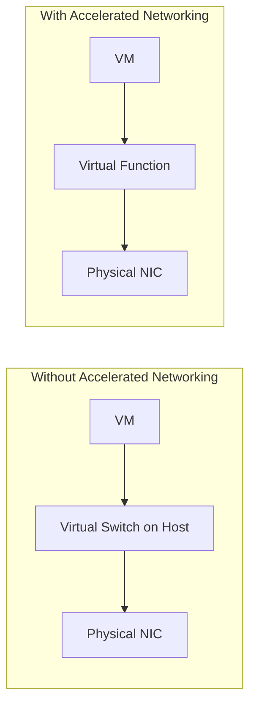

# How to Set Up Accelerated Networking on an Azure Virtual Machine

Author: [nawazdhandala](https://www.github.com/nawazdhandala)

Tags: Azure, Accelerated Networking, Virtual Machine, Networking, Performance, SR-IOV, Azure CLI

Description: How to enable accelerated networking on Azure VMs to achieve lower latency, higher throughput, and reduced CPU utilization for network traffic.

---

By default, all network traffic to and from an Azure VM goes through a virtual switch on the host. This works fine for most workloads, but it adds latency and uses CPU cycles for packet processing. Accelerated networking bypasses the virtual switch by using SR-IOV (Single Root I/O Virtualization) to give the VM direct access to the physical NIC. The result is lower latency, higher throughput, and reduced CPU utilization for network operations.

If you are running latency-sensitive applications, handling high network throughput, or simply want to squeeze more performance out of your VMs, accelerated networking is a no-brainer.

## What Is SR-IOV?

SR-IOV is a hardware virtualization standard that allows a single physical network adapter to present itself as multiple virtual functions. Each VM gets its own virtual function, which provides a direct hardware path for network traffic. This eliminates the host's virtual switch from the data path.

Here is how traffic flows with and without accelerated networking:



The difference is measurable. With accelerated networking, you can expect:
- Latency reduced by up to 50% compared to non-accelerated networking.
- Throughput increased significantly, closer to the NIC's line rate.
- CPU utilization for network processing reduced, freeing up cycles for your application.

## Supported VM Sizes

Not all VM sizes support accelerated networking. Generally, it is supported on most general-purpose and compute-optimized VM sizes with 2 or more vCPUs. Here are some common supported families:

- D-series v3, v4, v5 (e.g., Standard_D2s_v5 and above)
- E-series v3, v4, v5
- F-series v2
- M-series
- L-series
- N-series (GPU VMs)

The B-series (burstable) VMs generally do not support accelerated networking, which is a common gotcha. Check whether your specific size supports it:

```bash
# Check if a VM size supports accelerated networking
az vm list-sizes --location eastus \
  --query "[?name=='Standard_D4s_v5'].{Name:name, AccelNet:acceleratedNetworkingEnabled}" \
  --output table
```

## Supported Operating Systems

Accelerated networking requires kernel drivers in the guest OS. Most modern OS images on Azure come with the required drivers pre-installed:

- Ubuntu 18.04 LTS and later
- RHEL 7.4 and later
- CentOS 7.4 and later
- Debian 9 and later
- SUSE Linux Enterprise Server 15 and later
- Windows Server 2016 and later
- Windows 10 and later

If you are using a custom image, you may need to install the Mellanox drivers manually.

## Enabling Accelerated Networking on a New VM

When creating a new VM, enable accelerated networking with a single flag:

```bash
# Create a VM with accelerated networking enabled
az vm create \
  --resource-group myResourceGroup \
  --name myFastVM \
  --image Ubuntu2204 \
  --size Standard_D4s_v5 \
  --admin-username azureuser \
  --generate-ssh-keys \
  --accelerated-networking true
```

That is all it takes. Azure provisions the VM with a NIC that has SR-IOV enabled, and the VM's OS picks up the Mellanox virtual function driver during boot.

## Enabling Accelerated Networking on an Existing VM

For an existing VM, you need to update the NIC configuration. The VM must be stopped first:

```bash
# Step 1: Deallocate the VM
az vm deallocate \
  --resource-group myResourceGroup \
  --name myVM

# Step 2: Get the NIC name
NIC_NAME=$(az vm show \
  --resource-group myResourceGroup \
  --name myVM \
  --query networkProfile.networkInterfaces[0].id \
  --output tsv | xargs basename)

# Step 3: Enable accelerated networking on the NIC
az network nic update \
  --resource-group myResourceGroup \
  --name $NIC_NAME \
  --accelerated-networking true

# Step 4: Start the VM
az vm start \
  --resource-group myResourceGroup \
  --name myVM
```

The update takes effect when the VM starts. If the VM size does not support accelerated networking, the `nic update` command will fail with a clear error message.

## Verifying Accelerated Networking Is Active

After the VM is running, verify that accelerated networking is working:

**From the Azure side:**

```bash
# Check the NIC's accelerated networking status
az network nic show \
  --resource-group myResourceGroup \
  --name $NIC_NAME \
  --query enableAcceleratedNetworking \
  --output tsv
```

This should return `true`.

**From inside the Linux VM:**

```bash
# Check if the Mellanox driver is loaded (indicates SR-IOV is active)
lspci | grep -i mellanox
```

If accelerated networking is working, you will see a Mellanox ConnectX device listed. If there is no output, the SR-IOV virtual function is not attached.

You can also check the network interface:

```bash
# List network interfaces - look for the Mellanox VF
ip link show
```

You should see two network interfaces: the synthetic interface (eth0) and the Mellanox VF interface. The VF interface handles the actual data path.

Another check:

```bash
# Verify the driver in use for the network interface
ethtool -i eth0
```

The driver should show `hv_netvsc` for the synthetic interface, with the Mellanox VF visible as a slave device.

**From inside a Windows VM:**

Open Device Manager and look for "Mellanox ConnectX" under Network Adapters. If it is there, accelerated networking is active.

Or use PowerShell:

```powershell
# Check for the Mellanox adapter in Windows
Get-NetAdapter | Where-Object {$_.InterfaceDescription -like "*Mellanox*"}
```

## Performance Testing

To see the actual impact of accelerated networking, run some network benchmarks:

```bash
# Install iperf3 for network throughput testing
sudo apt install -y iperf3

# On the server VM
iperf3 -s

# On the client VM (replace with server's IP)
iperf3 -c 10.0.1.4 -t 30 -P 4
```

With accelerated networking on a D4s_v5, you should see throughput close to the VM's network bandwidth limit (typically around 12.5 Gbps for that size). Without accelerated networking, the throughput would be lower and the CPU utilization for network processing would be higher.

For latency testing:

```bash
# Install and use sockperf for latency measurement
sudo apt install -y sockperf

# On the server VM
sockperf sr --daemonize

# On the client VM
sockperf ping-pong -i 10.0.1.4 -t 30
```

You should see round-trip latencies in the range of 50-100 microseconds with accelerated networking, compared to 200-500 microseconds without.

## Common Issues and Troubleshooting

**Mellanox device not showing up**: Make sure the VM size supports accelerated networking and that the NIC has it enabled. Also verify that the OS image has the required drivers. Older custom images might need a manual driver install.

**Performance not improving**: Check that the VF is actually being used for traffic. On Linux, the `ethtool -S eth0` command shows statistics. Look for traffic on the VF interface.

**VM fails to start after enabling**: This can happen if the VM size does not support accelerated networking. Disable it from outside the VM:

```bash
# Disable accelerated networking if the VM cannot start
az network nic update \
  --resource-group myResourceGroup \
  --name $NIC_NAME \
  --accelerated-networking false
```

**Driver issues after kernel update**: On some Linux distributions, a kernel update can break the Mellanox driver. Reboot the VM and check if the driver loads with the new kernel. If not, you may need to install the latest Mellanox OFED drivers.

## When to Use Accelerated Networking

Honestly, you should enable it on every VM that supports it. There is no additional cost, and the performance benefits are meaningful even for light workloads. The only reason not to enable it is if your VM size does not support it.

Workloads that benefit the most:
- Database servers handling high connection counts
- Application servers with heavy API traffic
- Real-time data processing pipelines
- Microservices architectures with lots of inter-service communication
- NFS or file servers handling many concurrent transfers

## Wrapping Up

Accelerated networking is a free performance upgrade that every Azure VM admin should enable. It reduces latency, increases throughput, and frees up CPU cycles - all by simply flipping a switch on the NIC configuration. There is no reason to leave performance on the table. Enable it on your existing VMs during your next maintenance window, and make it a standard part of your VM creation process going forward.
