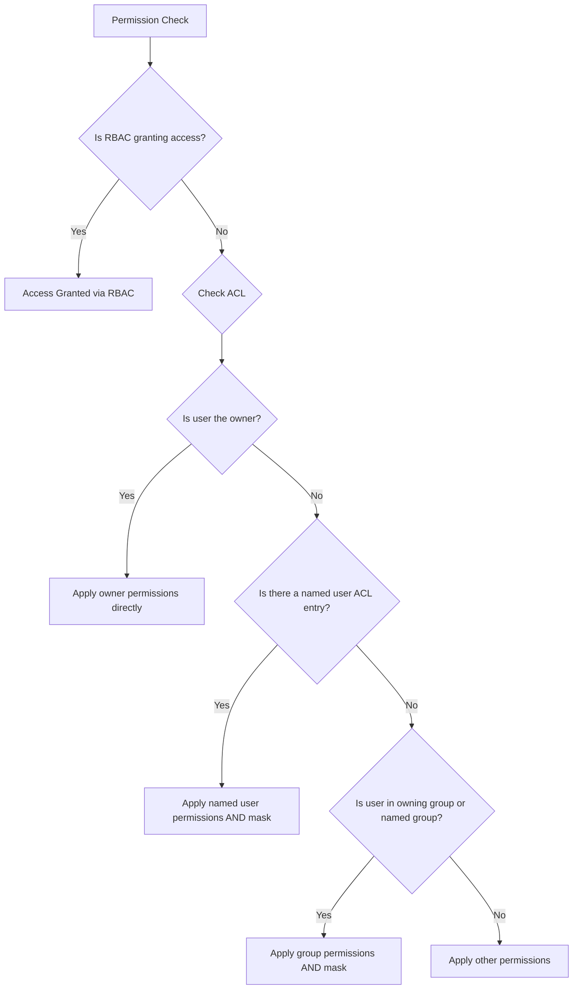

# How to Set Up ACLs and POSIX Permissions in Azure Data Lake Storage Gen2

Author: [nawazdhandala](https://www.github.com/nawazdhandala)

Tags: Azure, Data Lake Storage, ACL, POSIX Permissions, Security, Access Control, Gen2

Description: A practical guide to configuring POSIX-style access control lists and permissions on Azure Data Lake Storage Gen2 files and directories.

---

Azure Data Lake Storage Gen2 supports POSIX-like access control lists (ACLs), giving you fine-grained permission control over files and directories. If you have worked with Linux file permissions, this model will feel familiar. You can control read, write, and execute permissions at the user, group, and other levels, and use ACLs to grant access to specific security principals beyond the owning user and group. In this guide, I will walk through how ACLs work in ADLS Gen2 and how to configure them for common scenarios.

## Understanding the Permission Model

ADLS Gen2 uses two layers of access control.

**Azure RBAC (Role-Based Access Control)** operates at the storage account, container, or resource group level. Roles like "Storage Blob Data Contributor" grant broad access.

**POSIX ACLs** operate at the individual file and directory level. They provide granular control over who can read, write, or execute specific files and directories.

RBAC is evaluated first. If an RBAC role grants access, the ACLs are not checked. ACLs only come into play when RBAC does not provide access. This means if someone has "Storage Blob Data Owner" at the account level, ACLs will not restrict them.

## POSIX Permission Basics

Each file and directory has three permission sets, just like in Linux.

- **Owner (user)**: The user who created the file.
- **Owning group**: A group assigned to the file.
- **Other**: Everyone else.

Each set has three permission bits.

- **Read (r)**: List contents of a directory, or read file contents.
- **Write (w)**: Create, delete, or rename items in a directory, or modify file contents.
- **Execute (x)**: Traverse a directory (required to access items inside it), or execute a file.

Permissions are represented as a three-digit octal number (like 750) or as an rwx string (like rwxr-x---).

## Setting Permissions with Azure CLI

```bash
# Set permissions on a directory
# 750 means: owner=rwx, group=r-x, other=---
az storage fs access set \
  --permissions rwxr-x--- \
  --path data/sales \
  --file-system analytics \
  --account-name mydatalakeaccount \
  --auth-mode login

# Set permissions on a file
# 640 means: owner=rw-, group=r--, other=---
az storage fs access set \
  --permissions rw-r----- \
  --path data/sales/report.csv \
  --file-system analytics \
  --account-name mydatalakeaccount \
  --auth-mode login

# View current permissions on a path
az storage fs access show \
  --path data/sales \
  --file-system analytics \
  --account-name mydatalakeaccount \
  --auth-mode login
```

## Setting Permissions with Python

```python
from azure.storage.filedatalake import DataLakeServiceClient
import os

connection_string = os.environ["AZURE_STORAGE_CONNECTION_STRING"]
service_client = DataLakeServiceClient.from_connection_string(connection_string)
file_system_client = service_client.get_file_system_client("analytics")

# Get a reference to the directory
directory_client = file_system_client.get_directory_client("data/sales")

# Set POSIX permissions using octal notation
# 750: owner has full access, group can read and traverse, others have no access
directory_client.set_access_control(permissions="0750")

# Verify the permissions
acl_props = directory_client.get_access_control()
print(f"Owner: {acl_props['owner']}")
print(f"Group: {acl_props['group']}")
print(f"Permissions: {acl_props['permissions']}")
print(f"ACL: {acl_props['acl']}")
```

## Understanding ACL Types

Beyond basic POSIX permissions, ADLS Gen2 supports two types of ACLs.

**Access ACLs** control access to the specific file or directory they are set on.

**Default ACLs** can only be set on directories. They define the ACL template that new child items inherit when they are created inside that directory.

This inheritance model is powerful. Set a default ACL on a top-level directory, and every new file or subdirectory created underneath it automatically gets those permissions.

## Setting Access ACLs

ACL entries follow this format: `type:id:permissions`

- `user::rwx` - owning user permissions
- `group::r-x` - owning group permissions
- `other::---` - other permissions
- `user:object-id:rw-` - named user ACL
- `group:object-id:r-x` - named group ACL
- `mask::rwx` - mask that limits named user and group permissions

```python
# Set an ACL that grants a specific Azure AD user read access
# The object ID is the user's Azure AD object ID
directory_client.set_access_control(
    acl="user::rwx,group::r-x,other::---,user:a]b1c2d3-e4f5-6789-abcd-ef0123456789:r-x"
)
```

Here is a more complete example that sets up ACLs for a data engineering team.

```python
from azure.storage.filedatalake import DataLakeServiceClient

service_client = DataLakeServiceClient.from_connection_string(connection_string)
fs_client = service_client.get_file_system_client("analytics")

# Set up ACLs for the raw data directory
raw_data = fs_client.get_directory_client("raw-data")

# ACL breakdown:
# - Owner (data-platform service account): full access
# - Owning group (data-engineering team): read and traverse
# - Data science group: read and traverse
# - Other: no access
data_science_group_id = "11111111-2222-3333-4444-555555555555"
acl_string = (
    "user::rwx,"                                         # Owner: full access
    "group::r-x,"                                        # Owning group: read + traverse
    f"group:{data_science_group_id}:r-x,"               # Data science: read + traverse
    "other::---,"                                        # Others: no access
    "mask::r-x"                                          # Mask limits named entries to r-x
)

raw_data.set_access_control(acl=acl_string)
print("Access ACL set on raw-data directory")
```

## Setting Default ACLs

Default ACLs ensure new items inherit the right permissions automatically.

```python
# Set default ACL on a directory
# New files and subdirectories will inherit these permissions
processed_data = fs_client.get_directory_client("processed-data")

# The 'default:' prefix marks these as default (inheritance) ACLs
default_acl = (
    "user::rwx,"                                          # Owner: full
    "group::r-x,"                                         # Owning group: read + traverse
    f"group:{data_science_group_id}:r-x,"                # Data science: read + traverse
    "other::---,"                                         # Others: none
    "mask::r-x,"                                          # Mask
    "default:user::rwx,"                                  # Default for new items: owner full
    "default:group::r-x,"                                 # Default: group read + traverse
    f"default:group:{data_science_group_id}:r-x,"        # Default: data science read
    "default:other::---,"                                 # Default: others none
    "default:mask::r-x"                                   # Default: mask
)

processed_data.set_access_control(acl=default_acl)
print("Default ACL set - new items will inherit these permissions")
```

## The Mask Entry

The mask is an important concept that often confuses people. It acts as a ceiling on the permissions granted to named users, named groups, and the owning group. It does not affect the owning user or "other" entries.



For example, if a named user has `rwx` but the mask is `r-x`, the effective permissions for that user are `r-x`.

## Setting ACLs Recursively

When you add a new team member or change access policies, you often need to update ACLs on an entire directory tree. ADLS Gen2 supports recursive ACL operations.

```python
# Recursively set ACLs on an entire directory tree
# This updates every file and subdirectory under the path
directory_client = fs_client.get_directory_client("analytics-data")

new_acl = (
    "user::rwx,"
    "group::r-x,"
    f"group:{new_team_group_id}:r-x,"
    "other::---,"
    "mask::r-x,"
    "default:user::rwx,"
    "default:group::r-x,"
    f"default:group:{new_team_group_id}:r-x,"
    "default:other::---,"
    "default:mask::r-x"
)

# set_access_control_recursive updates all items in the subtree
# It returns a summary of the operation
result = directory_client.set_access_control_recursive(acl=new_acl)

print(f"Directories processed: {result['directories_successful']}")
print(f"Files processed: {result['files_successful']}")
print(f"Failures: {result['failure_count']}")
```

## Changing Ownership

You can change the owner and owning group of files and directories.

```bash
# Change the owning user of a directory
az storage fs access set \
  --owner "new-owner-object-id" \
  --path data/sales \
  --file-system analytics \
  --account-name mydatalakeaccount \
  --auth-mode login

# Change the owning group
az storage fs access set \
  --group "new-group-object-id" \
  --path data/sales \
  --file-system analytics \
  --account-name mydatalakeaccount \
  --auth-mode login
```

## Best Practices

Use default ACLs on parent directories to ensure consistent permissions on new items. This avoids the need to set ACLs on every file individually.

Keep the mask as restrictive as possible. It serves as a safety net that prevents accidentally granting too much access through named ACLs.

Prefer group-based ACLs over user-based ACLs. Managing permissions by group makes it easier to add and remove team members.

Remember that RBAC takes precedence. If someone has a broad RBAC role, ACLs will not restrict them. Plan your RBAC assignments accordingly.

Test your permission setup by trying to access files as different users. The Azure Storage Explorer tool is helpful for this.

ACLs in ADLS Gen2 give you the kind of fine-grained access control that data teams need. Combined with Azure AD groups and RBAC, you can build a layered security model that meets even the most demanding compliance requirements.
