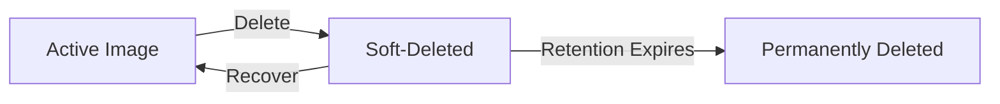
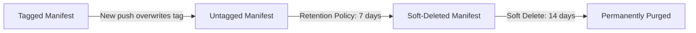

# How to Set Up ACR Soft Delete and Retention Policies for Accidental Image Deletion Recovery

Author: [nawazdhandala](https://www.github.com/nawazdhandala)

Tags: ACR, Azure Container Registry, Soft Delete, Retention, Image Management, DevOps, Azure

Description: Learn how to enable ACR soft delete for recovering accidentally deleted container images and configure retention policies to manage registry storage costs.

---

Deleting the wrong container image from your registry is one of those mistakes that happens to everyone eventually. Someone runs a cleanup script that is a bit too aggressive, or a CI/CD pipeline untags an image that production is still referencing. Without soft delete enabled, that image is gone permanently, and your next deployment or pod restart fails because the image cannot be pulled.

ACR soft delete gives you a safety net. When you delete an image or manifest, it is not immediately purged - it moves to a soft-deleted state where it can be recovered within a configurable retention period. Combined with retention policies that automatically clean up old images, you get a balanced approach to registry management that prevents accidental data loss while keeping storage costs under control.

## How ACR Soft Delete Works

When soft delete is enabled:

1. Deleting a manifest (image) marks it as soft-deleted instead of permanently removing it
2. The soft-deleted manifest and its associated layers are retained for the configured retention period (default 7 days)
3. During the retention period, you can recover the manifest to restore the image
4. After the retention period expires, the manifest and unreferenced layers are permanently purged
5. Soft-deleted images do not count against your normal image listing but do consume storage



## Prerequisites

- Azure Container Registry on the Standard or Premium SKU (soft delete is not available on Basic)
- Azure CLI 2.50 or later
- Some images in your registry to test with

## Step 1: Enable Soft Delete

Enable soft delete on your registry and set the retention period.

```bash
# Enable soft delete with a 14-day retention period
az acr config soft-delete update \
  --registry myRegistry \
  --status Enabled \
  --days 14

# Verify the configuration
az acr config soft-delete show --registry myRegistry
```

The retention period can be set from 1 to 90 days. For production registries, I recommend 14-30 days. This gives you enough time to notice and recover from mistakes without accumulating too much soft-deleted storage.

## Step 2: Test Soft Delete

Let's walk through a delete-and-recover cycle to see soft delete in action.

First, push a test image:

```bash
# Pull a test image and push it to your registry
docker pull nginx:1.25
docker tag nginx:1.25 myregistry.azurecr.io/test/nginx:1.25
docker push myregistry.azurecr.io/test/nginx:1.25

# Verify it is in the registry
az acr repository show-tags --name myRegistry --repository test/nginx
```

Now delete the image:

```bash
# Delete the image by tag
az acr repository delete \
  --name myRegistry \
  --image test/nginx:1.25 \
  --yes

# The image is now soft-deleted, not visible in normal listings
az acr repository show-tags --name myRegistry --repository test/nginx
# Output: empty or tag not listed
```

## Step 3: List Soft-Deleted Images

View images that are in the soft-deleted state and available for recovery.

```bash
# List all soft-deleted manifests in the registry
az acr manifest list-deleted \
  --registry myRegistry \
  --name test/nginx

# Show details of a specific soft-deleted manifest
az acr manifest show-deleted \
  --registry myRegistry \
  --name test/nginx \
  --digest <manifest-digest>
```

The output includes the manifest digest, the original tags, the deletion timestamp, and when the retention period expires.

## Step 4: Recover a Soft-Deleted Image

Restore a soft-deleted image using its manifest digest.

```bash
# Recover the deleted image
az acr manifest restore \
  --registry myRegistry \
  --name test/nginx \
  --digest <manifest-digest> \
  --tag 1.25

# Verify the image is back
az acr repository show-tags --name myRegistry --repository test/nginx
# Output should include 1.25 again

# Pull the recovered image to verify it works
docker pull myregistry.azurecr.io/test/nginx:1.25
```

The image is fully restored with the same content and manifest digest. Any pod that references this image by digest or tag will be able to pull it again.

## Step 5: Configure Retention Policies

Retention policies automatically delete untagged manifests after a specified period. This is different from soft delete - retention policies target manifests that have lost their tags (often from tag overwriting during CI/CD) and have not been referenced.

```bash
# Enable retention policy for untagged manifests
# Keep untagged manifests for 7 days before deletion
az acr config retention update \
  --registry myRegistry \
  --status Enabled \
  --days 7 \
  --type UntaggedManifests

# Verify retention policy configuration
az acr config retention show --registry myRegistry
```

### How Retention and Soft Delete Work Together

When both are enabled:

1. **CI/CD pushes a new image with the same tag**: The old manifest loses its tag and becomes untagged
2. **Retention policy kicks in**: After 7 days (configurable), the untagged manifest is deleted
3. **Soft delete catches the deletion**: The manifest moves to soft-deleted state
4. **Soft delete retention expires**: After 14 days (configurable), the manifest is permanently purged

So the total time before permanent deletion is retention period + soft delete period.



## Step 6: Manage Storage Costs

Soft-deleted images consume storage, which adds to your registry costs. Monitor your storage usage and adjust retention periods accordingly.

```bash
# Check registry storage usage
az acr show-usage --name myRegistry -o table

# Check how much storage soft-deleted items are using
az acr manifest list-deleted \
  --registry myRegistry \
  --name test/nginx \
  --query "length(@)"
```

### Purge Soft-Deleted Items Early

If you need to free up storage immediately, you can permanently purge specific soft-deleted items.

```bash
# Permanently purge a specific soft-deleted manifest
az acr manifest delete \
  --registry myRegistry \
  --name test/nginx \
  --digest <manifest-digest> \
  --yes

# Purge all soft-deleted items in a repository
az acr manifest list-deleted \
  --registry myRegistry \
  --name test/nginx \
  --query "[].digest" -o tsv | while read DIGEST; do
    az acr manifest delete \
      --registry myRegistry \
      --name test/nginx \
      --digest $DIGEST \
      --yes
done
```

## Step 7: Automate Image Cleanup with ACR Tasks

For more sophisticated cleanup, use ACR purge tasks that run on a schedule.

```bash
# Create a scheduled purge task
# This removes images older than 30 days, keeping the 5 most recent
az acr task create \
  --name purge-old-images \
  --registry myRegistry \
  --cmd "acr purge --filter 'myapp/api:.*' --ago 30d --keep 5 --untagged" \
  --schedule "0 1 * * *" \
  --context /dev/null
```

This task runs daily at 1 AM and removes images from the `myapp/api` repository that are older than 30 days, while always keeping at least the 5 most recent tags. The soft delete safety net means you can recover anything this accidentally removes.

```bash
# Create a purge task for multiple repositories
az acr task create \
  --name purge-all-old \
  --registry myRegistry \
  --cmd "acr purge --filter 'myapp/.*:.*' --ago 60d --keep 10 --untagged" \
  --schedule "0 2 * * 0" \
  --context /dev/null
```

This runs weekly and cleans up all repositories under `myapp/` that match the criteria.

## Step 8: Set Up Monitoring and Alerts

Monitor your registry for unexpected deletions.

```bash
# Enable diagnostic logging for the registry
az monitor diagnostic-settings create \
  --resource $(az acr show --name myRegistry --query id -o tsv) \
  --name acr-diagnostics \
  --workspace <log-analytics-workspace-id> \
  --logs '[
    {"category": "ContainerRegistryRepositoryEvents", "enabled": true},
    {"category": "ContainerRegistryLoginEvents", "enabled": true}
  ]'
```

Query for deletion events:

```
// KQL query for image deletion events
ContainerRegistryRepositoryEvents
| where OperationName == "Delete"
| project TimeGenerated, Repository, Digest, Tag, CallerIPAddress, Identity
| order by TimeGenerated desc
```

## Best Practices

**Enable soft delete before you need it.** It does not apply retroactively. Images deleted before soft delete was enabled cannot be recovered.

**Set retention periods based on your deployment cycle.** If you deploy weekly, a 14-day soft delete retention covers at least two deployment cycles. If you deploy daily, 7 days might be sufficient.

**Use immutable tags for critical images.** Instead of relying solely on soft delete, configure specific tags as immutable so they cannot be deleted or overwritten.

```bash
# Enable tag locking on the registry
az acr config content-trust update --registry myRegistry --status Enabled
```

**Coordinate with your CI/CD pipeline.** If your pipeline overwrites tags on every push, you will accumulate many untagged manifests. The retention policy handles this automatically, but make sure the retention period is long enough that you can roll back if needed.

**Audit deletion activity.** Use diagnostic logs to track who is deleting images and from where. This helps identify runaway cleanup scripts or unauthorized access.

Soft delete and retention policies together form a complete image lifecycle management strategy for ACR. Soft delete protects against mistakes, retention policies keep storage costs manageable, and scheduled purge tasks automate the ongoing maintenance. Enable soft delete first, then layer on retention policies and automated cleanup as your registry grows.
