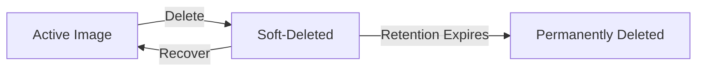
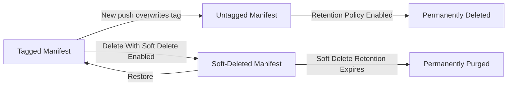

# How to Set Up ACR Soft Delete and Retention Policies

Author: [nawazdhandala](https://www.github.com/nawazdhandala)

Tags: ACR, Azure Container Registry, Soft Delete, Retention, Image Management, DevOps, Azure

Description: Learn how to enable ACR soft delete for recovering accidentally deleted container images and configure retention policies to manage registry storage costs.

---

Deleting the wrong container image from your registry is one of those mistakes that happens to everyone eventually. Someone runs a cleanup script that is a bit too aggressive, or a CI/CD pipeline untags an image that production is still referencing. Without soft delete enabled, that image is gone permanently, and your next deployment or pod restart fails because the image cannot be pulled.

ACR soft delete gives you a safety net. When you delete an image or manifest, it is not immediately purged - it moves to a soft-deleted state where it can be recovered within a configurable retention period. Combined with scheduled purge tasks that automatically clean up old images, you get a balanced approach to registry management that prevents accidental data loss while keeping storage costs under control.

## How ACR Soft Delete Works

When soft delete is enabled:

1. Deleting a manifest (image) marks it as soft-deleted instead of permanently removing it
2. The soft-deleted manifest and its associated layers are retained for the configured retention period (default 7 days)
3. During the retention period, you can recover the manifest to restore the image
4. After the retention period expires, the manifest and unreferenced layers are permanently purged
5. Soft-deleted images do not count against your normal image listing but do consume storage


```mermaid
graph LR
    A[Active Image] -->|Delete| B[Soft-Deleted]
    B -->|Recover| A
    B -->|Retention Expires| C[Permanently Deleted]
```

## Prerequisites

- Azure Container Registry (soft delete is currently a preview feature available across ACR service tiers)
- Premium SKU if you want to use the separate retention policy for untagged manifests
- The latest Azure CLI
- Some images in your registry to test with

## Step 1: Enable Soft Delete

Enable soft delete on your registry and set the retention period.

```bash
# Enable soft delete with a 14-day retention period

az acr config soft-delete update \
  --registry myRegistry \
  --status Enabled \
  --days 14

# Verify the configuration
az acr config soft-delete show --registry myRegistry
```

The retention period can be set from 1 to 90 days. For production registries, I recommend 14-30 days. This gives you enough time to notice and recover from mistakes without accumulating too much soft-deleted storage.

## Step 2: Test Soft Delete

Let's walk through a delete-and-recover cycle to see soft delete in action.

First, push a test image:

```bash
# Pull a test image and push it to your registry
docker pull nginx:1.25
docker tag nginx:1.25 myregistry.azurecr.io/test/nginx:1.25
docker push myregistry.azurecr.io/test/nginx:1.25

# Verify it is in the registry
az acr repository show-tags --name myRegistry --repository test/nginx
```

Now delete the image:

```bash
# Delete the image by tag
az acr repository delete \
  --name myRegistry \
  --image test/nginx:1.25 \
  --yes

# The image is now soft-deleted, not visible in normal listings
az acr repository show-tags --name myRegistry --repository test/nginx
# Output: empty or tag not listed
```

## Step 3: List Soft-Deleted Images

View images that are in the soft-deleted state and available for recovery.

```bash
# List all soft-deleted manifests in the registry
az acr manifest list-deleted \
  --registry myRegistry \
  --name test/nginx

# List soft-deleted tags for the repository
az acr manifest list-deleted-tags \
  --registry myRegistry \
  --name test/nginx
```

The output includes the manifest digest, the original tags, the deletion timestamp, and when the retention period expires.

## Step 4: Recover a Soft-Deleted Image

Restore a soft-deleted image using its manifest digest.

```bash
# Recover the deleted image
az acr manifest restore \
  --registry myRegistry \
  --name test/nginx:1.25 \
  --digest <manifest-digest>

# Verify the image is back
az acr repository show-tags --name myRegistry --repository test/nginx
# Output should include 1.25 again

# Pull the recovered image to verify it works
docker pull myregistry.azurecr.io/test/nginx:1.25
```

The image is fully restored with the same content and manifest digest. Any pod that references this image by digest or tag will be able to pull it again.

## Step 5: Configure Retention Policies

Retention policies automatically delete untagged manifests after a specified period. This is different from soft delete - retention policies target manifests that have lost their tags (often from tag overwriting during CI/CD) and have not been referenced.

ACR does not allow the soft delete policy and the retention policy to be enabled on the same registry. If recovery is your priority, use soft delete and scheduled purge tasks. If automatic deletion of untagged manifests is your priority and you are using Premium, use the retention policy without soft delete.

```bash
# Enable retention policy for untagged manifests
# Keep untagged manifests for 7 days before deletion
# Run this only on a Premium registry where soft delete is disabled
az acr config retention update \
  --registry myRegistry \
  --status Enabled \
  --days 7 \
  --type UntaggedManifests

# Verify retention policy configuration
az acr config retention show --registry myRegistry
```

### How Retention and Soft Delete Differ

Because ACR does not allow both policies on the same registry, choose the behavior that matches your operational goal:

1. **Soft delete enabled**: Deleted artifacts move to a soft-deleted state and can be restored during the configured retention period
2. **Retention policy enabled**: Untagged manifests are automatically deleted after the configured period and are not recoverable through soft delete
3. **Scheduled purge tasks with soft delete enabled**: Purge tasks can clean up old images, and deleted artifacts can still be restored during the soft delete retention period

The retention policy is still useful for Premium registries where automatic deletion of untagged manifests matters more than recovery. For registries where accidental deletion recovery is the priority, keep the retention policy disabled and use soft delete with scheduled cleanup tasks instead.


```mermaid
graph LR
    A[Tagged Manifest] -->|New push overwrites tag| B[Untagged Manifest]
    B -->|Retention Policy Enabled| C[Permanently Deleted]
    A -->|Delete With Soft Delete Enabled| D[Soft-Deleted Manifest]
    D -->|Restore| A
    D -->|Soft Delete Retention Expires| E[Permanently Purged]
```

## Step 6: Manage Storage Costs

Soft-deleted images consume storage, which adds to your registry costs. Monitor your storage usage and adjust retention periods accordingly.

```bash
# Check registry storage usage
az acr show-usage --name myRegistry -o table

# Check how much storage soft-deleted items are using
az acr manifest list-deleted \
  --registry myRegistry \
  --name test/nginx \
  --query "length(@)"
```

### Plan for Automatic Purge

ACR does not support manually purging soft-deleted artifacts. To free storage, reduce the soft delete retention period if your recovery requirements allow it, then wait for the automatic purge process to remove expired artifacts.

```bash
# Shorten the soft delete retention period for future automatic purge decisions
az acr config soft-delete update \
  --registry myRegistry \
  --status Enabled \
  --days 1
```

## Step 7: Automate Image Cleanup with ACR Tasks

For more sophisticated cleanup, use ACR purge tasks that run on a schedule.

```bash
# Create a scheduled purge task
# This removes images older than 30 days, keeping the 5 most recent
az acr task create \
  --name purge-old-images \
  --registry myRegistry \
  --cmd "acr purge --filter 'myapp/api:.*' --ago 30d --keep 5 --untagged" \
  --schedule "0 1 * * *" \
  --context /dev/null
```

This task runs daily at 1 AM and removes images from the `myapp/api` repository that are older than 30 days, while always keeping at least the 5 most recent tags. If soft delete is enabled, deleted artifacts can be restored during the configured soft delete retention period.

```bash
# Create a purge task for multiple repositories
az acr task create \
  --name purge-all-old \
  --registry myRegistry \
  --cmd "acr purge --filter 'myapp/.*:.*' --ago 60d --keep 10 --untagged" \
  --schedule "0 2 * * 0" \
  --context /dev/null
```

This runs weekly and cleans up all repositories under `myapp/` that match the criteria.

## Step 8: Set Up Monitoring and Alerts

Monitor your registry for unexpected deletions.

```bash
# Enable diagnostic logging for the registry
az monitor diagnostic-settings create \
  --resource $(az acr show --name myRegistry --query id -o tsv) \
  --name acr-diagnostics \
  --workspace <log-analytics-workspace-id> \
  --logs '[
    {"category": "ContainerRegistryRepositoryEvents", "enabled": true},
    {"category": "ContainerRegistryLoginEvents", "enabled": true}
  ]'
```

Query for deletion events:

```text
// KQL query for image deletion events
ContainerRegistryRepositoryEvents
| where OperationName == "Delete"
| project TimeGenerated, Repository, Digest, Tag, CallerIPAddress, Identity
| order by TimeGenerated desc
```

## Best Practices

**Enable soft delete before you need it.** It does not apply retroactively. Images deleted before soft delete was enabled cannot be recovered.

**Set retention periods based on your deployment cycle.** If you deploy weekly, a 14-day soft delete retention covers at least two deployment cycles. If you deploy daily, 7 days might be sufficient.

**Use immutable tags for critical images.** Instead of relying solely on soft delete, configure specific tags as immutable so they cannot be deleted or overwritten.

```bash
# Lock a specific image tag so it cannot be overwritten
az acr repository update \
  --name myRegistry \
  --image myrepo:tag \
  --write-enabled false
```

**Coordinate with your CI/CD pipeline.** If your pipeline overwrites tags on every push, you will accumulate many untagged manifests. Use scheduled purge tasks with soft delete enabled if you need recoverability, or use the Premium retention policy if automatic untagged manifest deletion is more important than soft delete recovery.

**Audit deletion activity.** Use diagnostic logs to track who is deleting images and from where. This helps identify runaway cleanup scripts or unauthorized access.

Soft delete and scheduled purge tasks together form a complete image lifecycle management strategy for ACR. Soft delete protects against mistakes, and scheduled purge tasks automate the ongoing maintenance. Enable soft delete first, then layer on automated cleanup as your registry grows.
