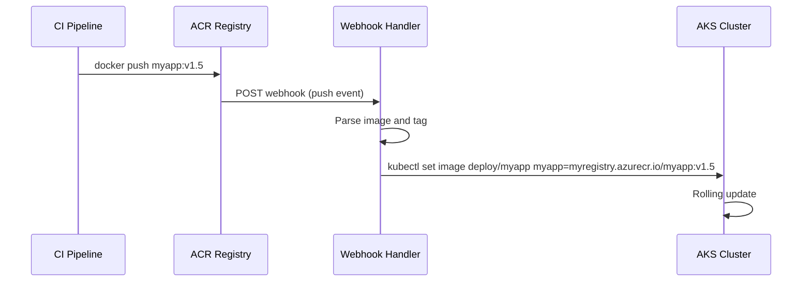

# How to Set Up ACR Webhook Notifications for Image Push and Delete Events

Author: [nawazdhandala](https://www.github.com/nawazdhandala)

Tags: ACR, Webhooks, Container Registry, Azure, CI/CD, Notifications, Automation

Description: Learn how to configure Azure Container Registry webhooks to trigger actions on image push, delete, quarantine, and chart push events.

---

Azure Container Registry (ACR) can notify external services whenever something happens to your container images. When an image is pushed, deleted, quarantined, or when a Helm chart is uploaded, ACR can send an HTTP POST to any endpoint you specify. This opens up a world of automation possibilities: triggering deployments, updating image catalogs, running security scans, sending Slack notifications, or syncing images to other registries. In this guide, I will walk through setting up ACR webhooks and building useful automation around them.

## What ACR Webhooks Can Do

ACR supports webhooks for the following events:

- **push** - Triggered when an image manifest is pushed (new image or new tag)
- **delete** - Triggered when an image manifest or tag is deleted
- **quarantine** - Triggered when an image is quarantined (for registries with quarantine enabled)
- **chart_push** - Triggered when a Helm chart is pushed
- **chart_delete** - Triggered when a Helm chart is deleted

Each webhook sends a JSON payload with details about the event, including the registry name, repository, tag, digest, and timestamp.

## Prerequisites

You need an ACR instance (any tier supports webhooks) and an endpoint to receive the webhook notifications. This could be an Azure Function, a Logic App, a custom web service, or any publicly accessible HTTP endpoint.

## Step 1: Create a Webhook Using Azure CLI

The simplest way to create a webhook is through the Azure CLI.

```bash
# Create a webhook that fires on image push events
az acr webhook create \
  --name imagePushNotification \
  --registry myregistry \
  --resource-group myResourceGroup \
  --uri https://myapp.azurewebsites.net/api/webhook \
  --actions push \
  --scope "myapp:*" \
  --status enabled
```

Key parameters:

- `--actions` can be `push`, `delete`, `quarantine`, `chart_push`, `chart_delete`, or a combination
- `--scope` limits the webhook to specific repositories and tags. `myapp:*` matches all tags in the myapp repository. `*` matches everything.
- `--uri` is the endpoint that will receive the HTTP POST

## Step 2: Create a Webhook for Multiple Events

You can configure a single webhook to fire on multiple events.

```bash
# Webhook that fires on both push and delete events
az acr webhook create \
  --name imageLifecycle \
  --registry myregistry \
  --resource-group myResourceGroup \
  --uri https://myapp.azurewebsites.net/api/image-events \
  --actions push delete \
  --status enabled
```

## Step 3: Add Custom Headers

If your endpoint requires authentication or custom headers, include them in the webhook configuration.

```bash
# Create a webhook with custom headers
az acr webhook create \
  --name secureWebhook \
  --registry myregistry \
  --resource-group myResourceGroup \
  --uri https://myapp.azurewebsites.net/api/webhook \
  --actions push \
  --headers "Authorization=Bearer mytoken123" "X-Custom-Header=myvalue" \
  --status enabled
```

## Step 4: Understand the Webhook Payload

When a webhook fires, ACR sends a JSON payload like this for a push event:

```json
{
  "id": "cb8c3971-9adc-488b-bdd8-43cbb4974ff5",
  "timestamp": "2026-02-16T10:30:00.000Z",
  "action": "push",
  "target": {
    "mediaType": "application/vnd.docker.distribution.manifest.v2+json",
    "size": 524,
    "digest": "sha256:abc123def456...",
    "length": 524,
    "repository": "myapp",
    "tag": "v1.5.0"
  },
  "request": {
    "id": "a]f8c3971-9adc-488b-bdd8-43cbb4974ff5",
    "host": "myregistry.azurecr.io",
    "method": "PUT"
  }
}
```

For delete events, the payload is similar but with `"action": "delete"` and the tag or digest that was removed.

## Step 5: Build an Azure Function to Handle Webhooks

Here is a practical example of an Azure Function that receives ACR push events and triggers a deployment.

```python
# function_app.py
# Azure Function that handles ACR webhook notifications
import azure.functions as func
import json
import logging
import requests

app = func.FunctionApp()

@app.route(route="webhook", methods=["POST"])
def acr_webhook(req: func.HttpRequest) -> func.HttpResponse:
    """Handle ACR webhook notifications for image push events."""
    try:
        # Parse the webhook payload
        payload = req.get_json()
        action = payload.get('action', 'unknown')
        target = payload.get('target', {})

        repository = target.get('repository', '')
        tag = target.get('tag', '')
        digest = target.get('digest', '')

        logging.info(f"ACR event: {action} for {repository}:{tag}")

        if action == 'push':
            handle_push(repository, tag, digest)
        elif action == 'delete':
            handle_delete(repository, tag, digest)

        return func.HttpResponse(status_code=200)

    except Exception as e:
        logging.error(f"Error processing webhook: {str(e)}")
        return func.HttpResponse(status_code=500)

def handle_push(repository, tag, digest):
    """Handle image push - trigger deployment or scan."""
    logging.info(f"New image pushed: {repository}:{tag} ({digest})")

    # Example: Trigger a security scan
    scan_url = "https://scanner.internal/api/scan"
    requests.post(scan_url, json={
        "image": f"myregistry.azurecr.io/{repository}:{tag}",
        "digest": digest
    })

    # Example: Notify Slack
    slack_webhook = "https://hooks.slack.com/services/YOUR/WEBHOOK/URL"
    requests.post(slack_webhook, json={
        "text": f"New image pushed: `{repository}:{tag}`"
    })

def handle_delete(repository, tag, digest):
    """Handle image deletion - update catalog or notify."""
    logging.info(f"Image deleted: {repository}:{tag}")
```

## Step 6: Test the Webhook

ACR provides a built-in way to test webhooks by sending a ping event.

```bash
# Send a test ping to the webhook endpoint
az acr webhook ping \
  --name imagePushNotification \
  --registry myregistry \
  --resource-group myResourceGroup
```

You can also check the webhook delivery history.

```bash
# List recent webhook deliveries
az acr webhook list-events \
  --name imagePushNotification \
  --registry myregistry \
  --resource-group myResourceGroup \
  --output table
```

This shows the status code, timestamp, and response for each delivery attempt. If a delivery fails, ACR retries it.

## Step 7: Scope Webhooks to Specific Repositories

If you have multiple applications in the same registry, create separate webhooks for each one.

```bash
# Webhook only for the frontend repository
az acr webhook create \
  --name frontendPush \
  --registry myregistry \
  --resource-group myResourceGroup \
  --uri https://deploy.internal/api/frontend \
  --actions push \
  --scope "frontend:v*" \
  --status enabled

# Webhook only for the backend repository
az acr webhook create \
  --name backendPush \
  --registry myregistry \
  --resource-group myResourceGroup \
  --uri https://deploy.internal/api/backend \
  --actions push \
  --scope "backend:v*" \
  --status enabled
```

The scope `frontend:v*` matches only tags starting with "v" in the frontend repository. This lets you trigger deployments only for versioned releases, not for dev or feature tags.

## Step 8: Use Webhooks to Trigger AKS Deployments

A common use case is to automatically update AKS deployments when a new image is pushed. Here is the flow.



Here is a webhook handler that triggers a kubectl set image.

```python
# deploy-handler.py
# Webhook handler that updates AKS deployments
import subprocess
import json

def update_deployment(repository, tag):
    """Update the AKS deployment with the new image tag."""
    # Map repository names to deployment names
    deployment_map = {
        "frontend": "frontend-deployment",
        "backend": "backend-deployment",
        "worker": "worker-deployment"
    }

    deployment = deployment_map.get(repository)
    if not deployment:
        print(f"No deployment mapping for repository: {repository}")
        return

    image = f"myregistry.azurecr.io/{repository}:{tag}"

    # Use kubectl to update the deployment
    cmd = [
        "kubectl", "set", "image",
        f"deployment/{deployment}",
        f"{repository}={image}",
        "-n", "production"
    ]

    result = subprocess.run(cmd, capture_output=True, text=True)
    if result.returncode == 0:
        print(f"Updated {deployment} to {image}")
    else:
        print(f"Failed to update: {result.stderr}")
```

## Step 9: Monitor Webhook Health

Keep an eye on webhook deliveries to catch failures early.

```bash
# List all webhooks and their status
az acr webhook list \
  --registry myregistry \
  --resource-group myResourceGroup \
  --output table

# Get delivery details for a specific webhook
az acr webhook list-events \
  --name imagePushNotification \
  --registry myregistry \
  --resource-group myResourceGroup \
  --query "[?responseStatus!='200']" \
  --output table
```

Set up monitoring to alert when webhook deliveries start failing. Consistent 4xx or 5xx responses indicate a problem with your receiving endpoint.

## Webhook Retry Behavior

When a webhook delivery fails (non-2xx response or timeout), ACR retries the delivery. The retry behavior is:

- ACR waits 10 seconds before the first retry
- Subsequent retries use exponential backoff
- Retries continue for up to 1 hour
- After all retries are exhausted, the event is dropped

Design your webhook endpoints to be idempotent since the same event might be delivered more than once due to retries.

## Best Practices

**Use scoped webhooks.** Do not create one webhook that matches everything. Use scopes to target specific repositories and tags. This reduces noise and ensures each webhook handler only receives relevant events.

**Secure your webhook endpoints.** Use custom headers with authentication tokens. Validate the webhook payload before acting on it.

**Keep webhook handlers fast.** The webhook expects a response within 10 seconds. If you need to do heavy processing, acknowledge the webhook immediately and process asynchronously.

**Log webhook deliveries.** Use the ACR webhook event history for auditing, but also log on the receiving side for correlation.

ACR webhooks are a lightweight but powerful way to build automation around your container lifecycle. Combined with Azure Functions or Logic Apps, they enable fully automated workflows from image push to production deployment.
