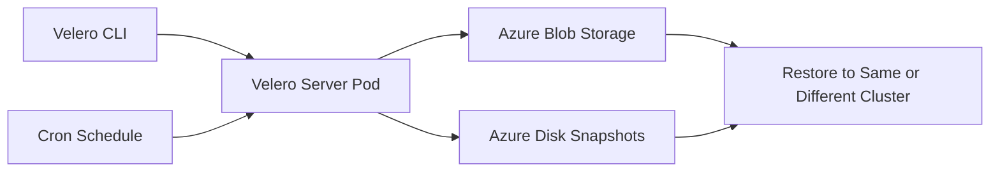

# How to Set Up AKS Backup and Restore Using Velero with Azure Blob Storage

Author: [nawazdhandala](https://www.github.com/nawazdhandala)

Tags: AKS, Kubernetes, Velero, Backup, Disaster Recovery, Azure Blob Storage, Operations

Description: Complete walkthrough for setting up Velero on AKS to back up and restore Kubernetes resources and persistent volumes using Azure Blob Storage.

---

Kubernetes does not back up itself. If someone accidentally deletes a namespace, or a Helm upgrade goes sideways, or you need to migrate workloads to a new cluster, you need a backup solution. Velero (formerly Heptio Ark) is the standard tool for Kubernetes backup and restore, and it integrates natively with Azure Blob Storage for storing backup data and Azure Disk snapshots for persistent volumes.

This guide covers the full setup of Velero on AKS, including storage configuration, scheduled backups, selective backups, and restore procedures.

## Architecture Overview

Velero runs as a deployment inside your AKS cluster. When a backup is triggered (manually or on schedule), it does two things. First, it exports all Kubernetes resource definitions (deployments, services, configmaps, etc.) as JSON and stores them in an Azure Blob Storage container. Second, it takes snapshots of any persistent volumes attached to the pods being backed up using the Azure Disk CSI snapshot API.



## Setting Up Azure Resources

First, create the Azure resources that Velero needs: a storage account, a blob container, and a service principal with the right permissions.

```bash
# Set variables
AZURE_BACKUP_RESOURCE_GROUP="velero-backups"
AZURE_STORAGE_ACCOUNT_NAME="velerobackups$(openssl rand -hex 4)"
BLOB_CONTAINER="velero"
AKS_RESOURCE_GROUP="myRG"
AKS_CLUSTER_NAME="myAKS"

# Create the resource group for backups
az group create --name $AZURE_BACKUP_RESOURCE_GROUP --location eastus

# Create the storage account
az storage account create \
  --name $AZURE_STORAGE_ACCOUNT_NAME \
  --resource-group $AZURE_BACKUP_RESOURCE_GROUP \
  --sku Standard_GRS \
  --encryption-services blob \
  --kind StorageV2 \
  --min-tls-version TLS1_2

# Create the blob container
az storage container create \
  --name $BLOB_CONTAINER \
  --account-name $AZURE_STORAGE_ACCOUNT_NAME \
  --auth-mode login
```

Notice that we use `Standard_GRS` (geo-redundant storage) for the storage account. This means your backups are replicated to a paired Azure region, giving you protection against regional outages.

## Creating the Service Principal

Velero needs permissions to manage snapshots and access blob storage. Create a service principal with the minimum required roles.

```bash
# Get the subscription ID and tenant ID
AZURE_SUBSCRIPTION_ID=$(az account show --query id -o tsv)
AZURE_TENANT_ID=$(az account show --query tenantId -o tsv)

# Get the AKS node resource group (where disks live)
AKS_NODE_RESOURCE_GROUP=$(az aks show \
  --resource-group $AKS_RESOURCE_GROUP \
  --name $AKS_CLUSTER_NAME \
  --query nodeResourceGroup -o tsv)

# Create a service principal for Velero
AZURE_CLIENT_SECRET=$(az ad sp create-for-rbac \
  --name "velero-sp" \
  --role "Contributor" \
  --scope "/subscriptions/$AZURE_SUBSCRIPTION_ID/resourceGroups/$AKS_NODE_RESOURCE_GROUP" \
  --query password -o tsv)

AZURE_CLIENT_ID=$(az ad sp list \
  --display-name "velero-sp" \
  --query "[0].appId" -o tsv)

# Grant the SP access to the backup storage account
az role assignment create \
  --assignee $AZURE_CLIENT_ID \
  --role "Storage Blob Data Contributor" \
  --scope "/subscriptions/$AZURE_SUBSCRIPTION_ID/resourceGroups/$AZURE_BACKUP_RESOURCE_GROUP/providers/Microsoft.Storage/storageAccounts/$AZURE_STORAGE_ACCOUNT_NAME"

# Also grant access to the AKS resource group for disk snapshots
az role assignment create \
  --assignee $AZURE_CLIENT_ID \
  --role "Contributor" \
  --scope "/subscriptions/$AZURE_SUBSCRIPTION_ID/resourceGroups/$AKS_RESOURCE_GROUP"
```

Create the credentials file that Velero needs.

```bash
# Create the Velero credentials file
cat <<EOF > velero-credentials.env
AZURE_SUBSCRIPTION_ID=$AZURE_SUBSCRIPTION_ID
AZURE_TENANT_ID=$AZURE_TENANT_ID
AZURE_CLIENT_ID=$AZURE_CLIENT_ID
AZURE_CLIENT_SECRET=$AZURE_CLIENT_SECRET
AZURE_RESOURCE_GROUP=$AKS_NODE_RESOURCE_GROUP
AZURE_CLOUD_NAME=AzurePublicCloud
EOF
```

## Installing Velero

Install the Velero CLI first, then use it to install the server components on the cluster.

```bash
# Install the Velero CLI (macOS)
brew install velero

# Or download for Linux
# wget https://github.com/vmware-tanzu/velero/releases/download/v1.13.0/velero-v1.13.0-linux-amd64.tar.gz

# Install Velero on the AKS cluster
velero install \
  --provider azure \
  --plugins velero/velero-plugin-for-microsoft-azure:v1.9.0 \
  --bucket $BLOB_CONTAINER \
  --secret-file velero-credentials.env \
  --backup-location-config \
    resourceGroup=$AZURE_BACKUP_RESOURCE_GROUP,\
    storageAccount=$AZURE_STORAGE_ACCOUNT_NAME,\
    subscriptionId=$AZURE_SUBSCRIPTION_ID \
  --snapshot-location-config \
    resourceGroup=$AKS_NODE_RESOURCE_GROUP,\
    subscriptionId=$AZURE_SUBSCRIPTION_ID \
  --use-node-agent \
  --default-volumes-to-fs-backup
```

The `--use-node-agent` flag deploys a DaemonSet that handles file-system-level backups of volumes (for volumes that do not support snapshots). The `--default-volumes-to-fs-backup` flag makes this the default behavior for all volumes.

Verify the installation.

```bash
# Check Velero deployment
kubectl get pods -n velero

# Verify the backup location is available
velero backup-location get

# Check the snapshot location
velero snapshot-location get
```

## Creating Your First Backup

With Velero installed, let us create a backup.

```bash
# Back up everything in the cluster
velero backup create full-backup-$(date +%Y%m%d)

# Back up a specific namespace
velero backup create team-alpha-backup \
  --include-namespaces team-alpha

# Back up multiple namespaces
velero backup create production-backup \
  --include-namespaces production,monitoring,ingress

# Back up by label selector
velero backup create critical-apps-backup \
  --selector tier=critical

# Check backup status
velero backup describe full-backup-$(date +%Y%m%d)

# List all backups
velero backup get
```

## Setting Up Scheduled Backups

For production clusters, schedule backups to run automatically.

```bash
# Daily backup of all namespaces, keep for 30 days
velero schedule create daily-full \
  --schedule="0 2 * * *" \
  --ttl 720h

# Hourly backup of production namespace, keep for 7 days
velero schedule create hourly-production \
  --schedule="0 * * * *" \
  --include-namespaces production \
  --ttl 168h

# Weekly full backup, keep for 90 days
velero schedule create weekly-full \
  --schedule="0 3 * * 0" \
  --ttl 2160h

# List scheduled backups
velero schedule get
```

The TTL (time to live) controls how long backups are retained. After the TTL expires, Velero automatically deletes the backup from blob storage and removes the associated disk snapshots.

## Restoring from a Backup

When you need to restore, Velero makes it straightforward.

```bash
# Restore everything from a backup
velero restore create --from-backup full-backup-20260216

# Restore a specific namespace
velero restore create --from-backup production-backup \
  --include-namespaces production

# Restore to a different namespace (useful for testing)
velero restore create --from-backup production-backup \
  --namespace-mappings production:production-restored

# Restore only specific resource types
velero restore create --from-backup full-backup-20260216 \
  --include-resources deployments,services,configmaps

# Check restore status
velero restore describe <restore-name>

# List all restores
velero restore get
```

## Excluding Resources from Backup

Not everything needs to be backed up. Exclude resources that are dynamically generated or managed by controllers.

```yaml
# Add this label to any resource you want to exclude from backups
metadata:
  labels:
    velero.io/exclude-from-backup: "true"
```

You can also exclude at the backup level.

```bash
# Exclude certain resource types
velero backup create my-backup \
  --exclude-resources events,endpoints

# Exclude specific namespaces
velero backup create my-backup \
  --exclude-namespaces kube-system,velero
```

## Backing Up Persistent Volumes

By default with our installation, Velero uses file-system backup for persistent volumes. This works with any volume type but is slower. For Azure Disk volumes, you can use native snapshots instead.

```yaml
# pod-with-volume-annotation.yaml
# Annotate pods to use volume snapshots instead of file-system backup
apiVersion: v1
kind: Pod
metadata:
  name: data-processor
  annotations:
    # Opt in to volume snapshot backup for this pod
    backup.velero.io/backup-volumes: data-volume
spec:
  containers:
    - name: processor
      image: myapp:latest
      volumeMounts:
        - name: data-volume
          mountPath: /data
  volumes:
    - name: data-volume
      persistentVolumeClaim:
        claimName: data-pvc
```

## Monitoring Backup Health

Set up monitoring to catch backup failures early.

```bash
# Check for failed backups
velero backup get | grep -i failed

# Get detailed logs from a failed backup
velero backup logs <backup-name>

# Check Velero server logs
kubectl logs -n velero -l app.kubernetes.io/name=velero --tail=100
```

## Disaster Recovery: Restoring to a New Cluster

The real test of a backup solution is restoring to a completely new cluster. Here is the process.

```bash
# 1. Create a new AKS cluster
az aks create --resource-group recovery-rg --name recovery-cluster --node-count 3

# 2. Install Velero on the new cluster pointing to the same storage
velero install \
  --provider azure \
  --plugins velero/velero-plugin-for-microsoft-azure:v1.9.0 \
  --bucket $BLOB_CONTAINER \
  --secret-file velero-credentials.env \
  --backup-location-config \
    resourceGroup=$AZURE_BACKUP_RESOURCE_GROUP,\
    storageAccount=$AZURE_STORAGE_ACCOUNT_NAME,\
    subscriptionId=$AZURE_SUBSCRIPTION_ID \
  --snapshot-location-config \
    resourceGroup=$AKS_NODE_RESOURCE_GROUP,\
    subscriptionId=$AZURE_SUBSCRIPTION_ID

# 3. Velero automatically discovers existing backups
velero backup get

# 4. Restore from the latest backup
velero restore create --from-backup daily-full-20260216020000
```

## Wrapping Up

Velero with Azure Blob Storage gives you a reliable, automated backup solution for AKS. The setup takes about 30 minutes, and once scheduled backups are running, you have a safety net for accidental deletions, failed upgrades, and even full cluster recovery. Test your restores regularly - a backup you have never tested is a backup you cannot trust. Run a restore drill at least once a quarter to make sure the process works and your team knows how to execute it.
