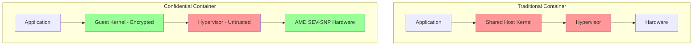

# How to Set Up AKS Confidential Containers with AMD SEV-SNP Encrypted Virtual Machines

Author: [nawazdhandala](https://www.github.com/nawazdhandala)

Tags: AKS, Confidential Computing, AMD SEV-SNP, Kubernetes, Security, Azure, Encryption

Description: Step-by-step guide to deploying confidential containers on AKS using AMD SEV-SNP hardware encryption for memory-level workload protection.

---

Traditional container isolation relies on the operating system kernel - namespaces and cgroups separate containers from each other and from the host. But the host OS, the hypervisor, and anyone with physical access to the hardware can still read your container's memory. For workloads processing sensitive data like healthcare records, financial transactions, or encryption keys, this is not acceptable.

AKS confidential containers solve this by running your pods inside AMD SEV-SNP (Secure Encrypted Virtualization - Secure Nested Paging) encrypted virtual machines. The hardware encrypts the container's memory, and not even the Azure infrastructure operator can read the data. This is not application-level encryption - it is hardware-enforced memory encryption that protects data while it is being processed.

## What AMD SEV-SNP Actually Does

AMD SEV-SNP is a hardware feature built into AMD EPYC processors. It provides three layers of protection.

**Memory encryption**: Each virtual machine gets its own encryption key, managed by the hardware. Memory pages belonging to the VM are encrypted with AES-256 before they leave the CPU. Even if someone reads the physical RAM, they get encrypted garbage.

**Integrity protection**: SNP (Secure Nested Paging) adds integrity checks to prevent a malicious hypervisor from replaying or modifying encrypted memory pages.

**Attestation**: The hardware can generate a cryptographic report that proves the VM is running in a genuine SEV-SNP environment. Your workload can verify this before processing sensitive data.

## Prerequisites

Confidential containers on AKS require specific VM sizes and configuration.

```bash
# Check that your subscription has access to confidential VM sizes
az vm list-sizes --location eastus -o table | grep -i "Standard_DC"

# The DCas_v5 and DCads_v5 series support AMD SEV-SNP
# Example sizes:
# Standard_DC2as_v5 (2 vCPU, 8 GB RAM)
# Standard_DC4as_v5 (4 vCPU, 16 GB RAM)
# Standard_DC8as_v5 (8 vCPU, 32 GB RAM)

# Register the required feature flag
az feature register \
  --namespace Microsoft.ContainerService \
  --name KataCcIsolationPreview

# Wait for registration to complete
az feature show \
  --namespace Microsoft.ContainerService \
  --name KataCcIsolationPreview \
  --query "properties.state" -o tsv

# Refresh the provider registration
az provider register --namespace Microsoft.ContainerService
```

## Creating an AKS Cluster with Confidential Node Pool

You need a separate node pool using confidential VM sizes. The system node pool can use regular VMs.

```bash
# Create the AKS cluster with a regular system pool
az aks create \
  --resource-group confidential-rg \
  --name cc-cluster \
  --node-count 2 \
  --node-vm-size Standard_D4s_v5 \
  --os-sku AzureLinux \
  --network-plugin azure \
  --generate-ssh-keys

# Add a confidential node pool with AMD SEV-SNP VMs
az aks nodepool add \
  --resource-group confidential-rg \
  --cluster-name cc-cluster \
  --name ccpool \
  --node-count 2 \
  --node-vm-size Standard_DC4as_v5 \
  --os-sku AzureLinux \
  --workload-runtime KataCcIsolation \
  --labels workload=confidential

# Verify the node pool
az aks nodepool show \
  --resource-group confidential-rg \
  --cluster-name cc-cluster \
  --name ccpool \
  --query workloadRuntime -o tsv
```

The `--workload-runtime KataCcIsolation` flag is the key setting. It tells AKS to run pods on this node pool inside Kata Containers with confidential computing isolation. Each pod gets its own lightweight VM with SEV-SNP encryption.

## Deploying a Confidential Container

To run a pod as a confidential container, you use a specific runtime class.

```bash
# Verify the runtime class exists
kubectl get runtimeclass

# You should see kata-cc listed
```

Now deploy a pod using the confidential runtime.

```yaml
# confidential-pod.yaml
# A pod that runs inside an AMD SEV-SNP encrypted VM
apiVersion: v1
kind: Pod
metadata:
  name: confidential-app
  labels:
    app: confidential-app
spec:
  # Use the Kata Confidential Containers runtime
  runtimeClassName: kata-cc
  # Schedule on the confidential node pool
  nodeSelector:
    workload: confidential
  containers:
    - name: app
      image: myacr.azurecr.io/secure-processor:v1
      ports:
        - containerPort: 8443
      resources:
        requests:
          cpu: 500m
          memory: 512Mi
        limits:
          cpu: 2
          memory: 2Gi
      # Environment variables are encrypted in memory
      env:
        - name: DATABASE_URL
          valueFrom:
            secretKeyRef:
              name: db-credentials
              key: url
```

```bash
# Deploy the confidential pod
kubectl apply -f confidential-pod.yaml

# Verify it is running with the Kata CC runtime
kubectl get pod confidential-app -o jsonpath='{.spec.runtimeClassName}'

# Check pod status
kubectl describe pod confidential-app
```

## Understanding the Security Boundary

With confidential containers, the trust boundary changes significantly.



In a traditional container, the host kernel and hypervisor can read all container memory. In a confidential container, only the application and its guest kernel are inside the trust boundary. The hypervisor and host OS are outside - they can see encrypted data but cannot decrypt it.

## Configuring Security Policies

Confidential containers on AKS use a security policy to define what operations are allowed inside the encrypted VM. This policy is enforced by the hardware attestation mechanism.

```yaml
# confidential-deployment.yaml
# Deployment with confidential containers security policy
apiVersion: apps/v1
kind: Deployment
metadata:
  name: secure-processor
spec:
  replicas: 3
  selector:
    matchLabels:
      app: secure-processor
  template:
    metadata:
      labels:
        app: secure-processor
      annotations:
        # Security policy annotation for confidential containers
        io.katacontainers.config.agent.policy: |
          {
            "allowed_images": [
              "myacr.azurecr.io/secure-processor:v1",
              "myacr.azurecr.io/secure-processor:v2"
            ],
            "allowed_env_vars": [
              "DATABASE_URL",
              "API_KEY"
            ]
          }
    spec:
      runtimeClassName: kata-cc
      nodeSelector:
        workload: confidential
      containers:
        - name: processor
          image: myacr.azurecr.io/secure-processor:v1
          securityContext:
            readOnlyRootFilesystem: true
            runAsNonRoot: true
            runAsUser: 1000
          resources:
            requests:
              cpu: 1
              memory: 1Gi
            limits:
              cpu: 2
              memory: 4Gi
```

## Remote Attestation

One of the most powerful features of confidential containers is remote attestation. Your application can cryptographically verify that it is running in a genuine SEV-SNP environment before processing any sensitive data.

```yaml
# attestation-sidecar.yaml
# Deploy with an attestation sidecar that verifies the TEE before starting
apiVersion: v1
kind: Pod
metadata:
  name: attested-app
spec:
  runtimeClassName: kata-cc
  nodeSelector:
    workload: confidential
  initContainers:
    # Attestation init container verifies the TEE environment
    - name: attestation
      image: mcr.microsoft.com/aci/skr:2.7
      command:
        - /skr
      env:
        - name: SkrSideCarArgs
          value: "ewogICAgImNlcnRjYWNoZSI6IHsKICAgICAgICAiZW5kcG9pbnQiOiAi..."
      resources:
        limits:
          cpu: 100m
          memory: 128Mi
  containers:
    - name: app
      image: myacr.azurecr.io/secure-processor:v1
      ports:
        - containerPort: 8443
```

The attestation init container contacts Microsoft Azure Attestation service to verify that the pod is running in a genuine SEV-SNP enclave. Only after successful attestation does the main application container start.

## Integrating with Azure Key Vault

For confidential workloads, you often need to securely retrieve encryption keys. Azure Key Vault integrates with confidential containers through Managed HSM and secure key release.

```bash
# Create an Azure Key Vault with HSM backing
az keyvault create \
  --name cc-keyvault \
  --resource-group confidential-rg \
  --location eastus \
  --sku premium

# Create a key with a release policy tied to attestation
az keyvault key create \
  --vault-name cc-keyvault \
  --name data-encryption-key \
  --kty RSA-HSM \
  --size 2048 \
  --exportable true \
  --policy "@release-policy.json"
```

The release policy ensures the key is only released to workloads that pass attestation - proving they are running in a genuine confidential computing environment.

## Performance Considerations

Confidential containers have some performance overhead compared to regular containers.

- **Startup time**: Each pod launches a lightweight VM, adding 2-5 seconds to startup time.
- **Memory overhead**: The guest kernel and VM management consume approximately 256MB per pod.
- **CPU overhead**: Memory encryption adds roughly 2-5% CPU overhead for memory-intensive workloads.
- **I/O**: Disk I/O goes through the encrypted VM boundary, adding latency to disk operations.

For most workloads, the performance impact is minimal. Compute-heavy workloads (CPU math, not memory-bound) see almost no difference.

## Monitoring Confidential Workloads

Standard Kubernetes monitoring works for confidential containers, but you cannot inspect memory contents from outside the VM.

```bash
# Standard pod monitoring still works
kubectl top pod confidential-app

# Logs are available through the standard mechanism
kubectl logs confidential-app

# But you cannot exec into the pod for debugging in some configurations
# This is by design - the security boundary prevents external access
```

## Wrapping Up

AKS confidential containers with AMD SEV-SNP provide hardware-level memory encryption for your most sensitive workloads. The setup requires specific VM sizes and the Kata CC runtime, but once configured, deploying confidential containers is as simple as adding a `runtimeClassName` to your pod spec. The key benefit is that your data is protected not just from other tenants, but from the cloud provider's infrastructure itself. For regulated industries dealing with healthcare, financial, or government data, this level of protection can be the difference between passing and failing a compliance audit. Start with a proof of concept on a dedicated node pool, validate the performance characteristics for your workload, and expand as confidence grows.
