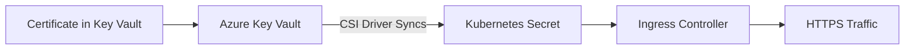

# How to Set Up AKS with Azure Key Vault for TLS Ingress Certificate Management

Author: [nawazdhandala](https://www.github.com/nawazdhandala)

Tags: AKS, Azure Key Vault, TLS, Ingress, Certificates, Kubernetes, Security

Description: Step-by-step guide to integrating Azure Key Vault with AKS for automated TLS certificate provisioning and rotation on ingress controllers.

---

Managing TLS certificates in Kubernetes is a chore that nobody enjoys. You generate certs, store them as Kubernetes secrets, configure ingress rules, and then remember to rotate them before they expire. If you forget, your users see scary browser warnings and your monitoring lights up. Azure Key Vault integration with AKS removes most of this pain by letting you store and manage certificates in Key Vault and sync them automatically into your cluster.

This guide walks through the full setup: enabling the Key Vault Secrets Provider addon, storing TLS certificates in Key Vault, and configuring your ingress controller to use them.

## Architecture Overview

The integration works through the Azure Key Vault Provider for Secrets Store CSI Driver. This driver mounts Key Vault secrets, keys, and certificates as volumes in your pods. For TLS ingress, the flow looks like this:



The Secrets Store CSI driver polls Key Vault at a configurable interval and updates the Kubernetes secret whenever the certificate changes in Key Vault. This means certificate rotation in Key Vault automatically propagates to your ingress without manual intervention.

## Prerequisites

- An AKS cluster running Kubernetes 1.24 or later
- Azure CLI with the aks-preview extension
- An Azure Key Vault instance
- A TLS certificate (you can use a self-signed cert for testing or import one from a CA)
- An ingress controller installed (NGINX Ingress Controller works well for this)

## Step 1: Enable the Key Vault Secrets Provider Addon

AKS has a built-in addon that installs the Secrets Store CSI driver and the Azure Key Vault provider.

```bash
# Enable the Key Vault secrets provider addon on your AKS cluster
az aks enable-addons \
  --addons azure-keyvault-secrets-provider \
  --resource-group myResourceGroup \
  --name myAKSCluster

# Enable auto-rotation of secrets (polls Key Vault every 2 minutes by default)
az aks update \
  --resource-group myResourceGroup \
  --name myAKSCluster \
  --enable-secret-rotation \
  --rotation-poll-interval 2m
```

Verify the addon is running:

```bash
# Check that the secrets store CSI driver pods are running
kubectl get pods -n kube-system -l app=secrets-store-csi-driver

# Check that the Azure Key Vault provider pods are running
kubectl get pods -n kube-system -l app=csi-secrets-store-provider-azure
```

## Step 2: Create an Azure Key Vault and Import a Certificate

If you do not already have a Key Vault, create one. Then import or generate a TLS certificate.

```bash
# Create a Key Vault
az keyvault create \
  --resource-group myResourceGroup \
  --name myAKSKeyVault \
  --location eastus

# Option A: Import an existing PFX certificate
az keyvault certificate import \
  --vault-name myAKSKeyVault \
  --name my-tls-cert \
  --file ./my-certificate.pfx \
  --password "pfx-password"

# Option B: Generate a self-signed certificate for testing
az keyvault certificate create \
  --vault-name myAKSKeyVault \
  --name my-tls-cert \
  --policy "$(az keyvault certificate get-default-policy)"
```

## Step 3: Configure Identity and Access

The Secrets Store CSI driver needs permission to read secrets from your Key Vault. The cleanest approach is using the addon's managed identity.

```bash
# Get the managed identity client ID created by the addon
IDENTITY_CLIENT_ID=$(az aks show \
  --resource-group myResourceGroup \
  --name myAKSCluster \
  --query addonProfiles.azureKeyvaultSecretsProvider.identity.clientId -o tsv)

# Get the Key Vault resource ID
KEYVAULT_ID=$(az keyvault show \
  --name myAKSKeyVault \
  --query id -o tsv)

# Grant the managed identity access to read secrets and certificates
az role assignment create \
  --assignee $IDENTITY_CLIENT_ID \
  --role "Key Vault Secrets User" \
  --scope $KEYVAULT_ID

# If using RBAC model, also grant certificate read access
az role assignment create \
  --assignee $IDENTITY_CLIENT_ID \
  --role "Key Vault Certificate User" \
  --scope $KEYVAULT_ID
```

If your Key Vault uses access policies instead of RBAC:

```bash
# Set access policy for the managed identity
az keyvault set-policy \
  --name myAKSKeyVault \
  --spn $IDENTITY_CLIENT_ID \
  --secret-permissions get \
  --certificate-permissions get
```

## Step 4: Create a SecretProviderClass

The SecretProviderClass tells the CSI driver which secrets to fetch from Key Vault and how to create Kubernetes secrets from them.

```yaml
# secret-provider-class.yaml
# Defines how to sync a TLS certificate from Key Vault to a Kubernetes secret
apiVersion: secrets-store.csi.x-k8s.io/v1
kind: SecretProviderClass
metadata:
  name: azure-tls-cert
  namespace: default
spec:
  provider: azure
  # secretObjects creates a Kubernetes secret from the mounted content
  secretObjects:
  - secretName: ingress-tls-cert
    type: kubernetes.io/tls
    data:
    - objectName: my-tls-cert
      key: tls.key
    - objectName: my-tls-cert
      key: tls.crt
  parameters:
    usePodIdentity: "false"
    useVMManagedIdentity: "true"
    # The client ID of the addon managed identity
    userAssignedIdentityID: "<IDENTITY_CLIENT_ID>"
    keyvaultName: "myAKSKeyVault"
    objects: |
      array:
        - |
          objectName: my-tls-cert
          objectType: secret
    tenantId: "<YOUR_TENANT_ID>"
```

Replace `<IDENTITY_CLIENT_ID>` and `<YOUR_TENANT_ID>` with your actual values. You can get the tenant ID with:

```bash
# Get your Azure AD tenant ID
az account show --query tenantId -o tsv
```

Apply the SecretProviderClass:

```bash
kubectl apply -f secret-provider-class.yaml
```

## Step 5: Deploy a Pod That References the SecretProviderClass

The Kubernetes secret is only created when a pod mounts the SecretProviderClass volume. You need at least one pod that mounts it to trigger the sync.

```yaml
# cert-sync-pod.yaml
# This pod mounts the Key Vault secret to trigger Kubernetes secret creation
apiVersion: apps/v1
kind: Deployment
metadata:
  name: cert-sync
  namespace: default
spec:
  replicas: 1
  selector:
    matchLabels:
      app: cert-sync
  template:
    metadata:
      labels:
        app: cert-sync
    spec:
      containers:
      - name: cert-sync
        image: mcr.microsoft.com/cbl-mariner/busybox:2.0
        command: ["sleep", "infinity"]
        volumeMounts:
        - name: secrets-store
          mountPath: "/mnt/secrets-store"
          readOnly: true
      volumes:
      - name: secrets-store
        csi:
          driver: secrets-store.csi.k8s.io
          readOnly: true
          volumeAttributes:
            secretProviderClass: "azure-tls-cert"
```

Apply it and verify the secret gets created:

```bash
# Deploy the cert sync pod
kubectl apply -f cert-sync-pod.yaml

# Wait for the pod to be running
kubectl wait --for=condition=ready pod -l app=cert-sync --timeout=120s

# Verify the Kubernetes TLS secret was created
kubectl get secret ingress-tls-cert
```

## Step 6: Configure Ingress to Use the TLS Secret

Now configure your ingress resource to use the synced TLS secret.

```yaml
# ingress.yaml
# Ingress rule using the TLS certificate synced from Key Vault
apiVersion: networking.k8s.io/v1
kind: Ingress
metadata:
  name: my-app-ingress
  namespace: default
  annotations:
    nginx.ingress.kubernetes.io/ssl-redirect: "true"
spec:
  ingressClassName: nginx
  tls:
  - hosts:
    - myapp.example.com
    # This secret is automatically synced from Key Vault
    secretName: ingress-tls-cert
  rules:
  - host: myapp.example.com
    http:
      paths:
      - path: /
        pathType: Prefix
        backend:
          service:
            name: my-app-service
            port:
              number: 80
```

## Step 7: Verify TLS Is Working

Test that the ingress serves traffic with the correct TLS certificate.

```bash
# Check the ingress resource
kubectl describe ingress my-app-ingress

# Test TLS connection (replace with your actual domain or use port-forward)
curl -v https://myapp.example.com 2>&1 | grep "subject:"

# If testing locally, use port-forward to the ingress controller
kubectl port-forward -n ingress-nginx svc/ingress-nginx-controller 8443:443
curl -vk https://localhost:8443 -H "Host: myapp.example.com"
```

## Certificate Rotation

When you renew the certificate in Key Vault, the Secrets Store CSI driver automatically picks up the change during its next poll interval and updates the Kubernetes secret. Most ingress controllers (including NGINX Ingress Controller) detect the secret change and reload without downtime.

To test rotation:

```bash
# Generate a new version of the certificate in Key Vault
az keyvault certificate create \
  --vault-name myAKSKeyVault \
  --name my-tls-cert \
  --policy "$(az keyvault certificate get-default-policy)"

# Wait for the rotation poll interval (2 minutes by default)
# Then check that the secret was updated
kubectl get secret ingress-tls-cert -o jsonpath='{.metadata.resourceVersion}'
```

## Troubleshooting

If the Kubernetes secret is not being created, check these common issues:

```bash
# Check SecretProviderClass events for errors
kubectl describe secretproviderclass azure-tls-cert

# Check the cert-sync pod for mount errors
kubectl describe pod -l app=cert-sync

# Check CSI driver logs for Key Vault access errors
kubectl logs -n kube-system -l app=csi-secrets-store-provider-azure --tail=50

# Verify the managed identity has the correct permissions
az role assignment list --assignee $IDENTITY_CLIENT_ID --scope $KEYVAULT_ID -o table
```

Common problems include incorrect tenant IDs, missing RBAC assignments, Key Vault firewall blocking the cluster's IP range, and typos in the certificate name.

## Production Tips

For production environments, store the SecretProviderClass manifests in your GitOps repository alongside your application manifests. Use separate Key Vault instances for production and non-production environments. Enable Key Vault soft delete and purge protection so certificates cannot be accidentally deleted. Set up Azure Monitor alerts for Key Vault access failures. And always test certificate rotation in a staging environment before rolling it out to production.

Using Azure Key Vault for TLS certificate management in AKS is the right approach for any team that wants centralized certificate lifecycle management without the operational burden of manually syncing secrets into Kubernetes.
