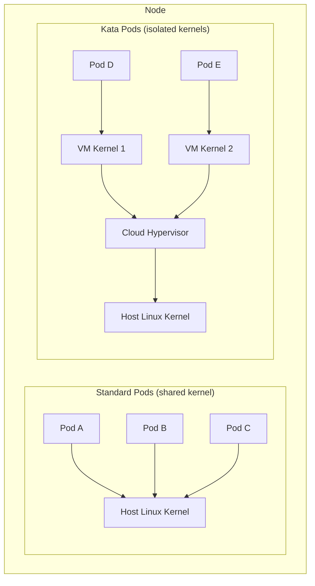

# How to Set Up AKS with Kata Containers for Hardware-Isolated Pod Sandboxing

Author: [nawazdhandala](https://www.github.com/nawazdhandala)

Tags: AKS, Kata Containers, Kubernetes, Sandboxing, Security, Azure, Isolation

Description: Learn how to deploy Kata Containers on AKS to run pods inside lightweight virtual machines for hardware-level isolation between workloads.

---

Standard container isolation relies on Linux kernel features - namespaces, cgroups, and seccomp profiles. These work well for trusted workloads, but they all share the same kernel. A kernel exploit in one container can potentially compromise every other container on the same node. For environments running untrusted code, multi-tenant workloads, or anything requiring strong isolation guarantees, you need something more.

Kata Containers solve this by running each pod inside its own lightweight virtual machine. The pod gets its own kernel, its own memory space, and hardware-enforced isolation from other pods. From the Kubernetes perspective, it looks and behaves like a regular pod. Under the hood, it is a VM managed by a lightweight hypervisor, giving you the security of virtual machines with the operational simplicity of containers.

## How Kata Containers Work on AKS

On AKS, Kata Containers use Cloud Hypervisor as the lightweight VMM (Virtual Machine Monitor). When you create a pod with the Kata runtime class, the following happens.

1. Kubelet calls the Kata runtime instead of the standard containerd runtime.
2. Kata launches a lightweight VM using Cloud Hypervisor.
3. The VM boots a minimal Linux kernel (in about 100ms).
4. The container image is mounted inside the VM.
5. The application process starts inside the VM.

From Kubernetes' perspective, the pod is just a pod. Kubectl, services, networking, storage - everything works the same way. The difference is entirely at the isolation layer.



## Prerequisites

Kata Containers on AKS require nested virtualization support, which means you need VM sizes that support it.

```bash
# VM sizes that support nested virtualization (Dv3, Dsv3, Ev3, Esv3 and newer)
# Standard_D4s_v3, Standard_D8s_v5, Standard_E4s_v5, etc.

# Verify your cluster can support Kata
az vm list-sizes --location eastus -o table | grep -E "Standard_D[0-9]+s_v[3-5]"
```

## Creating an AKS Cluster with Kata Containers

You can enable Kata Containers by creating a node pool with the `KataMshvVmIsolation` workload runtime.

```bash
# Create the AKS cluster with a standard system pool
az aks create \
  --resource-group myRG \
  --name kata-cluster \
  --node-count 2 \
  --node-vm-size Standard_D4s_v5 \
  --os-sku AzureLinux \
  --network-plugin azure \
  --generate-ssh-keys

# Add a node pool that supports Kata Containers
az aks nodepool add \
  --resource-group myRG \
  --cluster-name kata-cluster \
  --name katapool \
  --node-count 3 \
  --node-vm-size Standard_D4s_v5 \
  --os-sku AzureLinux \
  --workload-runtime KataMshvVmIsolation \
  --labels workload-runtime=kata

# Verify the runtime class was created
kubectl get runtimeclass
```

You should see a `kata-mshv-vm-isolation` runtime class listed.

## Deploying a Pod with Kata Isolation

Deploying a Kata-isolated pod is as simple as adding the `runtimeClassName` field to your pod spec.

```yaml
# kata-pod.yaml
# A pod that runs inside a Kata Container (lightweight VM)
apiVersion: v1
kind: Pod
metadata:
  name: isolated-workload
  labels:
    app: isolated-workload
spec:
  # This is the key setting - tells Kubernetes to use Kata runtime
  runtimeClassName: kata-mshv-vm-isolation
  # Schedule on the Kata-capable node pool
  nodeSelector:
    workload-runtime: kata
  containers:
    - name: app
      image: nginx:1.25
      ports:
        - containerPort: 80
      resources:
        requests:
          cpu: 250m
          memory: 256Mi
        limits:
          cpu: 1
          memory: 1Gi
```

```bash
# Deploy the pod
kubectl apply -f kata-pod.yaml

# Verify it is running
kubectl get pod isolated-workload -o wide

# Check the runtime class of the running pod
kubectl get pod isolated-workload -o jsonpath='{.spec.runtimeClassName}'
```

## Running a Deployment with Kata Containers

For production workloads, use Deployments as usual. The runtime class applies to all pods in the deployment.

```yaml
# kata-deployment.yaml
# Deployment running all pods in Kata Containers
apiVersion: apps/v1
kind: Deployment
metadata:
  name: sandboxed-api
  namespace: untrusted-workloads
spec:
  replicas: 3
  selector:
    matchLabels:
      app: sandboxed-api
  template:
    metadata:
      labels:
        app: sandboxed-api
    spec:
      runtimeClassName: kata-mshv-vm-isolation
      nodeSelector:
        workload-runtime: kata
      containers:
        - name: api
          image: myacr.azurecr.io/sandboxed-api:v2
          ports:
            - containerPort: 8080
          resources:
            requests:
              cpu: 500m
              memory: 512Mi
            limits:
              cpu: 2
              memory: 2Gi
          securityContext:
            readOnlyRootFilesystem: true
            runAsNonRoot: true
            runAsUser: 1000
      # Volumes work normally with Kata Containers
      volumes:
        - name: tmp
          emptyDir: {}
---
apiVersion: v1
kind: Service
metadata:
  name: sandboxed-api-svc
  namespace: untrusted-workloads
spec:
  selector:
    app: sandboxed-api
  ports:
    - port: 80
      targetPort: 8080
  type: ClusterIP
```

## Use Cases for Kata Containers

### Multi-Tenant Platforms

If you run a platform where different customers deploy their own code, Kata Containers prevent one customer from breaking out of their container and accessing another customer's data.

```yaml
# Each tenant gets their own Kata-isolated pods
apiVersion: apps/v1
kind: Deployment
metadata:
  name: tenant-app
  namespace: tenant-abc  # Namespace per tenant
spec:
  replicas: 2
  selector:
    matchLabels:
      app: tenant-app
      tenant: abc
  template:
    metadata:
      labels:
        app: tenant-app
        tenant: abc
    spec:
      runtimeClassName: kata-mshv-vm-isolation
      nodeSelector:
        workload-runtime: kata
      containers:
        - name: app
          # Customer-provided image - runs in hardware isolation
          image: customer-abc.azurecr.io/their-app:latest
          resources:
            limits:
              cpu: 2
              memory: 4Gi
```

### CI/CD Build Environments

Running CI/CD builds (especially Docker builds) inside a cluster is risky with standard containers. Kata Containers let you run builds with full isolation.

```yaml
# ci-build-pod.yaml
# CI build pod that runs Docker-in-Docker safely with Kata isolation
apiVersion: v1
kind: Pod
metadata:
  name: ci-build
spec:
  runtimeClassName: kata-mshv-vm-isolation
  nodeSelector:
    workload-runtime: kata
  containers:
    - name: builder
      image: myacr.azurecr.io/ci-builder:latest
      command:
        - /bin/sh
        - -c
        - |
          # Build commands run inside the Kata VM
          # Even if the build tries to escape the container,
          # it is contained within the VM boundary
          docker build -t myapp:latest .
          docker push myacr.azurecr.io/myapp:latest
      resources:
        limits:
          cpu: 4
          memory: 8Gi
```

### Running Untrusted Code

For applications that execute user-provided code (serverless functions, code playgrounds, data processing pipelines), Kata provides the isolation boundary.

```yaml
# code-executor.yaml
# Executes untrusted user code in a hardware-isolated sandbox
apiVersion: batch/v1
kind: Job
metadata:
  name: user-code-execution
spec:
  template:
    spec:
      runtimeClassName: kata-mshv-vm-isolation
      nodeSelector:
        workload-runtime: kata
      containers:
        - name: executor
          image: myacr.azurecr.io/code-sandbox:v1
          env:
            - name: USER_CODE
              valueFrom:
                configMapKeyRef:
                  name: user-submission
                  key: code
          resources:
            limits:
              cpu: 1
              memory: 512Mi
          # Strict timeout to prevent resource abuse
          command: ["timeout", "60", "/run-user-code.sh"]
      restartPolicy: Never
  backoffLimit: 0
```

## Performance Characteristics

Kata Containers add some overhead compared to standard containers. Here is what to expect.

**Startup time**: 1-3 seconds additional startup time for the VM boot. The minimal Linux kernel boots quickly, but it is not instant like a standard container.

**Memory overhead**: Each Kata pod consumes approximately 128-256MB of additional memory for the guest kernel and VM management layer. This is on top of the memory requested by the container.

**CPU overhead**: Minimal for compute-bound workloads. The hardware virtualization extensions (VT-x) make CPU operations nearly native speed.

**I/O overhead**: Disk and network I/O passes through the VM boundary, adding some latency. For most workloads, this is not noticeable, but I/O-heavy applications might see 5-10% throughput reduction.

```bash
# Compare startup times between standard and Kata pods
time kubectl run standard-pod --image=nginx --restart=Never
time kubectl run kata-pod --image=nginx --restart=Never --overrides='{"spec":{"runtimeClassName":"kata-mshv-vm-isolation","nodeSelector":{"workload-runtime":"kata"}}}'
```

## Networking with Kata Containers

Networking works transparently. Kata pods get the same networking behavior as standard pods - they get an IP from the CNI, can communicate with other pods, and work with Services and NetworkPolicies.

```bash
# Verify networking works between a standard pod and a Kata pod
kubectl exec standard-pod -- wget -qO- http://sandboxed-api-svc.untrusted-workloads.svc.cluster.local

# Verify DNS resolution inside a Kata pod
kubectl exec isolated-workload -- nslookup kubernetes.default.svc.cluster.local
```

## Mixing Kata and Standard Pods

You can run both Kata and standard pods on the same cluster. Use node selectors and runtime classes to control which pods run where.

```bash
# Standard workloads on the standard pool
kubectl get pods -l workload=standard -o wide

# Kata workloads on the Kata pool
kubectl get pods -l workload=sandboxed -o wide
```

## Monitoring Kata Pods

Standard monitoring tools work with Kata pods. Prometheus can scrape metrics, kubectl logs works, and kubectl exec works (the exec session happens inside the VM).

```bash
# Logs work normally
kubectl logs isolated-workload

# Exec into a Kata pod (session runs inside the VM)
kubectl exec -it isolated-workload -- /bin/sh

# Metrics from the kubelet include Kata pods
kubectl top pod isolated-workload
```

## Wrapping Up

Kata Containers on AKS give you hardware-level isolation without giving up the Kubernetes developer experience. Pods look and behave the same - the isolation is transparent. Use them for multi-tenant platforms, CI/CD builds, untrusted code execution, or any workload where kernel-level isolation is not sufficient. The performance overhead is modest, the setup is straightforward (just add a node pool and a runtime class), and you get genuine VM-level security for your most sensitive workloads. Start by identifying which workloads in your cluster need stronger isolation, create a Kata node pool, and gradually migrate those workloads to the new runtime class.
