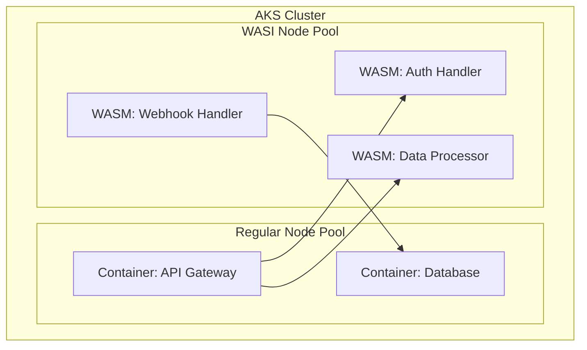

# How to Set Up AKS with WebAssembly (WASM) Workloads Using Spin and WASI Node Pools

Author: [nawazdhandala](https://www.github.com/nawazdhandala)

Tags: AKS, WebAssembly, WASM, WASI, Spin, Kubernetes, Serverless

Description: Learn how to create AKS WASI node pools and deploy WebAssembly workloads using Spin and containerd shims for lightweight, fast-starting serverless functions.

---

WebAssembly (WASM) is moving beyond the browser and into server-side computing. When paired with the WebAssembly System Interface (WASI), WASM modules can run as lightweight, sandboxed workloads that start in milliseconds, use a fraction of the memory of containers, and provide strong isolation guarantees. AKS now supports running WASM workloads alongside traditional containers using dedicated WASI node pools.

If you are looking for a way to run lightweight, event-driven workloads on Kubernetes without the overhead of full container images, WASM on AKS is worth exploring. This guide covers setting up WASI node pools, building and deploying WASM workloads with Spin, and understanding when WASM makes sense versus traditional containers.

## Why WASM on Kubernetes

Traditional containers package an entire OS userspace along with your application. Even a "minimal" container image based on Alpine or distroless is tens of megabytes. A WASM module is just your compiled code - typically a few hundred kilobytes to a few megabytes. This translates to:

- **Sub-millisecond cold starts**: No OS to boot, no runtime to initialize
- **Lower memory footprint**: A WASM workload uses 10-100x less memory than an equivalent container
- **Stronger sandboxing**: WASM modules are sandboxed by default with no filesystem or network access unless explicitly granted
- **Language flexibility**: Compile from Rust, Go, C, C++, JavaScript, Python, and many other languages

The tradeoff is that WASM workloads are best suited for stateless, compute-focused tasks. They do not replace containers for everything, but they are excellent for API handlers, event processors, and serverless-style functions.

## Prerequisites

- An AKS cluster running Kubernetes 1.27 or later
- Azure CLI with the aks-preview extension
- The Spin CLI for building WASM applications
- Rust toolchain (for building Spin applications in Rust) or another supported language

## Step 1: Install the aks-preview Extension

WASI node pools require the aks-preview extension.

```bash
# Install or update the aks-preview extension
az extension add --name aks-preview --upgrade

# Register the WasmNodePoolPreview feature flag
az feature register \
  --namespace "Microsoft.ContainerService" \
  --name "WasmNodePoolPreview"

# Wait for registration (check periodically)
az feature show \
  --namespace "Microsoft.ContainerService" \
  --name "WasmNodePoolPreview" \
  --query properties.state -o tsv

# Refresh the provider registration
az provider register --namespace Microsoft.ContainerService
```

## Step 2: Create a WASI Node Pool

Add a WASI node pool to your AKS cluster. This pool runs the containerd WASM shim that can execute WASM modules.

```bash
# Add a WASI node pool with the Spin runtime
az aks nodepool add \
  --resource-group myResourceGroup \
  --cluster-name myAKSCluster \
  --name wasmpool \
  --node-count 2 \
  --node-vm-size Standard_D2s_v5 \
  --workload-runtime WasmWasi
```

The `--workload-runtime WasmWasi` flag configures the node pool with the containerd WASM shim. This shim can run WASM modules compiled for WASI.

Verify the node pool:

```bash
# Check the node pool configuration
az aks nodepool show \
  --resource-group myResourceGroup \
  --cluster-name myAKSCluster \
  --name wasmpool \
  --query "workloadRuntime" -o tsv

# Check that the nodes are ready
kubectl get nodes -l kubernetes.azure.com/wasmtime-spin-v2=true
```

## Step 3: Install the Spin CLI

Spin is a framework from Fermyon for building and running WASM applications. It is the most popular way to build WASM workloads for Kubernetes.

```bash
# Install the Spin CLI
# On macOS
brew install fermyon/tap/spin

# On Linux
curl -fsSL https://developer.fermyon.com/downloads/install.sh | bash
sudo mv spin /usr/local/bin/

# Verify installation
spin --version

# Install the Kubernetes plugin for Spin
spin plugins update
spin plugins install kube
```

## Step 4: Build a WASM Application

Create a simple HTTP handler using Spin with Rust.

```bash
# Create a new Spin application from template
spin new -t http-rust my-wasm-app
cd my-wasm-app
```

This generates a project structure. The main source file handles HTTP requests:

```rust
// src/lib.rs
// A simple HTTP handler compiled to WebAssembly
use spin_sdk::http::{IntoResponse, Request, Response};
use spin_sdk::http_component;

// This function handles incoming HTTP requests
#[http_component]
fn handle_request(req: Request) -> anyhow::Result<impl IntoResponse> {
    // Log the incoming request path
    println!("Received request: {} {}", req.method(), req.path());

    // Build a JSON response
    let body = serde_json::json!({
        "message": "Hello from WebAssembly on AKS!",
        "path": req.path(),
        "method": req.method().to_string(),
        "runtime": "Spin on WASI"
    });

    // Return the response with appropriate headers
    Ok(Response::builder()
        .status(200)
        .header("content-type", "application/json")
        .body(body.to_string())
        .build())
}
```

The Spin configuration file (`spin.toml`) defines the application:

```toml
# spin.toml
# Spin application configuration
spin_manifest_version = 2

[application]
name = "my-wasm-app"
version = "0.1.0"
description = "A WASM HTTP handler running on AKS"

[[trigger.http]]
route = "/..."
component = "my-wasm-app"

[component.my-wasm-app]
source = "target/wasm32-wasi/release/my_wasm_app.wasm"
allowed_outbound_hosts = []
[component.my-wasm-app.build]
command = "cargo build --target wasm32-wasi --release"
```

Build the application:

```bash
# Build the WASM module
spin build

# Test it locally
spin up
# Visit http://localhost:3000 to test
```

## Step 5: Push the WASM Module to a Registry

WASM modules are distributed as OCI artifacts, just like container images. Push to your ACR.

```bash
# Login to ACR
az acr login --name myRegistry

# Push the WASM module to ACR as an OCI artifact
spin registry push myregistry.azurecr.io/my-wasm-app:v1
```

## Step 6: Deploy to AKS

Deploy the WASM workload to the WASI node pool.

```yaml
# wasm-deployment.yaml
# Kubernetes deployment for a WASM workload on WASI node pool
apiVersion: apps/v1
kind: Deployment
metadata:
  name: my-wasm-app
spec:
  replicas: 3
  selector:
    matchLabels:
      app: my-wasm-app
  template:
    metadata:
      labels:
        app: my-wasm-app
    spec:
      # Use the Spin runtime class for WASM execution
      runtimeClassName: wasmtime-spin-v2
      # Schedule on WASI-enabled nodes
      nodeSelector:
        kubernetes.azure.com/wasmtime-spin-v2: "true"
      containers:
      - name: my-wasm-app
        # Reference the WASM OCI artifact
        image: myregistry.azurecr.io/my-wasm-app:v1
        # WASM modules use minimal resources
        resources:
          requests:
            cpu: "10m"
            memory: "16Mi"
          limits:
            cpu: "100m"
            memory: "32Mi"
        command: ["/"]
---
# Service to expose the WASM application
apiVersion: v1
kind: Service
metadata:
  name: my-wasm-app
spec:
  type: ClusterIP
  ports:
  - port: 80
    targetPort: 80
  selector:
    app: my-wasm-app
```

Deploy and verify:

```bash
# Apply the deployment
kubectl apply -f wasm-deployment.yaml

# Check that pods are running
kubectl get pods -l app=my-wasm-app -o wide

# Test the endpoint
kubectl port-forward svc/my-wasm-app 8080:80
curl http://localhost:8080/hello
```

## Step 7: Expose via Ingress

Add an ingress rule to expose the WASM application externally:

```yaml
# wasm-ingress.yaml
# Ingress for the WASM application
apiVersion: networking.k8s.io/v1
kind: Ingress
metadata:
  name: my-wasm-app
spec:
  ingressClassName: nginx
  rules:
  - host: wasm-app.example.com
    http:
      paths:
      - path: /
        pathType: Prefix
        backend:
          service:
            name: my-wasm-app
            port:
              number: 80
```

## Step 8: Scale and Performance Test

One of WASM's biggest advantages is scaling. Because modules start in milliseconds, scaling from 0 to many replicas is nearly instantaneous.

```bash
# Scale the deployment
kubectl scale deployment my-wasm-app --replicas=20

# Watch pods start (they should be Running almost immediately)
kubectl get pods -l app=my-wasm-app -w

# Run a load test to see performance
kubectl run load-test --rm -it --image=busybox -- \
  wget -q -O- http://my-wasm-app/hello
```

Compare the startup time and resource usage with a traditional container:

```bash
# Check resource usage of WASM pods vs container pods
kubectl top pods -l app=my-wasm-app
# WASM pods typically use 5-20MB of memory

# Compare with a similar container deployment
kubectl top pods -l app=my-container-app
# Container pods typically use 50-200MB+
```

## When to Use WASM vs Containers

WASM works best for:
- HTTP API handlers and middleware
- Event-driven functions (similar to serverless)
- Data transformation and processing pipelines
- Edge computing workloads
- Lightweight microservices with minimal state

Stick with containers for:
- Applications that need filesystem access
- Workloads that depend on system libraries (databases, ML inference with GPU)
- Long-running stateful services
- Applications with complex networking requirements

## Running Both Side by Side

The beauty of the AKS WASI integration is that you can run WASM and container workloads in the same cluster. Your container workloads run on regular node pools, and WASM workloads run on WASI node pools. They can communicate with each other through Kubernetes services.



This hybrid approach lets you use the right tool for each workload. Lightweight, stateless handlers run as WASM for minimal resource usage and fast startup, while heavier services run as traditional containers.

WASM on AKS is still relatively new, but it is maturing quickly. If you have workloads that fit the profile - stateless HTTP handlers, event processors, or lightweight API endpoints - running them as WASM modules can significantly reduce your resource consumption and improve cold start performance compared to containers.
