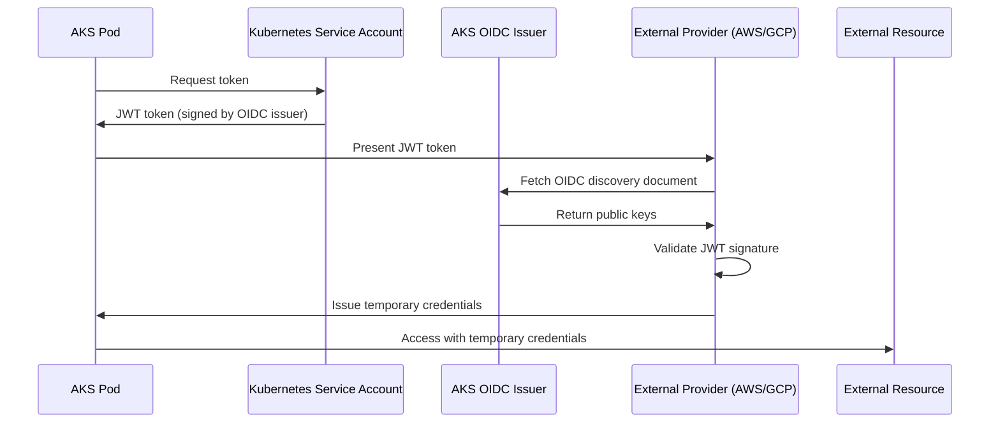

# How to Set Up AKS Workload Identity Federation with External OIDC Identity Providers

Author: [nawazdhandala](https://www.github.com/nawazdhandala)

Tags: AKS, Workload Identity, OIDC, Federation, Kubernetes, Azure, Security

Description: Learn how to configure AKS workload identity federation with external OIDC providers for secure cross-cloud and cross-cluster authentication.

---

Workload identity on AKS lets your pods authenticate to Azure services without storing credentials. But what if your pods also need to authenticate to services outside Azure - an AWS S3 bucket, a GCP BigQuery dataset, or another Kubernetes cluster's API server? This is where workload identity federation with external OIDC providers comes in.

Instead of creating and rotating service account keys, you establish a trust relationship between your AKS cluster's OIDC issuer and the external identity provider. Your pod presents its Kubernetes service account token, the external provider validates it against your cluster's OIDC issuer URL, and access is granted. No secrets are exchanged, stored, or rotated.

## How Workload Identity Federation Works

The core concept is straightforward. AKS clusters have a built-in OIDC issuer that produces signed JWT tokens for service accounts. When you enable workload identity, the cluster's OIDC issuer URL becomes a public endpoint that external systems can use to validate tokens.



The key insight is that no secrets cross boundaries. The external provider trusts the OIDC issuer, and the issuer cryptographically proves the pod's identity.

## Prerequisites

Enable OIDC issuer and workload identity on your AKS cluster.

```bash
# Enable OIDC issuer on an existing cluster
az aks update \
  --resource-group myRG \
  --name myAKS \
  --enable-oidc-issuer

# Enable workload identity
az aks update \
  --resource-group myRG \
  --name myAKS \
  --enable-workload-identity

# Get the OIDC issuer URL - you will need this for external federation
OIDC_ISSUER=$(az aks show \
  --resource-group myRG \
  --name myAKS \
  --query "oidcIssuerProfile.issuerUrl" -o tsv)

echo "OIDC Issuer: $OIDC_ISSUER"
```

The OIDC issuer URL looks something like `https://eastus.oic.prod-aks.azure.com/tenant-id/cluster-id/`. This URL serves the OIDC discovery document and public keys that external providers use to validate tokens.

## Federating with AWS (Cross-Cloud Access)

A common scenario is an AKS pod that needs to access AWS services - reading from S3, querying DynamoDB, or invoking Lambda functions. Instead of storing AWS access keys in a Kubernetes secret, you set up OIDC federation.

### Step 1: Create an OIDC Identity Provider in AWS

```bash
# In AWS, create an OIDC identity provider pointing to your AKS cluster
aws iam create-open-id-connect-provider \
  --url "$OIDC_ISSUER" \
  --client-id-list "sts.amazonaws.com" \
  --thumbprint-list "$(openssl s_client -connect $(echo $OIDC_ISSUER | sed 's|https://||' | sed 's|/.*||'):443 -servername $(echo $OIDC_ISSUER | sed 's|https://||' | sed 's|/.*||') 2>/dev/null | openssl x509 -fingerprint -noout | sed 's/://g' | cut -d= -f2 | tr '[:upper:]' '[:lower:]')"
```

### Step 2: Create an AWS IAM Role with Trust Policy

```json
{
  "Version": "2012-10-17",
  "Statement": [
    {
      "Effect": "Allow",
      "Principal": {
        "Federated": "arn:aws:iam::ACCOUNT_ID:oidc-provider/eastus.oic.prod-aks.azure.com/TENANT_ID/CLUSTER_ID"
      },
      "Action": "sts:AssumeRoleWithWebIdentity",
      "Condition": {
        "StringEquals": {
          "eastus.oic.prod-aks.azure.com/TENANT_ID/CLUSTER_ID:sub": "system:serviceaccount:default:my-app-sa",
          "eastus.oic.prod-aks.azure.com/TENANT_ID/CLUSTER_ID:aud": "sts.amazonaws.com"
        }
      }
    }
  ]
}
```

The condition restricts which Kubernetes service accounts can assume this role. Only the `my-app-sa` service account in the `default` namespace is allowed.

### Step 3: Configure the Kubernetes Service Account

```yaml
# service-account.yaml
# Kubernetes service account annotated for AWS federation
apiVersion: v1
kind: ServiceAccount
metadata:
  name: my-app-sa
  namespace: default
  annotations:
    # Tell the Azure workload identity webhook to project the token
    azure.workload.identity/client-id: "<azure-managed-identity-client-id>"
  labels:
    azure.workload.identity/use: "true"
```

### Step 4: Deploy the Pod with Token Projection

```yaml
# aws-federated-pod.yaml
# Pod that uses federated identity to access AWS
apiVersion: v1
kind: Pod
metadata:
  name: aws-access-pod
  namespace: default
spec:
  serviceAccountName: my-app-sa
  containers:
    - name: app
      image: myacr.azurecr.io/cross-cloud-app:v1
      env:
        # AWS SDK reads these environment variables
        - name: AWS_ROLE_ARN
          value: "arn:aws:iam::ACCOUNT_ID:role/aks-federated-role"
        - name: AWS_WEB_IDENTITY_TOKEN_FILE
          value: "/var/run/secrets/tokens/aws-token"
        - name: AWS_REGION
          value: "us-east-1"
      volumeMounts:
        - name: aws-token
          mountPath: /var/run/secrets/tokens
          readOnly: true
  volumes:
    # Project a service account token with the AWS audience
    - name: aws-token
      projected:
        sources:
          - serviceAccountToken:
              audience: "sts.amazonaws.com"
              expirationSeconds: 3600
              path: aws-token
```

The projected service account token has the audience set to `sts.amazonaws.com`, which is what AWS expects. The token is automatically rotated before expiration.

## Federating with GCP

The pattern for GCP is similar. You create a workload identity pool in GCP that trusts your AKS OIDC issuer.

```bash
# Create a workload identity pool in GCP
gcloud iam workload-identity-pools create aks-pool \
  --location="global" \
  --description="AKS Workload Identity Pool"

# Add the AKS OIDC provider
gcloud iam workload-identity-pools providers create-oidc aks-provider \
  --location="global" \
  --workload-identity-pool="aks-pool" \
  --issuer-uri="$OIDC_ISSUER" \
  --allowed-audiences="gcp" \
  --attribute-mapping="google.subject=assertion.sub,attribute.namespace=assertion['kubernetes.io'].namespace,attribute.service_account_name=assertion['kubernetes.io']['serviceaccount']['name']"

# Create a service account binding
gcloud iam service-accounts add-iam-policy-binding \
  my-gcp-sa@my-project.iam.gserviceaccount.com \
  --role="roles/iam.workloadIdentityUser" \
  --member="principalSet://iam.googleapis.com/projects/PROJECT_NUMBER/locations/global/workloadIdentityPools/aks-pool/attribute.service_account_name/my-app-sa"
```

## Federating Between AKS Clusters

You can also federate identities between two AKS clusters. This is useful for multi-cluster architectures where services in one cluster need to authenticate to services in another.

```bash
# On Cluster B, create a managed identity that trusts Cluster A's OIDC issuer
CLUSTER_A_OIDC=$(az aks show --resource-group rgA --name clusterA --query "oidcIssuerProfile.issuerUrl" -o tsv)

# Create a federated credential on the managed identity
az identity federated-credential create \
  --name "cluster-a-federation" \
  --identity-name "cross-cluster-identity" \
  --resource-group myRG \
  --issuer "$CLUSTER_A_OIDC" \
  --subject "system:serviceaccount:default:cross-cluster-sa" \
  --audience "api://AzureADTokenExchange"
```

Now a pod in Cluster A using the `cross-cluster-sa` service account can authenticate as the managed identity and access resources that Cluster B's identity has permissions for.

## Token Validation and Security

The projected tokens have several security properties.

- **Short-lived**: Tokens expire after the configured `expirationSeconds` (minimum 600 seconds, default 3600).
- **Audience-scoped**: Each token is scoped to a specific audience. A token for AWS cannot be used with GCP.
- **Automatically rotated**: Kubelet refreshes the token before it expires.
- **Bound to the pod**: The token is invalidated when the pod is deleted.

```bash
# Inspect the projected token to see its claims
kubectl exec aws-access-pod -- cat /var/run/secrets/tokens/aws-token | \
  cut -d. -f2 | base64 -d 2>/dev/null | jq .
```

The token includes the service account name, namespace, pod name, and the configured audience. The external provider validates all of these before granting access.

## Troubleshooting Federation Issues

### Token Validation Failures

If the external provider rejects the token, check the OIDC discovery endpoint.

```bash
# Verify the OIDC discovery document is accessible
curl -s "$OIDC_ISSUER/.well-known/openid-configuration" | jq .

# Verify the JWKS (public keys) endpoint
JWKS_URI=$(curl -s "$OIDC_ISSUER/.well-known/openid-configuration" | jq -r '.jwks_uri')
curl -s "$JWKS_URI" | jq .
```

### Subject Mismatch

The subject claim in the token must match exactly what you configured in the external provider's trust policy.

```bash
# The subject format for Kubernetes service accounts is:
# system:serviceaccount:<namespace>:<service-account-name>

# Verify the actual subject in the token
kubectl exec aws-access-pod -- cat /var/run/secrets/tokens/aws-token | \
  cut -d. -f2 | base64 -d 2>/dev/null | jq -r '.sub'
```

## Wrapping Up

Workload identity federation with external OIDC providers eliminates the need for long-lived credentials in cross-cloud and cross-cluster scenarios. Your AKS pods get short-lived, automatically rotated tokens that external providers validate cryptographically. No secrets to store, no keys to rotate, no credentials to leak. Set up the trust relationship once, and the authentication flows automatically from that point forward. Whether you are building a multi-cloud architecture or connecting multiple AKS clusters, OIDC federation is the secure and maintainable way to handle cross-boundary authentication.
