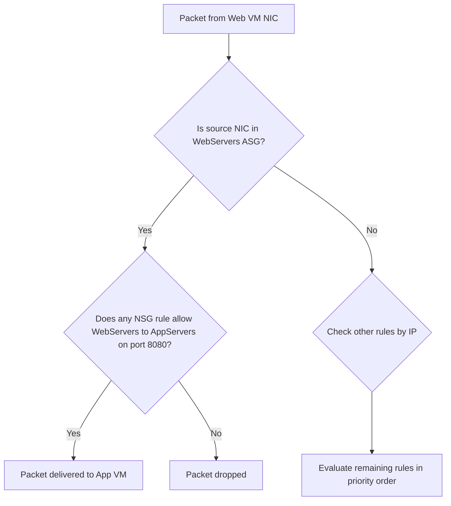

# How to Set Up Application Security Groups in Azure to Simplify NSG Rule Management

Author: [nawazdhandala](https://www.github.com/nawazdhandala)

Tags: Azure, Application Security Groups, NSG, Network Security, Cloud Networking, Azure Networking, Security

Description: Learn how to create and use Application Security Groups in Azure to organize VMs logically and simplify your Network Security Group rules.

---

If you have spent any time managing Network Security Groups in Azure, you know how quickly things get out of hand. A handful of VMs turns into dozens of IP-based rules, and before long nobody on the team can tell which rule does what. Application Security Groups (ASGs) fix this problem by letting you group virtual machines by workload and then reference those groups directly in NSG rules instead of hardcoding IP addresses.

In this guide, I will walk through the full setup - from creating ASGs and associating them with VM network interfaces to writing clean NSG rules that are easy to read and maintain.

## Why Application Security Groups Matter

Traditional NSG rules rely on source and destination IP addresses or CIDR ranges. This works for small deployments, but it creates a few headaches at scale:

- When you add a new VM to a tier, you have to update every NSG rule that references that tier's IP range.
- IP-based rules do not convey intent. Seeing `10.0.1.4` in a rule tells you nothing about whether that machine is a web server or a database.
- Overlapping CIDR blocks lead to ambiguous rules that are hard to audit.

ASGs solve all of this. You create a logical group called something like `WebServers` or `DatabaseServers`, attach VM NICs to that group, and then write NSG rules that say "allow traffic from WebServers to DatabaseServers on port 1433." If you add a new database VM next month, you just add its NIC to the `DatabaseServers` ASG and the existing rules apply automatically.

## Prerequisites

Before starting, make sure you have:

- An active Azure subscription
- The Azure CLI installed (version 2.40 or later) or access to the Azure Portal
- At least one virtual network with subnets and a couple of VMs deployed
- Contributor or Network Contributor role on the resource group

## Step 1: Create the Application Security Groups

You will typically create one ASG per application tier. For a standard three-tier application, that means web, app, and database groups.

The following CLI commands create three ASGs in the same region and resource group as your VMs.

```bash
# Create an ASG for the web tier
az network asg create \
  --resource-group myResourceGroup \
  --name WebServers \
  --location eastus

# Create an ASG for the application tier
az network asg create \
  --resource-group myResourceGroup \
  --name AppServers \
  --location eastus

# Create an ASG for the database tier
az network asg create \
  --resource-group myResourceGroup \
  --name DatabaseServers \
  --location eastus
```

Each ASG is just a metadata container at this point. It does not do anything until you associate NICs with it and reference it in NSG rules.

## Step 2: Associate VM Network Interfaces with ASGs

Every VM in Azure has at least one network interface (NIC). You link a NIC to one or more ASGs by updating the NIC's IP configuration.

Here is how to add a web server VM's NIC to the `WebServers` ASG.

```bash
# Associate the NIC of web-vm-1 with the WebServers ASG
az network nic ip-config update \
  --resource-group myResourceGroup \
  --nic-name web-vm-1-nic \
  --name ipconfig1 \
  --application-security-groups WebServers
```

Repeat this for each VM in the tier. For the database tier, swap in the appropriate NIC name and ASG.

```bash
# Associate the NIC of db-vm-1 with the DatabaseServers ASG
az network nic ip-config update \
  --resource-group myResourceGroup \
  --nic-name db-vm-1-nic \
  --name ipconfig1 \
  --application-security-groups DatabaseServers
```

One NIC can belong to multiple ASGs, which is useful when a VM serves more than one role. However, all ASGs associated with a single NIC must be in the same virtual network.

## Step 3: Create NSG Rules Using ASGs

Now comes the payoff. Instead of writing rules with IP addresses, you reference the ASG names. This makes the rules self-documenting.

The following commands create an NSG and add rules that control traffic between the tiers.

```bash
# Create the NSG
az network nsg create \
  --resource-group myResourceGroup \
  --name three-tier-nsg \
  --location eastus

# Allow HTTPS traffic from the internet to web servers
az network nsg rule create \
  --resource-group myResourceGroup \
  --nsg-name three-tier-nsg \
  --name AllowHTTPSToWeb \
  --priority 100 \
  --direction Inbound \
  --access Allow \
  --protocol Tcp \
  --source-address-prefixes Internet \
  --destination-asgs WebServers \
  --destination-port-ranges 443

# Allow traffic from web servers to app servers on port 8080
az network nsg rule create \
  --resource-group myResourceGroup \
  --nsg-name three-tier-nsg \
  --name AllowWebToApp \
  --priority 200 \
  --direction Inbound \
  --access Allow \
  --protocol Tcp \
  --source-asgs WebServers \
  --destination-asgs AppServers \
  --destination-port-ranges 8080

# Allow traffic from app servers to database servers on port 1433
az network nsg rule create \
  --resource-group myResourceGroup \
  --nsg-name three-tier-nsg \
  --name AllowAppToDb \
  --priority 300 \
  --direction Inbound \
  --access Allow \
  --protocol Tcp \
  --source-asgs AppServers \
  --destination-asgs DatabaseServers \
  --destination-port-ranges 1433

# Deny all other inbound traffic (lower priority catch-all)
az network nsg rule create \
  --resource-group myResourceGroup \
  --nsg-name three-tier-nsg \
  --name DenyAllInbound \
  --priority 4000 \
  --direction Inbound \
  --access Deny \
  --protocol '*' \
  --source-address-prefixes '*' \
  --destination-address-prefixes '*' \
  --destination-port-ranges '*'
```

Notice how readable those rules are. Anyone looking at `AllowWebToApp` immediately understands the intent without needing to decode IP ranges.

## Step 4: Associate the NSG with Subnets

The NSG needs to be attached to the subnets where your VMs live for the rules to take effect.

```bash
# Attach the NSG to the web subnet
az network vnet subnet update \
  --resource-group myResourceGroup \
  --vnet-name myVNet \
  --name WebSubnet \
  --network-security-group three-tier-nsg

# Attach the NSG to the app subnet
az network vnet subnet update \
  --resource-group myResourceGroup \
  --vnet-name myVNet \
  --name AppSubnet \
  --network-security-group three-tier-nsg

# Attach the NSG to the database subnet
az network vnet subnet update \
  --resource-group myResourceGroup \
  --vnet-name myVNet \
  --name DbSubnet \
  --network-security-group three-tier-nsg
```

You can also attach NSGs at the NIC level, but subnet-level association is generally easier to manage because it applies to every VM in the subnet without extra per-NIC configuration.

## How Traffic Evaluation Works

When a packet arrives at a VM's NIC, Azure evaluates NSG rules in priority order (lowest number first). For rules that reference ASGs, Azure checks whether the source or destination NIC belongs to the specified ASG. If the NIC is a member, the rule matches.

Here is a simplified flow of how Azure processes a request from a web server to an app server:



This evaluation happens at wire speed inside the Azure networking stack, so there is no performance penalty for using ASGs compared to IP-based rules.

## Limitations to Keep in Mind

ASGs are powerful, but they have a few constraints you should know about:

- All VMs in an ASG must be in the same virtual network. You cannot span ASGs across VNets.
- You cannot mix ASGs and IP addresses in the same source or destination field of a single rule. You need separate rules for that.
- There is a limit of around 3,000 ASGs per subscription, which is generous but worth noting for very large environments.
- ASGs only work with NICs that have a single IP configuration or where all IP configurations are in the same ASG set.

## Managing ASGs with Terraform

If you use Infrastructure as Code, Terraform has first-class support for ASGs. Here is a quick example.

```hcl
# Define the ASG resource
resource "azurerm_application_security_group" "web" {
  name                = "WebServers"
  location            = azurerm_resource_group.main.location
  resource_group_name = azurerm_resource_group.main.name
}

# Reference the ASG in an NSG rule
resource "azurerm_network_security_rule" "allow_https_to_web" {
  name                        = "AllowHTTPSToWeb"
  priority                    = 100
  direction                   = "Inbound"
  access                      = "Allow"
  protocol                    = "Tcp"
  source_port_range           = "*"
  destination_port_ranges     = ["443"]
  source_address_prefix       = "Internet"
  # Associate the rule with the ASG
  destination_application_security_group_ids = [
    azurerm_application_security_group.web.id
  ]
  resource_group_name         = azurerm_resource_group.main.name
  network_security_group_name = azurerm_network_security_group.main.name
}
```

## Best Practices

After working with ASGs across several production environments, here are some patterns that have served me well:

1. Name ASGs after the application role, not the technology. Use `OrderProcessing` instead of `SqlServer` because the role is more stable than the tech stack.
2. Document ASG membership alongside your infrastructure code. If someone deploys a new VM manually without adding it to the right ASG, the traffic rules will not apply.
3. Combine ASGs with Azure Policy to enforce that every NIC in a given subnet must belong to at least one ASG. This prevents accidental gaps in your security posture.
4. Use separate NSGs per subnet rather than one giant NSG for the entire VNet. This keeps rules scoped and easier to audit.
5. Review ASG membership periodically. Decommissioned VMs sometimes leave stale NIC associations that clutter your configuration.

## Wrapping Up

Application Security Groups are one of those Azure features that do not get enough attention. They turn messy, IP-heavy NSG configurations into clean, intent-driven rules that anyone on the team can understand. The setup takes a few minutes per tier, and the ongoing maintenance savings are substantial - especially as your environment grows.

Start by identifying your application tiers, create an ASG for each one, associate your VM NICs, and rewrite your NSG rules to reference the groups. Once you see how much cleaner everything looks, you will wonder why you ever managed NSGs with raw IP addresses.
