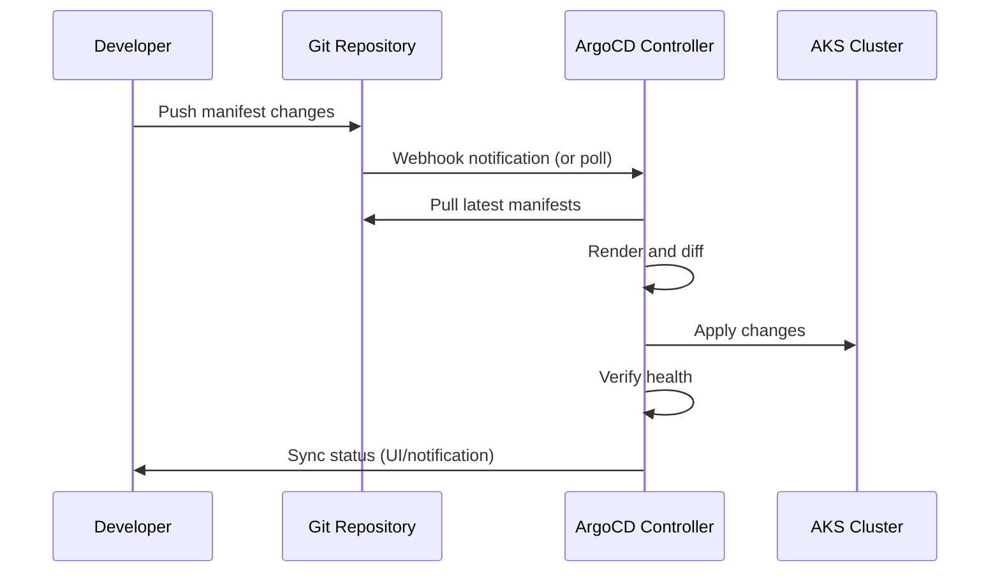

# How to Set Up ArgoCD on AKS for Declarative GitOps Continuous Delivery

Author: [nawazdhandala](https://www.github.com/nawazdhandala)

Tags: AKS, ArgoCD, GitOps, Continuous Delivery, Kubernetes, DevOps, Azure

Description: Step-by-step guide to installing ArgoCD on AKS and setting up declarative GitOps workflows for automated Kubernetes deployments.

---

GitOps flips the traditional deployment model on its head. Instead of pushing changes to your cluster from a CI pipeline, you declare your desired state in Git and let a controller pull those changes into the cluster. ArgoCD is the most popular GitOps controller for Kubernetes, and it works exceptionally well on AKS. In this guide, I will walk through installing ArgoCD on AKS, connecting it to a Git repository, and setting up automated sync so that every merge to your main branch automatically deploys to your cluster.

## Why GitOps with ArgoCD

Traditional CI/CD pipelines push changes to the cluster using kubectl or Helm from within the pipeline. This creates several problems: the pipeline needs cluster credentials, there is no single source of truth for what is deployed, and drift between the desired state and actual state goes undetected.

With ArgoCD, Git is the single source of truth. ArgoCD continuously watches your Git repository and compares it to what is running in the cluster. If they differ, ArgoCD either alerts you or automatically reconciles the difference. You get an audit trail (Git history), easy rollbacks (git revert), and no need to share cluster credentials with CI systems.

## Prerequisites

You need an AKS cluster, kubectl configured, Helm 3, and a Git repository containing your Kubernetes manifests. The repository can be on GitHub, Azure DevOps, GitLab, or any Git hosting service.

## Step 1: Install ArgoCD

Install ArgoCD using the official manifests or Helm. I will use the Helm approach since it gives more configuration control.

```bash
# Add the ArgoCD Helm repository
helm repo add argo https://argoproj.github.io/argo-helm
helm repo update

# Create the namespace
kubectl create namespace argocd

# Install ArgoCD with HA configuration
helm install argocd argo/argo-cd \
  --namespace argocd \
  --set server.service.type=LoadBalancer \
  --set configs.params."server\.insecure"=true \
  --set controller.replicas=2 \
  --set server.replicas=2 \
  --set repoServer.replicas=2
```

For production, you would put ArgoCD behind an ingress with TLS instead of exposing it directly with a LoadBalancer. But for getting started, the LoadBalancer approach works.

Wait for all pods to be ready.

```bash
# Check ArgoCD pod status
kubectl get pods -n argocd

# Get the initial admin password
kubectl get secret argocd-initial-admin-secret -n argocd \
  -o jsonpath='{.data.password}' | base64 -d
```

## Step 2: Access the ArgoCD UI

Get the external IP of the ArgoCD server and log in.

```bash
# Get the ArgoCD server external IP
kubectl get svc argocd-argo-cd-server -n argocd -o jsonpath='{.status.loadBalancer.ingress[0].ip}'
```

Open the IP in your browser and log in with username `admin` and the password from the previous step. Change the admin password immediately.

You can also use the ArgoCD CLI.

```bash
# Install the ArgoCD CLI
brew install argocd  # macOS
# or download from https://github.com/argoproj/argo-cd/releases

# Log in to ArgoCD
argocd login <argocd-server-ip> --username admin --password <password> --insecure
```

## Step 3: Connect Your Git Repository

Register your Git repository with ArgoCD. If it is a private repository, you will need to provide credentials.

```bash
# For a public repository
argocd repo add https://github.com/myorg/k8s-manifests.git

# For a private GitHub repository using a personal access token
argocd repo add https://github.com/myorg/k8s-manifests.git \
  --username git \
  --password <github-pat>

# For Azure DevOps
argocd repo add https://dev.azure.com/myorg/myproject/_git/k8s-manifests \
  --username git \
  --password <azure-devops-pat>
```

Alternatively, create the repository connection as a Kubernetes secret.

```yaml
# repo-secret.yaml
# Git repository credentials for ArgoCD
apiVersion: v1
kind: Secret
metadata:
  name: private-repo
  namespace: argocd
  labels:
    argocd.argoproj.io/secret-type: repository
stringData:
  type: git
  url: https://github.com/myorg/k8s-manifests.git
  username: git
  password: <github-pat>
```

## Step 4: Create an Application

An ArgoCD Application defines the relationship between a Git path and a Kubernetes namespace.

```yaml
# application.yaml
# ArgoCD Application that syncs from Git to the cluster
apiVersion: argoproj.io/v1alpha1
kind: Application
metadata:
  name: web-app
  namespace: argocd
spec:
  project: default
  source:
    # Git repository URL
    repoURL: https://github.com/myorg/k8s-manifests.git
    # Branch to track
    targetRevision: main
    # Path within the repo containing manifests
    path: apps/web-app/overlays/production
  destination:
    # Deploy to this cluster (in-cluster)
    server: https://kubernetes.default.svc
    # Target namespace
    namespace: production
  syncPolicy:
    # Automatically sync when Git changes
    automated:
      # Automatically create the namespace if it does not exist
      selfHeal: true
      # Prune resources that are no longer in Git
      prune: true
    syncOptions:
      - CreateNamespace=true
    retry:
      limit: 5
      backoff:
        duration: 5s
        factor: 2
        maxDuration: 3m
```

Apply the application.

```bash
kubectl apply -f application.yaml
```

## Step 5: Understand the Sync Process

Once the application is created, ArgoCD will:

1. Clone the Git repository
2. Render the manifests (plain YAML, Kustomize, or Helm)
3. Compare the rendered manifests to what is in the cluster
4. If they differ and auto-sync is enabled, apply the changes

The sync process repeats every 3 minutes by default (configurable). You can also trigger a manual sync.

```bash
# Manually sync an application
argocd app sync web-app

# Check the sync status
argocd app get web-app

# View the sync history
argocd app history web-app
```

## GitOps Deployment Flow

Here is the full GitOps deployment flow with ArgoCD.



## Step 6: Set Up Webhook for Instant Sync

By default, ArgoCD polls the Git repository every 3 minutes. For faster deployments, configure a webhook.

For GitHub, add a webhook in your repository settings pointing to:

```
https://<argocd-server>/api/webhook
```

Set the content type to `application/json` and select "Just the push event".

## Step 7: Configure Multiple Environments

A common pattern is to have different directories or branches for each environment.

```yaml
# dev-application.yaml
# Dev environment - tracks the develop branch
apiVersion: argoproj.io/v1alpha1
kind: Application
metadata:
  name: web-app-dev
  namespace: argocd
spec:
  project: default
  source:
    repoURL: https://github.com/myorg/k8s-manifests.git
    targetRevision: develop
    path: apps/web-app/overlays/dev
  destination:
    server: https://kubernetes.default.svc
    namespace: dev
  syncPolicy:
    automated:
      selfHeal: true
      prune: true
---
# production-application.yaml
# Production - tracks main branch, manual sync required
apiVersion: argoproj.io/v1alpha1
kind: Application
metadata:
  name: web-app-prod
  namespace: argocd
spec:
  project: default
  source:
    repoURL: https://github.com/myorg/k8s-manifests.git
    targetRevision: main
    path: apps/web-app/overlays/production
  destination:
    server: https://kubernetes.default.svc
    namespace: production
  syncPolicy:
    # No automated sync for production - require manual approval
    syncOptions:
      - CreateNamespace=true
```

Notice that the production application does not have `automated` sync. Changes still show up in the ArgoCD UI as "OutOfSync", but an operator must manually trigger the sync.

## Step 8: Set Up Notifications

Configure ArgoCD to send notifications on sync success, failure, or health degradation.

```bash
# Install the ArgoCD notifications controller
helm upgrade argocd argo/argo-cd \
  --namespace argocd \
  --reuse-values \
  --set notifications.enabled=true
```

Create a notification configuration for Slack.

```yaml
# notifications-configmap.yaml
# ArgoCD notification templates and triggers
apiVersion: v1
kind: ConfigMap
metadata:
  name: argocd-notifications-cm
  namespace: argocd
data:
  service.slack: |
    token: $slack-token
  template.app-sync-status: |
    message: |
      Application {{.app.metadata.name}} sync is {{.app.status.sync.status}}.
      Revision: {{.app.status.sync.revision}}
  trigger.on-sync-succeeded: |
    - when: app.status.sync.status == 'Synced'
      send: [app-sync-status]
  trigger.on-sync-failed: |
    - when: app.status.sync.status == 'OutOfSync'
      send: [app-sync-status]
```

## Step 9: Rollback

One of the biggest advantages of GitOps is easy rollbacks. You have two options:

```bash
# Option 1: Rollback in ArgoCD to a previous sync
argocd app rollback web-app <history-id>

# Option 2: Git revert (preferred - keeps Git as source of truth)
git revert HEAD
git push origin main
# ArgoCD will automatically sync the reverted state
```

The Git revert approach is preferred because it keeps Git as the single source of truth. The ArgoCD rollback works but creates drift between Git and the cluster until you also update Git.

## Security Best Practices

**Use RBAC to control who can sync.** ArgoCD has a built-in RBAC system. Restrict who can trigger syncs on production applications.

**Enable SSO.** Integrate ArgoCD with your identity provider (Azure AD, GitHub OAuth, etc.) instead of using the built-in admin account.

**Use sealed secrets or external secret operators.** Never store plain secrets in Git. Use tools like Sealed Secrets, External Secrets Operator, or Azure Key Vault CSI driver.

**Restrict repository access.** Use read-only tokens for ArgoCD's Git access. ArgoCD never needs to write to your repository.

ArgoCD on AKS transforms your deployment process from ad-hoc pipeline runs into a controlled, auditable, and reversible workflow. The initial setup takes about an hour, and the operational benefits compound every day as your team gets used to deploying through Git instead of running pipeline commands.
