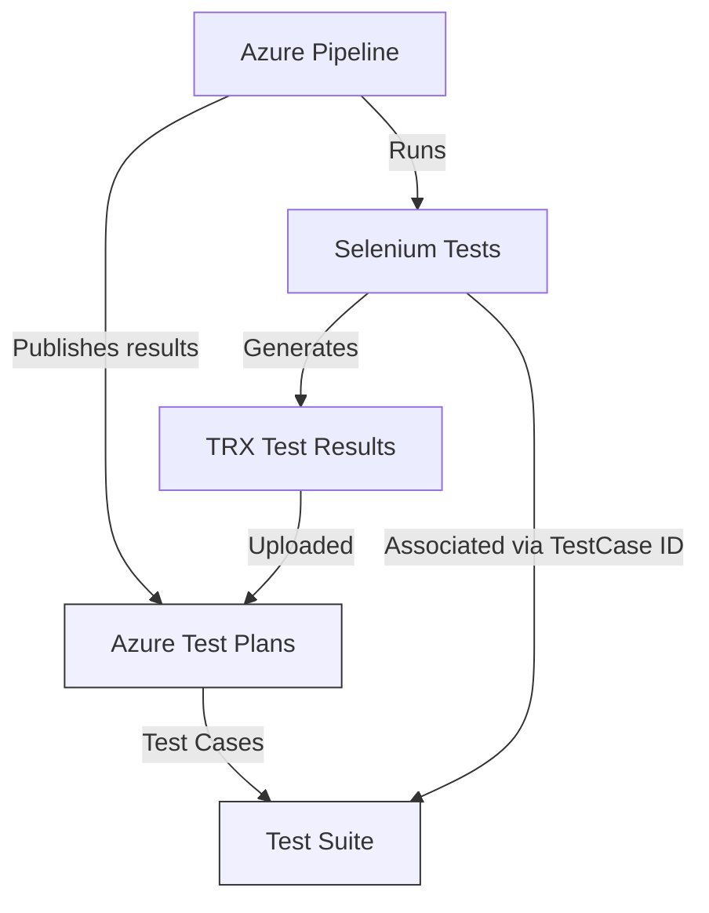

# How to Set Up Automated Test Execution in Azure Test Plans with Selenium and Azure Pipelines

Author: [nawazdhandala](https://www.github.com/nawazdhandala)

Tags: Azure Test Plans, Selenium, Automated Testing, Azure Pipelines, CI/CD, QA, Test Automation

Description: Connect Selenium automated tests to Azure Test Plans test cases and execute them through Azure Pipelines for integrated test reporting and tracking.

---

Azure Test Plans is the test management component of Azure DevOps. It is where QA teams organize test cases, plan test runs, and track test results. Selenium is one of the most popular browser automation frameworks. Most teams use both, but they often treat them as completely separate systems - test cases live in Azure Test Plans while Selenium tests run in pipelines with no connection between them.

Linking your Selenium tests to Azure Test Plans test cases gives you the best of both worlds: automated execution with centralized tracking. When a test passes or fails, the result is recorded against the corresponding test case in Azure Test Plans, giving QA teams visibility without having to dig through pipeline logs.

## The Architecture

Here is how the pieces fit together:



The connection works through test case IDs. Each Selenium test method is annotated with the ID of its corresponding Azure Test Plans test case. When the test runs, the results are published to Azure Test Plans, matching on those IDs.

## Step 1: Create Test Cases in Azure Test Plans

First, create your test cases in Azure Test Plans. Go to Test Plans in your Azure DevOps project, create a test plan, add test suites, and then add test cases.

Each test case gets a unique ID (shown in the work item). You will need these IDs to link your Selenium tests.

For example:
- Test Case #5001: Verify user can log in with valid credentials
- Test Case #5002: Verify error message on invalid login
- Test Case #5003: Verify user can reset password

## Step 2: Write Selenium Tests with Test Case Associations

The key is associating each test method with an Azure Test Plans test case ID. How you do this depends on your test framework.

### Using NUnit (.NET)

```csharp
// LoginTests.cs - Selenium tests associated with Azure Test Plans test cases
using NUnit.Framework;
using OpenQA.Selenium;
using OpenQA.Selenium.Chrome;

namespace MyApp.Tests.UI
{
    [TestFixture]
    public class LoginTests
    {
        private IWebDriver driver;

        [SetUp]
        public void Setup()
        {
            // Initialize Chrome with headless options for CI
            var options = new ChromeOptions();
            options.AddArgument("--headless");
            options.AddArgument("--no-sandbox");
            options.AddArgument("--disable-dev-shm-usage");
            driver = new ChromeDriver(options);
            driver.Manage().Timeouts().ImplicitWait = TimeSpan.FromSeconds(10);
        }

        // Associate this test with Azure Test Plans test case #5001
        [Test]
        [Property("TestCaseId", "5001")]
        public void UserCanLoginWithValidCredentials()
        {
            driver.Navigate().GoToUrl("https://myapp.example.com/login");

            // Find and fill the email field
            var emailField = driver.FindElement(By.Id("email"));
            emailField.SendKeys("testuser@example.com");

            // Find and fill the password field
            var passwordField = driver.FindElement(By.Id("password"));
            passwordField.SendKeys("TestPassword123!");

            // Click the login button
            var loginButton = driver.FindElement(By.Id("login-button"));
            loginButton.Click();

            // Verify redirect to dashboard
            Assert.That(driver.Url, Does.Contain("/dashboard"));
            Assert.That(driver.FindElement(By.Id("welcome-message")).Text,
                Does.Contain("Welcome"));
        }

        // Associate with test case #5002
        [Test]
        [Property("TestCaseId", "5002")]
        public void ErrorMessageDisplayedOnInvalidLogin()
        {
            driver.Navigate().GoToUrl("https://myapp.example.com/login");

            var emailField = driver.FindElement(By.Id("email"));
            emailField.SendKeys("invalid@example.com");

            var passwordField = driver.FindElement(By.Id("password"));
            passwordField.SendKeys("wrongpassword");

            var loginButton = driver.FindElement(By.Id("login-button"));
            loginButton.Click();

            // Verify error message appears
            var errorMessage = driver.FindElement(By.CssSelector(".error-message"));
            Assert.That(errorMessage.Text, Does.Contain("Invalid credentials"));
            Assert.That(driver.Url, Does.Contain("/login"));
        }

        // Associate with test case #5003
        [Test]
        [Property("TestCaseId", "5003")]
        public void UserCanResetPassword()
        {
            driver.Navigate().GoToUrl("https://myapp.example.com/login");

            // Click forgot password link
            var forgotLink = driver.FindElement(By.LinkText("Forgot password?"));
            forgotLink.Click();

            // Enter email for reset
            var emailField = driver.FindElement(By.Id("reset-email"));
            emailField.SendKeys("testuser@example.com");

            var resetButton = driver.FindElement(By.Id("reset-button"));
            resetButton.Click();

            // Verify confirmation message
            var confirmation = driver.FindElement(By.CssSelector(".success-message"));
            Assert.That(confirmation.Text, Does.Contain("reset link has been sent"));
        }

        [TearDown]
        public void Teardown()
        {
            driver.Quit();
            driver.Dispose();
        }
    }
}
```

### Using MSTest (.NET)

MSTest has built-in support for test case association through the `TestProperty` attribute:

```csharp
// LoginTests.cs - MSTest version with test case associations
using Microsoft.VisualStudio.TestTools.UnitTesting;
using OpenQA.Selenium;
using OpenQA.Selenium.Chrome;

namespace MyApp.Tests.UI
{
    [TestClass]
    public class LoginTests
    {
        private IWebDriver driver;

        [TestInitialize]
        public void Setup()
        {
            var options = new ChromeOptions();
            options.AddArgument("--headless");
            driver = new ChromeDriver(options);
        }

        // MSTest uses TestProperty to link to Azure Test Plans
        [TestMethod]
        [TestProperty("TestCaseId", "5001")]
        public void UserCanLoginWithValidCredentials()
        {
            driver.Navigate().GoToUrl("https://myapp.example.com/login");
            driver.FindElement(By.Id("email")).SendKeys("testuser@example.com");
            driver.FindElement(By.Id("password")).SendKeys("TestPassword123!");
            driver.FindElement(By.Id("login-button")).Click();

            Assert.IsTrue(driver.Url.Contains("/dashboard"),
                "User should be redirected to dashboard after login");
        }

        [TestCleanup]
        public void Teardown()
        {
            driver.Quit();
        }
    }
}
```

## Step 3: Configure the Azure Pipeline

Here is a pipeline that runs the Selenium tests and publishes results to Azure Test Plans:

```yaml
# azure-pipelines-e2e.yml - Run Selenium tests and publish to Azure Test Plans
trigger:
  - main

pool:
  vmImage: 'ubuntu-latest'

variables:
  testPlanId: 42        # Your test plan ID
  testSuiteId: 100      # Your test suite ID
  testConfigId: 1       # Your test configuration ID

steps:
  # Install Chrome for Selenium
  - script: |
      wget -q -O - https://dl.google.com/linux/linux_signing_key.pub | sudo apt-key add -
      echo "deb [arch=amd64] http://dl.google.com/linux/chrome/deb/ stable main" | sudo tee /etc/apt/sources.list.d/google-chrome.list
      sudo apt-get update
      sudo apt-get install -y google-chrome-stable
    displayName: 'Install Chrome'

  # Restore and build the test project
  - task: DotNetCoreCLI@2
    inputs:
      command: 'restore'
      projects: 'tests/**/*.csproj'
    displayName: 'Restore test project'

  - task: DotNetCoreCLI@2
    inputs:
      command: 'build'
      projects: 'tests/**/*.csproj'
      arguments: '--configuration Release'
    displayName: 'Build test project'

  # Run the tests and generate results
  - task: DotNetCoreCLI@2
    inputs:
      command: 'test'
      projects: 'tests/**/*.csproj'
      arguments: '--configuration Release --logger trx --results-directory $(Agent.TempDirectory)/TestResults'
    displayName: 'Run Selenium tests'
    continueOnError: true  # Continue even if tests fail so we can publish results

  # Publish test results to Azure Test Plans
  - task: PublishTestResults@2
    inputs:
      testResultsFormat: 'VSTest'
      testResultsFiles: '**/*.trx'
      searchFolder: '$(Agent.TempDirectory)/TestResults'
      testRunTitle: 'Selenium E2E Tests - $(Build.BuildNumber)'
    displayName: 'Publish test results'
```

## Step 4: Link Automated Tests to Test Cases

After running the pipeline at least once, you need to associate the automated test methods with the test cases in Azure Test Plans.

Go to Azure Test Plans, open a test case, click the "Associated Automation" tab, and link it to the corresponding test method. The test method name should match what appeared in the published test results.

You can also do this programmatically using the Azure DevOps REST API:

```bash
# Associate a test method with a test case using the REST API
curl -u :$PAT \
  -X PATCH \
  -H "Content-Type: application/json-patch+json" \
  "https://dev.azure.com/{org}/{project}/_apis/wit/workitems/5001?api-version=7.0" \
  -d '[
    {
      "op": "add",
      "path": "/fields/Microsoft.VSTS.TCM.AutomatedTestName",
      "value": "MyApp.Tests.UI.LoginTests.UserCanLoginWithValidCredentials"
    },
    {
      "op": "add",
      "path": "/fields/Microsoft.VSTS.TCM.AutomatedTestStorage",
      "value": "MyApp.Tests.UI.dll"
    }
  ]'
```

## Step 5: Run Automated Tests from Test Plans

Once tests are associated, you can trigger them directly from Azure Test Plans. Go to your test plan, select the test suite, and click "Run." Choose "Run with options" and select "Automated tests."

Azure Test Plans will create a pipeline run that executes the associated automated tests and reports the results back to the test plan.

## Handling Test Environment Configuration

Your Selenium tests need to know which URL to test against. Use pipeline variables or a configuration file:

```csharp
// TestConfiguration.cs - read the target URL from environment variables
public static class TestConfiguration
{
    // Read from environment variable, fall back to localhost for local dev
    public static string BaseUrl =>
        Environment.GetEnvironmentVariable("TEST_BASE_URL")
        ?? "https://localhost:5001";

    public static int ImplicitWaitSeconds =>
        int.Parse(Environment.GetEnvironmentVariable("TEST_WAIT_SECONDS") ?? "10");
}
```

In your pipeline, set the variable:

```yaml
variables:
  TEST_BASE_URL: 'https://myapp-staging.azurewebsites.net'

steps:
  - task: DotNetCoreCLI@2
    inputs:
      command: 'test'
      projects: 'tests/**/*.csproj'
    env:
      TEST_BASE_URL: $(TEST_BASE_URL)
    displayName: 'Run Selenium tests'
```

## Generating Screenshots on Failure

Capturing screenshots when tests fail makes debugging much easier:

```csharp
// Capture a screenshot when a test fails
[TearDown]
public void Teardown()
{
    if (TestContext.CurrentContext.Result.Outcome.Status == TestStatus.Failed)
    {
        var screenshot = ((ITakesScreenshot)driver).GetScreenshot();
        var fileName = $"{TestContext.CurrentContext.Test.Name}_{DateTime.Now:yyyyMMdd_HHmmss}.png";
        var path = Path.Combine(TestContext.CurrentContext.WorkDirectory, fileName);
        screenshot.SaveAsFile(path);

        // Attach to test results so it shows up in Azure DevOps
        TestContext.AddTestAttachment(path, "Screenshot on failure");
    }

    driver.Quit();
}
```

## Wrapping Up

Connecting Selenium tests to Azure Test Plans creates a feedback loop between your automated tests and your test management process. QA teams get real-time test results in the tool they use for planning, and developers get test infrastructure that runs automatically in the pipeline. The setup requires some initial configuration - associating test methods with test cases and configuring the pipeline - but once it is in place, test results flow automatically from every pipeline run into Azure Test Plans, keeping everyone on the same page about the state of the application.
