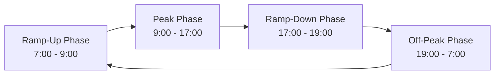

# How to Set Up Autoscaling for Azure Virtual Desktop Session Hosts Based on User Demand

Author: [nawazdhandala](https://www.github.com/nawazdhandala)

Tags: Azure, Virtual Desktop, Autoscaling, Cost Optimization, Session Hosts, Scaling Plan, VDI

Description: Configure autoscaling for Azure Virtual Desktop session hosts to automatically adjust capacity based on user demand and reduce costs during off-peak hours.

---

Running a fixed number of Azure Virtual Desktop session hosts 24/7 is wasteful. Most organizations have predictable usage patterns - heavy usage during business hours, minimal usage at night and on weekends. Autoscaling adjusts the number of running session hosts based on actual demand, starting VMs as users arrive in the morning and shutting them down as people leave for the day. This can cut AVD compute costs by 40-60% without affecting user experience.

Azure Virtual Desktop has a built-in scaling plan feature that handles this automatically. This guide covers configuring it from scratch.

## How AVD Autoscaling Works

The autoscaling feature monitors the percentage of available sessions across your host pool. It uses configurable thresholds to decide when to turn on additional VMs (ramp up) and when to shut down idle VMs (ramp down).

You define schedules with different capacity targets for different times of day:



During each phase, you set:

- **Minimum percentage of hosts**: The floor - how many VMs should always be running.
- **Capacity threshold**: The percentage of used sessions that triggers scaling.
- **Load balancing algorithm**: How users are distributed to VMs.

## Prerequisites

- An Azure Virtual Desktop host pool (pooled type - autoscaling works with pooled host pools).
- Session hosts deployed in the host pool.
- The `Microsoft.DesktopVirtualization` resource provider registered.
- At minimum, `Desktop Virtualization Power On Off Contributor` role assigned to the Windows Virtual Desktop service principal on the session host VMs.

## Step 1: Assign Required Permissions

The AVD autoscaling service needs permission to start and stop your session host VMs. Assign the power management role to the AVD service principal.

```bash
# Get the Azure Virtual Desktop service principal object ID
# The app ID for AVD is: 9cdead84-a844-4324-93f2-b2e6bb768d07
AVD_SP_ID=$(az ad sp show --id "9cdead84-a844-4324-93f2-b2e6bb768d07" --query "id" --output tsv)

# Get the subscription ID
SUB_ID=$(az account show --query "id" --output tsv)

# Assign the power on/off contributor role at the subscription level
# You can also scope this to a specific resource group for tighter security
az role assignment create \
  --assignee-object-id "$AVD_SP_ID" \
  --assignee-principal-type ServicePrincipal \
  --role "Desktop Virtualization Power On Off Contributor" \
  --scope "/subscriptions/$SUB_ID"
```

If you want to scope the role more tightly (recommended for production), assign it at the resource group level.

```bash
# Assign only to the resource group containing session host VMs
az role assignment create \
  --assignee-object-id "$AVD_SP_ID" \
  --assignee-principal-type ServicePrincipal \
  --role "Desktop Virtualization Power On Off Contributor" \
  --scope "/subscriptions/$SUB_ID/resourceGroups/myResourceGroup"
```

## Step 2: Create a Scaling Plan

A scaling plan defines the schedule and thresholds for autoscaling. Create one through the Azure portal or CLI.

### Through the Portal

1. Navigate to Azure Virtual Desktop > Scaling plans.
2. Click "Create."
3. Fill in the basics:
   - **Name**: avd-scaling-plan
   - **Location**: Same region as your host pool
   - **Time zone**: Your business time zone (e.g., Eastern Standard Time)
   - **Exclusion tags**: Optional - tag VMs you want to exclude from scaling

### Through Azure CLI

```bash
# Create a scaling plan
az desktopvirtualization scaling-plan create \
  --resource-group myResourceGroup \
  --name avd-scaling-plan \
  --location eastus \
  --time-zone "Eastern Standard Time" \
  --host-pool-type Pooled
```

## Step 3: Configure the Schedule

The schedule defines how scaling behaves throughout the day. Here is a typical business-hours configuration.

### Ramp-Up Phase (7:00 AM - 9:00 AM)

During ramp-up, you gradually increase capacity before peak hours start.

- **Start time**: 07:00
- **Load balancing algorithm**: Breadth-first (spread users to warm up multiple VMs)
- **Minimum percentage of hosts**: 25% (start 25% of VMs before anyone logs in)
- **Capacity threshold**: 60% (start more VMs when 60% of sessions are used)

### Peak Phase (9:00 AM - 5:00 PM)

During peak hours, keep enough capacity for all users with headroom for spikes.

- **Start time**: 09:00
- **Load balancing algorithm**: Depth-first (fill VMs before starting new ones, for efficiency)
- **Minimum percentage of hosts**: 75%
- **Capacity threshold**: 80%

### Ramp-Down Phase (5:00 PM - 7:00 PM)

As users leave, gradually reduce capacity.

- **Start time**: 17:00
- **Load balancing algorithm**: Depth-first (consolidate users onto fewer VMs)
- **Minimum percentage of hosts**: 25%
- **Capacity threshold**: 90%
- **Force logoff**: Yes, after 15 minutes notification
- **Stop when**: VMs have no active sessions

### Off-Peak Phase (7:00 PM - 7:00 AM)

Overnight, run the minimum number of VMs.

- **Start time**: 19:00
- **Load balancing algorithm**: Depth-first
- **Minimum percentage of hosts**: 10% (keep at least one VM for overnight users)
- **Capacity threshold**: 90%

Configure this through the portal's schedule editor or via ARM template:

```json
{
  "name": "WeekdaySchedule",
  "daysOfWeek": ["Monday", "Tuesday", "Wednesday", "Thursday", "Friday"],
  "rampUpStartTime": {
    "hour": 7,
    "minute": 0
  },
  "rampUpLoadBalancingAlgorithm": "BreadthFirst",
  "rampUpMinimumHostsPct": 25,
  "rampUpCapacityThresholdPct": 60,
  "peakStartTime": {
    "hour": 9,
    "minute": 0
  },
  "peakLoadBalancingAlgorithm": "DepthFirst",
  "peakMinimumHostsPct": 75,
  "peakCapacityThresholdPct": 80,
  "rampDownStartTime": {
    "hour": 17,
    "minute": 0
  },
  "rampDownLoadBalancingAlgorithm": "DepthFirst",
  "rampDownMinimumHostsPct": 25,
  "rampDownCapacityThresholdPct": 90,
  "rampDownForceLogoffUsers": true,
  "rampDownWaitTimeMinutes": 15,
  "rampDownNotificationMessage": "Your session will be logged off in 15 minutes. Please save your work.",
  "rampDownStopHostsWhen": "ZeroSessions",
  "offPeakStartTime": {
    "hour": 19,
    "minute": 0
  },
  "offPeakLoadBalancingAlgorithm": "DepthFirst",
  "offPeakMinimumHostsPct": 10,
  "offPeakCapacityThresholdPct": 90
}
```

## Step 4: Assign the Scaling Plan to a Host Pool

Link the scaling plan to your host pool to activate it.

```bash
# Assign the scaling plan to the host pool
az desktopvirtualization scaling-plan update \
  --resource-group myResourceGroup \
  --name avd-scaling-plan \
  --host-pool-references "[{\"hostPoolArmPath\": \"/subscriptions/<sub-id>/resourceGroups/myResourceGroup/providers/Microsoft.DesktopVirtualization/hostpools/avd-pooled-hp\", \"scalingPlanEnabled\": true}]"
```

Through the portal, go to the scaling plan, click "Host pool assignments," and add your host pool with the toggle set to Enabled.

## Step 5: Add a Weekend Schedule

Create a separate schedule for weekends with lower capacity.

```json
{
  "name": "WeekendSchedule",
  "daysOfWeek": ["Saturday", "Sunday"],
  "rampUpStartTime": {
    "hour": 8,
    "minute": 0
  },
  "rampUpLoadBalancingAlgorithm": "DepthFirst",
  "rampUpMinimumHostsPct": 10,
  "rampUpCapacityThresholdPct": 80,
  "peakStartTime": {
    "hour": 10,
    "minute": 0
  },
  "peakLoadBalancingAlgorithm": "DepthFirst",
  "peakMinimumHostsPct": 25,
  "peakCapacityThresholdPct": 80,
  "rampDownStartTime": {
    "hour": 16,
    "minute": 0
  },
  "rampDownLoadBalancingAlgorithm": "DepthFirst",
  "rampDownMinimumHostsPct": 10,
  "rampDownCapacityThresholdPct": 90,
  "rampDownForceLogoffUsers": true,
  "rampDownWaitTimeMinutes": 15,
  "rampDownNotificationMessage": "Your session will end in 15 minutes. Please save your work.",
  "rampDownStopHostsWhen": "ZeroSessions",
  "offPeakStartTime": {
    "hour": 18,
    "minute": 0
  },
  "offPeakLoadBalancingAlgorithm": "DepthFirst",
  "offPeakMinimumHostsPct": 0,
  "offPeakCapacityThresholdPct": 90
}
```

Setting off-peak minimum to 0% on weekends means all VMs can shut down if nobody is connected. This is the maximum cost savings.

## Step 6: Exclude Specific VMs from Scaling

Some session hosts might need to run continuously - for example, a dedicated VM for a 24/7 operations team. Tag these VMs to exclude them from scaling.

```bash
# Tag a VM to exclude it from autoscaling
az vm update \
  --resource-group myResourceGroup \
  --name avd-host-0 \
  --set tags.ExcludeFromScaling=true
```

In the scaling plan, set the exclusion tag to `ExcludeFromScaling`. Any VM with this tag will not be started or stopped by the autoscaler.

## Step 7: Monitor Scaling Activity

Track how the scaling plan is performing using Azure Monitor.

```bash
# View scaling plan activity in the activity log
az monitor activity-log list \
  --resource-group myResourceGroup \
  --resource-id "/subscriptions/<sub-id>/resourceGroups/myResourceGroup/providers/Microsoft.DesktopVirtualization/scalingPlans/avd-scaling-plan" \
  --output table
```

Key metrics to monitor:

- **Number of active sessions over time** - Compare to the number of running VMs to see how well scaling matches demand.
- **VM start/stop events** - Track how often the autoscaler changes capacity.
- **User connection failures** - If users cannot connect during scaling events, your capacity threshold might be too aggressive.

Set up alerts for situations where:

- All VMs in the host pool reach capacity (no available sessions).
- The autoscaler fails to start a VM (possibly due to Azure capacity constraints).
- Users receive logoff notifications during ramp-down (might indicate ramp-down starts too early).

## Cost Impact

To estimate savings, calculate the difference between running all VMs 24/7 and the autoscaled configuration.

Example for 10 Standard_D4s_v5 VMs:

- **Without scaling**: 10 VMs x 24 hours x 30 days = 7,200 VM-hours/month
- **With scaling**: Peak (8h x 7.5 VMs) + Off-peak (16h x 1 VM) = roughly 2,280 VM-hours/month
- **Savings**: About 68% reduction in compute hours

The actual savings depend on your specific usage patterns, but 40-60% is typical for organizations with standard business hours.

## Summary

AVD autoscaling uses a schedule-based approach with capacity thresholds to match running session hosts to user demand. The setup requires assigning power management permissions to the AVD service principal, creating a scaling plan with schedules for different times of day, and assigning it to your host pool. The schedule should reflect your organization's work patterns - ramp up before people arrive, maintain capacity during business hours, and ramp down as people leave. With proper configuration, you get the same user experience at significantly lower cost because you only pay for compute resources when users actually need them.
