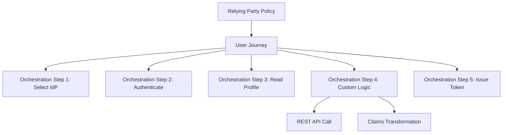

# How to Set Up Azure AD B2C Custom Policies for SaaS Application User Journeys

Author: [nawazdhandala](https://www.github.com/nawazdhandala)

Tags: Azure AD B2C, Custom Policies, SaaS, User Journeys, Identity Experience Framework, Authentication, Identity

Description: Set up Azure AD B2C custom policies to build advanced user journeys for SaaS applications including progressive profiling and conditional MFA.

---

Azure AD B2C user flows handle basic sign-up and sign-in scenarios well. But SaaS applications often need more sophisticated authentication workflows. Maybe you want to collect additional profile information after the third login instead of during sign-up. Maybe you need to enforce MFA only for users who access premium features. Maybe you want to validate a business email domain before allowing sign-up.

Custom policies in Azure AD B2C give you this level of control. They use XML-based configuration files that define every step of the user journey. The learning curve is steep compared to user flows, but the flexibility is worth it for complex SaaS requirements.

## Custom Policies vs User Flows

User flows are the simple option. You configure them in the Azure portal with dropdowns and checkboxes. They cover standard scenarios: sign-up, sign-in, password reset, and profile editing.

Custom policies (also called the Identity Experience Framework) give you a programming model for authentication. You define:

- **Claims schemas** - the data attributes you work with
- **Claims transformations** - functions that manipulate claims
- **Technical profiles** - integrations with identity providers, REST APIs, and Azure AD B2C itself
- **User journeys** - the orchestrated sequence of steps
- **Relying party** - the entry point that ties everything together



## Step 1 - Set Up the Starter Pack

Microsoft provides a starter pack of custom policy files. Start from these instead of writing XML from scratch.

Download the starter pack and customize it for your tenant.

```bash
# Clone the custom policy starter pack
git clone https://github.com/Azure-Samples/active-directory-b2c-custom-policy-starterpack.git

# Use the SocialAndLocalAccounts folder for the most common scenario
cd active-directory-b2c-custom-policy-starterpack/SocialAndLocalAccounts
```

The starter pack includes these policy files:
- `TrustFrameworkBase.xml` - Base definitions (rarely modified)
- `TrustFrameworkLocalization.xml` - Localization strings
- `TrustFrameworkExtensions.xml` - Your customizations go here
- `SignUpOrSignin.xml` - Relying party for sign-up/sign-in
- `ProfileEdit.xml` - Relying party for profile editing
- `PasswordReset.xml` - Relying party for password reset

Before uploading, replace placeholder values in each file.

```bash
# Replace tenant name placeholders
sed -i 's/yourtenant.onmicrosoft.com/your-b2c-tenant.onmicrosoft.com/g' *.xml
sed -i 's/ProxyIdentityExperienceFrameworkAppId/<your-proxy-app-id>/g' *.xml
sed -i 's/IdentityExperienceFrameworkAppId/<your-ief-app-id>/g' *.xml
```

Upload the policies to B2C in the correct order: Base first, then Extensions, then the relying party files.

## Step 2 - Add Progressive Profiling

Progressive profiling collects user information gradually over multiple sessions instead of asking for everything at sign-up. This reduces friction during initial registration.

First, define the additional claims in your extensions policy.

```xml
<!-- In TrustFrameworkExtensions.xml -->
<ClaimsSchema>
    <!-- Track how many times the user has signed in -->
    <ClaimType Id="signInCount">
        <DisplayName>Sign In Count</DisplayName>
        <DataType>int</DataType>
    </ClaimType>

    <!-- Additional profile fields collected progressively -->
    <ClaimType Id="companyName">
        <DisplayName>Company Name</DisplayName>
        <DataType>string</DataType>
        <UserInputType>TextBox</UserInputType>
    </ClaimType>

    <ClaimType Id="jobTitle">
        <DisplayName>Job Title</DisplayName>
        <DataType>string</DataType>
        <UserInputType>TextBox</UserInputType>
    </ClaimType>

    <ClaimType Id="phoneNumber">
        <DisplayName>Phone Number</DisplayName>
        <DataType>string</DataType>
        <UserInputType>TextBox</UserInputType>
    </ClaimType>

    <ClaimType Id="profileComplete">
        <DisplayName>Profile Complete</DisplayName>
        <DataType>boolean</DataType>
    </ClaimType>
</ClaimsSchema>
```

Now create a technical profile that calls a REST API to check if the profile needs additional information.

```xml
<!-- REST API technical profile to check profile completeness -->
<TechnicalProfile Id="REST-CheckProfileComplete">
    <DisplayName>Check if user profile needs additional info</DisplayName>
    <Protocol Name="Proprietary"
              Handler="Web.TPEngine.Providers.RestfulProvider, Web.TPEngine, Version=1.0.0.0, Culture=neutral" />
    <Metadata>
        <Item Key="ServiceUrl">https://your-api.azurewebsites.net/api/check-profile</Item>
        <Item Key="AuthenticationType">Bearer</Item>
        <Item Key="SendClaimsIn">Body</Item>
    </Metadata>
    <InputClaims>
        <InputClaim ClaimTypeReferenceId="objectId" PartnerClaimType="userId" />
        <InputClaim ClaimTypeReferenceId="signInCount" PartnerClaimType="signInCount" />
    </InputClaims>
    <OutputClaims>
        <OutputClaim ClaimTypeReferenceId="profileComplete" PartnerClaimType="profileComplete" />
        <OutputClaim ClaimTypeReferenceId="signInCount" PartnerClaimType="newSignInCount" />
    </OutputClaims>
</TechnicalProfile>
```

Add a self-asserted technical profile that collects the additional information when needed.

```xml
<!-- Self-asserted page for collecting additional profile info -->
<TechnicalProfile Id="SelfAsserted-ProgressiveProfile">
    <DisplayName>Complete Your Profile</DisplayName>
    <Protocol Name="Proprietary"
              Handler="Web.TPEngine.Providers.SelfAssertedAttributeProvider, Web.TPEngine, Version=1.0.0.0, Culture=neutral" />
    <Metadata>
        <Item Key="ContentDefinitionReferenceId">api.selfasserted.profileupdate</Item>
        <Item Key="language.button_continue">Save and Continue</Item>
    </Metadata>
    <InputClaims>
        <InputClaim ClaimTypeReferenceId="companyName" />
        <InputClaim ClaimTypeReferenceId="jobTitle" />
    </InputClaims>
    <OutputClaims>
        <OutputClaim ClaimTypeReferenceId="companyName" Required="true" />
        <OutputClaim ClaimTypeReferenceId="jobTitle" Required="true" />
        <OutputClaim ClaimTypeReferenceId="phoneNumber" />
    </OutputClaims>
</TechnicalProfile>
```

Now wire these into the user journey with a conditional step.

```xml
<!-- User journey with progressive profiling -->
<UserJourney Id="SignUpOrSignInWithProgressiveProfile">
    <OrchestrationSteps>
        <!-- Step 1: Standard sign-up or sign-in -->
        <OrchestrationStep Order="1" Type="CombinedSignInAndSignUp">
            <!-- Standard sign-in content definition -->
        </OrchestrationStep>

        <!-- Step 2: Read existing profile from directory -->
        <OrchestrationStep Order="2" Type="ClaimsExchange">
            <ClaimsExchanges>
                <ClaimsExchange Id="AADUserReadWithObjectId"
                                TechnicalProfileReferenceId="AAD-UserReadUsingObjectId" />
            </ClaimsExchanges>
        </OrchestrationStep>

        <!-- Step 3: Check if profile is complete via REST API -->
        <OrchestrationStep Order="3" Type="ClaimsExchange">
            <ClaimsExchanges>
                <ClaimsExchange Id="CheckProfile"
                                TechnicalProfileReferenceId="REST-CheckProfileComplete" />
            </ClaimsExchanges>
        </OrchestrationStep>

        <!-- Step 4: Show progressive profile form if needed (conditional) -->
        <OrchestrationStep Order="4" Type="ClaimsExchange">
            <Preconditions>
                <Precondition Type="ClaimEquals" ExecuteActionsIf="true">
                    <Value>profileComplete</Value>
                    <Value>True</Value>
                    <Action>SkipThisOrchestrationStep</Action>
                </Precondition>
            </Preconditions>
            <ClaimsExchanges>
                <ClaimsExchange Id="ProgressiveProfile"
                                TechnicalProfileReferenceId="SelfAsserted-ProgressiveProfile" />
            </ClaimsExchanges>
        </OrchestrationStep>

        <!-- Step 5: Write updated profile back to directory -->
        <OrchestrationStep Order="5" Type="ClaimsExchange">
            <ClaimsExchanges>
                <ClaimsExchange Id="WriteProfile"
                                TechnicalProfileReferenceId="AAD-UserWriteProfileUsingObjectId" />
            </ClaimsExchanges>
        </OrchestrationStep>

        <!-- Step 6: Issue the token -->
        <OrchestrationStep Order="6" Type="SendClaims"
                            CpimIssuerTechnicalProfileReferenceId="JwtIssuer" />
    </OrchestrationSteps>
</UserJourney>
```

The precondition on Step 4 is what makes this progressive. If the REST API says the profile is already complete, this step is skipped. Otherwise, the user sees a form asking for company name, job title, and phone number.

## Step 3 - Add Email Domain Validation for Business Sign-Up

For B2B SaaS, you might want to restrict sign-ups to business email addresses and reject personal email domains like gmail.com or yahoo.com.

```xml
<!-- Claims transformation to extract and validate the email domain -->
<ClaimsTransformation Id="GetEmailDomain" TransformationMethod="ParseDomain">
    <InputClaims>
        <InputClaim ClaimTypeReferenceId="email" TransformationClaimType="emailAddress" />
    </InputClaims>
    <OutputClaims>
        <OutputClaim ClaimTypeReferenceId="emailDomain" TransformationClaimType="domain" />
    </OutputClaims>
</ClaimsTransformation>

<!-- REST API call to validate the domain is a business domain -->
<TechnicalProfile Id="REST-ValidateBusinessEmail">
    <DisplayName>Validate Business Email Domain</DisplayName>
    <Protocol Name="Proprietary"
              Handler="Web.TPEngine.Providers.RestfulProvider, Web.TPEngine, Version=1.0.0.0, Culture=neutral" />
    <Metadata>
        <Item Key="ServiceUrl">https://your-api.azurewebsites.net/api/validate-domain</Item>
        <Item Key="SendClaimsIn">Body</Item>
    </Metadata>
    <InputClaims>
        <InputClaim ClaimTypeReferenceId="emailDomain" PartnerClaimType="domain" />
    </InputClaims>
    <OutputClaims>
        <OutputClaim ClaimTypeReferenceId="isBusinessEmail" PartnerClaimType="isValid" />
    </OutputClaims>
</TechnicalProfile>
```

The REST API behind this checks the domain against a blocklist of consumer email providers.

```python
# Azure Function that validates business email domains
BLOCKED_DOMAINS = {
    "gmail.com", "yahoo.com", "hotmail.com", "outlook.com",
    "aol.com", "icloud.com", "mail.com", "protonmail.com"
}

@app.route(route="validate-domain", methods=["POST"])
def validate_domain(req: func.HttpRequest) -> func.HttpResponse:
    body = req.get_json()
    domain = body.get("domain", "").lower()

    is_valid = domain not in BLOCKED_DOMAINS and "." in domain

    # Return conflict error if the domain is blocked
    # B2C interprets HTTP 409 as a validation error and shows the message to the user
    if not is_valid:
        return func.HttpResponse(
            json.dumps({
                "version": "1.0.0",
                "status": 409,
                "userMessage": "Please use your business email address. Personal email addresses are not accepted."
            }),
            status_code=409,
            mimetype="application/json"
        )

    return func.HttpResponse(
        json.dumps({"isValid": True}),
        status_code=200,
        mimetype="application/json"
    )
```

## Step 4 - Implement Conditional MFA

Different SaaS tiers might have different security requirements. Free tier users get basic authentication. Enterprise tier users are required to use MFA.

```xml
<!-- Check user's subscription tier via REST API -->
<TechnicalProfile Id="REST-CheckSubscriptionTier">
    <Protocol Name="Proprietary"
              Handler="Web.TPEngine.Providers.RestfulProvider, Web.TPEngine, Version=1.0.0.0, Culture=neutral" />
    <Metadata>
        <Item Key="ServiceUrl">https://your-api.azurewebsites.net/api/check-tier</Item>
        <Item Key="SendClaimsIn">Body</Item>
    </Metadata>
    <InputClaims>
        <InputClaim ClaimTypeReferenceId="objectId" PartnerClaimType="userId" />
    </InputClaims>
    <OutputClaims>
        <OutputClaim ClaimTypeReferenceId="requiresMfa" PartnerClaimType="requiresMfa" />
        <OutputClaim ClaimTypeReferenceId="subscriptionTier" PartnerClaimType="tier" />
    </OutputClaims>
</TechnicalProfile>

<!-- Conditional MFA step in the user journey -->
<OrchestrationStep Order="4" Type="ClaimsExchange">
    <Preconditions>
        <Precondition Type="ClaimEquals" ExecuteActionsIf="true">
            <Value>requiresMfa</Value>
            <Value>False</Value>
            <Action>SkipThisOrchestrationStep</Action>
        </Precondition>
    </Preconditions>
    <ClaimsExchanges>
        <ClaimsExchange Id="PhoneFactorVerification"
                        TechnicalProfileReferenceId="PhoneFactor-InputOrVerify" />
    </ClaimsExchanges>
</OrchestrationStep>
```

Users on enterprise plans get prompted for MFA. Free tier users skip that step entirely.

## Deploying Custom Policies

Upload policies in dependency order using the Azure CLI or Graph API.

```bash
# Upload policies in order
az rest --method PUT \
  --url "https://graph.microsoft.com/beta/trustFramework/policies/B2C_1A_TrustFrameworkBase" \
  --headers "Content-Type=application/xml" \
  --body @TrustFrameworkBase.xml

az rest --method PUT \
  --url "https://graph.microsoft.com/beta/trustFramework/policies/B2C_1A_TrustFrameworkExtensions" \
  --headers "Content-Type=application/xml" \
  --body @TrustFrameworkExtensions.xml

az rest --method PUT \
  --url "https://graph.microsoft.com/beta/trustFramework/policies/B2C_1A_signup_signin" \
  --headers "Content-Type=application/xml" \
  --body @SignUpOrSignin.xml
```

## Wrapping Up

Azure AD B2C custom policies give SaaS applications fine-grained control over the authentication experience. Progressive profiling reduces sign-up friction while still collecting the data you need. Domain validation ensures only business users can register. Conditional MFA ties security requirements to subscription tiers. The XML configuration has a learning curve, but start from the starter pack and add one customization at a time. Test each change in isolation before combining multiple features into a single policy. The result is an authentication flow that feels custom-built for your SaaS product while leveraging Azure AD B2C's security and scale.
