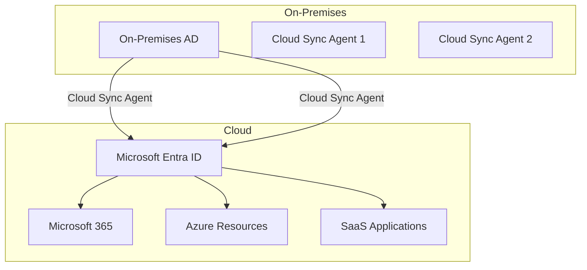

# How to Set Up Azure AD Connect Cloud Sync for Hybrid Identity with Password Hash Synchronization

Author: [nawazdhandala](https://www.github.com/nawazdhandala)

Tags: Azure, Microsoft Entra ID, Azure AD Connect, Cloud Sync, Hybrid Identity, Password Hash Sync, Active Directory

Description: Learn how to configure Azure AD Connect Cloud Sync to synchronize on-premises Active Directory identities with Microsoft Entra ID using password hash synchronization.

---

Most organizations do not flip a switch and move entirely to the cloud overnight. They run a hybrid identity environment where users exist in on-premises Active Directory and need to access cloud resources in Microsoft Entra ID. Azure AD Connect Cloud Sync is Microsoft's lightweight agent for synchronizing identities from on-premises AD to Entra ID, and when combined with password hash synchronization, it lets users sign in to cloud services with the same credentials they use on-premises.

This guide covers the full setup of Cloud Sync with password hash synchronization, including the differences from the older Azure AD Connect Sync and when to use each.

## Cloud Sync vs. Azure AD Connect Sync

Microsoft offers two tools for hybrid identity synchronization, and choosing the right one matters:

**Azure AD Connect Sync** (the older, full-featured tool):
- Requires a dedicated server running on-premises
- Supports all synchronization scenarios including pass-through authentication, federation, device writeback, and group writeback
- Heavy footprint but very flexible

**Azure AD Connect Cloud Sync** (the newer, lightweight tool):
- Runs as a lightweight agent on a domain-joined server
- Managed from the cloud (no local SQL or sync engine)
- Supports password hash sync and user/group synchronization
- Multiple agents for high availability
- Simpler to deploy and manage



For new deployments where you need user and group sync with password hash synchronization, Cloud Sync is the recommended choice. Use Azure AD Connect Sync only when you need features that Cloud Sync does not support.

## Prerequisites

Before starting, make sure you have:

- On-premises Active Directory domain
- One or more Windows Server 2016+ machines that are domain-joined (for the agent)
- Microsoft Entra ID P1 or P2 license (P1 is sufficient for Cloud Sync)
- Global Administrator or Hybrid Identity Administrator role in Entra ID
- Enterprise Administrator credentials for on-premises AD (for initial setup)
- Network connectivity from the agent server to the internet (outbound HTTPS on port 443)

## Step 1: Prepare Your On-Premises Environment

Before installing the agent, verify your on-premises AD is ready:

```powershell
# Verify the AD forest and domain functional levels
# Cloud Sync requires at minimum Windows Server 2003 forest functional level
$forest = [System.DirectoryServices.ActiveDirectory.Forest]::GetCurrentForest()
Write-Host "Forest: $($forest.Name)"
Write-Host "Forest Functional Level: $($forest.ForestMode)"

foreach ($domain in $forest.Domains) {
    Write-Host "Domain: $($domain.Name) - Level: $($domain.DomainMode)"
}

# Verify that the UPN suffix matches your verified domain in Entra ID
# Users should have UPN suffixes like user@contoso.com, not user@contoso.local
$users = Get-ADUser -Filter * -Properties UserPrincipalName |
    Select-Object UserPrincipalName |
    Group-Object { ($_.UserPrincipalName -split '@')[1] }

foreach ($group in $users) {
    Write-Host "UPN Suffix: $($group.Name) - User Count: $($group.Count)"
}
```

If users have non-routable UPN suffixes like contoso.local, add an alternate UPN suffix through Active Directory Domains and Trusts before synchronization. Users need routable UPN suffixes (like contoso.com) that match verified domains in Entra ID.

## Step 2: Verify Domain in Microsoft Entra ID

Make sure your domain is verified in Entra ID:

1. Go to the Microsoft Entra admin center.
2. Navigate to Settings, then Domain names.
3. Verify that your organization's domain (e.g., contoso.com) is listed and verified.
4. If not, add the domain and complete the DNS verification process.

## Step 3: Download and Install the Cloud Sync Agent

1. In the Microsoft Entra admin center, go to Hybrid management, then Microsoft Entra Connect, then Cloud sync.
2. Click on Agent, then Download on-premises agent.
3. Accept the terms of service and download the installer.
4. Run the installer on your domain-joined Windows Server.

During installation:

- The installer will prompt you to sign in with your Global Administrator or Hybrid Identity Administrator credentials.
- It will configure the agent to connect to your Entra ID tenant.
- A group Managed Service Account (gMSA) is created automatically for the agent. If your environment does not support gMSA, you can use a custom service account.

To install the agent silently via command line:

```powershell
# Silent installation of the Cloud Sync agent
# Run this on the domain-joined server
$installerPath = "C:\Downloads\AADConnectProvisioningAgentSetup.exe"

# Install with default settings
Start-Process -FilePath $installerPath `
    -ArgumentList "/quiet" `
    -Wait -NoNewWindow

Write-Host "Agent installation completed. Sign in to Entra admin center to complete configuration."
```

## Step 4: Install a Second Agent for High Availability

For production environments, install a second agent on a different server:

1. Download the same agent installer.
2. Run it on a second domain-joined server.
3. Sign in with the same Entra ID credentials.

Both agents will load-balance the synchronization work and provide failover if one agent goes offline. This is a significant advantage over Azure AD Connect Sync, which requires a separate staging server for high availability.

## Step 5: Configure Cloud Sync in the Portal

With the agents installed, configure the synchronization:

1. In the Entra admin center, go to Hybrid management, then Cloud sync.
2. Click New configuration.
3. Select your on-premises AD domain from the dropdown.
4. On the settings page, configure:
   - **Notification email**: An email address to receive sync notifications
   - **Accidental delete prevention**: Enable this and set a threshold (e.g., 500). This prevents mass deletions if something goes wrong.
5. Click Create.

## Step 6: Configure Scoping Filters

By default, Cloud Sync synchronizes all users and groups. You can scope it to specific OUs or filter by attribute:

1. In the Cloud Sync configuration, click Scoping filters.
2. Choose OU-based filtering to select only specific organizational units.
3. Or use attribute-based filtering. For example, sync only users where the department attribute is not empty.

For OU filtering:

1. Click on the domain and expand the OU tree.
2. Select only the OUs that contain the users and groups you want to synchronize.
3. Click Save.

## Step 7: Enable Password Hash Synchronization

Password hash synchronization (PHS) sends a hash of the hash of user passwords from on-premises AD to Entra ID. This is not the actual password or even the original NTLM hash - it is a derived value that is secure in transit and at rest.

To enable PHS:

1. In the Cloud Sync configuration, click on Password hash synchronization.
2. Toggle it to Enabled.
3. Click Save.

PHS has several benefits beyond just allowing users to sign in:

- It enables leaked credential detection in Entra ID Protection
- It provides a backup authentication path if your on-premises environment goes down
- It works with Conditional Access policies and MFA

## Step 8: Configure Attribute Mapping

Cloud Sync has default attribute mappings that work for most organizations. However, you may need to customize them:

1. In the Cloud Sync configuration, click Attribute mapping.
2. Review the default mappings for user objects.
3. To add or modify a mapping, click on the attribute.
4. Common customizations include:
   - Mapping the mailNickname attribute from the on-premises mail attribute
   - Adding custom extension attributes
   - Configuring the sourceAnchor (immutable ID) mapping

For example, if your on-premises users have an employee ID in an extension attribute that you want to sync:

1. Click Add attribute mapping.
2. Set the mapping type to Direct.
3. Set the source attribute to your on-premises extension attribute.
4. Set the target attribute to the corresponding Entra ID attribute.

## Step 9: Start the Initial Synchronization

1. In the Cloud Sync configuration, verify all settings are correct.
2. Click Enable to start the configuration.
3. The initial synchronization will begin. Depending on the number of objects, this can take from minutes to several hours.
4. Monitor the progress in the Provisioning logs section.

You can check the sync status with:

```powershell
# Check Cloud Sync provisioning logs via Microsoft Graph
Connect-MgGraph -Scopes "AuditLog.Read.All"

# Get recent provisioning logs
$logs = Get-MgAuditLogProvisioning -Top 50 -Filter "jobId eq 'YOUR_JOB_ID'"

foreach ($log in $logs) {
    Write-Host "$($log.ProvisioningAction) - $($log.SourceIdentity.DisplayName) - $($log.ProvisioningStatusInfo.Status)"
}
```

## Step 10: Verify Synchronization

After the initial sync completes, verify that users appear in Entra ID:

1. Go to the Entra admin center and navigate to Users.
2. Search for a user that should have been synchronized.
3. Check that the user's source shows as "Windows Server AD."
4. Verify the user's attributes are correct (display name, email, UPN).

Also verify password hash sync by having a synchronized user sign in to a cloud service like portal.azure.com using their on-premises password.

## Monitoring and Troubleshooting

Cloud Sync provides several monitoring capabilities:

- **Provisioning logs**: Show detailed information about each synchronization operation
- **Agent health**: Shows the status of each installed agent
- **Email notifications**: Alerts you to sync failures

Common issues and their solutions:

- **Agent offline**: Verify the agent server is running and has internet connectivity. Check the AADConnectProvisioningAgent service is running.
- **Permission errors**: Ensure the gMSA account has read permissions on the OUs being synchronized.
- **UPN conflicts**: If a user in Entra ID already has the same UPN as an on-premises user, the sync will fail. Resolve the conflict by soft-matching the accounts.
- **Password hash sync failures**: Check that the agent can reach the domain controller and that the gMSA has replication permissions.

## Conclusion

Azure AD Connect Cloud Sync provides a simpler, cloud-managed approach to hybrid identity synchronization compared to the traditional Azure AD Connect Sync. With multiple lightweight agents for high availability, cloud-based configuration, and support for password hash synchronization, it covers the most common hybrid identity scenarios. The setup is straightforward - install agents, configure scoping and attribute mappings, enable password hash sync, and start the initial synchronization. For organizations starting their hybrid identity journey or looking to simplify their existing setup, Cloud Sync is the right tool for the job.
