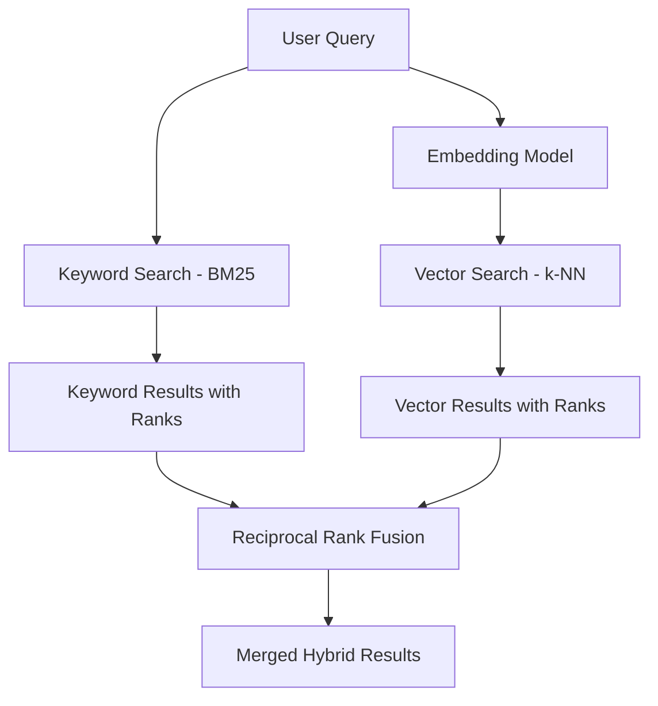

# How to Set Up Azure AI Search Hybrid Search Combining Keyword and Vector Retrieval

Author: [nawazdhandala](https://www.github.com/nawazdhandala)

Tags: Azure AI Search, Hybrid Search, Vector Search, Keyword Search, Semantic Search, RAG, Information Retrieval

Description: Configure Azure AI Search hybrid search that combines traditional keyword matching with vector similarity for more accurate and comprehensive search results.

---

Keyword search and vector search each have blind spots. Keyword search excels at exact matches but fails when users phrase queries differently from the documents. Vector search captures semantic meaning but can miss exact term matches that matter - like product codes, error messages, or specific names. Hybrid search combines both approaches, giving you the best of both worlds.

Azure AI Search supports hybrid search natively. You can run keyword and vector queries in a single API call, and the service automatically merges the results using Reciprocal Rank Fusion (RRF). In this guide, I will set up a hybrid search index from scratch, including vector embeddings, keyword indexing, and the hybrid query configuration.

## How Hybrid Search Works

A hybrid search query runs two retrieval paths in parallel:

1. **Keyword (BM25)**: Traditional full-text search using term frequency and inverse document frequency
2. **Vector (k-NN)**: Finds documents whose embeddings are closest to the query embedding in vector space

The results from both paths are merged using RRF, which takes the rank position of each document in both result sets and produces a combined score. Documents that appear in both result sets get boosted.



## Prerequisites

- An Azure AI Search resource (Basic tier or above for vector search)
- An Azure OpenAI resource with a text embedding model deployed (text-embedding-ada-002 or text-embedding-3-small)
- Python 3.9+
- Documents to index

```bash
# Install required packages
pip install azure-search-documents azure-identity openai
```

## Step 1: Create the Hybrid Search Index

The index needs both text fields for keyword search and vector fields for vector search.

```python
# create_index.py - Create a hybrid search index with both text and vector fields
from azure.search.documents.indexes import SearchIndexClient
from azure.search.documents.indexes.models import (
    SearchIndex,
    SearchField,
    SearchFieldDataType,
    SimpleField,
    SearchableField,
    VectorSearch,
    HnswAlgorithmConfiguration,
    VectorSearchProfile,
    SemanticConfiguration,
    SemanticSearch,
    SemanticPrioritizedFields,
    SemanticField,
)
from azure.core.credentials import AzureKeyCredential

# Connect to the search service
search_endpoint = "https://your-search.search.windows.net"
admin_key = "your-admin-key"

index_client = SearchIndexClient(
    endpoint=search_endpoint,
    credential=AzureKeyCredential(admin_key)
)

# Define the index fields
fields = [
    # Key field
    SimpleField(
        name="id",
        type=SearchFieldDataType.String,
        key=True,
        filterable=True
    ),
    # Searchable text fields for keyword search (BM25)
    SearchableField(
        name="title",
        type=SearchFieldDataType.String,
        analyzer_name="en.microsoft"
    ),
    SearchableField(
        name="content",
        type=SearchFieldDataType.String,
        analyzer_name="en.microsoft"
    ),
    # Category for filtering
    SimpleField(
        name="category",
        type=SearchFieldDataType.String,
        filterable=True,
        facetable=True
    ),
    # Vector field for semantic search
    SearchField(
        name="content_vector",
        type=SearchFieldDataType.Collection(SearchFieldDataType.Single),
        searchable=True,
        # Dimension must match your embedding model output
        vector_search_dimensions=1536,  # text-embedding-ada-002 outputs 1536 dims
        vector_search_profile_name="vector-profile"
    ),
    # Additional vector field for title embeddings
    SearchField(
        name="title_vector",
        type=SearchFieldDataType.Collection(SearchFieldDataType.Single),
        searchable=True,
        vector_search_dimensions=1536,
        vector_search_profile_name="vector-profile"
    ),
]

# Configure vector search with HNSW algorithm
vector_search = VectorSearch(
    algorithms=[
        HnswAlgorithmConfiguration(
            name="hnsw-config",
            parameters={
                "m": 4,          # Number of bidirectional links per node
                "efConstruction": 400,  # Size of candidate list during indexing
                "efSearch": 500,        # Size of candidate list during search
                "metric": "cosine"      # Similarity metric
            }
        )
    ],
    profiles=[
        VectorSearchProfile(
            name="vector-profile",
            algorithm_configuration_name="hnsw-config"
        )
    ]
)

# Optional: Add semantic ranking for reranking the top results
semantic_config = SemanticConfiguration(
    name="semantic-config",
    prioritized_fields=SemanticPrioritizedFields(
        title_field=SemanticField(field_name="title"),
        content_fields=[SemanticField(field_name="content")]
    )
)

# Create the index
index = SearchIndex(
    name="hybrid-knowledge-base",
    fields=fields,
    vector_search=vector_search,
    semantic_search=SemanticSearch(configurations=[semantic_config])
)

result = index_client.create_or_update_index(index)
print(f"Index '{result.name}' created successfully")
```

## Step 2: Generate Embeddings and Index Documents

Before indexing, generate vector embeddings for each document using Azure OpenAI:

```python
# index_documents.py - Generate embeddings and upload documents to the index
from azure.search.documents import SearchClient
from azure.core.credentials import AzureKeyCredential
from openai import AzureOpenAI
import json

# Initialize clients
search_client = SearchClient(
    endpoint="https://your-search.search.windows.net",
    index_name="hybrid-knowledge-base",
    credential=AzureKeyCredential("your-search-key")
)

openai_client = AzureOpenAI(
    azure_endpoint="https://your-openai.openai.azure.com/",
    api_key="your-openai-key",
    api_version="2024-06-01"
)

def get_embedding(text: str) -> list:
    """Generate an embedding vector for the given text."""
    response = openai_client.embeddings.create(
        model="text-embedding-ada-002",
        input=text
    )
    return response.data[0].embedding

# Sample documents to index
documents = [
    {
        "id": "doc-001",
        "title": "Setting Up HTTP Monitoring with OneUptime",
        "content": "HTTP monitoring checks the availability and response time of your web endpoints. Configure monitors to ping your URLs at regular intervals and alert when response codes indicate failures. You can set thresholds for response time, check SSL certificate expiry, and validate response body content.",
        "category": "monitoring"
    },
    {
        "id": "doc-002",
        "title": "Configuring Alert Policies and Notification Rules",
        "content": "Alert policies define when and how your team gets notified about incidents. Set up escalation chains that start with Slack notifications and escalate to phone calls if not acknowledged. Configure quiet hours, on-call schedules, and deduplication rules to reduce alert fatigue.",
        "category": "alerting"
    },
    {
        "id": "doc-003",
        "title": "Incident Management Best Practices",
        "content": "Effective incident management requires clear roles, communication channels, and post-incident reviews. Assign an incident commander, use a dedicated Slack channel for each incident, and update your status page to keep customers informed. After resolution, run a blameless retrospective to identify systemic improvements.",
        "category": "incidents"
    }
]

# Generate embeddings and prepare documents for indexing
indexed_documents = []
for doc in documents:
    # Generate embeddings for both title and content
    doc["title_vector"] = get_embedding(doc["title"])
    doc["content_vector"] = get_embedding(doc["content"])
    indexed_documents.append(doc)

# Upload documents to the search index
result = search_client.upload_documents(documents=indexed_documents)
print(f"Indexed {len(result)} documents")
for r in result:
    print(f"  {r.key}: {'Success' if r.succeeded else 'Failed'}")
```

## Step 3: Execute Hybrid Search Queries

Now run hybrid queries that combine keyword and vector search:

```python
# hybrid_search.py - Execute hybrid search queries
from azure.search.documents import SearchClient
from azure.search.documents.models import VectorizedQuery
from azure.core.credentials import AzureKeyCredential

search_client = SearchClient(
    endpoint="https://your-search.search.windows.net",
    index_name="hybrid-knowledge-base",
    credential=AzureKeyCredential("your-search-key")
)

def hybrid_search(query: str, top_k: int = 5, category_filter: str = None):
    """
    Perform a hybrid search combining keyword and vector retrieval.
    """
    # Generate the query embedding for vector search
    query_embedding = get_embedding(query)

    # Build the vector query
    vector_query = VectorizedQuery(
        vector=query_embedding,
        k_nearest_neighbors=top_k,
        fields="content_vector,title_vector"  # Search against both vector fields
    )

    # Build the filter (optional)
    filter_expression = None
    if category_filter:
        filter_expression = f"category eq '{category_filter}'"

    # Execute the hybrid search
    # The 'search_text' parameter triggers keyword search
    # The 'vector_queries' parameter triggers vector search
    # Both run in parallel and results are merged with RRF
    results = search_client.search(
        search_text=query,              # Keyword search component
        vector_queries=[vector_query],   # Vector search component
        select=["id", "title", "content", "category"],
        filter=filter_expression,
        top=top_k,
        # Optional: enable semantic ranking for reranking
        query_type="semantic",
        semantic_configuration_name="semantic-config"
    )

    # Process and display results
    print(f"Results for: '{query}'")
    print("-" * 60)
    for result in results:
        print(f"Score: {result['@search.score']:.4f}")
        if hasattr(result, '@search.reranker_score'):
            print(f"Semantic Score: {result['@search.reranker_score']:.4f}")
        print(f"Title: {result['title']}")
        print(f"Category: {result['category']}")
        print(f"Content: {result['content'][:200]}...")
        print("-" * 60)

# Example searches
hybrid_search("how do I set up alerts for my website?")
print()
hybrid_search("SSL certificate monitoring", category_filter="monitoring")
print()
hybrid_search("what should I do when something goes wrong in production?")
```

## Step 4: Integrate with RAG (Retrieval-Augmented Generation)

Hybrid search is often used as the retrieval component in a RAG pattern. Here is how to combine hybrid search with Azure OpenAI for answering questions:

```python
# rag_search.py - RAG pipeline using hybrid search and Azure OpenAI
def answer_question(question: str) -> str:
    """
    Answer a question using hybrid search retrieval + Azure OpenAI generation.
    """
    # Step 1: Retrieve relevant documents using hybrid search
    query_embedding = get_embedding(question)
    vector_query = VectorizedQuery(
        vector=query_embedding,
        k_nearest_neighbors=3,
        fields="content_vector"
    )

    results = search_client.search(
        search_text=question,
        vector_queries=[vector_query],
        select=["title", "content"],
        top=3
    )

    # Step 2: Build the context from retrieved documents
    context_parts = []
    for result in results:
        context_parts.append(f"## {result['title']}\n{result['content']}")
    context = "\n\n".join(context_parts)

    # Step 3: Generate an answer using Azure OpenAI
    response = openai_client.chat.completions.create(
        model="gpt-4o",
        messages=[
            {
                "role": "system",
                "content": "Answer the user's question based only on the provided context. If the context does not contain the answer, say so."
            },
            {
                "role": "user",
                "content": f"Context:\n{context}\n\nQuestion: {question}"
            }
        ],
        temperature=0.3
    )

    return response.choices[0].message.content

# Ask questions
answer = answer_question("How do I reduce alert noise for my monitoring setup?")
print(answer)
```

## Tuning Hybrid Search

The relative weight of keyword vs. vector results can be adjusted. By default, RRF gives equal weight to both. You can bias toward one or the other using weighted scoring:

```python
# Weighted hybrid search - give more weight to vector results
from azure.search.documents.models import VectorizedQuery

# You can control the weight by adjusting the k parameter
# A larger k for vector means more vector candidates enter the RRF merge
vector_query = VectorizedQuery(
    vector=query_embedding,
    k_nearest_neighbors=50,  # More vector candidates = more vector influence
    fields="content_vector",
    weight=0.7  # Explicit weight for vector results (if supported)
)
```

## Summary

Hybrid search in Azure AI Search gives you more accurate and comprehensive results than either keyword or vector search alone. Keywords catch exact matches that vectors might miss, while vectors capture semantic meaning that keywords cannot. The setup involves creating an index with both text and vector fields, generating embeddings for your documents, and executing queries that specify both `search_text` and `vector_queries`. Combined with semantic ranking and RAG, hybrid search forms the foundation of modern enterprise search and AI-powered question answering systems.
