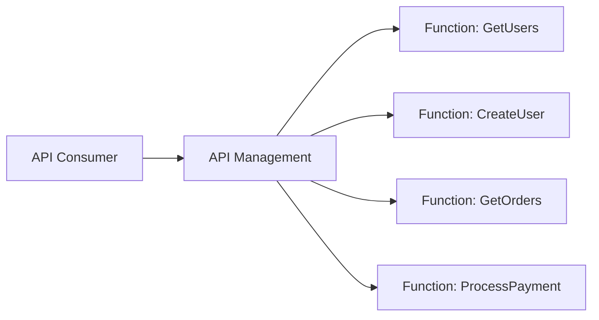

# How to Set Up Azure API Management with Azure Functions as Backend

Author: [nawazdhandala](https://www.github.com/nawazdhandala)

Tags: Azure, API Management, Azure Functions, Serverless, API Gateway, Backend, REST

Description: Configure Azure API Management to use Azure Functions as a backend service with authentication, policies, rate limiting, and API versioning.

---

Azure Functions are excellent for building individual API endpoints, but they lack features you need for a production API: rate limiting, authentication, request transformation, caching, and documentation. Azure API Management (APIM) fills these gaps. It sits in front of your functions as an API gateway, providing a professional API layer while your functions handle the business logic.

In this post, I will walk through setting up API Management with Azure Functions as the backend, configuring policies, and handling common patterns like authentication forwarding and response transformation.

## Why Put API Management in Front of Functions?

Without APIM, your Azure Functions endpoints are individually accessible. Each function has its own URL, its own authentication (function keys), and there is no centralized way to manage versioning, throttling, or monitoring across all your endpoints.

With APIM, you get:

- A single, consistent API surface for consumers
- Rate limiting and quotas per subscription
- Built-in OAuth 2.0 / JWT validation
- Request and response transformation
- Caching
- API versioning
- Developer portal with auto-generated documentation



## Step 1: Create the API Management Instance

```bash
# Create an API Management instance (Consumption tier for serverless pricing)
az apim create \
  --name my-api-gateway \
  --resource-group rg-api \
  --location eastus \
  --publisher-name "My Company" \
  --publisher-email "api@mycompany.com" \
  --sku-name Consumption
```

The Consumption tier is ideal when pairing with Azure Functions because it also follows serverless pricing - you pay per API call rather than a fixed monthly rate.

Note: The Consumption tier can take a few minutes to provision. The Developer and Standard tiers take 30-60 minutes.

## Step 2: Import Azure Functions into APIM

The easiest way to import functions is through the Azure portal, but you can also do it with the CLI or API.

### Using the Azure Portal

1. Open your API Management instance.
2. Go to APIs and click "Add API."
3. Select "Function App" from the options.
4. Browse and select your Function App.
5. Select which functions to import.
6. Set an API URL suffix (e.g., `v1`).

### Using the CLI

```bash
# Import functions as an API
az apim api import \
  --resource-group rg-api \
  --service-name my-api-gateway \
  --path "v1" \
  --api-id "my-api" \
  --specification-format OpenApi \
  --specification-url "https://my-function-app.azurewebsites.net/api/swagger.json"
```

If your functions do not expose an OpenAPI spec, you can define the API operations manually.

```bash
# Create an API
az apim api create \
  --resource-group rg-api \
  --service-name my-api-gateway \
  --api-id "users-api" \
  --display-name "Users API" \
  --path "users" \
  --protocols https \
  --service-url "https://my-function-app.azurewebsites.net/api"

# Add an operation
az apim api operation create \
  --resource-group rg-api \
  --service-name my-api-gateway \
  --api-id "users-api" \
  --operation-id "get-users" \
  --display-name "Get Users" \
  --method GET \
  --url-template "/users"
```

## Step 3: Configure Authentication Between APIM and Functions

APIM needs to authenticate with your Function App. The recommended approach is using the function's host key or a system-assigned managed identity.

### Using Function Keys

Configure APIM to include the function key in requests to the backend.

```xml
<!-- Policy that adds the function key to backend requests -->
<policies>
    <inbound>
        <base />
        <!-- Add the function key as a query parameter -->
        <set-query-parameter name="code" exists-action="override">
            <value>{{function-app-key}}</value>
        </set-query-parameter>
    </inbound>
    <backend>
        <base />
    </backend>
    <outbound>
        <base />
    </outbound>
</policies>
```

Store the function key as a Named Value in APIM rather than hardcoding it in the policy.

### Using Managed Identity

A cleaner approach is using APIM's managed identity to authenticate with the Function App.

```xml
<!-- Policy that uses managed identity for backend authentication -->
<policies>
    <inbound>
        <base />
        <authentication-managed-identity resource="https://my-function-app.azurewebsites.net" />
    </inbound>
    <backend>
        <base />
    </backend>
    <outbound>
        <base />
    </outbound>
</policies>
```

This requires configuring the Function App to accept tokens from the APIM managed identity.

## Step 4: Add API Policies

Policies are the real power of APIM. They let you transform requests, enforce security, and add operational features without changing your function code.

### Rate Limiting

```xml
<!-- Rate limit: 100 calls per minute per subscription -->
<policies>
    <inbound>
        <base />
        <rate-limit calls="100" renewal-period="60" />
    </inbound>
    <backend>
        <base />
    </backend>
    <outbound>
        <base />
    </outbound>
</policies>
```

### JWT Validation

Validate OAuth 2.0 tokens before the request reaches your function.

```xml
<!-- Validate JWT tokens from Azure AD -->
<policies>
    <inbound>
        <base />
        <validate-jwt header-name="Authorization" require-scheme="Bearer">
            <openid-config url="https://login.microsoftonline.com/{tenant-id}/v2.0/.well-known/openid-configuration" />
            <audiences>
                <audience>api://my-api</audience>
            </audiences>
            <required-claims>
                <claim name="roles" match="any">
                    <value>API.Read</value>
                </claim>
            </required-claims>
        </validate-jwt>
    </inbound>
</policies>
```

### Response Caching

Cache GET responses to reduce function invocations.

```xml
<!-- Cache responses for 5 minutes -->
<policies>
    <inbound>
        <base />
        <cache-lookup vary-by-developer="false" vary-by-developer-groups="false">
            <vary-by-query-parameter>page,limit</vary-by-query-parameter>
        </cache-lookup>
    </inbound>
    <outbound>
        <base />
        <cache-store duration="300" />
    </outbound>
</policies>
```

### Request Transformation

Transform requests before they reach your function.

```xml
<!-- Add headers and transform the request -->
<policies>
    <inbound>
        <base />
        <!-- Add a correlation ID header -->
        <set-header name="X-Correlation-Id" exists-action="skip">
            <value>@(Guid.NewGuid().ToString())</value>
        </set-header>
        <!-- Forward the caller's IP -->
        <set-header name="X-Forwarded-For" exists-action="override">
            <value>@(context.Request.IpAddress)</value>
        </set-header>
    </inbound>
    <outbound>
        <base />
        <!-- Remove internal headers from the response -->
        <set-header name="X-Powered-By" exists-action="delete" />
        <set-header name="X-AspNet-Version" exists-action="delete" />
    </outbound>
</policies>
```

## Step 5: Set Up API Versioning

APIM supports multiple versioning schemes: URL path, query string, and header-based.

```bash
# Create a versioned API
az apim api create \
  --resource-group rg-api \
  --service-name my-api-gateway \
  --api-id "users-api-v2" \
  --display-name "Users API v2" \
  --path "v2/users" \
  --protocols https \
  --service-url "https://my-function-app-v2.azurewebsites.net/api"
```

With URL-based versioning, consumers call `/v1/users` for the old version and `/v2/users` for the new one. Both can point to different Function Apps or different functions within the same app.

## Step 6: Set Up Subscriptions and Products

APIM uses products and subscriptions to manage API access.

```bash
# Create a product
az apim product create \
  --resource-group rg-api \
  --service-name my-api-gateway \
  --product-id "standard" \
  --display-name "Standard" \
  --description "Standard API access" \
  --subscription-required true \
  --approval-required false \
  --state published

# Add the API to the product
az apim product api add \
  --resource-group rg-api \
  --service-name my-api-gateway \
  --product-id "standard" \
  --api-id "users-api"
```

Consumers subscribe to a product and receive a subscription key. They include this key in their API requests via the `Ocp-Apim-Subscription-Key` header.

## Testing the Setup

Once everything is configured, test the API through APIM.

```bash
# Test the API endpoint through APIM
curl -X GET "https://my-api-gateway.azure-api.net/v1/users" \
  -H "Ocp-Apim-Subscription-Key: your-subscription-key" \
  -H "Content-Type: application/json"
```

If everything is configured correctly, APIM will validate the subscription key, apply the policies, forward the request to your function, and return the response.

## Wrapping Up

Azure API Management turns your collection of Azure Functions into a proper API platform. It adds the operational features that functions lack on their own: rate limiting, authentication, caching, versioning, and monitoring. The Consumption tier matches the serverless pricing model of Functions, so you are not paying a fixed monthly fee for an API gateway. Start by importing your functions, add authentication and rate limiting policies, and build from there. Your API consumers get a professional experience, and you get centralized control over how your functions are accessed.
