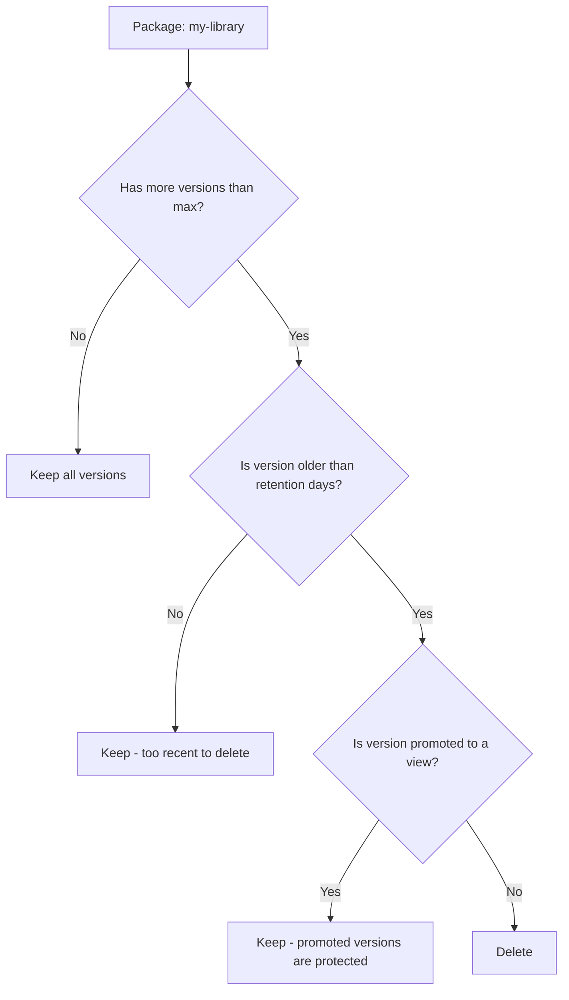

# How to Set Up Azure Artifacts Retention Policies to Manage Package Storage Costs

Author: [nawazdhandala](https://www.github.com/nawazdhandala)

Tags: Azure Artifacts, Retention Policies, Package Management, Cost Optimization, DevOps, Storage

Description: Configure retention policies in Azure Artifacts to automatically clean up old package versions and keep storage costs under control.

---

Azure Artifacts is one of those services that starts cheap and slowly gets expensive if you are not paying attention. Every time a CI pipeline publishes a new package version, it adds to your storage. For a typical project publishing npm, NuGet, or Universal Packages on every build, you can accumulate hundreds or thousands of package versions in a matter of months. Azure DevOps gives you 2 GB of storage for free, and after that, each additional GB costs money.

Retention policies let you automatically clean up old package versions so your storage usage stays reasonable. This guide covers how to configure them and the strategies that work in practice.

## Understanding Azure Artifacts Storage

Before setting up retention, it helps to understand what counts toward your storage:

- All package versions across all feeds in your organization
- All package types: npm, NuGet, Maven, Python, and Universal Packages
- Deleted packages still count until they are permanently purged (soft delete has a recycle bin)
- Upstream packages cached from public registries also count

You can check your current usage in Organization Settings under Billing:

```bash
# There is no direct CLI command for storage usage, but you can check
# feed-level package counts to estimate
az artifacts feed list \
  --organization "https://dev.azure.com/myorg" \
  --output table
```

## How Retention Policies Work

Azure Artifacts retention policies work at the feed level. When you configure a retention policy, you specify:

1. **Maximum number of versions to keep per package**: Older versions beyond this count are candidates for deletion
2. **Days to keep recently published versions**: Versions newer than this threshold are never deleted, regardless of the count

When the retention policy runs, it evaluates each package in the feed. For each package, it keeps the newest versions up to your configured maximum. Versions that exceed the count and are older than the age threshold get deleted.



Important: Versions that have been promoted to a view (like @release or @prerelease) are never deleted by retention policies. This is how you protect your production-deployed versions while cleaning up development builds.

## Configuring Retention Through the UI

Go to Azure Artifacts in your project, select the feed you want to configure, click the gear icon for feed settings, and select "Retention."

Configure:
- **Maximum number of versions per package**: A good starting point is 10-25 for development feeds, 50-100 for release feeds
- **Days to keep recently created packages**: 30 days is a reasonable default

## Configuring Retention Through the REST API

For automation, use the REST API:

```bash
# Set retention policy on a feed
# Keep max 20 versions per package, protect anything newer than 30 days
curl -u :$PAT \
  -X PATCH \
  -H "Content-Type: application/json" \
  "https://feeds.dev.azure.com/{org}/{project}/_apis/packaging/feeds/{feedId}/retentionpolicies?api-version=7.0" \
  -d '{
    "countLimit": 20,
    "daysToKeepRecentlyCreatedPackages": 30
  }'
```

To check the current retention policy:

```bash
# Get the current retention policy for a feed
curl -u :$PAT \
  "https://feeds.dev.azure.com/{org}/{project}/_apis/packaging/feeds/{feedId}/retentionpolicies?api-version=7.0"
```

## Strategy 1: Separate Feeds for Dev and Release

The most effective approach is to use separate feeds with different retention policies:

**Development feed** (aggressive cleanup):
- Maximum versions per package: 5
- Days to keep: 7
- Purpose: Stores CI build outputs, pre-release versions

**Release feed** (conservative cleanup):
- Maximum versions per package: 100
- Days to keep: 365
- Purpose: Stores released versions that might be deployed in production

```bash
# Create a development feed with aggressive retention
az artifacts feed create \
  --name "dev-packages" \
  --description "Development packages - aggressive retention" \
  --project "MyProject" \
  --organization "https://dev.azure.com/myorg"

# Create a release feed with conservative retention
az artifacts feed create \
  --name "release-packages" \
  --description "Release packages - long retention" \
  --project "MyProject" \
  --organization "https://dev.azure.com/myorg"
```

In your CI pipeline, publish to the dev feed on every build and to the release feed only for tagged releases:

```yaml
# Publish to dev feed on every build
- task: NuGetCommand@2
  inputs:
    command: 'push'
    packagesToPush: '$(Build.ArtifactStagingDirectory)/**/*.nupkg'
    nuGetFeedType: 'internal'
    publishVstsFeed: 'dev-packages'
  displayName: 'Publish to dev feed'

# Publish to release feed only on tags
- task: NuGetCommand@2
  inputs:
    command: 'push'
    packagesToPush: '$(Build.ArtifactStagingDirectory)/**/*.nupkg'
    nuGetFeedType: 'internal'
    publishVstsFeed: 'release-packages'
  condition: startsWith(variables['Build.SourceBranch'], 'refs/tags/')
  displayName: 'Publish to release feed'
```

## Strategy 2: Use Views to Protect Important Versions

If you prefer a single feed, use views to protect versions that matter:

```bash
# Promote a version to the release view (protected from retention)
# Using the Azure DevOps REST API
curl -u :$PAT \
  -X PATCH \
  -H "Content-Type: application/json" \
  "https://pkgs.dev.azure.com/{org}/{project}/_apis/packaging/feeds/{feedId}/nuget/packages/{packageName}/versions/{version}?api-version=7.0" \
  -d '{
    "views": {
      "op": "add",
      "path": "/views/-",
      "value": "@release"
    }
  }'
```

In your release pipeline, promote packages after successful deployment:

```yaml
# After successful deployment, promote the package to @release view
- task: AzureCLI@2
  inputs:
    azureSubscription: 'my-connection'
    scriptType: 'bash'
    scriptLocation: 'inlineScript'
    inlineScript: |
      # Promote the deployed version to the release view
      az rest --method patch \
        --url "https://pkgs.dev.azure.com/myorg/MyProject/_apis/packaging/feeds/main-feed/nuget/packages/MyPackage/versions/$(packageVersion)?api-version=7.0" \
        --body '{"views": {"op": "add", "path": "/views/-", "value": "@release"}}'
  displayName: 'Promote package to release view'
```

## Strategy 3: Automated Cleanup Script

For more control, run a cleanup script on a schedule:

```powershell
# cleanup-old-packages.ps1
# Delete package versions older than 60 days that are not in a release view

param(
    [string]$Organization = "https://dev.azure.com/myorg",
    [string]$Project = "MyProject",
    [string]$FeedName = "dev-packages",
    [int]$MaxAgeDays = 60
)

$headers = @{
    Authorization = "Basic $([Convert]::ToBase64String([Text.Encoding]::ASCII.GetBytes(":$env:PAT")))"
    "Content-Type" = "application/json"
}

# Get all packages in the feed
$feedUrl = "$Organization/$Project/_apis/packaging/feeds/$FeedName/packages?api-version=7.0"
$packages = (Invoke-RestMethod -Uri $feedUrl -Headers $headers).value

$cutoffDate = (Get-Date).AddDays(-$MaxAgeDays)
$deletedCount = 0

foreach ($package in $packages) {
    # Get versions for this package
    $versionsUrl = "$Organization/$Project/_apis/packaging/feeds/$FeedName/packages/$($package.id)/versions?api-version=7.0"
    $versions = (Invoke-RestMethod -Uri $versionsUrl -Headers $headers).value

    foreach ($version in $versions) {
        # Skip versions in a view (promoted/released)
        if ($version.views.count -gt 0) {
            continue
        }

        # Skip recent versions
        $publishDate = [DateTime]::Parse($version.publishDate)
        if ($publishDate -gt $cutoffDate) {
            continue
        }

        # Delete the old version
        $deleteUrl = "$Organization/$Project/_apis/packaging/feeds/$FeedName/packages/$($package.id)/versions/$($version.id)?api-version=7.0"
        Invoke-RestMethod -Uri $deleteUrl -Method Delete -Headers $headers
        $deletedCount++

        Write-Output "Deleted: $($package.name) v$($version.version) (published $publishDate)"
    }
}

Write-Output "Total versions deleted: $deletedCount"
```

Run this as a scheduled pipeline:

```yaml
# Scheduled cleanup pipeline
trigger: none

schedules:
  - cron: '0 2 * * 0'  # Every Sunday at 2 AM
    displayName: 'Weekly package cleanup'
    branches:
      include:
        - main
    always: true

pool:
  vmImage: 'ubuntu-latest'

steps:
  - task: PowerShell@2
    inputs:
      filePath: 'scripts/cleanup-old-packages.ps1'
      arguments: '-MaxAgeDays 60'
    env:
      PAT: $(System.AccessToken)
    displayName: 'Clean up old package versions'
```

## Handling Upstream Package Caching

When you configure an upstream source (like npmjs.org or nuget.org), Azure Artifacts caches packages from those sources in your feed. These cached packages count toward your storage.

You cannot set retention policies specifically for upstream packages, but you can:

1. Remove upstream sources from feeds that do not need them
2. Create a separate feed for upstream caching to isolate the storage impact
3. Periodically delete unused cached packages

## Monitoring Storage Usage Over Time

Set up a simple monitoring script that tracks storage trends:

```bash
# Get package count per feed (rough proxy for storage usage)
feeds=$(az artifacts feed list \
  --organization "https://dev.azure.com/myorg" \
  --query "[].name" -o tsv)

for feed in $feeds; do
    count=$(az artifacts package list \
      --feed "$feed" \
      --organization "https://dev.azure.com/myorg" \
      --query "length(@)" -o tsv 2>/dev/null)
    echo "Feed: $feed - Packages: ${count:-0}"
done
```

## Best Practices

1. **Set retention policies on day one.** Do not wait until you hit storage limits. Configure retention when you create the feed.

2. **Use views to protect released versions.** Always promote production-deployed packages to a release view before relying on retention cleanup.

3. **Keep development feeds lean.** 5-10 versions per package is plenty for a dev feed. Developers rarely need more than the last few builds.

4. **Do not rely solely on automated retention.** Review your feeds periodically. Automated policies are good but they cannot account for everything, like packages that are no longer used at all.

5. **Permanently delete recycled packages.** When retention deletes a package, it goes to the recycle bin. The recycle bin still counts toward storage. Purge it periodically.

## Wrapping Up

Azure Artifacts retention policies are essential for keeping your package storage costs manageable. Without them, every CI build adds to an ever-growing pile of package versions that nobody will ever use again. Set up retention on every feed, use views to protect important versions, and run periodic cleanup scripts for anything the built-in policies cannot handle. The few minutes you spend configuring retention will save you from unexpected Azure bills down the line.
