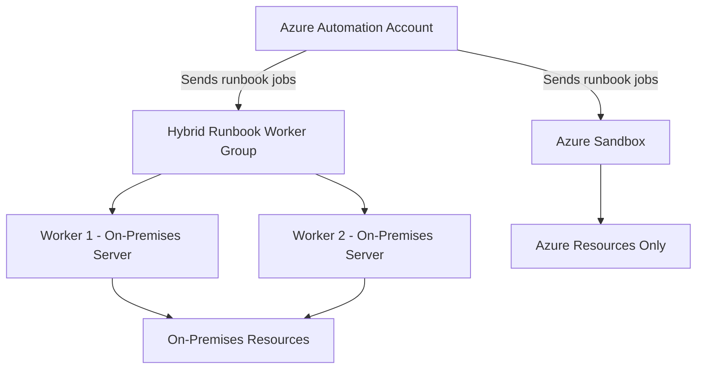

# How to Set Up Azure Automation Hybrid Runbook Workers for On-Premises Tasks

Author: [nawazdhandala](https://www.github.com/nawazdhandala)

Tags: Azure, Azure Automation, Hybrid Runbook Worker, On-Premises, Hybrid Cloud, DevOps, Infrastructure

Description: Learn how to configure Azure Automation Hybrid Runbook Workers to run automation scripts against on-premises servers and resources.

---

Azure Automation is great for managing cloud resources, but what about the servers sitting in your data center? That is where Hybrid Runbook Workers come in. A Hybrid Runbook Worker is an agent you install on a machine (physical or virtual, on-premises or in another cloud) that allows Azure Automation runbooks to execute locally on that machine. This means your automation scripts can reach resources that are not exposed to the public internet - Active Directory controllers, on-premises databases, file servers, network equipment, and anything else behind your firewall.

In this post, I will walk through how Hybrid Runbook Workers work, how to set them up, and how to use them effectively.

## How Hybrid Runbook Workers Fit In



When you run a runbook in Azure Automation normally, it executes in an Azure-managed sandbox. That sandbox can reach Azure resources through Azure APIs but cannot reach anything in your private network. A Hybrid Runbook Worker runs on a machine inside your network, so the runbook executes there and can access anything that machine can access.

## Types of Hybrid Runbook Workers

There are two types:

**User Hybrid Runbook Worker (extension-based)** - this is the recommended approach. You install the Hybrid Worker extension on an Azure Arc-enabled server or an Azure VM. The extension manages the agent lifecycle for you.

**User Hybrid Runbook Worker (agent-based)** - the older approach where you manually install the Log Analytics agent and the Hybrid Worker component. Microsoft is moving away from this in favor of the extension-based approach, so I recommend using the extension method for new deployments.

## Prerequisites

For the extension-based approach, you need:

- An Azure Automation account
- The on-premises machine must be onboarded to Azure Arc (this makes it visible to Azure Resource Manager)
- The machine needs outbound HTTPS connectivity to Azure (port 443)
- PowerShell 7.2 or later for PowerShell runbooks (or PowerShell 5.1 for older scripts)
- .NET Framework 4.7.2 or later on Windows machines

## Step 1: Onboard Your On-Premises Machine to Azure Arc

If your machine is not already Azure Arc-enabled, start here:

```bash
# Download and run the Azure Connected Machine agent on your on-prem server
# This makes the machine visible in Azure Resource Manager
# Run this ON the on-premises machine

# For Windows (run in an elevated PowerShell):
# Download the installation script
Invoke-WebRequest -Uri https://aka.ms/azcmagent-windows -OutFile install_windows_azcmagent.ps1

# Run the installation
./install_windows_azcmagent.ps1

# Connect the machine to Azure
azcmagent connect \
  --resource-group rg-hybrid-workers \
  --tenant-id "<your-tenant-id>" \
  --location eastus \
  --subscription-id "<your-subscription-id>"
```

For Linux machines:

```bash
# Download and install the Azure Connected Machine agent on Linux
# Run this ON the on-premises Linux machine
wget https://aka.ms/azcmagent -O install_linux_azcmagent.sh
bash install_linux_azcmagent.sh

# Connect to Azure
azcmagent connect \
  --resource-group rg-hybrid-workers \
  --tenant-id "<your-tenant-id>" \
  --location eastus \
  --subscription-id "<your-subscription-id>"
```

After connecting, verify the machine appears in the Azure portal under Azure Arc > Servers.

## Step 2: Create a Hybrid Runbook Worker Group

Hybrid Workers are organized into groups. A group can contain one or more workers, and when you target a runbook at a group, Azure Automation picks an available worker in that group to execute it.

```bash
# Create a Hybrid Runbook Worker group
az automation hrwg create \
  --resource-group rg-automation \
  --automation-account-name aa-operations \
  --hybrid-runbook-worker-group-name "on-prem-datacenter-1"
```

## Step 3: Install the Hybrid Worker Extension

Now install the Hybrid Worker extension on your Arc-enabled machine:

```bash
# Install the Hybrid Worker extension on an Azure Arc-enabled server
# This registers the machine as a worker in the specified group
az connectedmachine extension create \
  --resource-group rg-hybrid-workers \
  --machine-name "on-prem-server-01" \
  --name HybridWorkerExtension \
  --publisher Microsoft.Azure.Automation.HybridWorker \
  --type HybridWorkerForWindows \
  --location eastus \
  --settings '{
    "AutomationAccountURL": "https://eus2-agentservice-prod-1.azure-automation.net/accounts/<automation-account-id>"
  }'
```

For Linux machines, use `HybridWorkerForLinux` as the type:

```bash
# Install the Hybrid Worker extension on a Linux Arc-enabled server
az connectedmachine extension create \
  --resource-group rg-hybrid-workers \
  --machine-name "on-prem-linux-01" \
  --name HybridWorkerExtension \
  --publisher Microsoft.Azure.Automation.HybridWorker \
  --type HybridWorkerForLinux \
  --location eastus \
  --settings '{
    "AutomationAccountURL": "https://eus2-agentservice-prod-1.azure-automation.net/accounts/<automation-account-id>"
  }'
```

You can find the Automation Account URL in the portal under your Automation Account > Properties > URL.

## Step 4: Add the Worker to the Group

```bash
# Add the Arc-enabled machine as a worker in the group
az automation hrwg hrw create \
  --resource-group rg-automation \
  --automation-account-name aa-operations \
  --hybrid-runbook-worker-group-name "on-prem-datacenter-1" \
  --hybrid-runbook-worker-name "on-prem-server-01" \
  --vm-resource-id "/subscriptions/<sub-id>/resourceGroups/rg-hybrid-workers/providers/Microsoft.HybridCompute/machines/on-prem-server-01"
```

## Step 5: Verify the Worker Status

Check that the worker is reporting in:

```bash
# List workers in the group and check their status
az automation hrwg hrw list \
  --resource-group rg-automation \
  --automation-account-name aa-operations \
  --hybrid-runbook-worker-group-name "on-prem-datacenter-1" \
  --output table
```

You should see your machine listed with a "Connected" status.

## Step 6: Run a Runbook on the Hybrid Worker

Now you can run any runbook on the Hybrid Worker group instead of the Azure sandbox. Here is a simple test runbook:

```powershell
# Runbook: Test-HybridWorker
# Purpose: Verify the Hybrid Worker can reach on-premises resources
# This runs ON the Hybrid Worker machine, not in the Azure sandbox

# Get local machine information to prove we are running on-premises
$computerName = $env:COMPUTERNAME
$ipAddress = (Get-NetIPAddress -AddressFamily IPv4 | Where-Object { $_.InterfaceAlias -notlike '*Loopback*' }).IPAddress

Write-Output "Running on: $computerName"
Write-Output "IP Address: $ipAddress"

# Test connectivity to an on-premises resource
$testServer = "dc01.internal.company.com"
$pingResult = Test-Connection -ComputerName $testServer -Count 1 -Quiet

if ($pingResult) {
    Write-Output "Successfully reached on-premises server: $testServer"
} else {
    Write-Output "WARNING: Cannot reach on-premises server: $testServer"
}

# Test Active Directory connectivity (if AD module is installed)
if (Get-Module -ListAvailable -Name ActiveDirectory) {
    Import-Module ActiveDirectory
    $domain = Get-ADDomain
    Write-Output "Connected to AD Domain: $($domain.DNSRoot)"
    Write-Output "Domain Controller: $($domain.PDCEmulator)"
} else {
    Write-Output "Active Directory module not available on this worker"
}
```

To run this on the Hybrid Worker (through the portal):

1. Open the runbook in the portal
2. Click "Start"
3. Under "Run settings," select "Hybrid Worker"
4. Choose your worker group from the dropdown
5. Click OK

Through the CLI:

```bash
# Start a runbook job on the Hybrid Worker group
az automation runbook start \
  --resource-group rg-automation \
  --automation-account-name aa-operations \
  --name Test-HybridWorker \
  --run-on "on-prem-datacenter-1"
```

## Practical Use Cases

### Active Directory User Management

```powershell
# Runbook: Disable-InactiveADUsers
# Purpose: Find and disable AD accounts that have not logged in for 90 days
# Must run on a Hybrid Worker with AD module installed

param(
    [int]$InactiveDays = 90,
    [bool]$DryRun = $true
)

Import-Module ActiveDirectory

$cutoffDate = (Get-Date).AddDays(-$InactiveDays)

# Find users who haven't logged in since the cutoff date
$inactiveUsers = Get-ADUser -Filter {
    LastLogonTimestamp -lt $cutoffDate -and Enabled -eq $true
} -Properties LastLogonTimestamp, DisplayName

Write-Output "Found $($inactiveUsers.Count) inactive users (no login in $InactiveDays days)"

foreach ($user in $inactiveUsers) {
    $lastLogon = [DateTime]::FromFileTime($user.LastLogonTimestamp)
    if ($DryRun) {
        Write-Output "[DRY RUN] Would disable: $($user.DisplayName) ($($user.SamAccountName)) - Last logon: $lastLogon"
    } else {
        Disable-ADAccount -Identity $user.SamAccountName
        Write-Output "Disabled: $($user.DisplayName) ($($user.SamAccountName)) - Last logon: $lastLogon"
    }
}
```

### On-Premises File Server Cleanup

```powershell
# Runbook: Cleanup-OldFiles
# Purpose: Remove files older than a specified number of days from a network share
# Runs on a Hybrid Worker that has access to the file share

param(
    [string]$SharePath = "\\fileserver\archive",
    [int]$RetentionDays = 365,
    [bool]$DryRun = $true
)

$cutoffDate = (Get-Date).AddDays(-$RetentionDays)
$oldFiles = Get-ChildItem -Path $SharePath -Recurse -File | Where-Object { $_.LastWriteTime -lt $cutoffDate }

$totalSizeMB = [math]::Round(($oldFiles | Measure-Object -Property Length -Sum).Sum / 1MB, 2)

Write-Output "Found $($oldFiles.Count) files older than $RetentionDays days"
Write-Output "Total space to reclaim: $totalSizeMB MB"

foreach ($file in $oldFiles) {
    if ($DryRun) {
        Write-Output "[DRY RUN] Would delete: $($file.FullName) (Modified: $($file.LastWriteTime))"
    } else {
        Remove-Item -Path $file.FullName -Force
        Write-Output "Deleted: $($file.FullName)"
    }
}
```

## High Availability for Hybrid Workers

For production scenarios, always have at least two workers in each group. Azure Automation will distribute jobs across available workers, and if one worker goes down, the other picks up the jobs.

Also consider placing workers in different physical locations or network segments for resilience.

## Troubleshooting

**Worker shows as disconnected:** Check that the machine has outbound HTTPS connectivity to Azure. Verify the Hybrid Worker extension is running by checking the extension status in the Azure Arc portal.

**Runbook fails with module not found:** Modules installed in the Azure Automation account only apply to Azure sandbox runs. For Hybrid Workers, you need to install modules locally on the worker machine using `Install-Module`.

**Authentication issues:** If the runbook uses `Connect-AzAccount -Identity`, this works differently on Hybrid Workers. The managed identity on a Hybrid Worker is the identity of the Azure Arc-enabled server, not the Automation account's identity. Make sure the Arc machine's managed identity has the necessary permissions.

## Wrapping Up

Hybrid Runbook Workers extend Azure Automation's reach beyond the cloud and into your on-premises environment. By combining Azure Arc for machine management with the Hybrid Worker extension, you get a clean, modern approach to running automation against any resource your on-premises machines can reach. Start with a simple connectivity test runbook, verify everything works end to end, and then build out your library of on-premises automation tasks.
