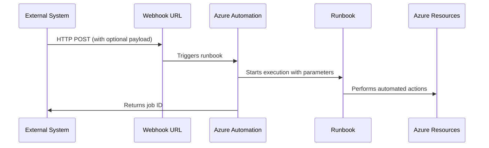

# How to Set Up Azure Automation Webhooks to Trigger Runbooks from External Systems

Author: [nawazdhandala](https://www.github.com/nawazdhandala)

Tags: Azure Automation, Webhooks, Runbooks, Automation, Integration, Azure Cloud, DevOps

Description: Learn how to create webhooks for Azure Automation runbooks so external systems like monitoring tools, CI/CD pipelines, and custom applications can trigger automated responses.

---

Azure Automation runbooks are useful for scheduled tasks and Azure-triggered automation, but their real power comes from being triggered by external systems. A monitoring tool detects a problem and triggers a remediation runbook. A CI/CD pipeline deploys an application and triggers a post-deployment configuration runbook. A custom portal lets users provision resources by triggering a runbook behind the scenes.

Webhooks make this possible. A webhook is an HTTP endpoint that triggers a specific runbook when called. The external system just needs to send an HTTP POST request - no Azure authentication required, no SDK needed.

## How Webhooks Work

When you create a webhook for a runbook, Azure generates a unique URL. Any system that can make an HTTP POST request to that URL will trigger the runbook. The request body can contain parameters that the runbook uses during execution.

The flow looks like this:



Security is handled by the URL itself - it contains a token that authenticates the request. Anyone with the URL can trigger the runbook, so treat it like a secret.

## Step 1: Create an Automation Account

If you do not already have one:

```bash
# Create an Azure Automation account
az automation account create \
  --name myAutomationAccount \
  --resource-group myRG \
  --location eastus \
  --sku Basic
```

## Step 2: Create a Runbook

Create a PowerShell runbook that the webhook will trigger. This example restarts a VM:

```powershell
# Runbook: Restart-VM-Runbook.ps1
# This runbook restarts a specified Azure VM
# It can be triggered by a webhook with the VM name in the request body

param(
    [Parameter(Mandatory=$false)]
    [object]$WebhookData
)

# Check if the runbook was triggered by a webhook
if ($WebhookData) {
    # Parse the request body
    $RequestBody = ConvertFrom-Json -InputObject $WebhookData.RequestBody

    $VMName = $RequestBody.VMName
    $ResourceGroup = $RequestBody.ResourceGroup

    Write-Output "Webhook triggered - Restarting VM: $VMName in resource group: $ResourceGroup"
} else {
    Write-Output "Not triggered by webhook, using default parameters"
    $VMName = "defaultVM"
    $ResourceGroup = "defaultRG"
}

# Authenticate using the Automation Account's managed identity
try {
    Connect-AzAccount -Identity
    Write-Output "Authenticated with managed identity"
} catch {
    Write-Error "Failed to authenticate: $_"
    throw
}

# Restart the VM
try {
    Restart-AzVM -ResourceGroupName $ResourceGroup -Name $VMName -Force
    Write-Output "Successfully restarted VM: $VMName"
} catch {
    Write-Error "Failed to restart VM: $_"
    throw
}
```

Publish the runbook:

```bash
# Create and publish the runbook
az automation runbook create \
  --automation-account-name myAutomationAccount \
  --resource-group myRG \
  --name Restart-VM-Runbook \
  --type PowerShell

# Upload the script content
az automation runbook replace-content \
  --automation-account-name myAutomationAccount \
  --resource-group myRG \
  --name Restart-VM-Runbook \
  --content @Restart-VM-Runbook.ps1

# Publish the runbook
az automation runbook publish \
  --automation-account-name myAutomationAccount \
  --resource-group myRG \
  --name Restart-VM-Runbook
```

## Step 3: Create the Webhook

Create a webhook that triggers the runbook:

```bash
# Create a webhook for the runbook
# IMPORTANT: The URL is only shown once - save it immediately
az automation webhook create \
  --automation-account-name myAutomationAccount \
  --resource-group myRG \
  --name restart-vm-webhook \
  --runbook-name Restart-VM-Runbook \
  --expiry-time "2025-12-31T23:59:59Z" \
  --is-enabled true
```

The response includes the webhook URL. Copy it immediately - Azure will never show the full URL again. If you lose it, you need to create a new webhook.

The URL looks something like:
```
https://s1events.azure-automation.net/webhooks?token=AbCdEfGhIjKlMnOpQrStUvWxYz1234567890
```

## Step 4: Trigger the Webhook from External Systems

Now any system can trigger the runbook with a simple HTTP POST.

**From curl (testing)**:

```bash
# Trigger the webhook with VM details in the request body
curl -X POST "https://s1events.azure-automation.net/webhooks?token=<your-token>" \
  -H "Content-Type: application/json" \
  -d '{
    "VMName": "web-server-01",
    "ResourceGroup": "production-rg"
  }'
```

**From a monitoring alert (Azure Monitor action group)**:

Create an action group with a webhook action pointing to your webhook URL. When an alert fires, it sends the alert payload to the webhook, which triggers the runbook.

**From a CI/CD pipeline (GitHub Actions)**:

```yaml
# GitHub Actions workflow step to trigger Azure Automation runbook
- name: Trigger post-deploy configuration
  run: |
    curl -X POST "${{ secrets.AZURE_WEBHOOK_URL }}" \
      -H "Content-Type: application/json" \
      -d '{
        "VMName": "${{ env.VM_NAME }}",
        "ResourceGroup": "${{ env.RESOURCE_GROUP }}",
        "DeploymentVersion": "${{ github.sha }}"
      }'
```

**From Python (custom application)**:

```python
import requests
import json

def trigger_vm_restart(vm_name, resource_group):
    """Trigger the Azure Automation runbook to restart a VM."""
    webhook_url = "https://s1events.azure-automation.net/webhooks?token=<your-token>"

    payload = {
        "VMName": vm_name,
        "ResourceGroup": resource_group
    }

    # Send the POST request to trigger the runbook
    response = requests.post(
        webhook_url,
        data=json.dumps(payload),
        headers={"Content-Type": "application/json"}
    )

    if response.status_code == 202:
        job_id = response.json().get("JobIds", [None])[0]
        print(f"Runbook triggered successfully. Job ID: {job_id}")
        return job_id
    else:
        print(f"Failed to trigger runbook: {response.status_code} - {response.text}")
        return None
```

## Step 5: Parse Webhook Data in the Runbook

The webhook passes data to the runbook through the `$WebhookData` parameter. This object has two important properties:

- `$WebhookData.RequestHeader`: The HTTP headers from the request
- `$WebhookData.RequestBody`: The body of the POST request (your JSON payload)

Here is a more robust example that validates the input:

```powershell
# Runbook with input validation and error handling
param(
    [Parameter(Mandatory=$false)]
    [object]$WebhookData
)

if (-not $WebhookData) {
    Write-Error "This runbook must be triggered by a webhook"
    exit 1
}

# Parse and validate the request body
try {
    $RequestBody = ConvertFrom-Json -InputObject $WebhookData.RequestBody
} catch {
    Write-Error "Invalid JSON in request body: $_"
    exit 1
}

# Validate required parameters
$VMName = $RequestBody.VMName
$ResourceGroup = $RequestBody.ResourceGroup
$Action = $RequestBody.Action  # start, stop, restart

if (-not $VMName -or -not $ResourceGroup) {
    Write-Error "VMName and ResourceGroup are required parameters"
    exit 1
}

if ($Action -notin @("start", "stop", "restart")) {
    Write-Error "Action must be 'start', 'stop', or 'restart'. Got: $Action"
    exit 1
}

# Log the webhook source for audit purposes
$WebhookName = $WebhookData.WebhookName
$RequestHeader = $WebhookData.RequestHeader
Write-Output "Triggered by webhook: $WebhookName"
Write-Output "Action: $Action on VM: $VMName in RG: $ResourceGroup"

# Authenticate and execute
Connect-AzAccount -Identity

switch ($Action) {
    "start"   { Start-AzVM -ResourceGroupName $ResourceGroup -Name $VMName -Force }
    "stop"    { Stop-AzVM -ResourceGroupName $ResourceGroup -Name $VMName -Force }
    "restart" { Restart-AzVM -ResourceGroupName $ResourceGroup -Name $VMName -Force }
}

Write-Output "Completed $Action on $VMName"
```

## Step 6: Manage Webhook Security

Since anyone with the URL can trigger the runbook, security is important:

**Rotate webhooks**: Set reasonable expiry dates and create new webhooks before old ones expire. Automate the rotation process.

**Add input validation**: Never trust the incoming data. Validate all parameters, check that resource names match expected patterns, and reject unexpected input.

**Limit runbook permissions**: The Automation Account's managed identity should have the minimum permissions needed. If the runbook only restarts VMs in one resource group, only grant permissions on that resource group.

**Log all executions**: Include audit logging in your runbook so you have a record of what was triggered and when.

**Use Azure API Management**: For production webhooks, put them behind API Management to add rate limiting, IP whitelisting, and additional authentication layers.

## Step 7: Monitor Webhook Executions

Track runbook execution history:

```bash
# List recent jobs for the runbook
az automation job list \
  --automation-account-name myAutomationAccount \
  --resource-group myRG \
  --query "[?runbook.name=='Restart-VM-Runbook'].{Status:status, StartTime:startTime, EndTime:endTime}" \
  --output table
```

Get the output of a specific job:

```bash
# Get the output stream of a specific job
az automation job show-output \
  --automation-account-name myAutomationAccount \
  --resource-group myRG \
  --job-name <job-id>
```

## Common Use Cases

- **Auto-remediation**: Monitoring detects an issue, webhook triggers a fix (restart service, clear disk space, scale up)
- **Self-service provisioning**: Internal portal triggers resource creation through webhooks
- **Post-deployment tasks**: CI/CD pipeline triggers configuration or validation runbooks after deployment
- **Incident response**: SIEM or ticketing system triggers evidence collection or isolation runbooks
- **Scheduled external triggers**: Third-party schedulers or workflow engines trigger Azure Automation tasks

## Summary

Azure Automation webhooks turn your runbooks into API endpoints that any system can call. The setup is straightforward - create a runbook, create a webhook, and send a POST request. The key considerations are security (treat the URL as a secret, validate inputs, limit permissions) and reliability (log executions, handle errors gracefully, monitor job status). With webhooks, your Azure Automation runbooks become building blocks that integrate with any system that can make HTTP requests.
