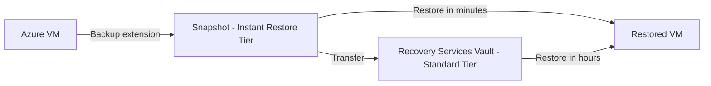

# How to Set Up Azure Backup for Azure Virtual Machines Using Backup Policies

Author: [nawazdhandala](https://www.github.com/nawazdhandala)

Tags: Azure Backup, Virtual Machines, Backup Policy, Recovery Services Vault, Azure, Data Protection, Snapshots

Description: Complete guide to setting up Azure Backup for Azure VMs including creating backup policies, configuring schedules, retention settings, and monitoring backup jobs.

---

Backups are one of those things nobody thinks about until they need one. Azure Backup for VMs is dead simple to set up, but there are enough configuration options that it is worth understanding what each one does before you flip the switch. A misconfigured backup policy can leave you with too few recovery points during a critical window or cost you more than necessary by retaining data you do not need.

This guide covers creating backup policies, applying them to VMs, and making sure everything actually works.

## How Azure VM Backup Works

When Azure Backup runs for a VM, it takes an application-consistent snapshot using the VM's backup extension. The process looks like this:

1. The Azure Backup service triggers the VM extension
2. The extension coordinates with VSS (Windows) or filesystem freeze (Linux) to create an application-consistent snapshot
3. The snapshot is stored as a recovery point in the Recovery Services vault
4. Optionally, data is transferred from the snapshot to the vault for longer-term storage

Azure Backup offers two tiers for recovery points:

**Snapshot tier (Instant Restore)** - Recovery points are stored as snapshots of the VM's managed disks. Restores from this tier are very fast because you are restoring from local snapshots. Retained for 1-5 days.

**Vault tier** - Snapshot data is transferred to the vault for longer-term retention. Restores take longer because data must be hydrated from the vault. Retained according to your policy (days, weeks, months, years).



## Prerequisites

- An Azure subscription
- Azure VMs running Windows or Linux (supported OS versions)
- A Recovery Services vault in the same region as the VMs
- VMs must use managed disks
- The VM must be running (or at least deallocated - not stopped from within the OS)

## Step 1: Create a Recovery Services Vault

If you do not already have one, create a vault in the same region as your VMs:

```bash
# Create a resource group for backup resources
az group create \
    --name rg-backup-eastus2 \
    --location eastus2

# Create the Recovery Services vault
az backup vault create \
    --resource-group rg-backup-eastus2 \
    --name rsv-backup-eastus2-001 \
    --location eastus2
```

Note: For backup, the vault should be in the same region as the VMs (unlike Site Recovery, where the vault is in a different region).

## Step 2: Create a Backup Policy

Backup policies define the schedule and retention for your backups. Create policies that match different workload requirements.

### Using the Portal

1. Open the Recovery Services vault
2. Go to "Backup policies"
3. Click "Add"
4. Select "Azure Virtual Machine" as the policy type
5. Configure the settings

### Policy Configuration Options

**Schedule frequency**: Daily or hourly

For daily backups:
- Choose the time of day (typically overnight during low-usage periods)
- Choose the timezone

For hourly backups (Enhanced policy):
- Choose the frequency (every 4, 6, 8, or 12 hours)
- Set the start time and duration window

**Instant Restore retention**: 1-5 days. This determines how long snapshot-tier recovery points are kept. More days means faster restores but higher snapshot storage costs.

**Daily retention**: How many daily backup points to keep (7-9999 days)

**Weekly retention**: Keep the backup from a specific day of the week for a longer period

**Monthly retention**: Keep the backup from a specific day or week of the month

**Yearly retention**: Keep the backup from a specific day for years

Here is an example of creating a comprehensive backup policy with Azure CLI:

```bash
# Create a backup policy with daily, weekly, monthly, and yearly retention
# This policy backs up daily at 11 PM UTC with tiered retention

az backup policy create \
    --resource-group rg-backup-eastus2 \
    --vault-name rsv-backup-eastus2-001 \
    --name policy-production-vms \
    --backup-management-type AzureIaasVM \
    --policy '{
        "schedulePolicy": {
            "schedulePolicyType": "SimpleSchedulePolicy",
            "scheduleRunFrequency": "Daily",
            "scheduleRunTimes": ["2026-02-16T23:00:00Z"]
        },
        "retentionPolicy": {
            "retentionPolicyType": "LongTermRetentionPolicy",
            "dailySchedule": {
                "retentionTimes": ["2026-02-16T23:00:00Z"],
                "retentionDuration": {
                    "count": 30,
                    "durationType": "Days"
                }
            },
            "weeklySchedule": {
                "daysOfTheWeek": ["Sunday"],
                "retentionTimes": ["2026-02-16T23:00:00Z"],
                "retentionDuration": {
                    "count": 12,
                    "durationType": "Weeks"
                }
            },
            "monthlySchedule": {
                "retentionScheduleFormatType": "Weekly",
                "retentionScheduleWeekly": {
                    "daysOfTheWeek": ["Sunday"],
                    "weeksOfTheMonth": ["First"]
                },
                "retentionTimes": ["2026-02-16T23:00:00Z"],
                "retentionDuration": {
                    "count": 12,
                    "durationType": "Months"
                }
            },
            "yearlySchedule": {
                "retentionScheduleFormatType": "Weekly",
                "retentionScheduleWeekly": {
                    "daysOfTheWeek": ["Sunday"],
                    "weeksOfTheMonth": ["First"]
                },
                "monthsOfYear": ["January"],
                "retentionTimes": ["2026-02-16T23:00:00Z"],
                "retentionDuration": {
                    "count": 3,
                    "durationType": "Years"
                }
            }
        },
        "instantRpRetentionRangeInDays": 5,
        "timeZone": "UTC"
    }'
```

This policy gives you:
- 30 daily recovery points
- 12 weekly recovery points (Sundays)
- 12 monthly recovery points (first Sunday of each month)
- 3 yearly recovery points (first Sunday of January)
- 5 days of instant restore snapshots

## Step 3: Enable Backup for VMs

With the policy created, apply it to your VMs:

### Using the Portal

1. Go to the Recovery Services vault
2. Click "Backup"
3. Workload: "Azure" and type: "Virtual machine"
4. Select the backup policy
5. Select the VMs to protect
6. Click "Enable backup"

### Using Azure CLI

```bash
# Enable backup for a VM using the production policy
az backup protection enable-for-vm \
    --resource-group rg-backup-eastus2 \
    --vault-name rsv-backup-eastus2-001 \
    --vm vm-web-01 \
    --policy-name policy-production-vms

# Enable backup for multiple VMs in a loop
for vm in vm-web-01 vm-app-01 vm-sql-01 vm-cache-01; do
    az backup protection enable-for-vm \
        --resource-group rg-backup-eastus2 \
        --vault-name rsv-backup-eastus2-001 \
        --vm $vm \
        --policy-name policy-production-vms
    echo "Backup enabled for $vm"
done
```

The first backup runs according to the schedule, but you can also trigger an immediate backup:

```bash
# Trigger an on-demand backup immediately
# Retain this backup for 30 days regardless of the policy
az backup protection backup-now \
    --resource-group rg-backup-eastus2 \
    --vault-name rsv-backup-eastus2-001 \
    --container-name "IaasVMContainer;V2;rg-production;vm-web-01" \
    --item-name "VM;iaasvmcontainerv2;rg-production;vm-web-01" \
    --retain-until 2026-03-18
```

## Step 4: Monitor Backup Jobs

Check that backups are running successfully:

### Using the Portal

1. In the vault, go to "Backup jobs"
2. Filter by time range and status
3. Look for any failed or in-progress jobs

### Using Azure CLI

```bash
# List recent backup jobs and their status
az backup job list \
    --resource-group rg-backup-eastus2 \
    --vault-name rsv-backup-eastus2-001 \
    --output table

# Get details of a specific job
az backup job show \
    --resource-group rg-backup-eastus2 \
    --vault-name rsv-backup-eastus2-001 \
    --name "job-id-here"
```

### Set Up Alerts

Configure alerts for failed backups so you are not caught off guard:

1. In the vault, go to "Alerts"
2. Enable built-in alerts for:
   - Backup failure
   - Backup warning
   - Delete protection data (someone attempting to remove backups)

## Step 5: Verify Backup Data

Periodically verify that your backups actually contain the data you expect:

1. Check recovery point counts for each VM
2. Perform test restores to verify data integrity
3. Document restore times for capacity planning

```bash
# List recovery points for a specific VM
az backup recoverypoint list \
    --resource-group rg-backup-eastus2 \
    --vault-name rsv-backup-eastus2-001 \
    --container-name "IaasVMContainer;V2;rg-production;vm-web-01" \
    --item-name "VM;iaasvmcontainerv2;rg-production;vm-web-01" \
    --output table
```

## Cost Management Tips

Azure Backup pricing has two components: the protected instance fee (per VM per month) and storage consumed (per GB per month).

**Right-size retention.** Do not keep 365 daily backups if you only need 30. Each recovery point stores incremental data, but it adds up.

**Use tiered retention.** Keep daily backups for 30 days, weekly for 12 weeks, monthly for 12 months, and yearly for 3-7 years. This gives you coverage without excessive storage.

**Monitor snapshot costs.** Instant Restore snapshots are stored as managed disk snapshots and billed separately from vault storage. Set the instant restore retention to the minimum you need (1-2 days for most workloads).

**Use Azure Backup Reserved Capacity.** For large deployments, reserved capacity offers discounts on vault storage.

## Wrapping Up

Setting up Azure Backup for VMs is straightforward, but the details matter. Choose backup frequencies and retention that match your RPO requirements and compliance obligations. Apply policies consistently across all VMs. Monitor backup jobs actively and investigate failures immediately. Most importantly, test your restores periodically. A backup that has never been restored is just a theory about whether your data is recoverable.
