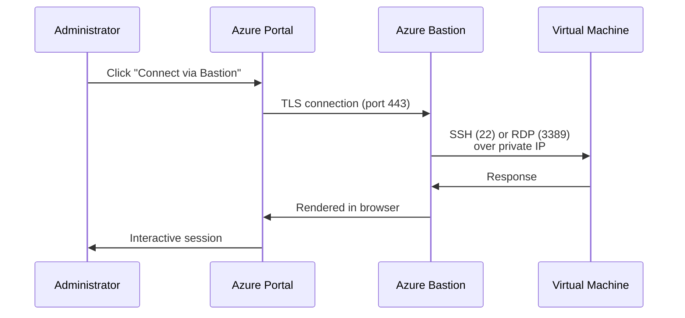

# How to Set Up Azure Bastion to Securely Connect to Virtual Machines

Author: [nawazdhandala](https://www.github.com/nawazdhandala)

Tags: Azure, Bastion, SSH, RDP, Secure Access, Virtual Machines, Azure Networking

Description: Learn how to deploy Azure Bastion for secure browser-based SSH and RDP connections to your Azure VMs without exposing public IP addresses.

---

Every time you expose SSH or RDP ports to the internet, you create a target for brute-force attacks, credential stuffing, and vulnerability scanners. The traditional approach - assigning a public IP to a VM and restricting access with NSG rules - works, but it still leaves a management port visible on the internet. Azure Bastion eliminates this risk entirely by providing browser-based SSH and RDP access through the Azure portal, without ever exposing your VMs to the public internet.

Azure Bastion is a fully managed PaaS service deployed inside your virtual network. You connect to it through the Azure portal over TLS, and it initiates the SSH or RDP session to your VM's private IP address. Your VMs never need public IPs for management access.

## How Azure Bastion Works



The administrator never directly touches the VM. All traffic from the browser goes to the Bastion service over HTTPS, and Bastion handles the SSH/RDP connection internally. This means no public IPs on VMs, no NSG rules for management ports, and no VPN required.

## Prerequisites

- An Azure subscription
- A virtual network with at least one VM
- Azure CLI installed

## Step 1: Create the Bastion Subnet

Azure Bastion requires a dedicated subnet named exactly `AzureBastionSubnet` with a minimum size of /26.

```bash
# Create a resource group (or use an existing one)
az group create --name rg-bastion-demo --location eastus

# Create a VNet (or use an existing one)
az network vnet create \
  --resource-group rg-bastion-demo \
  --name vnet-demo \
  --location eastus \
  --address-prefixes 10.0.0.0/16 \
  --subnet-name subnet-workloads \
  --subnet-prefixes 10.0.0.0/24

# Create the AzureBastionSubnet
az network vnet subnet create \
  --resource-group rg-bastion-demo \
  --vnet-name vnet-demo \
  --name AzureBastionSubnet \
  --address-prefixes 10.0.1.0/26
```

The subnet must be named `AzureBastionSubnet`. Any other name will fail. The /26 is the absolute minimum and supports up to 50 concurrent sessions. For larger environments, use /25 or bigger.

## Step 2: Create a Public IP for Bastion

Azure Bastion needs a Standard SKU public IP address.

```bash
# Create a public IP for Bastion
az network public-ip create \
  --resource-group rg-bastion-demo \
  --name pip-bastion \
  --sku Standard \
  --allocation-method Static
```

## Step 3: Deploy Azure Bastion

```bash
# Create Azure Bastion
az network bastion create \
  --resource-group rg-bastion-demo \
  --name bastion-demo \
  --public-ip-address pip-bastion \
  --vnet-name vnet-demo \
  --sku Standard \
  --location eastus
```

The deployment takes about 5-10 minutes. The SKU options are:

- **Basic**: Browser-based SSH/RDP, manual connection through the portal
- **Standard**: Everything in Basic plus native client support, shareable links, file transfer, and connection through the Azure CLI

For most use cases, Standard is worth the extra cost because of the native client support.

## Step 4: Create a Test VM (No Public IP)

Let us create a VM without a public IP to demonstrate that Bastion provides the only access path.

```bash
# Create a VM without a public IP
az vm create \
  --resource-group rg-bastion-demo \
  --name vm-test \
  --image Ubuntu2204 \
  --vnet-name vnet-demo \
  --subnet subnet-workloads \
  --admin-username azureuser \
  --generate-ssh-keys \
  --public-ip-address "" \
  --size Standard_B1s
```

Notice the `--public-ip-address ""` flag. This VM has no public IP and is only reachable through Bastion or from within the VNet.

## Step 5: Connect via the Azure Portal

1. Navigate to the VM in the Azure portal
2. Click "Connect" in the top menu
3. Select "Bastion"
4. Enter the username and either password or SSH key
5. Click "Connect"

A new browser tab opens with the SSH or RDP session. No client software needed, no VPN required.

## Step 6: Connect Using the Native Client (Standard SKU)

If you are using the Standard SKU, you can use your local SSH client or RDP client instead of the browser.

```bash
# Connect via native SSH client through Bastion
az network bastion ssh \
  --resource-group rg-bastion-demo \
  --name bastion-demo \
  --target-resource-id $(az vm show --resource-group rg-bastion-demo --name vm-test --query id -o tsv) \
  --auth-type ssh-key \
  --username azureuser \
  --ssh-key ~/.ssh/id_rsa
```

This tunnels your native SSH connection through the Bastion service. You get the full SSH experience (port forwarding, SCP, etc.) with the security of Bastion.

For RDP connections to Windows VMs:

```bash
# Connect via native RDP client through Bastion
az network bastion rdp \
  --resource-group rg-bastion-demo \
  --name bastion-demo \
  --target-resource-id $(az vm show --resource-group rg-bastion-demo --name vm-win --query id -o tsv)
```

## Step 7: Configure NSG for the Bastion Subnet

The AzureBastionSubnet needs specific NSG rules to function properly. Here is the minimum required configuration.

```bash
# Create an NSG for the Bastion subnet
az network nsg create \
  --resource-group rg-bastion-demo \
  --name nsg-bastion \
  --location eastus

# Allow inbound HTTPS from internet (for portal access)
az network nsg rule create \
  --resource-group rg-bastion-demo \
  --nsg-name nsg-bastion \
  --name AllowHttpsInbound \
  --priority 100 \
  --direction Inbound \
  --access Allow \
  --protocol Tcp \
  --source-address-prefixes Internet \
  --destination-port-ranges 443

# Allow inbound from GatewayManager (Azure management traffic)
az network nsg rule create \
  --resource-group rg-bastion-demo \
  --nsg-name nsg-bastion \
  --name AllowGatewayManagerInbound \
  --priority 110 \
  --direction Inbound \
  --access Allow \
  --protocol Tcp \
  --source-address-prefixes GatewayManager \
  --destination-port-ranges 443

# Allow outbound SSH/RDP to VNet
az network nsg rule create \
  --resource-group rg-bastion-demo \
  --nsg-name nsg-bastion \
  --name AllowSshRdpOutbound \
  --priority 100 \
  --direction Outbound \
  --access Allow \
  --protocol Tcp \
  --destination-address-prefixes VirtualNetwork \
  --destination-port-ranges 22 3389

# Allow outbound HTTPS to Azure Cloud (for management)
az network nsg rule create \
  --resource-group rg-bastion-demo \
  --nsg-name nsg-bastion \
  --name AllowAzureCloudOutbound \
  --priority 110 \
  --direction Outbound \
  --access Allow \
  --protocol Tcp \
  --destination-address-prefixes AzureCloud \
  --destination-port-ranges 443

# Associate the NSG with the Bastion subnet
az network vnet subnet update \
  --resource-group rg-bastion-demo \
  --vnet-name vnet-demo \
  --name AzureBastionSubnet \
  --network-security-group nsg-bastion
```

## File Transfer with Bastion

With the Standard SKU, you can upload and download files through the browser-based session.

- **Upload**: Drag and drop files or use the upload button in the Bastion toolbar
- **Download**: Files are downloaded through the browser

For the native client, you can use SCP as you normally would since the SSH tunnel supports it.

## Cost Considerations

Azure Bastion charges for two things:

1. **Hourly charge** for the Bastion deployment (whether you are using it or not)
2. **Data transfer** charges for data going through Bastion

The Basic SKU is cheaper per hour, but the Standard SKU provides significantly more features. For development environments where cost matters, consider deploying Bastion only when needed and deleting it when done. For production, the security benefits usually justify the continuous cost.

## Shareable Links (Standard SKU)

The Standard SKU supports shareable links, which let you create a URL that other users can use to connect to a specific VM without needing Azure portal access. This is useful for giving temporary access to contractors or support staff.

## Cleanup

```bash
# Delete all resources
az group delete --name rg-bastion-demo --yes --no-wait
```

## Wrapping Up

Azure Bastion removes the need to expose SSH and RDP ports to the internet. Deploy it in a dedicated subnet, point your VMs at it through the portal or native client, and you get secure management access without public IPs or VPNs. The Standard SKU is worth considering for the native client support and file transfer capabilities. For any production environment, Bastion should be your default method for VM management access rather than opening management ports through NSGs.
