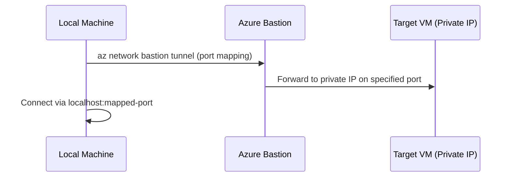

# How to Set Up Azure Bastion with IP-Based Connection for Non-Portal Access

Author: [nawazdhandala](https://www.github.com/nawazdhandala)

Tags: Azure, Bastion, Remote Access, Security, SSH, RDP, Networking

Description: Set up Azure Bastion with IP-based connection to connect to VMs using private IP addresses without requiring the Azure portal for access.

---

Azure Bastion provides secure RDP and SSH access to your VMs without exposing them to the public internet, but historically it required going through the Azure portal for every connection. That is fine for occasional troubleshooting, but it is a poor workflow for daily operations or when you need to use native SSH/RDP clients with features like file transfer, multi-hop connections, or custom terminal configurations.

Azure Bastion's IP-based connection feature changes this. It lets you connect to any VM by specifying its private IP address directly from your local SSH or RDP client through a tunnel, without needing the Azure portal. This guide walks through the setup.

## How IP-Based Connection Works

Standard Azure Bastion connections require you to select a VM resource in the Azure portal, and Bastion connects to it. IP-based connections remove that requirement. Instead, you establish a tunnel from your local machine to Azure Bastion, and Bastion forwards the traffic to the target VM's private IP address.



The tunnel creates a local port mapping on your machine. You then connect your SSH or RDP client to `localhost` on the mapped port, and Bastion handles forwarding the connection to the target VM's private IP.

## Prerequisites

- Azure Bastion deployed with Standard SKU (IP-based connections require Standard or Premium)
- Azure CLI version 2.32 or later
- The `ssh` and `bastion` extensions for Azure CLI
- Target VMs must be reachable from the Bastion subnet (no NSG blocking traffic between them)

## Step 1: Deploy Azure Bastion with Standard SKU

If you do not already have Azure Bastion deployed, or if you have the Basic SKU, you need Standard or higher for IP-based connections.

```bash
# Create the AzureBastionSubnet (required name, minimum /26)
az network vnet subnet create \
  --name AzureBastionSubnet \
  --resource-group myResourceGroup \
  --vnet-name myVNet \
  --address-prefixes "10.0.255.0/26"

# Create a public IP for Bastion
az network public-ip create \
  --name bastion-pip \
  --resource-group myResourceGroup \
  --location eastus \
  --sku Standard \
  --allocation-method Static

# Deploy Azure Bastion with Standard SKU
az network bastion create \
  --name myBastion \
  --resource-group myResourceGroup \
  --location eastus \
  --vnet-name myVNet \
  --public-ip-address bastion-pip \
  --sku Standard \
  --enable-ip-connect true \
  --enable-tunneling true
```

The two critical flags are:

- **enable-ip-connect**: Allows connections by IP address instead of requiring a VM resource reference
- **enable-tunneling**: Enables the CLI tunnel feature that creates local port forwarding

## Step 2: Upgrade Existing Bastion to Support IP-Based Connections

If you already have Bastion deployed but with Basic SKU, upgrade it:

```bash
# Upgrade Bastion SKU from Basic to Standard
az network bastion update \
  --name myBastion \
  --resource-group myResourceGroup \
  --sku Standard \
  --enable-ip-connect true \
  --enable-tunneling true
```

Note that downgrading from Standard to Basic is not supported. This is a one-way upgrade.

## Step 3: Install Required CLI Extensions

Make sure you have the necessary Azure CLI extensions:

```bash
# Install or update the SSH extension
az extension add --name ssh --upgrade

# Install or update the bastion extension
az extension add --name bastion --upgrade

# Verify the extensions are installed
az extension list --output table
```

## Step 4: Create a Tunnel for SSH Access

Now you can create a tunnel from your local machine to a target VM:

```bash
# Create a tunnel to a Linux VM on port 22
# This maps local port 2222 to the target VM's port 22 through Bastion
az network bastion tunnel \
  --name myBastion \
  --resource-group myResourceGroup \
  --target-ip-address 10.0.1.10 \
  --resource-port 22 \
  --port 2222
```

This command blocks and keeps the tunnel open. Open a new terminal window to connect:

```bash
# Connect via SSH through the tunnel
# Use localhost and the mapped port (2222)
ssh -p 2222 azureuser@localhost
```

You can also use it with SSH keys and config options:

```bash
# SSH with key file through the Bastion tunnel
ssh -p 2222 -i ~/.ssh/mykey azureuser@localhost

# SSH with port forwarding (useful for accessing services on the VM)
ssh -p 2222 -L 8080:localhost:8080 azureuser@localhost
```

## Step 5: Create a Tunnel for RDP Access

The same tunnel approach works for Windows VMs with RDP:

```bash
# Create a tunnel to a Windows VM on port 3389
# Maps local port 33389 to the VM's RDP port
az network bastion tunnel \
  --name myBastion \
  --resource-group myResourceGroup \
  --target-ip-address 10.0.2.10 \
  --resource-port 3389 \
  --port 33389
```

Then connect with your RDP client:

```bash
# On macOS, use Microsoft Remote Desktop and connect to:
# localhost:33389

# On Windows, use mstsc:
mstsc /v:localhost:33389

# On Linux, use xfreerdp:
xfreerdp /v:localhost:33389 /u:azureadmin
```

## Step 6: Connect to VMs in Peered VNets

One advantage of IP-based connections is that you can reach VMs in peered VNets, not just VMs in the same VNet as Bastion. As long as the Bastion subnet can route to the target IP, the connection works.

```bash
# Connect to a VM in a peered VNet
# The target VM is in a different VNet but reachable via VNet peering
az network bastion tunnel \
  --name myBastion \
  --resource-group myResourceGroup \
  --target-ip-address 10.1.0.15 \
  --resource-port 22 \
  --port 2223
```

This is particularly useful in hub-and-spoke topologies where Bastion is deployed in the hub VNet but you need to reach VMs in spoke VNets.

## Step 7: Connect to Non-Azure Resources

IP-based connections are not limited to Azure VMs. You can connect to any device that has a private IP reachable from the Bastion subnet. This includes:

- On-premises machines accessible through ExpressRoute or VPN
- Network appliances (firewalls, routers, switches)
- Kubernetes node VMs
- Any other compute resource with a private IP

```bash
# Connect to an on-premises server through ExpressRoute
# The on-premises server at 172.16.1.50 is reachable from the Bastion VNet
az network bastion tunnel \
  --name myBastion \
  --resource-group myResourceGroup \
  --target-ip-address 172.16.1.50 \
  --resource-port 22 \
  --port 2224
```

## Step 8: Automate with Scripts

For teams that connect to many VMs regularly, create a helper script:

```bash
#!/bin/bash
# bastion-connect.sh - Helper script for Bastion IP-based connections
# Usage: ./bastion-connect.sh <target-ip> <port> [local-port]

TARGET_IP=$1
REMOTE_PORT=${2:-22}
LOCAL_PORT=${3:-2222}
BASTION_NAME="myBastion"
RESOURCE_GROUP="myResourceGroup"

# Start the tunnel in the background
az network bastion tunnel \
  --name $BASTION_NAME \
  --resource-group $RESOURCE_GROUP \
  --target-ip-address $TARGET_IP \
  --resource-port $REMOTE_PORT \
  --port $LOCAL_PORT &

TUNNEL_PID=$!

# Wait for the tunnel to establish
sleep 5

# Connect via SSH
ssh -p $LOCAL_PORT -o StrictHostKeyChecking=no azureuser@localhost

# Clean up the tunnel when SSH exits
kill $TUNNEL_PID 2>/dev/null
```

## Security Considerations

**NSG rules**: Make sure the NSG on the AzureBastionSubnet allows outbound traffic to the target subnets. Also ensure the target VM's subnet NSG allows inbound traffic from the AzureBastionSubnet address range.

**RBAC permissions**: Users need the following minimum permissions to use Bastion tunneling:
- Reader role on the Bastion resource
- Reader role on the virtual network
- If using IP-based connect, no specific VM permissions are needed (since you are connecting by IP, not by VM resource)

**Audit logging**: All Bastion connections are logged in Azure Activity Log and Bastion diagnostic logs. Enable diagnostic logging to track who connects to which IPs:

```bash
# Enable Bastion diagnostic logging
az monitor diagnostic-settings create \
  --name "bastion-diagnostics" \
  --resource "/subscriptions/{sub-id}/resourceGroups/myResourceGroup/providers/Microsoft.Network/bastionHosts/myBastion" \
  --workspace "/subscriptions/{sub-id}/resourceGroups/myResourceGroup/providers/Microsoft.OperationalInsights/workspaces/myWorkspace" \
  --logs '[{"category": "BastionAuditLogs", "enabled": true}]'
```

## Wrapping Up

Azure Bastion with IP-based connections bridges the gap between the security of Bastion and the flexibility of native SSH/RDP clients. By using the CLI tunnel feature, you get local port forwarding that works with any client tool, supports file transfers, and does not require the Azure portal. The Standard SKU requirement adds cost compared to Basic, but the productivity gains for teams that need frequent VM access make it worthwhile. Enable both IP connect and tunneling on your Bastion deployment, install the CLI extensions, and you are ready to go.
