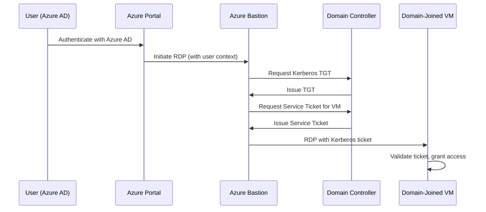

# How to Set Up Azure Bastion with Kerberos Authentication for Domain-Joined VMs

Author: [nawazdhandala](https://www.github.com/nawazdhandala)

Tags: Azure, Bastion, Kerberos, Active Directory, Authentication, RDP, Security

Description: Configure Azure Bastion to use Kerberos authentication for single sign-on RDP access to domain-joined Windows VMs without entering credentials manually.

---

If you manage domain-joined Windows VMs in Azure, you know the drill: connect via Bastion, type in your domain credentials, wait for authentication. Azure Bastion's Kerberos authentication feature streamlines this by using your existing Azure AD credentials to automatically authenticate you to domain-joined VMs via Kerberos. No more typing domain\username and passwords every time you connect - Bastion handles the Kerberos ticket exchange behind the scenes.

This guide walks through setting up Kerberos authentication with Azure Bastion, including the Azure AD DS or AD DS prerequisites, Bastion configuration, and troubleshooting the auth flow.

## How Kerberos Authentication Works with Bastion

In a standard Bastion RDP session, you provide your username and password in the portal, and Bastion passes them to the VM. With Kerberos authentication, the flow is different:



The user authenticates to Azure AD once (portal login), and Bastion uses that identity to obtain Kerberos tickets from the domain controller. The VM receives a Kerberos service ticket and grants access without any manual credential entry.

## Prerequisites

This setup requires several components to be in place:

- **Azure Bastion Standard SKU** (Kerberos requires Standard or higher)
- **Azure AD joined or hybrid Azure AD joined client** (the machine you are connecting from)
- **Domain-joined target VMs** (joined to Azure AD DS or on-premises AD synced to Azure AD)
- **Azure AD DS** (managed domain service) or **on-premises AD DS with Azure AD Connect** configured for password hash synchronization
- **Azure AD Premium P1 or P2 license** for Kerberos-based SSO

## Step 1: Set Up Azure AD DS (If Not Already in Place)

If you are using Azure AD Domain Services as your domain controller, set it up first:

```bash
# Create Azure AD DS managed domain
az ad ds create \
  --name "mycompany.onmicrosoft.com" \
  --resource-group myResourceGroup \
  --location eastus \
  --domain-name "mycompany.com" \
  --vnet-name myVNet \
  --subnet-name aadds-subnet \
  --sku Standard
```

Azure AD DS takes 30-45 minutes to provision. Once ready, it provides domain controllers that Azure VMs can join.

If you are using on-premises AD DS, ensure Azure AD Connect is configured with password hash synchronization enabled, and that your on-premises domain controllers are reachable from the Azure VNet (via VPN or ExpressRoute).

## Step 2: Deploy Azure Bastion with Standard SKU

Kerberos authentication requires Azure Bastion Standard SKU:

```bash
# Create the AzureBastionSubnet
az network vnet subnet create \
  --name AzureBastionSubnet \
  --resource-group myResourceGroup \
  --vnet-name myVNet \
  --address-prefixes "10.0.254.0/26"

# Create a public IP for Bastion
az network public-ip create \
  --name bastion-pip \
  --resource-group myResourceGroup \
  --location eastus \
  --sku Standard \
  --allocation-method Static

# Deploy Bastion with Standard SKU and Kerberos enabled
az network bastion create \
  --name myBastion \
  --resource-group myResourceGroup \
  --location eastus \
  --vnet-name myVNet \
  --public-ip-address bastion-pip \
  --sku Standard \
  --enable-kerberos true
```

The `--enable-kerberos true` flag activates Kerberos authentication support on the Bastion host.

## Step 3: Enable Kerberos on an Existing Bastion

If you already have a Bastion deployment, upgrade it and enable Kerberos:

```bash
# Update existing Bastion to enable Kerberos
az network bastion update \
  --name myBastion \
  --resource-group myResourceGroup \
  --sku Standard \
  --enable-kerberos true
```

## Step 4: Configure the Domain-Joined VMs

Your target VMs need to be joined to the domain and have the correct network configuration to reach the domain controllers.

For VMs joining Azure AD DS:

```powershell
# Join a Windows VM to the Azure AD DS managed domain
# Run this on the VM after DNS is configured to point to Azure AD DS

# Set DNS to Azure AD DS domain controller IPs
$adapter = Get-NetAdapter | Where-Object {$_.Status -eq "Up"}
Set-DnsClientServerAddress -InterfaceIndex $adapter.InterfaceIndex `
  -ServerAddresses "10.0.2.4","10.0.2.5"

# Join the domain
$credential = Get-Credential -Message "Enter domain admin credentials"
Add-Computer -DomainName "mycompany.com" -Credential $credential -Restart
```

For VMs using on-premises AD through VPN/ExpressRoute, ensure the VMs can resolve and reach the on-premises domain controllers:

```powershell
# Verify domain controller connectivity
nltest /dsgetdc:mycompany.com

# Verify DNS resolution for the domain
nslookup _ldap._tcp.dc._msdcs.mycompany.com
```

## Step 5: Configure Azure AD for Kerberos SSO

For Kerberos authentication to work through Bastion, Azure AD needs to be configured to issue Kerberos tickets. This involves registering the Kerberos server object in Azure AD:

```powershell
# Install the Azure AD Kerberos PowerShell module
Install-Module -Name AzureADHybridAuthenticationManagement -AllowClobber

# Connect to Azure AD
Connect-AzureAD

# Create the Kerberos server object
# This enables Azure AD to issue Kerberos tickets for the domain
Set-AzureADKerberosServer -Domain "mycompany.com" `
  -UserPrincipalName "admin@mycompany.com" `
  -DomainCredential (Get-Credential -Message "Enter on-premises domain admin credentials")
```

Verify the Kerberos server object was created:

```powershell
# Verify the Kerberos server configuration
Get-AzureADKerberosServer -Domain "mycompany.com" `
  -UserPrincipalName "admin@mycompany.com" `
  -DomainCredential (Get-Credential)
```

## Step 6: Configure Group Policy for Kerberos

On the target VMs (or via domain Group Policy), ensure the following settings are in place:

```powershell
# Configure the VM to allow Kerberos authentication from Bastion
# These settings should be applied via Group Policy for consistency

# Allow delegating fresh credentials with NTLM-only server authentication
# Group Policy Path: Computer Configuration > Administrative Templates >
#   System > Credentials Delegation > Allow delegating fresh credentials
#   with NTLM-only server authentication

# Set the SPN list to include the Bastion host
# wsman/mybastion.mycompany.com
```

For Azure AD DS environments, the Group Policy Objects are managed through the AADDC Computers OU. You can create and link GPOs using the Group Policy Management Console from a management VM.

## Step 7: Test the Kerberos Connection

Connect to a domain-joined VM through Bastion using the Azure portal:

1. Navigate to the target VM in the Azure portal
2. Click **Connect** > **Bastion**
3. In the authentication type, select **Azure AD** instead of providing local credentials
4. Click **Connect**

If Kerberos is working correctly, you should be connected to the VM without entering any credentials. The portal uses your Azure AD session to obtain the Kerberos ticket automatically.

## Step 8: Verify the Authentication Method

After connecting, verify that Kerberos was used for authentication:

```powershell
# On the target VM, check the logon type
# Run this in the RDP session
klist

# This should show Kerberos tickets:
# #0> Client: user@MYCOMPANY.COM
#    Server: krbtgt/MYCOMPANY.COM
#    KerbTicket Encryption Type: AES-256-CTS-HMAC-SHA1-96
```

You can also check the Windows Security event log for logon events:

```powershell
# Check for Kerberos logon events
Get-WinEvent -LogName Security |
  Where-Object { $_.Id -eq 4624 -and $_.Message -match "Kerberos" } |
  Select-Object -First 5 |
  Format-List TimeCreated, Message
```

Look for Event ID 4624 with Logon Type 10 (RemoteInteractive) and Authentication Package "Kerberos".

## Step 9: Enable Diagnostic Logging

Monitor Kerberos authentication through Bastion:

```bash
# Enable Bastion diagnostic logging
az monitor diagnostic-settings create \
  --name "bastion-kerberos-logs" \
  --resource "/subscriptions/{sub-id}/resourceGroups/myResourceGroup/providers/Microsoft.Network/bastionHosts/myBastion" \
  --workspace "/subscriptions/{sub-id}/resourceGroups/myResourceGroup/providers/Microsoft.OperationalInsights/workspaces/myWorkspace" \
  --logs '[{"category": "BastionAuditLogs", "enabled": true}]'
```

Query the logs for Kerberos-specific events:

```
// KQL query for Bastion Kerberos authentication events
MicrosoftAzureBastionAuditLogs
| where OperationName == "BastionSessionEstablished"
| where Message contains "Kerberos"
| project TimeGenerated, UserName, TargetVMIPAddress, Message
| order by TimeGenerated desc
```

## Troubleshooting

**Kerberos falls back to NTLM**: If the connection succeeds but uses NTLM instead of Kerberos, check that:
- The VM's clock is synchronized with the domain controller (Kerberos is time-sensitive, max skew is 5 minutes)
- DNS resolution works correctly for the domain name
- The Azure AD Kerberos server object exists and is current

**Connection fails with authentication error**: Verify that the user account exists in both Azure AD and the on-premises/Azure AD DS domain. Password hash synchronization must be working for the account.

**"Cannot find domain controller" errors**: Check that the VM's DNS settings point to the domain controllers and that NSG rules allow DNS (UDP/TCP 53) and Kerberos (TCP 88, UDP 88) traffic between the VM and domain controllers.

**Bastion shows "Kerberos not available"**: Ensure the Bastion host is Standard SKU and that `--enable-kerberos true` was set. Also verify that the browser you are using supports the Azure AD Kerberos extension.

## Security Benefits

Kerberos authentication through Bastion provides several security advantages:

- **No password exposure**: Users never type their domain passwords into the Bastion portal. Kerberos tickets are used instead.
- **Single sign-on**: One Azure AD authentication gets you into all domain-joined VMs.
- **MFA integration**: Azure AD conditional access policies (including MFA) are enforced at the portal login, adding an extra layer of security.
- **Ticket expiration**: Kerberos tickets have limited lifetimes, reducing the window for credential theft.

## Wrapping Up

Azure Bastion with Kerberos authentication creates a smooth, secure workflow for accessing domain-joined VMs. Users authenticate to Azure AD once, and Bastion handles the Kerberos ticket exchange to give them RDP access without additional credential prompts. The setup requires Azure AD DS or hybrid AD with password hash sync, Bastion Standard SKU with Kerberos enabled, and proper DNS and network configuration between the VMs and domain controllers. Once working, it significantly improves the daily experience for teams that manage large numbers of domain-joined VMs.
