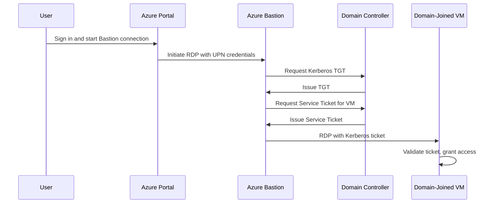

# How to Set Up Azure Bastion with Kerberos Authentication for Domain-Joined VMs

Author: [nawazdhandala](https://www.github.com/nawazdhandala)

Tags: Azure, Bastion, Kerberos, Active Directory, Authentication, RDP, Security

Description: Configure Azure Bastion to use Kerberos authentication for single sign-on RDP access to domain-joined Windows VMs without entering credentials manually.

---

If you manage domain-joined Windows VMs in Azure, you know the drill: connect via Bastion, type in your domain credentials, wait for authentication. Azure Bastion's Kerberos authentication feature lets Bastion use Kerberos instead of falling back to NTLM when you sign in to domain-joined VMs with a user principal name (UPN). Bastion handles the Kerberos exchange behind the scenes.

This guide walks through setting up Kerberos authentication with Azure Bastion, including the AD DS prerequisites, Bastion configuration, and troubleshooting the auth flow.

## How Kerberos Authentication Works with Bastion

In a standard Bastion RDP session, you provide your username and password in the portal, and Bastion passes them to the VM. With Kerberos authentication, the flow is different:


```mermaid
sequenceDiagram
    participant User as User
    participant Portal as Azure Portal
    participant Bastion as Azure Bastion
    participant DC as Domain Controller
    participant VM as Domain-Joined VM
    User->>Portal: Sign in and start Bastion connection
    Portal->>Bastion: Initiate RDP with UPN credentials
    Bastion->>DC: Request Kerberos TGT
    DC->>Bastion: Issue TGT
    Bastion->>DC: Request Service Ticket for VM
    DC->>Bastion: Issue Service Ticket
    Bastion->>VM: RDP with Kerberos ticket
    VM->>VM: Validate ticket, grant access
```

The user signs in through the Azure portal and then uses a UPN, such as `user@mycompany.com`, for the Bastion connection. Bastion uses Kerberos with the domain controller instead of NTLM. The VM receives a Kerberos service ticket and grants access when the domain credentials and permissions are valid.

## Prerequisites

This setup requires several components to be in place:

- **Azure Bastion Basic SKU or higher** (Kerberos isn't available on the Developer SKU)
- **Domain-joined target VMs** joined to the same AD DS domain that Bastion can use for Kerberos
- **An AD DS domain controller running on an Azure VM in the same virtual network as the Bastion deployment**
- **VNet DNS configured to use the domain controller IP address before Bastion is deployed or redeployed**
- **NSG rules that allow DNS, Kerberos, LDAP, Kerberos password change, and LDAPS traffic** on ports 53, 88, 389, 464, and 636 between Bastion, the domain controller, and the target VMs

## Step 1: Set Up AD DS and VNet DNS (If Not Already in Place)

For Azure Bastion Kerberos, the domain controller must be an Azure-hosted VM in the same virtual network where Bastion is deployed. Configure the VNet DNS settings to point to that domain controller before creating or redeploying Bastion:

```bash
# Point the VNet to the Azure-hosted domain controller
az network vnet update \
  --name myVNet \
  --resource-group myResourceGroup \
  --dns-servers 10.0.2.4
```

After the VNet DNS configuration is in place, join the target Windows VMs to the AD DS domain.

If you change the VNet DNS servers after Bastion has already been deployed, delete and re-create the Bastion resource so the updated DNS settings are picked up.

## Step 2: Deploy Azure Bastion with Kerberos Enabled

Kerberos authentication requires Azure Bastion Basic SKU or higher:

```bash
# Create the AzureBastionSubnet
az network vnet subnet create \
  --name AzureBastionSubnet \
  --resource-group myResourceGroup \
  --vnet-name myVNet \
  --address-prefixes "10.0.254.0/26"

# Create a public IP for Bastion
az network public-ip create \
  --name bastion-pip \
  --resource-group myResourceGroup \
  --location eastus \
  --sku Standard \
  --allocation-method Static

# Deploy Bastion with Standard SKU and Kerberos enabled
az network bastion create \
  --name myBastion \
  --resource-group myResourceGroup \
  --location eastus \
  --vnet-name myVNet \
  --public-ip-address bastion-pip \
  --sku Standard \
  --kerberos true
```

The `--kerberos true` flag activates Kerberos authentication support on the Bastion host.

## Step 3: Enable Kerberos on an Existing Bastion

If you already have a Bastion deployment, upgrade it and enable Kerberos:

```bash
# Update existing Bastion to enable Kerberos
az network bastion update \
  --name myBastion \
  --resource-group myResourceGroup \
  --location eastus \
  --sku name=Standard \
  --kerberos true
```

## Step 4: Configure the Domain-Joined VMs

Your target VMs need to be joined to the domain and have the correct network configuration to reach the domain controllers.

For VMs joining the AD DS domain:

```powershell
# Join a Windows VM to the AD DS domain
# Run this on the VM after VNet DNS is configured to point to the domain controller

# Verify the VM resolves the domain through the VNet DNS configuration
$adapter = Get-NetAdapter | Where-Object {$_.Status -eq "Up"}
Get-DnsClientServerAddress -InterfaceIndex $adapter.InterfaceIndex

# Join the domain
$credential = Get-Credential -Message "Enter domain admin credentials"
Add-Computer -DomainName "mycompany.com" -Credential $credential -Restart
```

Ensure the VMs can resolve and reach the Azure-hosted domain controller:

```powershell
# Verify domain controller connectivity
nltest /dsgetdc:mycompany.com

# Verify DNS resolution for the domain
nslookup _ldap._tcp.dc._msdcs.mycompany.com
```

## Step 5: Confirm Kerberos Support on Bastion

For Bastion Kerberos, you don't create a Microsoft Entra Kerberos server object. Confirm that the Bastion resource has Kerberos enabled:

```bash
# Verify the Bastion Kerberos setting
az network bastion show \
  --name myBastion \
  --resource-group myResourceGroup \
  --query enableKerberos
```

If this returns `true`, the Bastion resource is configured for Kerberos authentication.

## Step 6: Prevent NTLM Fallback for Validation

To verify that Bastion is really using Kerberos, configure the target VM to deny incoming NTLM authentication for domain accounts:

```powershell
# Group Policy Path:
# Computer Configuration > Windows Settings > Security Settings >
# Local Policies > Security Options >
# Network security: Restrict NTLM: Incoming NTLM traffic
#
# Set this policy to: Deny all domain accounts
```

This policy is useful for validation because Bastion can otherwise fall back to NTLM if Kerberos doesn't work.

## Step 7: Test the Kerberos Connection

Connect to a domain-joined VM through Bastion using the Azure portal:

1. Navigate to the target VM in the Azure portal
2. Click **Connect** > **Bastion**
3. Enter the domain account in UPN format, such as `user@mycompany.com`
4. Click **Connect**

If Kerberos is working correctly and NTLM fallback is denied, you should be connected to the VM. You must use the UPN format for Kerberos sign-in.

## Step 8: Verify the Authentication Method

After connecting, verify that Kerberos was used for authentication:

```powershell
# On the target VM, check the logon type
# Run this in the RDP session
klist

# This should show Kerberos tickets, such as:
# #0> Client: user @ MYCOMPANY.COM
#    Server: krbtgt/MYCOMPANY.COM @ MYCOMPANY.COM
#    KerbTicket Encryption Type: AES-256-CTS-HMAC-SHA1-96
```

You can also check the Windows Security event log for logon events:

```powershell
# Check for Kerberos logon events
Get-WinEvent -LogName Security |
  Where-Object { $_.Id -eq 4624 -and $_.Message -match "Kerberos" } |
  Select-Object -First 5 |
  Format-List TimeCreated, Message
```

Look for Event ID 4624 with Logon Type 10 (RemoteInteractive) and Authentication Package "Kerberos".

## Step 9: Enable Diagnostic Logging

Monitor Kerberos authentication through Bastion:

```bash
# Enable Bastion diagnostic logging
az monitor diagnostic-settings create \
  --name "bastion-kerberos-logs" \
  --resource "/subscriptions/{sub-id}/resourceGroups/myResourceGroup/providers/Microsoft.Network/bastionHosts/myBastion" \
  --workspace "/subscriptions/{sub-id}/resourceGroups/myResourceGroup/providers/Microsoft.OperationalInsights/workspaces/myWorkspace" \
  --logs '[{"category": "BastionAuditLogs", "enabled": true}]'
```

Query the logs for Kerberos-specific events:

```text
// KQL query for Bastion Kerberos authentication events
MicrosoftAzureBastionAuditLogs
| where OperationName == "BastionSessionEstablished"
| where Message contains "Kerberos"
| project TimeGenerated, UserName, TargetVMIPAddress, Message
| order by TimeGenerated desc
```

## Troubleshooting

**Kerberos falls back to NTLM**: If the connection succeeds but uses NTLM instead of Kerberos, check that:
- The VM's clock is synchronized with the domain controller (Kerberos is time-sensitive, max skew is 5 minutes)
- DNS resolution works correctly for the domain name
- The domain controller is an Azure-hosted VM in the same VNet as Bastion
- Bastion was redeployed after any VNet DNS server changes

**Connection fails with authentication error**: Verify that the domain account exists, that you entered it in UPN format, and that the account has permission to sign in to the target VM.

**"Cannot find domain controller" errors**: Check that the VNet's DNS settings point to the domain controller and that NSG rules allow ports 53, 88, 389, 464, and 636 between Bastion, the VM, and the domain controller.

**Bastion shows "Kerberos not available"**: Ensure the Bastion host is Basic SKU or higher and that Kerberos authentication is enabled on the Bastion resource.

## Security Benefits

Kerberos authentication through Bastion provides several security advantages:

- **Kerberos instead of NTLM**: Domain sign-in can use Kerberos rather than NTLM.
- **Reduced NTLM exposure**: You can deny incoming NTLM traffic for domain accounts and still validate Bastion access with Kerberos.
- **Portal access control**: Azure role assignments and portal access controls still govern who can start Bastion sessions.
- **Ticket expiration**: Kerberos tickets have limited lifetimes, reducing the window for credential theft.

## Wrapping Up

Azure Bastion with Kerberos authentication creates a smooth, secure workflow for accessing domain-joined VMs. Users sign in with a UPN, and Bastion handles the Kerberos ticket exchange to give them RDP access without falling back to NTLM. The setup requires an Azure-hosted AD DS domain controller in the same VNet as Bastion, Bastion Basic SKU or higher with Kerberos enabled, and proper DNS and network configuration between Bastion, the VMs, and the domain controller. Once working, it significantly improves the daily experience for teams that manage large numbers of domain-joined VMs.
