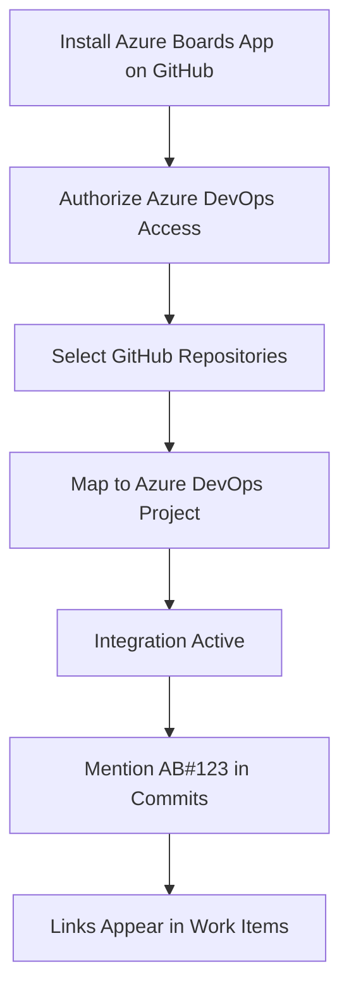

# How to Set Up Azure Boards GitHub Integration to Link Commits and Pull Requests to Work Items

Author: [nawazdhandala](https://www.github.com/nawazdhandala)

Tags: Azure Boards, GitHub, Integration, Work Items, DevOps, Project Management, Traceability

Description: Learn how to connect Azure Boards to GitHub repositories so that commits and pull requests automatically link to work items for full traceability.

---

Many teams use Azure Boards for project management but keep their code on GitHub. This split creates a traceability gap. Product managers track work in Azure Boards, developers write code on GitHub, and connecting the two requires manual effort that nobody remembers to do. The Azure Boards GitHub integration closes this gap by automatically linking GitHub commits, pull requests, and branches to Azure Boards work items.

Once configured, a developer mentions a work item ID in a commit message or PR title, and Azure Boards creates a link between them. You can see which commits belong to which work item, which PRs resolved which bugs, and which deployments shipped which features. This is the kind of traceability that auditors love and that actually helps teams understand what shipped.

## Prerequisites

You need the following before setting up the integration:

- An Azure DevOps organization with an Azure Boards project
- A GitHub account (personal or organization) with admin access to the repositories you want to connect
- The Azure Boards app installed on your GitHub organization or account

## Installing the Azure Boards App on GitHub

The integration works through a GitHub app, not OAuth tokens or webhooks. This is the recommended approach because it is more secure and provides granular repository access.

Go to the GitHub Marketplace and search for "Azure Boards." Click Install, then choose whether to install it for all repositories or select specific ones. You will be redirected to Azure DevOps to complete the connection.

Alternatively, you can start from Azure DevOps. Go to your project settings, navigate to Boards, then GitHub connections. Click "Connect your GitHub account" and follow the authorization flow.



## Connecting Repositories

After installing the GitHub app, you need to connect specific repositories to your Azure DevOps project.

In Azure DevOps, go to Project Settings, then Boards, then GitHub connections. You should see the GitHub account or organization you authorized. Select "Add repositories" and pick the repos you want to connect.

Each connected repository will show up in the list with its connection status. You can add or remove repositories at any time without affecting existing links.

## Linking Commits to Work Items

The integration uses a simple syntax: include `AB#<work-item-id>` in your commit message, and Azure Boards will create a link.

```bash
# Commit that links to work item 1234
git commit -m "Fix null pointer exception in user authentication AB#1234"

# Commit that links to multiple work items
git commit -m "Refactor database connection pooling AB#1234 AB#1567"

# Commit with work item reference in a multi-line message
git commit -m "Add pagination to search results

Implements the infinite scroll feature requested in AB#2345.
Also fixes the off-by-one error tracked in AB#2346."
```

When GitHub processes this commit, the Azure Boards integration picks up the `AB#` references and creates links on the corresponding work items. The work item shows the commit hash, message, author, and a direct link to the commit on GitHub.

## Linking Pull Requests to Work Items

Pull requests work the same way. Include `AB#<id>` in the PR title or description, and the integration creates a link.

```markdown
## Pull Request Title
Fix authentication timeout issue AB#1234

## Pull Request Description
This PR resolves the authentication timeout that users experience when
their session token expires during a long-running operation.

Related work items:
- AB#1234 - Authentication timeout on long sessions
- AB#1235 - Improve session renewal logic

### Changes
- Added automatic token refresh before expiration
- Increased session timeout to 30 minutes
- Added retry logic for failed authentication calls
```

The work item in Azure Boards will show the PR status (open, merged, closed) and update automatically as the PR progresses through its lifecycle.

## Automating Work Item State Changes

One of the most powerful features is automatically transitioning work items based on PR activity. You can configure Azure Boards to move a work item to a specific state when a linked PR is merged.

In your Azure Boards project settings, go to Board Settings, then configure the column-to-state mapping. For example, you might set up the following transitions:

- When a PR is created that references a work item, move it to "In Review"
- When the PR is merged, move it to "Done"
- When the PR is closed without merging, move it back to "Active"

This is configured at the board level. Navigate to your board, click the gear icon, and configure the "Auto-complete work items with PR" settings.

## Branch Naming with Work Item References

Some teams adopt a branch naming convention that includes the work item ID. While this does not automatically create links (the integration relies on commit and PR content), it helps with organization.

```bash
# Create a branch with the work item ID in the name
git checkout -b feature/AB1234-add-user-search

# Or with a more structured naming convention
git checkout -b users/nawazdhandala/AB1234-authentication-fix
```

You can then configure branch policies in your GitHub repository to require that branch names match a pattern that includes a work item reference.

## Querying Linked Items

Once you have links established, you can query them in Azure Boards to see the development status of your work items.

In Azure Boards, create a query with the "Development" link type. This lets you find work items that have (or lack) linked commits, PRs, or branches.

```text
Query: Work items with linked PRs
Type: Flat list of work items
Filters:
  - Work Item Type = User Story
  - State = Active
  - Development Link = Pull Request (exists)
```

You can also use the Azure DevOps REST API to query development links programmatically.

```bash
# Get development links for a work item using the REST API
ORG="your-organization"
PROJECT="your-project"
WORK_ITEM_ID=1234
PAT="your-pat"

# Fetch work item with relations (includes GitHub links)
curl -s \
  "https://dev.azure.com/${ORG}/${PROJECT}/_apis/wit/workitems/${WORK_ITEM_ID}?\$expand=relations&api-version=7.1" \
  -H "Authorization: Basic $(echo -n ":${PAT}" | base64)" | \
  python3 -c "
import json, sys
data = json.load(sys.stdin)
for rel in data.get('relations', []):
    if 'GitHub' in rel.get('attributes', {}).get('name', ''):
        print(f\"Link: {rel['url']}\")
        print(f\"Type: {rel['attributes']['name']}\")
"
```

## Setting Up Status Badges

You can add Azure Boards status badges to your GitHub repository README to show the status of work items or sprints.

```markdown
<!-- Add to your GitHub repository README.md -->
<!-- Shows the status of a specific query -->
[](https://dev.azure.com/your-org/your-project/_boards/board/t/your-team/Stories)
```

## Troubleshooting Common Issues

The most common issue is links not being created when you expect them. Check these things first:

Make sure the repository is connected in the Azure DevOps project settings. The connection might have been removed or never established for that specific repo.

Verify the syntax is exactly `AB#` followed by the number with no space. `AB# 1234` or `AB #1234` will not work.

Check that the work item actually exists in the connected project. If the work item is in a different project than the one connected to the GitHub repo, the link will not be created.

If the GitHub app was recently installed, there might be a brief delay before it starts processing events. Wait a few minutes and try again.

For permission issues, verify that the Azure Boards app has access to the specific repository. Go to your GitHub organization settings, then Installed GitHub Apps, find Azure Boards, and check the repository permissions.

## Best Practices for the Integration

Establish a team convention for work item references. The simplest approach is to always include the work item ID in the PR title. This is visible in the GitHub PR list and makes it easy to find the associated work item.

Use the integration as your traceability backbone. When someone asks "what went into this release," you can answer by querying Azure Boards for all work items completed in the sprint, then following the development links to see every commit and PR.

Do not over-reference work items. Linking every commit to a work item creates noise. Instead, link PRs (which represent completed units of work) and only link individual commits when they are significant on their own.

Review disconnected work items regularly. Create a query for work items in "Done" state that have no development links. These represent either manual changes or work that was done without proper linking, both of which deserve attention.

The Azure Boards and GitHub integration gives you the best of both worlds - GitHub's developer experience for code and Azure Boards' project management capabilities for planning. The automatic linking turns what would be a tedious manual tracking process into something that happens naturally as developers do their normal work.
