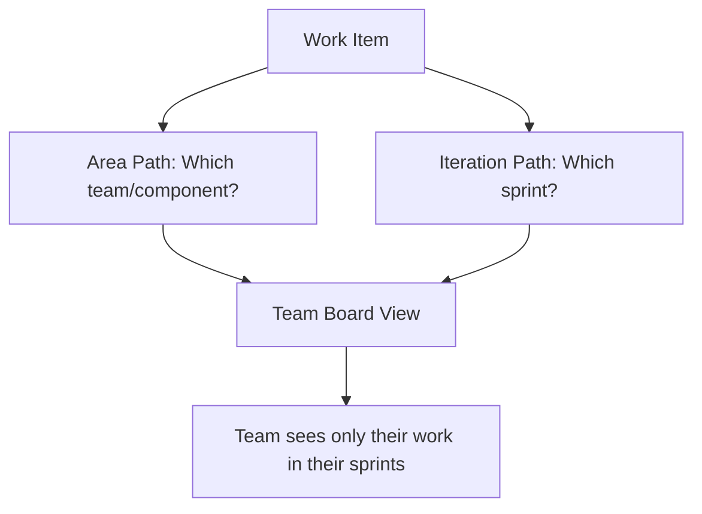

# How to Set Up Azure Boards Iteration Paths and Area Paths for Multi-Team Project Management

Author: [nawazdhandala](https://www.github.com/nawazdhandala)

Tags: Azure Boards, Iteration Paths, Area Paths, Project Management, Azure DevOps, Agile, Scrum

Description: Configure iteration paths and area paths in Azure Boards to organize work across multiple teams with different sprint cadences and product areas.

---

When a single Azure DevOps project houses multiple teams - frontend, backend, platform, QA - you need a way to organize work so that each team has its own view of the backlog while leadership can still see the big picture. Azure Boards provides two mechanisms for this: area paths and iteration paths. Area paths define what part of the product a work item belongs to, and iteration paths define when the work is scheduled. Together, they give you a flexible structure that scales from a single team to a large organization.

This guide covers how to set up both, assign them to teams, and avoid the common mistakes that lead to confusing board views.

## Understanding Area Paths and Iteration Paths

### Area Paths

Area paths represent the product structure. They answer the question "what part of the system does this work belong to?" Area paths are hierarchical, so you can organize them by feature area, component, or team.

Example area path hierarchy:

```
MyProject
  /Frontend
    /Frontend/Dashboard
    /Frontend/Settings
    /Frontend/Authentication
  /Backend
    /Backend/API
    /Backend/Workers
    /Backend/Database
  /Platform
    /Platform/Infrastructure
    /Platform/CI-CD
    /Platform/Monitoring
```

### Iteration Paths

Iteration paths represent time periods. They answer the question "when is this work planned?" Iteration paths are also hierarchical, typically organized by release or quarter, with sprints underneath.

Example iteration path hierarchy:

```
MyProject
  /2026-Q1
    /2026-Q1/Sprint 1 (Jan 6 - Jan 17)
    /2026-Q1/Sprint 2 (Jan 20 - Jan 31)
    /2026-Q1/Sprint 3 (Feb 3 - Feb 14)
    /2026-Q1/Sprint 4 (Feb 17 - Feb 28)
    /2026-Q1/Sprint 5 (Mar 3 - Mar 14)
    /2026-Q1/Sprint 6 (Mar 17 - Mar 28)
  /2026-Q2
    /2026-Q2/Sprint 7 (Mar 31 - Apr 11)
    ...
```



## Step 1: Create Area Paths

Go to Project Settings, then Boards, then Project Configuration. Under the "Areas" tab, you will see the root area path (your project name).

### Creating Through the UI

Click the ellipsis next to the root node and select "New child." Create your top-level areas first, then add sub-areas.

### Creating Through the Azure CLI

```bash
# Create top-level area paths
az boards area project create \
  --name "Frontend" \
  --project "MyProject" \
  --organization "https://dev.azure.com/myorg"

az boards area project create \
  --name "Backend" \
  --project "MyProject" \
  --organization "https://dev.azure.com/myorg"

az boards area project create \
  --name "Platform" \
  --project "MyProject" \
  --organization "https://dev.azure.com/myorg"

# Create child area paths
az boards area project create \
  --name "API" \
  --path "\\MyProject\\Backend" \
  --project "MyProject" \
  --organization "https://dev.azure.com/myorg"

az boards area project create \
  --name "Workers" \
  --path "\\MyProject\\Backend" \
  --project "MyProject" \
  --organization "https://dev.azure.com/myorg"

az boards area project create \
  --name "Dashboard" \
  --path "\\MyProject\\Frontend" \
  --project "MyProject" \
  --organization "https://dev.azure.com/myorg"
```

## Step 2: Create Iteration Paths

Under the same Project Configuration page, switch to the "Iterations" tab.

### Creating Iterations with Dates

Each iteration needs a start date and end date to appear on the sprint board:

```bash
# Create a quarterly grouping
az boards iteration project create \
  --name "2026-Q1" \
  --project "MyProject" \
  --organization "https://dev.azure.com/myorg"

# Create sprints within the quarter
az boards iteration project create \
  --name "Sprint 1" \
  --path "\\MyProject\\2026-Q1" \
  --start-date "2026-01-05" \
  --finish-date "2026-01-16" \
  --project "MyProject" \
  --organization "https://dev.azure.com/myorg"

az boards iteration project create \
  --name "Sprint 2" \
  --path "\\MyProject\\2026-Q1" \
  --start-date "2026-01-19" \
  --finish-date "2026-01-30" \
  --project "MyProject" \
  --organization "https://dev.azure.com/myorg"

az boards iteration project create \
  --name "Sprint 3" \
  --path "\\MyProject\\2026-Q1" \
  --start-date "2026-02-02" \
  --finish-date "2026-02-13" \
  --project "MyProject" \
  --organization "https://dev.azure.com/myorg"
```

### Bulk Creating Iterations with a Script

For creating a full year of sprints, a script is much faster:

```bash
#!/bin/bash
# create-sprints.sh - Create two-week sprints for a full quarter

PROJECT="MyProject"
ORG="https://dev.azure.com/myorg"
QUARTER="2026-Q1"

# Create the quarter node first
az boards iteration project create \
  --name "$QUARTER" \
  --project "$PROJECT" \
  --organization "$ORG"

# Define sprint start dates (Monday of each sprint)
STARTS=("2026-01-05" "2026-01-19" "2026-02-02" "2026-02-16" "2026-03-02" "2026-03-16")
SPRINT_NUM=1

for start in "${STARTS[@]}"; do
    # Calculate end date (start + 11 days = two weeks minus weekend)
    end=$(date -j -v+11d -f "%Y-%m-%d" "$start" "+%Y-%m-%d" 2>/dev/null || \
          date -d "$start + 11 days" "+%Y-%m-%d")

    az boards iteration project create \
      --name "Sprint $SPRINT_NUM" \
      --path "\\$PROJECT\\$QUARTER" \
      --start-date "$start" \
      --finish-date "$end" \
      --project "$PROJECT" \
      --organization "$ORG"

    echo "Created Sprint $SPRINT_NUM: $start to $end"
    SPRINT_NUM=$((SPRINT_NUM + 1))
done
```

## Step 3: Create Teams and Assign Paths

Each team in Azure DevOps can have its own area paths and iteration paths, which determines what shows up on their board and backlog.

### Creating Teams

```bash
# Create teams
az devops team create \
  --name "Frontend Team" \
  --project "MyProject" \
  --organization "https://dev.azure.com/myorg"

az devops team create \
  --name "Backend Team" \
  --project "MyProject" \
  --organization "https://dev.azure.com/myorg"

az devops team create \
  --name "Platform Team" \
  --project "MyProject" \
  --organization "https://dev.azure.com/myorg"
```

### Assigning Area Paths to Teams

Go to Project Settings, then Teams, select a team, then click "Areas."

For the Frontend Team:
- Set the default area to "MyProject\Frontend"
- Check "Include sub-areas" to include Dashboard, Settings, and Authentication

For the Backend Team:
- Set the default area to "MyProject\Backend"
- Check "Include sub-areas"

This means when the Frontend Team opens their board, they only see work items with area paths under "Frontend." The Backend Team only sees their work.

### Assigning Iterations to Teams

Under the same team settings, click "Iterations." Add the sprints that this team participates in.

All teams might share the same sprint cadence:

```
Frontend Team iterations:
  - 2026-Q1\Sprint 1
  - 2026-Q1\Sprint 2
  - 2026-Q1\Sprint 3
  ...

Backend Team iterations:
  - 2026-Q1\Sprint 1
  - 2026-Q1\Sprint 2
  - 2026-Q1\Sprint 3
  ...
```

Or teams might have different cadences. The Platform Team might use monthly iterations while the application teams use two-week sprints:

```
Platform Team iterations:
  - 2026-Q1\January
  - 2026-Q1\February
  - 2026-Q1\March
```

## Step 4: Configure Backlog Levels

Each team can configure which backlog levels they use. Go to Team Settings (the gear icon on the board) and configure:

- **Epics**: Usually managed by product leadership
- **Features**: Usually managed by team leads
- **User Stories / Product Backlog Items**: Managed by the team
- **Tasks**: Day-to-day work items

For cross-team visibility, create Epics at the root area path and Features at the team area path. This lets leadership see all epics across all teams while each team manages their own features and stories.

## Common Organizational Patterns

### Pattern 1: Team-Based Areas

```
MyProject
  /Team Alpha
  /Team Beta
  /Team Gamma
```

Simple but does not tell you anything about the product structure. Best for small organizations where teams own distinct products.

### Pattern 2: Component-Based Areas

```
MyProject
  /Frontend
  /Backend
  /Mobile
  /Infrastructure
```

Aligns with the technical architecture. Good when teams map to components. Can be problematic when a feature touches multiple components.

### Pattern 3: Feature-Based Areas

```
MyProject
  /User Management
  /Billing
  /Reporting
  /Notifications
```

Aligns with business capabilities. Good when teams are organized around features rather than technology layers.

### Pattern 4: Hybrid

```
MyProject
  /Product
    /Product/User Management
    /Product/Billing
    /Product/Reporting
  /Platform
    /Platform/Infrastructure
    /Platform/DevOps
  /Shared
    /Shared/Design System
    /Shared/Documentation
```

Combines product and platform concerns. This is the most common pattern in medium to large organizations.

## Queries and Reporting Across Teams

### Cross-Team Queries

To see work across all teams, create queries that look at the root area path:

```
Area Path: Under MyProject
Iteration Path: Under MyProject\2026-Q1\Sprint 3
State: Active
```

### Team-Specific Queries

To see work for a specific team:

```
Area Path: Under MyProject\Frontend
Iteration Path: = MyProject\2026-Q1\Sprint 3
State: Active
```

### Using the Analytics Service

For dashboards that show work distribution across teams:

```
Widget: Chart for Work Items
Group by: Area Path (first level)
Aggregation: Count
Filter: Iteration Path = current sprint
```

## Best Practices

1. **Keep area paths stable.** Reorganizing area paths is disruptive because it changes the area on existing work items. Plan your structure carefully before creating work items.

2. **Use the same sprint cadence when possible.** Even if teams work independently, having the same sprint dates makes cross-team coordination easier. Sprint reviews and planning can happen on the same days.

3. **Do not create too many levels.** Two to three levels of area paths is usually enough. Deep hierarchies make it hard to assign work items and create cluttered dropdowns.

4. **Set default area paths for teams.** When a team member creates a new work item from their board, it should automatically get the correct area path. Configure the team's default area to make this happen.

5. **Review and prune unused paths.** Over time, area paths accumulate as teams reorganize or products evolve. Periodically review your paths and remove or consolidate ones that are no longer used.

6. **Use iteration paths for time-based planning, not releases.** It is tempting to create iteration paths like "Release 2.0" but this conflates time and scope. Keep iterations as time periods and use tags or features to track releases.

## Wrapping Up

Area paths and iteration paths are the organizational backbone of Azure Boards. Getting them right means each team has a focused view of their work while maintaining the ability to see across the entire project. Start with a simple structure that reflects your team organization, assign paths to teams so their boards are filtered appropriately, and resist the urge to create overly complex hierarchies. The goal is to make it easy for people to find and organize their work, not to model every aspect of your organizational structure in Azure DevOps.
