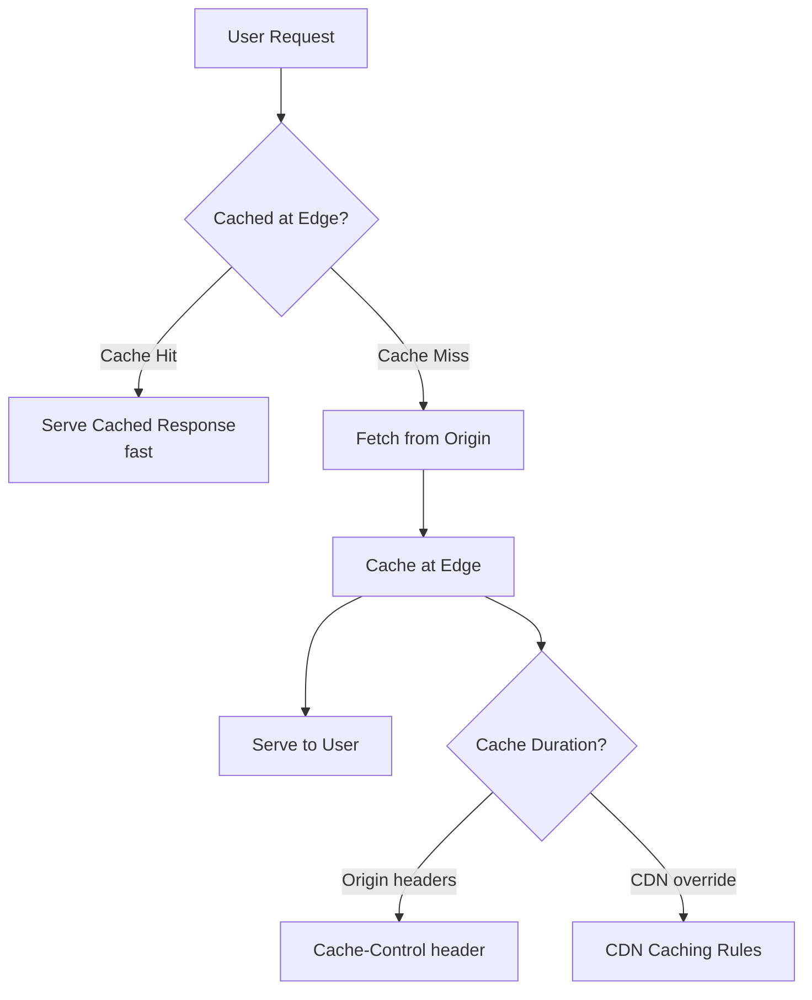
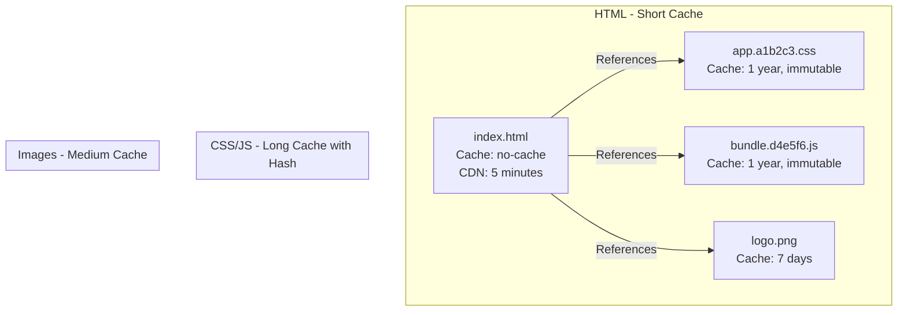

# How to Set Up Azure CDN Caching Rules for Static Website Content

Author: [nawazdhandala](https://www.github.com/nawazdhandala)

Tags: Azure, CDN, Caching, Static Website, Performance, Content Delivery, Azure Networking

Description: Learn how to configure Azure CDN caching rules to optimize delivery of static website content with proper cache durations and invalidation strategies.

---

A static website with HTML files, CSS stylesheets, JavaScript bundles, images, and fonts is a perfect candidate for CDN caching. These files change infrequently, and serving them from edge locations close to users dramatically reduces load times. But caching is not a set-it-and-forget-it feature. Cache too aggressively and users see stale content after deployments. Cache too conservatively and you negate the CDN's purpose.

This guide covers how to set up Azure CDN caching rules that balance performance with freshness. We will configure different cache durations for different file types, handle cache-busted assets, and set up purge workflows for deployments.

## Understanding CDN Caching

When a CDN edge node receives a request for a resource it does not have cached, it fetches the resource from your origin server. The CDN then caches the response and serves it to subsequent requests from the same edge location. How long the CDN keeps the cached version depends on:

1. **Cache-Control headers** from your origin server
2. **CDN caching rules** you configure (can override origin headers)
3. **Query string behavior** settings



## Prerequisites

- An Azure subscription
- An Azure CDN profile and endpoint (Standard Microsoft tier for rules engine support)
- A static website hosted on Azure Blob Storage, App Service, or any HTTP origin
- Azure CLI installed

## Step 1: Set Up the CDN with Your Static Website Origin

If you already have a CDN endpoint, skip to Step 2.

```bash
# Create a resource group
az group create --name rg-cdn-caching-demo --location eastus

# Create a storage account for static website hosting
az storage account create \
  --resource-group rg-cdn-caching-demo \
  --name ststaticsite2026 \
  --location eastus \
  --sku Standard_LRS \
  --kind StorageV2

# Enable static website hosting
az storage blob service-properties update \
  --account-name ststaticsite2026 \
  --static-website \
  --index-document index.html \
  --404-document 404.html

# Get the static website URL
ORIGIN_URL=$(az storage account show \
  --resource-group rg-cdn-caching-demo \
  --name ststaticsite2026 \
  --query "primaryEndpoints.web" --output tsv | sed 's|https://||;s|/$||')

# Create a CDN profile
az cdn profile create \
  --resource-group rg-cdn-caching-demo \
  --name cdn-staticsite \
  --sku Standard_Microsoft

# Create a CDN endpoint
az cdn endpoint create \
  --resource-group rg-cdn-caching-demo \
  --profile-name cdn-staticsite \
  --name staticsite-cdn \
  --origin $ORIGIN_URL \
  --origin-host-header $ORIGIN_URL \
  --enable-compression true \
  --content-types-to-compress "text/html" "text/css" "application/javascript" "application/json" "image/svg+xml" "text/plain"
```

## Step 2: Configure Global Caching Behavior

Set the default caching behavior for the entire endpoint. This acts as the baseline that more specific rules override.

```bash
# Set the global caching behavior to honor origin headers
az cdn endpoint update \
  --resource-group rg-cdn-caching-demo \
  --profile-name cdn-staticsite \
  --name staticsite-cdn \
  --query-string-caching-behavior IgnoreQueryString
```

The `--query-string-caching-behavior` options are:

- `IgnoreQueryString`: All requests share the same cache regardless of query string. Best for static content.
- `BypassCaching`: Never cache. Bad for performance.
- `UseQueryString`: Each unique query string gets a separate cache entry. Useful for cache-busting with versioned URLs.

## Step 3: Create Caching Rules for Different File Types

Different types of static content deserve different cache durations. Here is a sensible strategy:

- **HTML files**: Short cache (5 minutes) since they reference other assets and need to reflect new deployments
- **CSS and JS bundles** (with hash names): Long cache (1 year) since the filename changes when content changes
- **Images**: Medium cache (7 days) since they change less frequently
- **Fonts**: Long cache (30 days) since fonts almost never change

```bash
# Rule 1: Cache HTML files for 5 minutes
az cdn endpoint rule add \
  --resource-group rg-cdn-caching-demo \
  --profile-name cdn-staticsite \
  --endpoint-name staticsite-cdn \
  --order 1 \
  --rule-name "CacheHTML" \
  --match-variable UrlFileExtension \
  --operator Equal \
  --match-values "html" "htm" \
  --action-name CacheExpiration \
  --cache-behavior Override \
  --cache-duration "0.00:05:00"

# Rule 2: Cache CSS and JS for 365 days (for cache-busted files)
az cdn endpoint rule add \
  --resource-group rg-cdn-caching-demo \
  --profile-name cdn-staticsite \
  --endpoint-name staticsite-cdn \
  --order 2 \
  --rule-name "CacheCSSJS" \
  --match-variable UrlFileExtension \
  --operator Equal \
  --match-values "css" "js" \
  --action-name CacheExpiration \
  --cache-behavior Override \
  --cache-duration "365.00:00:00"

# Rule 3: Cache images for 7 days
az cdn endpoint rule add \
  --resource-group rg-cdn-caching-demo \
  --profile-name cdn-staticsite \
  --endpoint-name staticsite-cdn \
  --order 3 \
  --rule-name "CacheImages" \
  --match-variable UrlFileExtension \
  --operator Equal \
  --match-values "png" "jpg" "jpeg" "gif" "svg" "webp" "ico" \
  --action-name CacheExpiration \
  --cache-behavior Override \
  --cache-duration "7.00:00:00"

# Rule 4: Cache fonts for 30 days
az cdn endpoint rule add \
  --resource-group rg-cdn-caching-demo \
  --profile-name cdn-staticsite \
  --endpoint-name staticsite-cdn \
  --order 4 \
  --rule-name "CacheFonts" \
  --match-variable UrlFileExtension \
  --operator Equal \
  --match-values "woff" "woff2" "ttf" "otf" "eot" \
  --action-name CacheExpiration \
  --cache-behavior Override \
  --cache-duration "30.00:00:00"
```

## Step 4: Add Cache-Control Response Headers

In addition to CDN caching rules, set proper Cache-Control response headers so browsers also cache content appropriately.

```bash
# Add Cache-Control header for immutable CSS/JS assets
az cdn endpoint rule add \
  --resource-group rg-cdn-caching-demo \
  --profile-name cdn-staticsite \
  --endpoint-name staticsite-cdn \
  --order 5 \
  --rule-name "ImmutableCacheHeader" \
  --match-variable UrlFileExtension \
  --operator Equal \
  --match-values "css" "js" \
  --action-name ModifyResponseHeader \
  --header-action Overwrite \
  --header-name "Cache-Control" \
  --header-value "public, max-age=31536000, immutable"
```

The `immutable` directive tells browsers that this resource will never change at this URL. Combined with cache-busted filenames (like `app.abc123.js`), this eliminates unnecessary revalidation requests.

## Step 5: Configure the No-Cache Rule for HTML

HTML files should include `no-cache` which tells the browser to revalidate with the server on every request but still use the cached version if it has not changed.

```bash
# Set no-cache header for HTML files
az cdn endpoint rule add \
  --resource-group rg-cdn-caching-demo \
  --profile-name cdn-staticsite \
  --endpoint-name staticsite-cdn \
  --order 6 \
  --rule-name "NoCacheHTML" \
  --match-variable UrlFileExtension \
  --operator Equal \
  --match-values "html" "htm" \
  --action-name ModifyResponseHeader \
  --header-action Overwrite \
  --header-name "Cache-Control" \
  --header-value "no-cache"
```

## Understanding the Caching Strategy

Here is why this approach works:



When you deploy new code:
1. New CSS/JS files get new hashes (different filenames)
2. HTML files reference the new filenames
3. Users get the new HTML (short cache), which loads the new CSS/JS (new URLs, cache miss)
4. Old CSS/JS files in the CDN cache eventually expire and get evicted

## Step 6: Set Up Cache Purging for Deployments

Sometimes you need to force-clear the CDN cache after a deployment.

```bash
# Purge specific paths
az cdn endpoint purge \
  --resource-group rg-cdn-caching-demo \
  --profile-name cdn-staticsite \
  --name staticsite-cdn \
  --content-paths "/index.html" "/404.html"

# Purge an entire directory
az cdn endpoint purge \
  --resource-group rg-cdn-caching-demo \
  --profile-name cdn-staticsite \
  --name staticsite-cdn \
  --content-paths "/images/*"

# Nuclear option: purge everything
az cdn endpoint purge \
  --resource-group rg-cdn-caching-demo \
  --profile-name cdn-staticsite \
  --name staticsite-cdn \
  --content-paths "/*"
```

You can integrate this into your CI/CD pipeline. After uploading new static files to blob storage, purge the HTML files from the CDN:

```bash
# Deployment script snippet
# 1. Upload new files to blob storage
az storage blob upload-batch \
  --account-name ststaticsite2026 \
  --destination '$web' \
  --source ./build

# 2. Purge HTML files from CDN (CSS/JS have new hashes so no purge needed)
az cdn endpoint purge \
  --resource-group rg-cdn-caching-demo \
  --profile-name cdn-staticsite \
  --name staticsite-cdn \
  --content-paths "/index.html" "/404.html" "/"
```

## Verifying Cache Headers

Use curl to check what cache headers the CDN returns.

```bash
# Check response headers
curl -I https://staticsite-cdn.azureedge.net/index.html

# Look for:
# Cache-Control: no-cache
# X-Cache: HIT or MISS (tells you if the CDN served from cache)
# Age: 123 (seconds since the response was cached)

curl -I https://staticsite-cdn.azureedge.net/app.a1b2c3.css
# Look for:
# Cache-Control: public, max-age=31536000, immutable
```

## Cleanup

```bash
# Delete all resources
az group delete --name rg-cdn-caching-demo --yes --no-wait
```

## Wrapping Up

Effective CDN caching for static websites comes down to matching cache durations to content volatility. HTML files get short caches because they change on every deployment. CSS and JS files with hashed filenames get long caches because the filename itself changes when content changes. Images and fonts sit somewhere in between. Pair this with proper Cache-Control headers, a deployment workflow that purges HTML after uploads, and compression enabled on the endpoint, and you have a static website that loads fast for users everywhere while staying fresh after every deployment.
